[TOC]

# LIMO PRO 产品用户使用和开发手册

中文 | EN

Version: 1.0.0

| 版本  | 更新信息          | 责任人          |
| ----- | ----------------- | --------------- |
| 1.0.0 | [1]、第一版本开放 | Agilex ROS TEAM |
|       |                   |                 |
|       |                   |                 |

## 一、LIMO产品简介

### 1.1 产品简介

松灵机器人LIMO是全球首款集四种运动模态于一体的ROS开发平台，提供了适应场景更广泛、更符合行业应用要求的学习平台，适用于机器人教育、功能研发、产品开发。通过创新性的机械设计，能实现四轮差速、阿克曼、履带型、麦克纳姆轮运动模式的快速切换，可在配套的专业沙盘中快速建立多场景实拟教学和测试，LIMO搭载NVIDIA Jeston Orin Nano、EAI Tmini Pro激光雷达、深度相机等高性能传感器配置，可实现精确的自主定位、SLAM建图、路线规划和自主避障、自主倒车入库、红绿灯识别等丰富功能。

同时，松灵机器人联合国内ROS社区教学开创者古月居，致力于结合企业用人和行业应用需求，打造基于LIMO开发小车的全新ROS精品课程，助力院校科研教学，让学生达到更高的行业应用技术要求。

### 1.2 产品列表

（1）Limo主体

| 名称                            | 数量                   |
| ------------------------------- | ---------------------- |
| LIMO高配版主体（安装越野轮 X4） | X1                     |
| 电池                            | X1                     |
| 充电器                          | X1                     |
| 麦克纳姆轮                      | X4                     |
| 履带                            | x2                     |
| APP_Nexus                       | X1                     |
| 内六角螺丝刀                    | X1                     |
| 螺丝                            | M3 12mm x3、M3 5mm x20 |

 


（2）Mycobot机械臂（**选配**）

> **Mycobot机械臂为选配，标准Limo Pro没有搭配机械臂**


### 1.3 性能参数

（1）Limo主体

<table>
	<tr>
		<td>参数类型</td>
		<td>项目</td>
        <td>指标</td>
	</tr>
	<tr>
		<td rowspan="7">机械参数</td>
		<td>外形尺寸</td>
        <td>322*220*251mm</td>
	</tr>
	<tr>
		<td>轴距</td>
        <td>200mm</td>
	</tr>
    	<tr>
		<td>轮距</td>
        <td>175mm</td>
	</tr>
    	<tr>
		<td>自重</td>
        <td>4.8kg</td>
	</tr>
    	<tr>
		<td>负载</td>
        <td>4kg</td>
	</tr>
    	<tr>
		<td>最小离地间隙</td>
            <td>24mm</td>
	</tr>
    	<tr>
		<td>驱动方式</td>
            <td>轮毂电机(4x14.4W)</td>
	</tr>
<tr>
		<td rowspan="4">性能参数</td>
		<td>空载最高车速</td>
        <td>1m/s</td>
	</tr>
<tr>
		<td>阿克曼最小转弯半径</td>
        <td>0.4m</td>
	</tr>
<tr>
		<td>工作环境</td>
        <td>-10~+40℃</td>
	</tr>
<tr>
		<td>最大爬坡角度</td>
        <td>20°</td>
	</tr>
	<td rowspan="11">系统参数</td>
		<td>电源接口</td>
        <td>DC（5.5x2.1mm)</td>
	</tr>
    	<tr>
		<td>工控机</td>
        <td>jetson orin nano</td>
	</tr>
	<tr>
		<td>系统</td>
        <td>Ubuntu20.04</td>
	</tr>
    	<tr>
		<td>IMU</td>
        <td>HI226</td>
	</tr>
    	<tr>
		<td>CPU</td>
        <td>6核 Arm® Cortex®-A78AE</td>
	</tr>
    	<tr>
	</tr>
    	<tr>
		<td>GPU</td>
        <td>1024个CUDA核心</td>
	</tr>
    	<tr>
		<td>电池</td>
            <td>10Ah 12V</td>
	</tr>
    	<tr>
		<td>工作时间</td>
            <td>2.5H</td>
	</tr>
    	<tr>
		<td>待机时间</td>
            <td>4h</td>
	</tr>
    	<tr>
		<td>通讯接口</td>
            <td>WIFI、蓝牙</td>
	</tr>
	<td rowspan="5">传感器</td>
		<td>激光雷达</td>
        <td>EAI T-mini Pro</td>
	</tr>
	<tr>
		<td>深度相机</td>
        <td>奥比中光 DaBai</td>
	</tr>
    	<tr>
		<td>USB-HUB </td>
            <td>TYPE-C x1、USB2.0 x2、HDMI</td>
	</tr>
    	<tr>
		<td>前显示器</td>
            <td>1.54寸128x64白色OLED显示屏</td>
	</tr>
    	<tr>
		<td>后显示器</td>
            <td>7寸1024x600 IPS触控屏</td>
	</tr>
	<td rowspan="2">控制参数</td>
		<td>控制模式</td>
        <td>手机APP、指令控制</td>
	</tr>
	<tr>
		<td>手机APP</td>
        <td>蓝牙/极限距离10m</td>
	</tr>
</table>
（2）Mycobot机械臂（**选配**）

> **Mycobot机械臂为选配，标准Limo Pro没有搭配机械臂**

|     指标     |  参数   |
| :----------: | :-----: |
|    自由度    |    6    |
|   有效负载   |  250g   |
|   工作半径   |  280mm  |
| 重复定位精度 | ±0.5mm  |
|     重量     |  800g   |
|   电源输入   | 12V，5A |
|   工作温度   | -5-45℃  |
|     通信     | Type-C  |


### 1.4 Nvidia Jetson Orin Nano介绍

Jetson Orin Nano是一款基于英伟达（NVIDIA）Orin芯片的嵌入式AI计算机。它是英伟达Jetson系列产品的一员，旨在为开发人员和制造商提供高性能、低功耗的AI计算平台。Jetson Orin Nano是一款小型、低功耗的计算机，被广泛应用于智能监控、机器人、自动驾驶等领域。搭载在limo pro版本，可以用于拓展机器人导航定位、图像处理、语音识别等技术的拓展。

| 名称     | 参数                                                         |
| -------- | ------------------------------------------------------------ |
| GPU      | 1024-core NVIDIA Ampere architecture GPU with 32 tensor cores |
| CPU      | 6-core Arm Cortex-A78AE v8.2                                 |
| 内存     | 8GB 128-bit LPDDR5                                           |
| 存储     | Nvme 128G                                                    |
| 视频编码 | 1080p30 supported by 1-2 CPU cores                           |
| 视频解码 | 1x 4K60 (H.265) 2x 4K30 (H.265) 5x 1080p60 (H.265) 11x 1080p30 (H.265) |
| 摄像头   | Up to 4 cameras 8 lanes MIPI CSI-2 D-PHY 2.1                 |
| 联网     | 千兆以太网，M.2 Key E 接口外扩                               |
| 显示     | DP X 1                                                       |
| USB      | 4x USB 3.2 Gen2                                              |
| 扩展接口 | 3x UART, 2x SPI, 2x I2S, 4x I2C, 1x CAN, DMIC & DSPK, PWM, GPIOs |

### 1.6 MyCobot280 M5 机械臂介绍（选配）

> **Mycobot机械臂为选配，标准Limo Pro没有搭配机械臂**

MyCobot 可根据用户的需求进行二次开发，实现用户个性化定制，是生产力工具也是想象力边界的拓展工具。MyCobot 自重800g，有效载荷250g，有效工作半径280mm；体积小巧但功能强大，可搭配多种末端执行器适配多种应用场景，支持多平台软件的二次开发，满足科研教育、智能家居，商业探索等各种场景需求。

|   项目    |                             参数                             |
| :-------: | :----------------------------------------------------------: |
| 核心参数  | 240MHz dual core. 600DMIPS, 520KB SRAM. Wi-Fi, dual mode Bluetooth |
| 核心Flash |                             4MB                              |
|  核心IO   |                 G19、G21、G22、G23、G25、G33                 |
| 核心蓝牙  |                           2.4G/5G                            |
| 核心无线  |                       2.4G 3D Antenna                        |
| 核心型号  |                      M5Stack-basic/Atom                      |

### 1.7 部件名称


①　WIFI/蓝牙天线；

②　深度相机；

③　前显示器；

④　EAI Tmini PRO激光雷达;

⑤　轮毂电机；

⑥　RGB车灯；

⑦　四轮差速/阿克曼模式切换插销；

⑧　电量显示；

⑨　左扬声器；

⑩　左海鸥门；


⑪　后显示器；

⑫　电池门；

⑬　开关；

⑭　右海鸥门；

⑮　右扬声器；

 

⑯　USB-HUB模块；

 

⑰　语音模块；

⑱　工控机NVIDIA Jetson Nano（4G）；

⑲　电池；

### 1.8 功能亮点

（1）使用四个轮毂电机，节省车体内部空间，可在一个车体上实现阿克曼、四轮差速、履带和麦轮这四种模态的快速切换；


①阿克曼模式：

一种为了解决交通工具转弯时，内外转向轮路径指向的圆心不同的几何学，依据阿克曼转向几何设计的车辆，沿着弯道转弯时，利用四连杆的相等曲柄使内侧轮的转向角比外侧轮大大约2~4度，使四个轮子路径的圆心大致上交会于后轴的延长线上瞬时转向中心，让车辆可以顺畅的转弯。

 

②四轮差速模式：

四轮驱动，可实现原地自转，但对轮胎磨损严重，请勿长时间原地自转；

 

③履带模式：

具有良好的越野性能，可上40°坡和小台阶；

 

④麦克纳姆轮模式：

基于麦克纳姆轮技术的全方位运动设备可以实现前行、横移、斜行、旋转及其组合等运动方式。


（2）车灯状态指示：

两车灯为RGB LED，选用5种对比度高的颜色作为指示灯，其余颜色可供开发者自定义；

| 颜色     | 状态              |
| -------- | ----------------- |
| 红色闪烁 | 低电量/主控报警   |
| 红色常亮 | 程序暂停          |
| 绿色     | 阿克曼模式        |
| 黄色     | 四轮差速/履带模式 |
| 蓝色     | 麦克纳姆轮模式    |

（3）两侧车门可展开，预留一个TYPE-C口和两个USB2.0口，方便调试；


（4）电池可拆换；

 

（5）预留丰富的拓展孔位：

车顶预留8个M3螺丝孔位，以及两条3.2mm宽的槽口；


两车门预留4个M3螺丝孔位，水平展开获得更大安装平台；


车底前后各预留四个M3螺丝孔位；

 

（6）丰富的交互体验：

摄像头、激光雷达、语音模块、双扬声器配合前显示器可提供丰富的交互体验。


### 1.9 模态切换方法

（1）切换阿克曼模式：

先将两侧插销拔起，顺时针转30度，使两插销上较长的线指向车体正前方 ，即可卡住，车灯变为绿色且常亮时，则切换成功；


（2）切换四轮差速模式：

  拔起来顺时针转30度，使两插销上较短的线指向车体正前方，此时为插入状态，微调轮胎角度对准孔位让插销插入，车灯变为黄色且常亮时，则切换成功；

 


（3）切换履带模式：

在四轮差速模式下将履带直接套上，建议先套空间较小的后轮，并且履带模式下请将两侧车门抬起防止剐蹭；

 

（4）切换麦轮模式：

先将轮毂盖和轮胎拆下，只保留轮毂电机，然后保证每个麦轮的小滚子朝向车体中心，用包装里的M3*5螺丝将麦轮安装上，最后需要用遥控/APP调整至麦轮模式。

 


 

**注：切换至麦轮模式的时候，请确保每个麦轮安装的角度如上图所示**

### 1.9 操作说明

（1）长按开关键开机（短按暂停程序），观察电量表，最后一颗红灯量时请及时充电或更换电池；


（2）观察前面插销状态以及车灯颜色判断当前模式：


<table>
<tr>
	<td>插销状态</td>
	<td>车灯颜色</td>
	<td>当前模式</td>
</tr>
	<tr>
        <td rowspan="2"> 插入</td> 
        <td>黄色</td>
        <td>四轮差速/履带模式</td>
    </tr>
    <tr>
        <td>蓝色</td>
        <td>麦克纳姆轮模式</td>
    </tr>
<tr>
	<td>拔起</td>
	<td>绿色</td>
	<td>阿克曼</td>
</tr>
</table>

（3）遥控器说明

遥控准备：右滑开机键开机，将SWB通道拨到中间即可遥控控制，下方为指令控制，上方关闭控制；

 

 

差速模式：将SWD通道拨到中下档位为四轮差速模式，左摇杆控制前进后退，右摇杆控制原地左右转；

 

 

履带模式：与四轮差速模式的运动模型一样；

 

 

麦轮模式：SWD通道在上档位时为麦克纳姆轮模式，左摇杆控制运动方向，右摇杆控制左右原地转；

 

阿克曼模式：在车体上切换为阿克曼模式，开启遥控器控制即可，左摇杆控制前进后退，右摇杆控制左右方向；

 

（4）APP遥控说明

1、 首先在手机上下载我司提供的APP--Nexus，下载方式如下：

IOS端下载：在AppStore搜索Nexus并下载

Android端扫描下面二维码：

 

下载链接：https://www.pgyer.com/CjOI

2、下载App成功后，打开App,如图1-1所示，连接LIMO_xxxxxx的蓝牙；安卓手机点击左上的的蓝牙图标进入蓝牙扫描界面  

 

3、遥控limo


左边控制杆：控制limo前进后退

右边控制杆：控制limo左转右转

中间进度条：速度值显示

模式切换：总共有三种模式，阿克曼运动模式：ackermann，四轮差速运动模式：4wd，麦克纳姆运动模式：mailun

 ackerMann：需要手动将LIMO小车切换阿克曼模式，主要用于校准零点、控制前进后退以及转动角度；

4wd：需要手动将LIMO小车切换四轮差速模式，主要控制前进后退、转换方向以及原地旋转；

Mailun：需要手动将LIMO小车切换麦轮模式，主要控制前进后退、转换方向以及原地旋转

4、APP设置说明


Language switch：通过点击右边的按钮 English/简体，来切换英语和中文

Left-romte min speed：设置LIMO小车的最小速度

Left-romte max speed：设置LIMO小车的最大速度

right-romte min speed：设置LIMO小车的最小旋转速度

right-romte max speed：设置LIMO小车的最大旋转速度

veer calibration：设置零点矫正，先点击+号，然后点击确定Verify，当校准成功会弹出提醒框Successful calibration

BlueTooth：点击弹出蓝牙扫描界面

Bluetooth management：点击random 生成任意以LIMO_xxxx的命名的名字，确认OK并同步修改小车蓝牙的名字，注意此时蓝牙会断开，并会提醒重新连接蓝牙，重新连接蓝牙后可以继续控制小车；当app再次启动，小车的蓝牙名字已经显示修改成功的状态

### 1.10 远程桌面连接

#### 1.10.1 下载安装NoMachine

首先在个人电脑下载相应的软件，下载链接：https://www.nomachine.com/download，根据自己电脑的操作系统和架构下载相应的版本。让limo和电脑连接到同一个WIFI下。                         

#### 1.10.2 连接wifi

打开limo右侧的海鸥门，找到USB-HUB模块，给limo连接上键盘鼠标，USB-HUB模块的位置如下图：


键盘鼠标成功连接之后通过以下操作连接wifi，选择需要连接的wifi。


输入wifi的密码

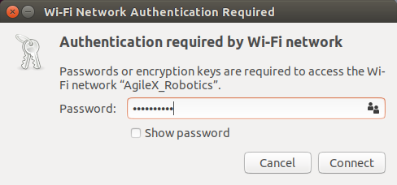


#### 1.10.2 远程连接limo

选择连接对象

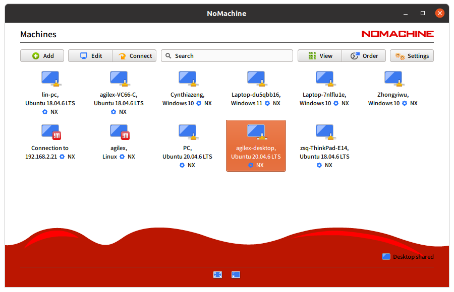

点击Yes


Username：agilex   Password：agx 勾选保存密码


一路选择默认OK


## 二、底盘电气信息说明

###  2.1 电池与充电

#### 2.1.1 电池基本信息

 LIMO随车配备一个12V的电池，该电池有两个接口。分别为黄色的电池输出接口和黑色的电池充电接口。

该电池参数如下表

| 项目         | 额定参数 |
| ------------ | -------- |
| 典型容量     | 10AH     |
| 最小容量     | 10AH     |
| 标称电压     | 11.1V    |
| 充电截至电压 | 12.6V    |
| 放电截至电压 | 8.25V    |

##### 电池注意事项

------

- 为了保证运输存储安全，LIMO配备的电池并不一定处于满电状态 。
- 请不要在电池使用殆尽以后再进行充电，当 LIMO提示电量低时，请及时充电。
- LIMO在关机状态下仍会产生静态待机电流，为防止电池过放，长时间不使用LIMO时请断开电池与车体的连接。
- 请勿将电池投火中，或对电池加热，请勿在高温下存储电池，电池存储的最佳温度为-10℃~40℃。
- 必须使用原厂配备或认证的电池为LIMO供电。

------

####  2.1.2 充电

LIMO默认随车配备一个12.6V 5A的充电器，可满足客户的充电需求，且充电器上设有指示灯可显示充电状态。

------

- 充电时请关机取出电池，将电池输出接口与车体分离。
- 将充电器的充电接头与电池连接，再接通充电器电源进行充电。
- 充满时请先将电池与充电器分离，再断开充电器电源。

------

充电器状态如下表：

| 充电器指示灯颜色 | 电池状态 |
| ---------------- | -------- |
| 红色             | 充电中   |
| 绿色闪烁         | 即将充满 |
| 绿色             | 已充满   |

##### 充电注意事项：

------

- 禁止使用非原装充电器对电池进行充电，请勿在0℃以下给电池充电。
- 充电时必须将电池与LIMO车体分离，禁止在电池充电的同时为LIMO进行供电。
- 当充电器指示灯变为绿色时表示充电完毕，但为了延长电池寿命，充电器会以0.1A的电流进行涓流充电，持续约0.5小时。
- 当前电池从8.25V到充满电状态大约需要2.5小时，电池充满电电压约为12.6V。

### 2.2 使用环境及安全注意事项

------

- LIMO的工作温度为-10℃ ~ 40℃，请勿在温度低于-10℃、高于40℃环境中使用；
- LIMO的使用环境的相对湿度要求是：最大80%，最小30%；
- 请勿在存在腐蚀性、易燃性气体的环境或者靠近可燃性物质的环境中使用；
- LIMO不具有防水功能，请勿在有雨、雪、积水的环境使用；
- 建议使用环境海拔高度不超过1000米、昼夜温差不超过25℃；
- 使用过程有疑问，请按照相关说明手册进行操作或者咨询相关技术人员
- 请不要推动limo，防止逆向发电损坏limo主板及电池；
- 请勿未经技术支持和允许，私自改装内部设备结构。

### 2.3 供电拓扑


------

- LIMO的电池能提供最大10A的电流给底盘、Nano及传感器等系统供电，当系统检测到工作电流大于10A时，为了保护电池和电机会进入过流保护模式。

- USB HUB 的三个USB接口合计输出电流最大为0.5A。

### 2.4 通信拓扑


------

- LIMO底盘内置了蓝牙5.0模块可以与手机端的APP连接，实现遥控功能。
- LIMO与Nano通过UART接口直接连接，Nano通过该接口可实现对底盘的控制。
- USB HUB提供2个USB和1个Type C接口，3个接口均工作在USB2.0协议下。
- 后显示屏通过USB2.0接口与USB HUB相连，起触摸功能。

## 三、底盘驱动程序驱动

移动底盘需要通过程序驱动才能实现limo的导航，limo的底盘驱动程序分为两个版本，分别为C++版本和Python版本，两个版本都可以控制limo运动。

### 3.1 C++底盘驱动

C++版本的驱动程序所在文件夹为~/agilex_ws/src/limo_ros/limo_base，可以通过以下命令进入到该文件夹中

```
cd agilex_ws/src/limo_ros/limo_base
```

以下是limo_base功能包的文件列表：

```
├── limo_base
    ├── CMakeLists.txt
    ├── include
    │   ├── limo_driver.h
    │   ├── limo_protocol.h
    │   └── serial_port.h
    ├── launch
    │   └── limo_base.launch
    ├── msg
    │   └── LimoStatus.msg
    ├── package.xml
    └── src
        ├── limo_base_node.cpp
        ├── limo_driver.cpp
        └── serial_port.cpp
```

limo_base下有四个文件夹，分别为include、launch、msg、src。include文件夹下存放着驱动程序所调用的库文件；launch文件夹下存放着驱动程序的启动文件；msg文件夹下存放着驱动程序所需要的消息文件；src文件夹下存放着驱动程序源代码。

| 文件夹  | 存放文件                 |
| ------- | ------------------------ |
| include | 驱动程序所调用的库文件   |
| launch  | 驱动程序的启动文件       |
| msg     | 驱动程序所需要的消息文件 |
| src     | 驱动程序源代码           |

可以通过一段简单的指令控制limo向前运动

注：在运行命令之前，请确保其他终端中的程序已经终止，终止命令为：Ctrl+c

1、启动底盘，打开一个终端，在终端中输入命令：

```
roslaunch limo_base limo_base.launch
```

2、输入控制指令，打开一个终端，在终端中输入命令：

```
rostopic pub /cmd_vel geometry_msgs/Twist "linear:
  x: 0.2
  y: 0.0
  z: 0.0
angular:
  x: 0.0
  y: 0.0
  z: 0.0" 
```

注：整个命令复制到终端中输入即可，不要手动输入

在终端输入命令之后，limo会先前行走一小段距离，然后停下。

驱动程序源码中使用到的函数：

| 函数名称                     | 函数作用                     |
| ---------------------------- | ---------------------------- |
| connect()                    | 连接底盘                     |
| readData()                   | 读取数据，获取底盘反馈的信息 |
| processRxData()              | 接收串口数据                 |
| parseFrame()                 | 处理串口数据                 |
| sendFrame()                  | 发送串口数据                 |
| setMotionCommand()           | 设置limo的控制模式           |
| enableCommandedMode()        | 使能控制模式                 |
| publishOdometry()            | 发布里程计数据               |
| publishLimoState()           | 发布limo的状态信息           |
| publishIMUData()             | 发布IMU的数据                |
| processErrorCode()           | 错误检测                     |
| twistCmdCallback()           | 发布速度控制数据             |
| normalizeAngle()             | 输出一个正常的角度           |
| degToRad()                   | 把角度转成弧度               |
| convertInnerAngleToCentral() | 将内角转换为中心角           |
| convertCentralAngleToInner() | 将中心角转换为内角           |

### 3.2 Python底盘驱动

limo的Python版本驱动上传到pypi，可以通过pip指令下载该驱动程序；程序的安装目录为~/.local/lib/python3.6/site-packages/pylimo。它的文件列表为：

```
├── __init__.py
├── limomsg.py	
├── limo.py	
└── __pycache__
    ├── __init__.cpython-36.pyc
    ├── limo.cpython-36.pyc
    └── limomsg.cpython-36.pyc
```

Python版本的代码比较简洁，仅有三个文件组成驱动程序，init.py的作用为申明需要使用的文件， limomsg.py的作用为驱动成所需要的消息，limo.py是主程序，它的作用是驱动limo。

| 文件名称   | 文件作用             |
| ---------- | -------------------- |
| init.py    | 申明需要使用的文件   |
| limomsg.py | 驱动成所需要的消息   |
| limo.py    | 主程序，用于驱动limo |

我们提供了一个脚本调用该驱动程序，该脚本所在目录为agilex_ws/src/limo_ros/limo_base/script，脚本名称为limomove.py。

可以通过以下命令访问此目录，打开终端，在终端中输入命令：

> 注：在运行命令之前，请确保其他终端中的程序已经终止，终止命令为：Ctrl+c
>

```
cd agilex_ws/src/limo_ros/limo_base/script
```

运行脚本，打开终端，在终端中输入命令：

```
python3 limomove.py
```

在终端输入命令之后，limo会先前行走一段距离，然后停下。

驱动程序中所使用的函数名称：

| 函数名称             | 函数作用         |
| -------------------- | ---------------- |
| EnableCommand()      | 控制使能         |
| SetMotionCommand()   | 设置移动命令     |
| GetLinearVelocity()  | 获取线速度       |
| GetAngularVelocity() | 获取角速度       |
| GetSteeringAngle()   | 获取内转角角度   |
| GetLateralVelocity() | 获取横移速度     |
| GetControlMode()     | 获取控制模式     |
| GetBatteryVoltage()  | 获取电池电量     |
| GetErrorCode()       | 获取错误代码     |
| GetRightWheelOdem()  | 获取左轮里程计   |
| GetLeftWheelOdem()   | 获取右轮里程计   |
| GetIMUAccelData()    | 获取IMU的加速度  |
| GetIMUGyroData()     | 获取陀螺仪的数据 |
| GetIMUYawData()      | 获取IMU的航向角  |
| GetIMUPichData()     | 获取俯仰角       |
| GetIMURollData()     | 获取横滚角       |

## 四、底盘运动学分析

现在移动机器人这么火热，大到无人驾驶车，规矩的有工业上应用得很多的AGV（比如智能物流自动搬运机器人），小到淘宝上面的智能小车，都可以算作移动机器人。移动机器人有各种各样的底盘，有两轮的三轮的四轮的，比如无人车是四轮的阿克曼模型，一般的AGV是两轮差速模型，还有大学生机器人竞赛里面常见的三轮全向轮底盘，四轮全向轮底盘，还有一些AGV是四轮滑移底盘，是不是有点让人眼花缭乱的感觉呢；本节将从运动学方面介绍limo的四种运动模式。

### 4.1 四轮差速运动模式

我们把一台四轮差速运动的机器人简化成下图的模型，其中四个车轮由四个单独的电机驱动，只需要控制四个车轮的速度，就可以达到控制机器人的前进、后退、以及转向的运动效果了。


我们给机器人一个参考坐标系，红色箭头为X正方向，蓝色箭头为Y轴正方向，Z轴沿着原点垂直屏幕向外，坐标原点为机器人的质心，坐标系满足安培右手定则。当四个车轮的速度（大小+方向）一样时，机器人就可以实现前进和后退。当四个车轮的速度不一样时，机器人将会产生转向运动。

一旦机器人产生转向运动，那么意味着有一个转向中心即下图中的点ICR。以左前轮为例，轮子与地面接触点A的相对运动速度方向如图所示，合速度方向与线段A-ICR相互垂直，而轮胎只能沿着纵向分速度方向转动，做速度分解可知，还存在沿轮子轴向（电机轴向）的横向分速度。


由于四个轮胎的横向分速度大小不同，因此机器人会产生旋转分运动，而纵向分速度产生纵向分运动，合成运动则表现为机器人绕ICR做圆周运动。 

在机器人转弯时，两侧的轮胎角速度一样，内侧的轮胎转弯半径小，所以线速度更小，外侧的轮胎转弯半径大，所以外侧线速度更大。即右侧速度大时，将会向左转，同理可知，左侧速度大时，将会向右转。

而且从上图可以看出同侧的轮胎Vx（纵向分速度）一样，上（下）端的轮胎Vy（横向分速度）一样。如果想要绕自身自转的话，只需要左（右）侧的两个车轮速度一样大，且方向相同、右（左）侧的两个车轮速度与另一侧一样，但方向与另一侧相反即可。

我们可以尝试控制四轮差速模式下的limo，首先把limo调整为四轮差速模式，  拔起来顺时针转30度，使两插销上较短的线指向车体正前方，此时为插入状态，微调轮胎角度对准孔位让插销插入，车灯变为黄色则切换成功。

模式切换成功之后，运行以下命令，我们就可以启用键盘或者手柄来控制。

启动底盘控制节点

注：在运行命令之前，请确保其他终端中的程序已经终止，终止命令为：Ctrl+c

```
roslaunch limo_base limo_base.launch
```

启动键盘控制节点

```
roslaunch limo_bringup limo_teletop_keyboard.launch  
```

### 4.2 履带运动模式

履带差速模式下单侧履带可等效视为“无穷多个小轮子”，且这单侧的“无穷多个小轮子”的“转速”是一致的。所以，履带差速模式的转向方式和四轮差速模式的转向方式是一致的，也是滑动转向。

具体来讲，履带差速运动和四轮差速运动均是通过控制两侧履带（或轮子）的相对速度实现，但二者也有区别：履带对地面产生的剪切和压力分布，是不同于轮子的。此区别体现在车轮速度控制上时影响不大。车轮速度不一致时，我们参照可以以下简化后的模型


ICR为运动旋转中心，CENTER为机器人几何学中心，COM为机器人质心。转弯时，内侧履带的速度小于外侧履带的速度，如果想要绕自身自转的话，只需要左（右）侧履带速度一样大，且方向相同、右（左）侧的履带速度与另一侧一样，但方向与另一侧相反即可。

在四轮差速模式下将履带直接套上，建议先套空间较小的后轮，并且履带模式下请将两侧车门抬起防止剐蹭。

更换完成之后，运行以下命令，我们就可以启用键盘或者手柄来控制。

启动底盘控制节点

注：在运行命令之前，请确保其他终端中的程序已经终止，终止命令为：Ctrl+c

```
roslaunch limo_base limo_base.launch
```

启动键盘控制节点

```
roslaunch limo_bringup limo_teletop_keyboard.launch  
```

### 4.3 阿克曼运动模式

阿克曼转向结构是现代汽车的转向方式，可以解决汽车在转向时，由于左、右转向轮的转向半径不同所造成的左、右转向轮转角不同的问题。

首先看一下阿克曼运动模态简化之后的模型图。与差速运动相同，如果我们给四个车轮相同的的速度（大小+方向），即可实现机器人的前进和后退。不同之处在于转弯，需要根据前端两个车轮的偏转方向，利用阿克曼转向几何来计算转弯半径。点CENTER为机器人几何中心，点BASE为后杆的中点。此时，机器人将绕ICR做圆周运动，此转弯半径也为最小转弯半径。由图可知，前段两个车轮的偏角并不一致，两个车轮偏角的差值（θA-θB）为阿克曼角。如果机器人在阿克曼运动模式下还是采用四轮驱动的方式，在转弯时，内侧车轮的速度小于外侧车轮。


阿克曼进一步简化，就是平时我们骑得自行车模型，上图橘黄色部分是机器人等效的自行车模型。相比于差速运动模态，阿克曼运动模态有转弯半径的限制，移动机器人不能实现自旋，即转弯半径不能为0。

先将两侧插销拔起，顺时针转30度，使两插销上较长的线指向车体正前方 ，即可卡住，车灯变为绿色则切换成功，limo就变换为阿克曼运动模态了。

模式切换成功之后，运行以下命令，我们就可以启用键盘或者手柄来控制。

切换成功之后，运行以下命令，我们就可以启用键盘或者手柄来控制。

启动底盘控制节点

> 注：在运行命令之前，请确保其他终端中的程序已经终止，终止命令为：Ctrl+c
>

```
roslaunch limo_base limo_base.launch
```

启动键盘控制节点

```
roslaunch limo_bringup limo_teletop_keyboard.launch  
```

> 注：当在阿克曼模式下走不直时需要进行舵机校准。
>

### 4.4 麦克纳姆运动模式

麦克纳姆轮是一种特殊的车轮，由轮毂和辊子组成：轮毂是整个轮子的主体支架，辊子则是安装在轮毂上的被动运动的鼓状物（小轮），两者组成一个完整的大轮。市面上轮毂轴线与辊子转轴夹角大致可分30度、45度、60度三种。为满足全向运动的几何关系，轮毂边缘采用了折弯工艺，为辊子的转轴提供安装孔。


假定车轮逆时针转动，对麦克纳姆轮进行受力分析，上图中坐标系红色表示x轴，绿色表示y轴，蓝色表示z轴，辊子坐标系用虚线表示，轮毂坐标系用实线表示；黄色箭头表示麦轮和辊子的受力分析；蓝色箭头表示速度方向。

麦轮外围的辊子是与地面接触的，当麦轮绕轮毂轴转动时，辊子会与地面产生摩擦力Ff，其作用力方向为轮毂坐标系Y轴正方向。对Ff沿着辊子坐标系做正交分解，F1沿辊子Y轴负方向，大小为√2/2Ff，FⅡ沿辊子X轴正方向，大小为√2/2Ff。F1为辊子的滚动摩擦力，对辊子造成磨损，并不能改变轮胎的运动方向，FⅡ会迫使辊子沿X轴正方向运动，故FⅡ为静摩擦，促使辊子相对地面运动。


不同的车轮排列方式也需采用不同的控制方式，将麦轮的全向运动简化成上图这个模型，蓝色箭头表示车轮运动方向，橘黄色箭头表示麦轮的受力分析情况。将各力合并，我们将发现移动机器人只有一个向前的力，故此时机器人将向前运动。

结合之前四轮差速运动模式，对各个轮胎的摩擦力进行合并，就可使机器人往任意方向去运动。下面列举一些不同方向运动时轮胎的状态。


先将轮毂盖和轮胎拆下，只保留轮毂电机，然后保证每个麦轮的小滚子朝向车体中心，用包装里的M3*5螺丝将麦轮安装上，遥控操作的时候需要将遥控器/APP调整至麦轮模式。

遥控手柄在四轮差速控制模式下，通道8处于最下档时切换为麦轮控制模式，处于中上档时切回差速模式；

启动底盘控制节点

> 注：在运行命令之前，请确保其他终端中的程序已经终止，终止命令为：Ctrl+c
>

```
roslaunch limo_base limo_base.launch
```

启动键盘控制节点

```
roslaunch limo_bringup limo_teletop_keyboard.launch  
```

移动机器人的运动模态有很多，每一种都有其优缺点，在实际场景中我们可以根据场景特点和需求，选用最合适的运动模态。下表总结了四种运动模式的优缺点，仅供参看。

| 模态 | 四轮差速                     | 履带                                             | 阿克曼                                         | 麦克纳姆                                           |
| ---- | ---------------------------- | ------------------------------------------------ | ---------------------------------------------- | -------------------------------------------------- |
| 优点 | 运动性能好，控制简单         | 适应性强，具有良好的越野性能，适用于多种复杂场地 | 与汽车的运动模式相同，便于做深入的自动驾驶研究 | 机动性好，可以全向运动                             |
| 缺点 | 转向有滑移，轮胎的磨损比较大 | 滑动转向阻力大，对履带的磨损较大                 | 转弯半径有限，轮胎磨损小                       | 场地要求较高，辊子间不连续，运动时有震动，磨损较大 |


## 五、雷达建图

### 5.1 雷达介绍和使用

YDLIDAR T-mini Pro 激光雷达是深圳玩智商科技有限公司（EAI）研发的一款 360°2D 激光雷达（以下简称：T-mini Pro）。本产品基于脉冲 ToF 测距原理，并配以相关光学、电 学、算法设计，实现高频高精度的距离测量，同时，机械结构 360 度旋转，不断获取角度信 息，从而实现了 360 度扫描测距，输出扫描环境的点云数据。

| 项目       | 最小值 | 默认值 | 最大值 | 单位 | 备注                                 |
| ---------- | ------ | ------ | ------ | ---- | ------------------------------------ |
| 测距频率   | /      | 4000   | /      | Hz   | 每秒测距 4000 次                     |
| 扫描频率   | 6      | 6      | 12     | Hz   | 需要接入 PWM 信号，推荐 使用转速 6Hz |
| 测距范围   | 0.02   | /      | 12     | m    | 室内环境，80%反射率物体              |
| 扫描角度   | /      | 0-360  | /      | Deg  | /                                    |
| 测距精度   | /      | 20     | /      | mm   | 0.05m <测距≤12m 时                   |
| 俯仰角     | 0      | 0.75   | 1.5    | Deg  | /                                    |
| 角度分辨率 | 0.54   |        |        | Deg  |                                      |

其使用方式如下：

打开一个新的终端，在终端中输入命令：

```
roslaunch limo_bringup limo_start.launch pub_odom_tf:=false
```

成功打开之后，终端会输出以下日志信息，如图：


然后新开启一个终端，在终端中输入命令：

```
roslaunch limo_bringup lidar_rviz.launch
```

成功运行之后会看到rviz可视化工具打开，其中显示的绿色数据就是雷达扫描出来的激光数据。


这时候可以把遥控器/App调为遥控模式，遥控小车进行移动，这时会看到激光的数据也会跟着变化。

### 5.2 gmapping 建图

#### 5.2.1 gmapping建图算法介绍

Gmapping是基于滤波SLAM框架的常用开源SLAM算法。Gmapping有效利用了车轮里程计信息，对激光雷达的频率要求不高，在构建小场景地图时，所需的计算量较小且精度较高。这里通过使用ROS封装了的GMapping功能包来实现limo的建图。

#### 5.2.2 gmapping建图实践操作

> 注：在运行命令之前，请确保其他终端中的程序已经终止，终止命令为：Ctrl+c
>

> 注：建图过程中limo的速度尽量慢点，速度太快会影响建图的效果
>

首先需要启动雷达，打开一个新终端，在终端中输入命令：

```
roslaunch limo_bringup limo_start.launch pub_odom_tf:=false
```

然后启动gmapping建图算法，打开另一个新终端，在终端中输入命令：

```
roslaunch limo_bringup limo_gmapping.launch
```

成功启动之后会打开rviz可视化工具，这时候看到的界面如图 

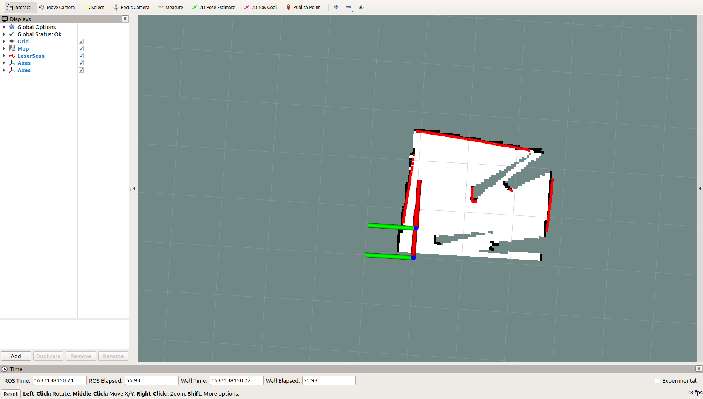

这时候就可以把手柄调为遥控模式，控制limo建图了。

构建完地图之后，需要运行以下命令，把地图保存到指定目录：

1、切换到需要保存地图的目录下，这里把地图保存到~/agilex_ws/src/limo_ros/limo_bringup/maps/，在终端中输入命令：

```
cd ~/agilex_ws/src/limo_ros/limo_bringup/maps/
```

2、切换到/agilex_ws/limo_bringup/maps 之后，继续在终端中输入命令：

```
rosrun map_server map_saver -f map1
```

> map1为保存地图的名称，保存地图时应避免地图的名称重复
>

### 5.3 cartographer建图

#### 5.3.1 cartographer建图算法介绍

cartographer是google推出的一套基于图优化的SLAM算法。该算法的主要目标是实现低计算资源消耗，达到实时SLAM的目的。该算法主要分为两个部分，第一个部分称为Local SLAM, 该部分通过一帧帧的Laser Scan建立并维护一系列的Submap，而所谓的submap就是一系列的Grid Map。算法的第二个部分，称为Global SLAM的部分，就是通过Loop Closure来进行闭环检测，来消除累积误差：当一个submap构建完成，也就是不会再有新的laser scan插入到该submap时，算法会将该submap加入到闭环检测中。

#### 5.3.2 cartographer建图实践操作

> 注：在运行命令之前，请确保其他终端中的程序已经终止，终止命令为：Ctrl+c
>

> 注：建图过程中limo的速度尽量慢点，速度太快会影响建图的效果
>

首先需要声明cartographer算法的环境变量

```
cd agilex_ws/
source install_isolated/local_setup.bash
```

启动雷达，打开一个新终端，在终端中输入命令：

```
roslaunch limo_bringup limo_start.launch pub_odom_tf:=false
```

然后启动cartographer建图算法，打开另一个新终端，在终端中输入命令：

```
roslaunch limo_bringup limo_cartographer.launch
```

成功启动之后会弹出rviz可视化界面，如下图：


在构建完地图之后需要保存地图，需要在终端中输入以下三条命令：

（1）完成轨迹, 不接受进一步的数据。

```
rosservice call /finish_trajectory 0
```

（2）序列化保存其当前状态

```
rosservice call /write_state "{filename: '${HOME}/agilex_ws/src/limo_ros/limo_bringup/maps/mymap.pbstream'}"
```

（3）将pbstream转换为pgm和yaml

```
rosrun cartographer_ros cartographer_pbstream_to_ros_map -map_filestem=${HOME}/agilex_ws/src/limo_ros/limo_bringup/maps/mymap.pbstream -pbstream_filename=${HOME}/agilex_ws/src/limo_ros/limo_bringup/maps/mymap.pbstream -resolution=0.05
```

生成对应的pgm和yaml，放于${HOME}/agilex_ws/src/limo_ros/limo_bringup/maps/mymap.pbstream目录下 

> 注：在建图过程中，终端中会出现一些警告，这是由于速度过快，数据处理不及时造成的，可以忽略
>


### 5.4 RRT自主探索建图功能

#### 5.4.1RRT自主探索功能介绍

在ROS中，RRT（Rapidly-exploring Random Tree）算法被用于自主探索和建图。机器人通过随机采样和快速扩展树结构，生成路径并遍历未知环境。集成RRT算法的导航系统允许机器人在未知区域中实时规划路径，从而构建环境地图。这种自主探索功能有助于机器人在复杂或未知环境中进行导航和建图，提高了系统的灵活性和适应性。

#### 5.4.2 RRT自主探索建图实践

> 注：在运行命令之前，请确保其他终端中的程序已经终止，终止命令为：Ctrl+c

（1）首先启动雷达，开启一个新的终端，在终端中输入命令：

```
roslaunch limo_bringup limo_start.launch pub_odom_tf:=false
```

（2）启动建图功能，开启一个新的终端，在终端中输入命令：

```
roslaunch limo_bringup limo_gmapping.launch
```

（3）启动move_base，开启一个新的终端，在终端中输入命令：

```
roslaunch limo_bringup limo_move_base.launch
```

（4）启动RRT探索功能，开去一个新的终端，在终端中输入命令：

```
roslaunch rrt_exploration simple.launch
```

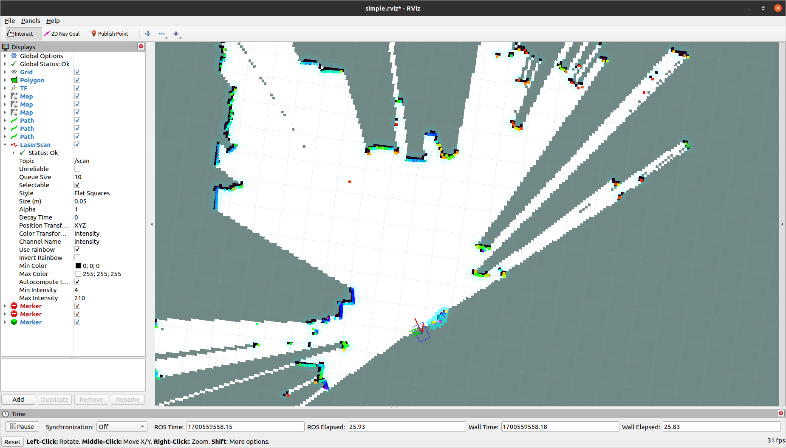

成功启动之后需要给rrt算法设置边界，用Publish Point按钮，设置4个边界点和一个搜索起始点，搜索起始点可以随机给。

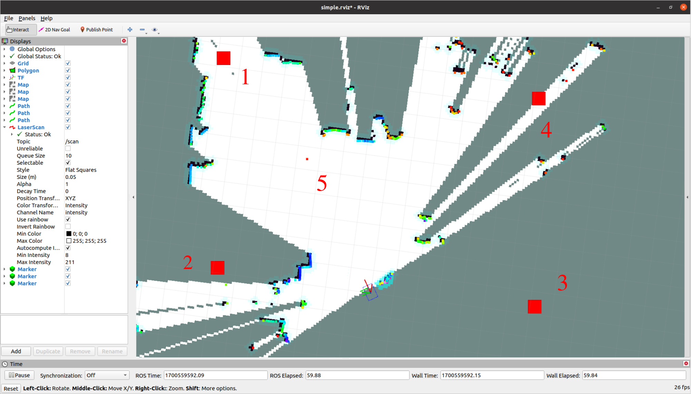

这时候就可以将limo的控制模式调整为指令模式，让limo自动建图了。最终建图的效果为：

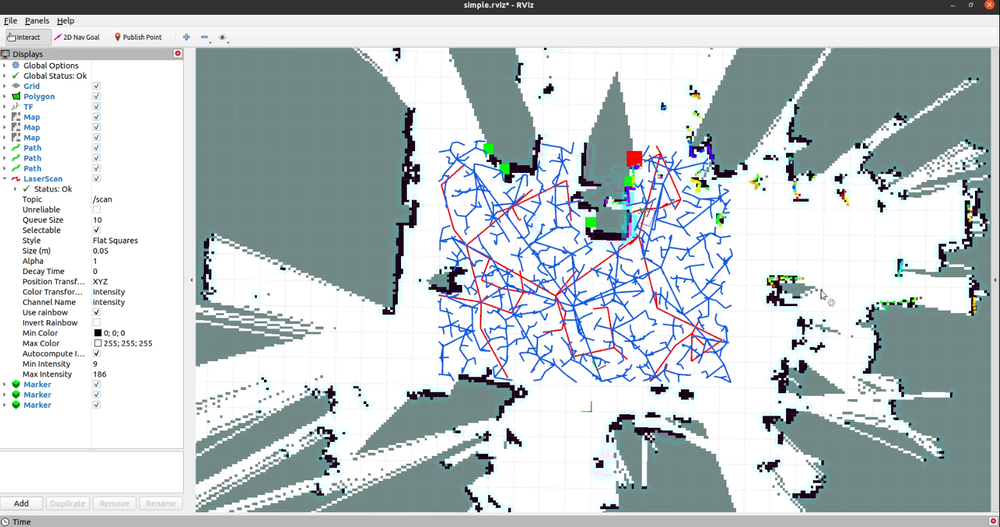

构建完地图之后，需要运行以下命令，把地图保存到指定目录：

1、切换到需要保存地图的目录下，这里把地图保存到~/agilex_ws/src/limo_ros/limo_bringup/maps/，在终端中输入命令：

```
cd ~/agilex_ws/src/limo_ros/limo_bringup/maps/
```

2、切换到/agilex_ws/limo_bringup/maps 之后，继续在终端中输入命令：

```
rosrun map_server map_saver -f map1
```

> map1为保存地图的名称，保存地图时应避免地图的名称重复
>

##  六、雷达导航

前面我们使用了两种激光建图方式，接下来利用刚刚构建地图进行导航。

### 6.1 导航框架

导航的关键是机器人定位和路径规划两大部分。针对这两个核心,ROS提供了以下两个功能包。

（1）move_base：实现机器人导航中的最优路径规划。

（2）amcl：实现二维地图中的机器人定位。

在上述的两个功能包的基础上，ROS提供了一套完整的导航框架，


机器人只需要发布必要的传感器信息和导航的目标位置,ROS即可完成导航功能。在该框架中,move_base功能包提供导航的主要运行、交互接口。为了保障导航路径的准确性,机器人还要对自己所处的位置进行精确定位,这部分功能由amcl功能包实现。

#### 6.1.1 move_base 功能包

move_base是ROS中完成路径规划的功能包,主要由以下两大规划器组成。

全局路径规划(global_planner)。全局路径规划是根据给定的目标位置和全局地图进行总体路径的规划。在导航中,使用Dijkstra或A*算法进行全局路径的规划,计算出机器人到目标位置的最优路线,作为机器人的全局路线。

本地实时规划(local_planner)。在实际情况中,机器人往往无法严格按照全局路线行驶,所以需要针对地图信息和机器人附近随时可能出现的障碍物规划机器人每个周期内应该行驶的路线,使之尽量符合全局最优路径。

#### 6.1.2 amcl 功能包

自主定位即机器人在任意状态下都可以推算出自己在地图中所处的位置。ROS为开发者提供了一种自适应(或kld采样)的蒙特卡罗定位方法(amcl), 这是一种概率定位系统，以2D方式对移动机器人定位。 它实现了自适应（或者KLD-采样）蒙特卡洛定位法，使用粒子滤波跟踪机器人在已知地图中的位姿。

#### 6.1.3 DWA_planner和TEB_planner介绍

DWA_planner

DWA 的全称为DynamicWindow Approaches，该算法可以搜索躲避和行进的多条路经,综合各评价标准(是否会撞击障碍物,所需要的时间等)选取最优路径,并且计算行驶周期内的线速度和角速度,避免与动态出现的障碍物发生碰撞。

TEB_planner

“TEB”全称Time Elastic Band（时间弹性带）Local Planner，该方法针对全局路径规划器生成的初始轨迹进行后续修正(modification)，从而优化机器人的运动轨迹，属于局部路径规划。在轨迹优化过程中，该算法拥有多种优化目标，包括但不限于：整体路径长度、轨迹运行时间、与障碍物的距离、通过中间路径点以及机器人动力学、运动学以及几何约束的符合性。“TEB方法”明确考虑了运动状态下时空方面的动态约束，如机器人的速度和加速度是有限制的。

### 6.2 limo导航功能

> 注：四轮差速模式和全向轮模式、履带模式下，导航运行的文件一样
>

> 注：在运行命令之前，请确保其他终端中的程序已经终止，终止命令为：Ctrl+c
>

（1）首先启动雷达，在终端中输入命令：

```
roslaunch limo_bringup limo_start.launch pub_odom_tf:=false
```

（2）启动导航功能，在终端中输入命令：

```
roslaunch limo_bringup limo_navigation_diff.launch
```

> 注：如果是阿克曼运动模式，请运行
>

```
roslaunch limo_bringup limo_navigation_ackerman.launch
```

启动成功之后会打开rviz界面，如图 


如需自定义打开的地图，请打开limo_navigation_diff.launch 文件修改参数, 文件所在目录为：~/agilex_ws/src/limo_ros/limo_bringup/launch。请把map02修改为需要更换的地图名称。

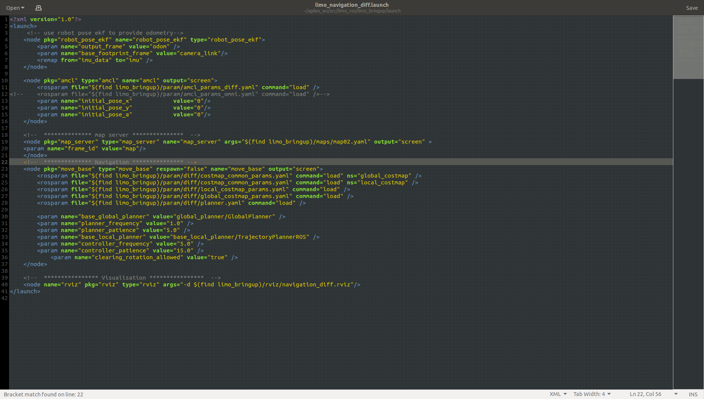

（3）开启导航之后，会发现激光扫描出来的形状和地图没有重合，需要我们手动校正，在rviz中显示的地图上矫正底盘在场景中实际的位置，通过rviz中的工具，发布一个大概的位置，给limo一个大致的位置，然后通过手柄遥控limo旋转，让其自动校正，当激光形状和地图中的场景形状重叠的时候，校正完成。操作步骤如图 ：


校正完成后


（4）通过2D Nav Goal 设置导航目标点。


地图中将会生成一条紫色的路径，手柄切换至指令模式，limo将自动导航到目标点


###  6.3 limo路径巡检

（1）首先启动雷达，开启一个新的终端，在终端中输入命令：

```
roslaunch limo_bringup limo_start.launch pub_odom_tf:=false
```

（2）启动导航功能，开启一个新的终端，在终端中输入命令：

```
roslaunch limo_bringup limo_navigation_diff.launch
```

> 注：如果是阿克曼运动模式，请运行
>

```
roslaunch limo_bringup limo_navigation_ackerman.launch
```

（3）启动路径记录功能，开启一个新的终端，在终端中输入命令：

```
roslaunch agilex_pure_pursuit record_path.launch
```

路径记录结束之后终止路径记录程序，在终端中输入命令为：Ctrl+c 

（4）启动路径巡检功能，开启一个新的终端，在终端中输入命令：

> 注：把手柄调至指令模式
>

```
roslaunch agilex_pure_pursuit pure_pursuit.launch
```

##  七、深度相机+雷达建图

### 7.1 ORBBEC®Dabai的介绍与使用

ORBBEC®Dabai 是基于双目结构光 3D 成像技术的深度相机，主要包括左红外相机(IR camera1)、右红外相机(IR camera2)、一个红外投影仪(IR projector)以及深度计算处理器(depth processor)。红外投影仪用于向目标场景(Scene)投射结构光图案(散斑图案)，左红外相机以及或红外相机分别采集目标的左红外结构光图像以及右红外结构光图像，深度计算处理器接收左红外结构光图像、右红外结构光图像后执行深度计算算法并输出目标场景的深度图像。

| 参数名称                         | 参数指标                                                     |
| -------------------------------- | ------------------------------------------------------------ |
| 左、右红外相机成像中心之间的距离 | 40mm                                                         |
| 深度距离                         | 0.3-3m                                                       |
| 功耗                             | 整机工作平均功耗<2W,<br/>激光开启瞬间峰值 <5W(持续时间 3ms),<br/>待机功耗典型值为<0.7W |
| 深度图分辨率                     | 640*400@30FPS<br/>320*200@30FPS                              |
| 彩色图分辨率                     | 1920X1080@30FPS<br/>1280X720@30FPS<br/>640X480@30FPS         |
| 精度                             | 6mm@1m(81%FOV区域参与精度计算*)                              |
| 深度 FOV                         | H 67.9° V 45.3°                                              |
| 彩色 FOV                         | H 71° V43.7° @1920X1080                                      |
| 延迟                             | 30-45ms                                                      |
| 数据传输                         | USB2.0 或以上                                                |
| 支持操作系统                     | Android / Linux / Windows7/10                                |
| 供电方式                         | USB                                                          |
| 工作温度                         | 10°C ~ 40°C                                                  |
| 适用场景                         | 室内 / 室外(具体以应用场景和相关算法要求为准)                |
| 防尘防水                         | 基础防尘                                                     |
| 安全性                           | Class1 激光                                                  |
| 尺寸(毫米)                       | 长59.6X宽17.4X厚11.1mm                                       |

了解ORBBEC®Dabai的基本参数之后，开始实践操作

> 注：在运行命令之前，请确保其他终端中的程序已经终止，终止命令为：Ctrl+c 
>

首先启动ORBBEC®Dabai摄像头，运行下面的命令：

```
roslaunch astra_camera dabai_u3.launch
```

如果启动失败，尝试启动以下命令：

```
roslaunch astra_camera dabai_dc1.launch 
```

运行过程中会出现以下警告，这是由于驱动中的一些参数摄像头不支持，可以忽略。


### 7.3 查看深度相机信息

成功打开深度相机之后，接下来启动rviz，查看深度相机所拍摄到的图像和采集的深度信息。

开启一个新终端，输入命令：

```
rviz
```

然后添加Image组件就能看到摄像头所拍摄的画面，操作步骤如下。


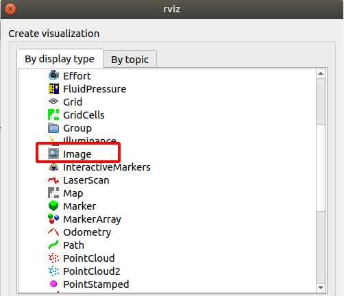

Fixed frame选择camera_link


image组件填入对应的话题获取rgb图片


完成上述操作之后就能在Image窗口看到摄像头拍摄的画面了。


如果想要查看点云数据，点击add添加DepthCloud组件


fixed frame选择camera_link, DepthCloud组件选择对应的话题


显示深度图


### 7.2 rtabmap算法介绍

rtabmap算法提供一个与时间和尺度无关的基于外观的定位与构图解决方案。针对解决大型环境中的在线闭环检测问题。方案的思想在于为了满足实时性的一些限制，闭环检测是仅仅利用有限数量的一些定位点，同时在需要的时候又能够访问到整个地图的定位点。

### 7.3 rtabmap算法建图

> 注：在运行命令之前，请确保其他终端中的程序已经终止，终止命令为：Ctrl+c
>

> 注：建图过程中limo的速度尽量慢点，速度太快会影响建图的效果
>

（1）启动雷达，在终端中输入命令：

```
roslaunch limo_bringup limo_start.launch pub_odom_tf:=true
```

（2）启动相机，在终端中输入命令：

```
 roslaunch astra_camera dabai_u3.launch 
```

如果启动失败，尝试启动以下命令：

```
 roslaunch astra_camera dabai_dc1.launch 
```

（3）启动rtabmap算法的建图模式，在终端中输入命令：

```
roslaunch limo_bringup limo_rtabmap_orbbec.launch
```

（4）启动rviz查看建图效果，在终端中输入命令：

```
roslaunch limo_bringup rtabmap_rviz.launch 
```

当rviz界面中出现如图 的画面时，rtabmap算法建图模式成功启动


当构建完地图之后，可以直接终止程序，构建的地图将自动保存在主目录下的.ros文件中，文件名称为rtabmap.db。.ros文件夹为隐藏文件夹，需要通过Ctrl+h指令显示出来。

### 7.4 rtabmap算法导航

> 注：在运行命令之前，请确保其他终端中的程序已经终止，终止命令为：Ctrl+c
>

（1）启动雷达，在终端中输入命令：

```
roslaunch limo_bringup limo_start.launch pub_odom_tf:=true
```

（2）启动相机，在终端中输入命令：

```
roslaunch astra_camera dabai_u3.launch 
```

如果启动失败，尝试启动以下命令：

```
 roslaunch astra_camera dabai_dc1.launch 
```

（3）启动rtabmap算法的定位模式，在终端中输入命令：

```
roslaunch limo_bringup limo_rtabmap_orbbec.launch localization:=true
```

（4）启动move_base，在终端中输入命令：

```
roslaunch limo_bringup limo_navigation_rtabmap.launch
```

> 注：如果是阿克曼运动模式，请运行
>

```
roslaunch limo_bringup limo_navigation_rtabmap_ackerman.launch
```

（5）启动rviz查看建图效果，在终端中输入命令：

```
 roslaunch limo_bringup rtabmap_rviz.launch 
```

（6）因为我们用到视觉定位，所以在采用rtabmap导航的时候不需要校正，可以直接开始设置目标点进行导航，操作步骤如图 。


地图中将会生成一条绿色的路径，手柄切换至指令模式，limo将自动导航到目标点


## 八、 视觉模块

### 8.1 识别文字

#### 8.1.1 功能简介

通过获取相机的rgb图像，对图像进行灰度化、二值化处理，在利用pytesseract文字识别库对图像的英文字母或数字进行识别，把识别的结果发布到detect_word_reslut话题中。

#### 8.1.2 运行功能

> 注：在运行命令之前，请确保其他终端中的程序已经终止，终止命令为：Ctrl+c
>

启动节点管理，在终端中输入命令：

```
roscore
```

启动文字识别功能，在终端中输入命令：

```
rosrun vision detect_node.py
```

执行rostopic echo /detect_word_reslut可以查看识别出来的结果

```
rostopic echo /detect_word_reslut
```


 

### 8.2 颜色识别

#### 8.2.1 功能简介

在ROS中使用OpenCV进行颜色识别的思路是，使用cv_bridge将ROS图像消息转换为OpenCV格式，然后在图像上应用颜色阈值过滤，提取感兴趣的颜色范围。标记检测结果，例如通过绘制边界框，然后将结果发布到新的ROS话题，以供其他节点使用。该过程包括图像的获取、颜色空间转换、阈值处理和结果发布，使机器人能够实时识别目标颜色区域。

#### 8.1.2 运行功能

> 注：在运行命令之前，请确保其他终端中的程序已经终止，终止命令为：Ctrl+c
>

启动颜色识别功能，在终端中输入命令：

```
rosrun limo_visions recognition
```


### 8.3 颜色跟踪

#### 8.3.1 功能简介

在ROS中使用OpenCV进行颜色识别的思路是，使用cv_bridge将ROS图像消息转换为OpenCV格式，然后在图像上应用颜色阈值过滤，提取感兴趣的颜色范围。标记检测结果，然后 根据检测到的结果判断是否需要向/cmd_vel话题发布数据。

#### 8.3.2 运行功能

> 注：在运行命令之前，请确保其他终端中的程序已经终止，终止命令为：Ctrl+c

启动相机，在终端中输入命令：

```
roslaunch astra_camera dabai_u3.launch 
```

如果启动失败，尝试启动以下命令：

```
 roslaunch astra_camera dabai_dc1.launch 
```

启动颜色识别功能，在终端中输入命令：

```
roslaunch limo_visions follow.launch
```


### 8.4 控制升降杆

#### 8.4.1 功能简介

通过aruco功能包识别升降杆上面的二维码，判断出Limo与升降杆的位置距离，当小于0.3M时，Limo会发送一个消息到/chatter_updown话题中，从而控制升降杆。

#### 8.4.2 运行功能

> 注：在运行命令之前，请确保其他终端中的程序已经终止，终止命令为：Ctrl+c
>

以ORBBEC®Dabai为例子，启动ORBBEC®Dabai深度相机，在终端中输入命令：

```
 roslaunch astra_camera dabai_u3.launch 
```

如果启动失败，尝试启动以下命令：

```
 roslaunch astra_camera dabai_dc1.launch 
```

启动二维码标签识别功能，在终端中输入命令：

```
roslaunch detect_ros agx_ar_pose.launch
```


当终端中出现pub num : 1时，升降杆将会抬起来，这时limo将有三秒钟的时间通过升降杆

### 8.5 视觉巡线功能

#### 8.5.1 功能介绍

在ROS中通过OpenCV实现视觉巡线功能的思路是：首先，订阅摄像头图像话题获取实时图像。然后，使用cv_bridge库将ROS图像消息转换为OpenCV格式。通过图像处理技术，如颜色阈值或边缘检测，提取巡线的特征。接着，检测巡线的位置与方向，计算机器人需要调整的航向角度。最后，将控制指令发布到机器人底盘控制话题，如/cmd_vel。

#### 8.5.2 运行功能

> 注：在运行命令之前，请确保其他终端中的程序已经终止，终止命令为：Ctrl+c

启动视觉巡线功能，在终端中输入指令

```
roslaunch limo_deeplearning follow_lane.launch
```


### 8.6 红绿灯识别

#### 8.6.1 功能介绍

在ROS中通过OpenCV实现红绿灯功能的思路是：首先，订阅摄像头图像话题以获取实时图像。然后，使用cv_bridge库将ROS图像消息转换为OpenCV格式。通过颜色阈值或机器学习模型，提取图像中的红绿灯区域。接着，分析灯的颜色状态，确定红绿灯的当前状态。最后，将识别到的红绿灯状态发布出来。

#### 8.6.2 运行功能

> 注：在运行命令之前，请确保其他终端中的程序已经终止，终止命令为：Ctrl+c

启动红绿灯识别功能，在终端中输入指令：

```
roslaunch limo_deeplearning traffic_detect.launch 
```


### 8.7 Ultralytics YOLO

#### 8.7.1 功能介绍

使用 Ultralytics YOLO 进行实时对象检测和分割

#### 8.7.2 运行功能

> 注：在运行命令之前，请确保其他终端中的程序已经终止，终止命令为：Ctrl+c

启动摄像头

```
roslaunch astra_camera dabai_u3.launch 
```

启动ultralytics_ros识别节点

```bash
roslaunch ultralytics_ros tracker.launch debug:=true
```

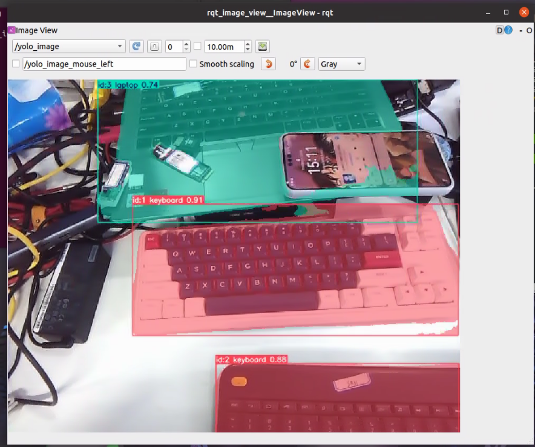

## 九、语音模块

### 9.1 语音转文字

#### 9.1.1 功能简介

通过orin nano的外接声卡把声音录制成wav文件，用可以离线识别的语音库pocketsphinx实现语音识别。该功能对英文的识别率较高，中文的识别率较差。

#### 9.1.2 运行功能

> 注：在运行命令之前，请确保其他终端中的程序已经终止，终止命令为：Ctrl+c
>

在终端中输入以下命令，当终端中出现recording时，开始录制声音，3秒中之后录制完毕，终端会出现done

```
rosrun voice  demo_record_voice.py 
```


声音录制完毕后，在终端中输入命令：

```
rosrun voice  demo_voice2word.py output.wav
```


###  9.2 语音控制

#### 9.2.1 功能简介

通过对limo说 ahead  back right left，控制limo前进，后退，右转，左转

#### 9.2.2 运行功能

> 注：在运行命令之前，请确保其他终端中的程序已经终止，终止命令为：Ctrl+c
>

1、启动底盘节点，底盘节点启动之后，把手柄调至指令模式

```
 roslaunch limo_base limo_base.launch 
```

2、启动语音控制节点，启动之后会出现下图的界面，通过输入1，回车之后进入语音录制模式，并控制limo；输入q则退出

```
rosrun voice voice_ctr_node.py 
```


## 十、机械臂控制（选配）

> **Mycobot机械臂为选配，标准Limo Pro没有搭配机械臂**

### (1) 机械臂的安装与连接

Mycobot机械臂与LIMO PRO通过螺钉连接在一起。LIMO PRO车顶预留了8个M3螺丝孔位用于扩展，利用其中4个正方形排布的螺丝孔位，对应Mycobot机械臂底部的4个正方形排布孔位，通过螺钉连接在一起。所对应的螺孔位置如下图所示。


> 注意：为了保证后续真实机械臂控制与rviz中的显示一致，机械臂与小车的安装关系应与软件包中的URDF模型文件一致。即安装时机械臂的显示屏方向应朝向小车的显示屏一侧，此时便可以通过机械臂底盘顶部的螺柱安装孔拧紧螺柱，机械臂安装示意图如下图。


安装完成后，进行小车和机械臂之间的接线。机械臂的基本控制功能的实现只需要完成两根接线：机械臂供电接线与串口通信接线。

①车载计算机与机械臂之间的串口通信目前可以支持两种接线方式：方式一：通过TypeC-USB线连接车载计算机扩展接口端的USB接口与机械臂的TypeC接口；方式二：通过TypeC-TypeC线分别连接车载计算机和机械臂的TypeC接口。

②机械臂供电接线：LIMO PRO车内引出电源DC接口线与机械臂侧面的电源DC接口连接供电。


Mycobot机械臂具有两种控制方式。首先，可以直接调用API接口，通过赋予机械臂六个关节角度来实现控制。这种方式可以让用户直接指定机械臂的运动轨迹和姿态，从而精确控制其动作。其次，Mycobot还支持使用MoveIt进行控制。用户可以设定目标点，由MoveIt计算出六个关节角度，并将这些角度发送给机械臂。这种方式更加灵活，可以通过目标点的设定来实现更加复杂的运动规划和控制，同时也能够适应不同的工作场景和需求。无论是直接调用API接口还是使用MoveIt，Mycobot都能够提供高效、精准的机械臂控制，满足用户在不同场景下的需求。

打开机械臂，若进入如下的界面，需要进行通讯配置。选择Transponder,点击ok.


再选择USB UART，点击ok。


成功后会出现Atom:ok字样。

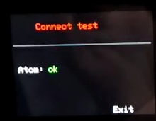

### (2) 机械臂的基础功能使用

在使用机械臂各功能前，请先查看系统软件包的版本是否为最新版本：

```bash
pip show pymycobot
```


若系统软件包版本不是最新版，请先更新至最新版：

```bash
pip install pymycobot --upgrade
```

### 10.1 使用滑块控制仿真机械臂（选配）

> 注：启动之前确保已经连接好机械臂

启动滑块控制节点，打开一个新终端，在终端中输入命令：

```bash
roslaunch mycobot_280 slider_control.launch port:=/dev/ttyACM0 baud:=115200
```

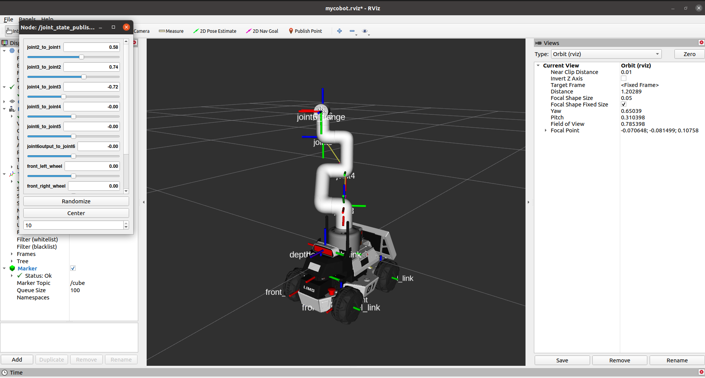

可以通过拖动滑块来控制机械臂移动。

### 10.2 使用滑块控制真实机械臂（选配）

> 注：由于在命令输入的同时机械臂会移动到模型目前的位置，在您使用命令之前请确保rviz中的模型没有出现穿模现象 不要在连接机械臂后做出快速拖动滑块的行为，防止机械臂损坏

> 注：启动之前确保已经连接好机械臂

启动滑块控制节点，打开一个终端，在终端中输入命令：

```
roslaunch mycobot_280 slider_control.launch
```

启动真实机械臂

```bash
rosrun mycobot_280 slider_control.py _port:=/dev/ttyACM0 _baud:=115200
```

### 10.3 模型跟随真实机械臂（选配）

> 注：启动之前确保已经连接好机械臂

启动机械臂模型，打开一个新终端，在终端中输入：

```
roslaunch mycobot_280 mycobot_follow.launch
```

启动模型跟随节点：

```
rosrun mycobot_280 follow_display.py _port:=/dev/ttyACM0 _baud:=115200
```

成功启动之后，机械臂会解锁，这时可以用手掰动机械臂，rviz里面的模型也会跟随移动


### 10.4 GUI控制机械臂（选配）

> 注：启动之前确保已经连接好机械臂

使用一个简单的GUI界面控制机械臂运动，启动一个新的终端，在终端之后输入命令：

```bash
roslaunch mycobot_280 simple_gui.launch
```

启动成功后，可以在gui界面中输入各个关节的角度信息或者位置信息


### 10.5 键盘控制机械臂（选配）

> 注：启动之前确保已经连接好机械臂

使用键盘控制机械，打开一个新终端，在终端中输入：

```bash
roslaunch mycobot_280 teleop_keyboard.launch
```

等待终端显示ready后再开一条命令行：

```bash
rosrun mycobot_280 teleop_keyboard.py
```

启动成功之后，可以使用按键w a s d控制机械臂运动

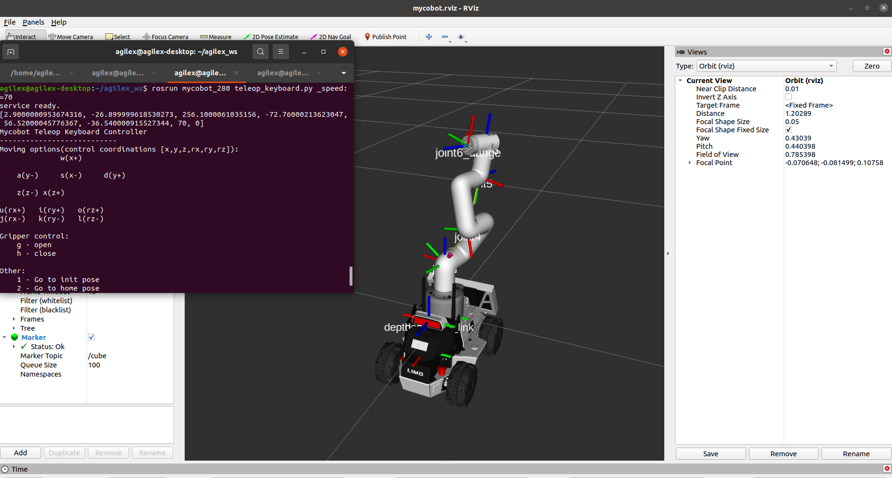

### 10.6 使用moveit控制机械臂（选配）

> 注：启动之前确保已经连接好机械臂

ROS MoveIt是一个用于运动规划和控制的强大框架，专门设计用于机械臂系统。MoveIt允许您轻松地配置、规划和执行机械臂的运动。

启动moveit 机械臂控制节点，打开一个新终端，在终端中输入：

```bash
roslaunch limo_cobot_moveit_config demo.launch
```

启动真实机械臂同步节点: 

```bash
rosrun mycobot_280_moveit sync_plan.py _port:=/dev/ttyACM0 _baud:=115200
```

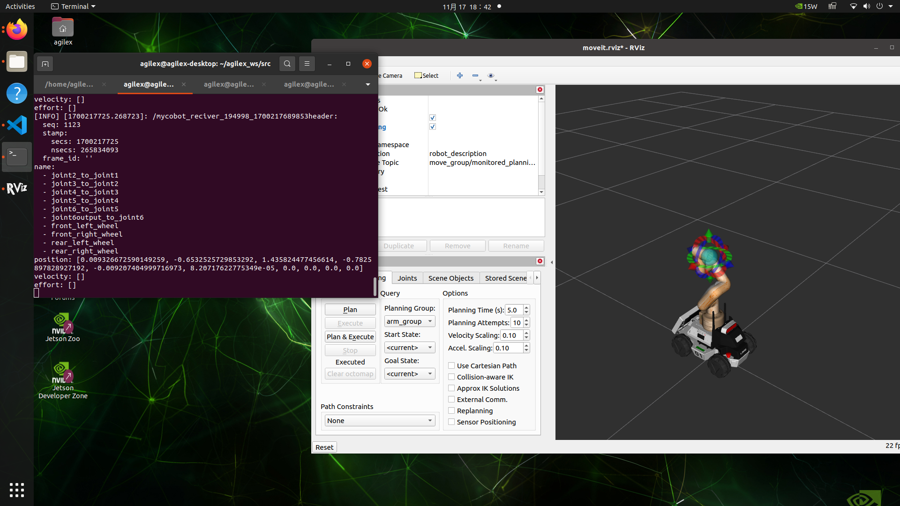

### 10.7 移动抓取（选配）

在移动抓取功能中，使用move_base将Limo机器人导航到目标点位置。一旦机器人到达目标位置，通过调用机械臂的API接口，触发机械臂执行抓取运动，实现移动抓取功能的完整流程。这种综合运用导航和机械臂控制，使得机器人可以在动态环境中移动并执行抓取任务。

（1）启动激光雷达，打开一个新终端，在终端中输入命令：

```
roslaunch limo_bringup limo_start.launch pub_odom_tf:=false
```

（2）启动导航功能，打开一个新终端，在终端中输入命令：

```
roslaunch limo_bringup limo_navigation_diff.launch
```

记录第一个位置

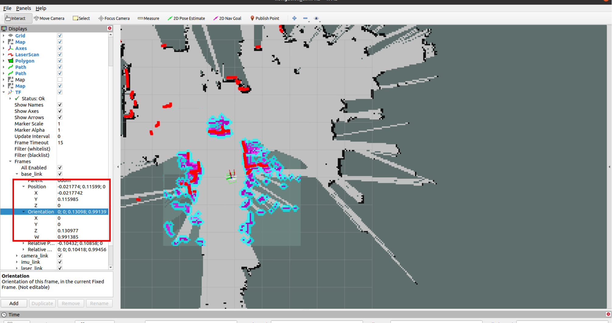

将limo开到抓取地点，记录第二个位置

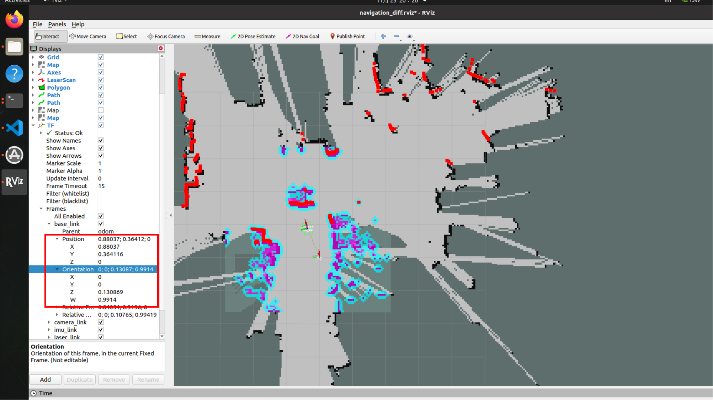

将数据填到/home/agilex/agilex_ws/src/set_nav_point/more_task_node.py中如图位置

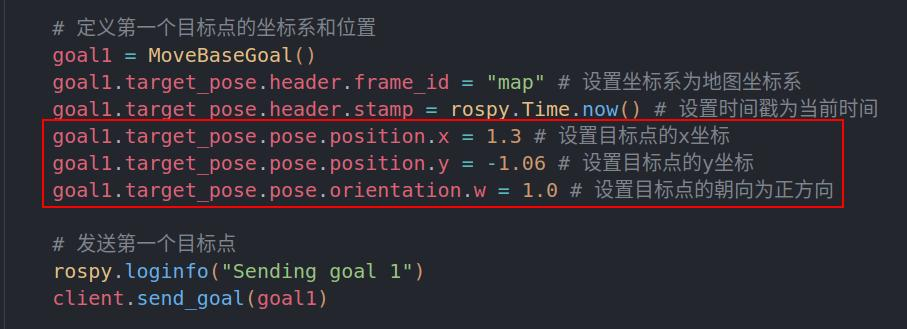


（3）启动移动抓取功能节点，打开一个新终端，在终端中输入命令：

```
rosrun set_nav_point more_task_node.py
```

启动成功之后，limo将前往抓取地点，到达之后，机械臂会执行抓取动作。

## 附录

### 附录1、三视图


### 附录2、基本操作命令

#### 2.1 目录操作命令

##### (1) 目录切换 cd

① cd /     切换到根目录

② cd /usr     切换到根目录下的usr目录

③ cd ../     切换到上一级目录 或者  cd ..

④ cd ~     切换到home目录

⑤ cd -     切换到上次访问的目录

##### (2) 目录查看 ls

① ls     查看当前目录下的所有目录和文件

② ls -a    查看当前目录下的所有目录和文件（包括隐藏的文件）

③ ls -l或ll  列表查看当前目录下的所有目录和文件（列表查看，显示更多信息）

④ ls /dir   查看指定目录下的所有目录和文件如：ls /usr

##### (3) 创建目录 mkdir

① mkdir aaa 在当前目录下创建一个名为aaa的目录

② mkdir /usr/aa 在指定目录下创建一个名为aaa的目录

##### (4) 显示隐藏目录 Ctrl+h

在文件夹中，通过 Ctrl+h可以显示文件夹中的隐藏文件夹

##### (5) 终止程序 Ctrl+c

在终端中输入命令 Ctrl+c ，强制终止正在执行的程序

#### 2.2 ROS常用命令

##### （1）编译命令 catkin_make

​	用于编译整个工作空间中的功能包

##### （2）初始化工作空间  catkin_init_workspace

​	在初次创建工作空间时，用于初始化工作空间

##### （3）创建功能包 catkin_create_pkg

​	用于创建一个功能包，其语法为：

```
 catkin_create_pkg <package_name> [depend1] [depend2] [depend3]...
```

##### （4）节点运行命令

​	① rosrun	用于运行.cpp文件和.py文件，其语法为：

```
	rosrun package_name node_name
```

​	②  roslaunch	用于运行.launch文件，在launch文件中可以同时调用.cpp文件和.py文件，其语法为：

```
	roslaunch package_name node_name
```


### 附录3、ROS框架

#### 3.1 ROS架构设计

ROS架构如下图，可以将其分为三个层次：OS层、中间层和应用层。

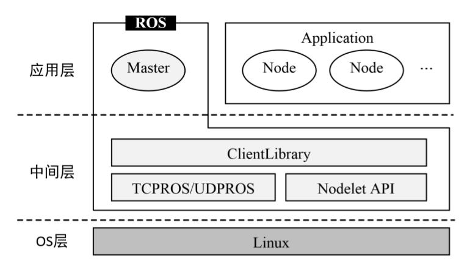

（1）OS层

ROS并不是一个传统意义上的操作系统，无法像Windows、Linux一样直接运行在计算机硬件之上，而是需要依托于Linux系统。所以在OS层，我们可以直接使用ROS官方支持度最好的Ubuntu操作系统，也可以使用macOS、Arch、Debian等操作系统。

（2）中间层

Linux是一个通用系统，并没有针对机器人开发提供特殊的中间件，所以ROS在中间层做了大量工作，其中最为重要的就是基于TCPROS/UDPROS的通信系统。ROS的通信系统基于TCP/UDP网络，在此之上进行了再次封装，也就是TCPROS/UDPROS。通信系统使用发布/订阅、客户端/服务器等模型，实现多种通信机制的数据传输。

除了TCPROS/UDPROS的通信机制外，ROS还提供一种进程内的通信方法——Nodelet，可以为多进程通信提供一种更优化的数据传输方式，适合对数据传输实时性方面有较高要求的应用。

在通信机制之上，ROS提供了大量机器人开发相关的库，如数据类型定义、坐标变换、运动控制等，可以提供给应用层使用。

（3）应用层

在应用层，ROS需要运行一个管理者——Master，负责管理整个系统的正常运行。ROS社区内共享了大量的机器人应用功能包，这些功能包内的模块以节点为单位运行，以ROS标准的输入输出作为接口，开发者不需要关注模块的内部实现机制，只需要了解接口规则即可实现复用，极大地提高了开发效率。

从系统实现的角度来看，ROS也可以分为如下图所示的三个层次：文件系统、计算图和开源社区。


#### 3.2 计算图

从计算图的角度来看，ROS系统软件的功能模块以节点为单位独立运行，可以分布于多个相同或不同的主机中，在系统运行时通过端对端的拓扑结构进行连接。

##### 3.2.1 节点

节点(Node)就是一些执行运算任务的进程，一个系统一般由多个节点组成，也可以称为“软件模块”。节点概念的引入使得基于ROS的系统在运行时更加形象：当许多节点同时运行时，可以很方便地将端对端的通信绘制成如下图所示的节点关系图，在这个图中进程就是图中的节点，而端对端的连接关系就是节点之间的连线。


##### 3.2.2 消息

节点之间最重要的通信机制就是基于发布/订阅模型的消息(Message)通信。每一个消息都是一种严格的数据结构，支持标准数据类型(整型、浮点型、布尔型等)，也支持嵌套结构和数组(类似于C语言的结构体struct)，还可以根据需求由开发者自主定义。

##### 3.2.3 话题

消息以一种发布/订阅(Publish/Subscribe)的方式传递(见下图)。一个节点可以针对一个给定的话题(Topic)发布消息(称为发布者/Talker)，也可以关注某个话题并订阅特定类型的数据(称为订阅者/Listener)。发布者和订阅者并不了解彼此的存在，系统中可能同时有多个节点发布或者订阅同一个话题的消息。


##### 3.2.4 服务

虽然基于话题的发布/订阅模型是一种很灵活的通信模式，但是对于双向的同步传输模式并不适合。在ROS中，我们称这种同步传输模式为服务(Service)，其基于客户端/服务器(Client/Server)模型，包含两个部分的通信数据类型：一个用于请求，另一个用于应答，类似于Web服务器。与话题不同的是，ROS中只允许有一个节点提供指定命名的服务。

##### 3.2.5 节点管理器

为了统筹管理以上概念，系统当中需要有一个控制器使得所有节点有条不紊地执行，这就是ROS节点管理器(ROS Master)。ROS Master通过远程过程调用(RPC)提供登记列表和对其他计算图表的查找功能，帮助ROS节点之间相互查找、建立连接，同时还为系统提供参数服务器，管理全局参数。ROS Master就是一个管理者，没有它的话，节点将无法找到彼此，也无法交换消息或调用服务，整个系统将会瘫痪，由此可见其在ROS系统中的重要性。

#### 3.3 文件系统

类似于操作系统，ROS将所有文件按照一定的规则进行组织，不同功能的文件被放置在不同的文件夹下，如图2-5所示。

功能包(Package)：功能包是ROS软件中的基本单元，包含ROS节点、库、配置文件等。

功能包清单(PackageManifest)：每个功能包都包含一个名为package.xml的功能包清单，用于记录功能包的基本信息，包含作者信息、许可信息、依赖选项、编译标志等。

元功能包(Meta Package)：在新版本的ROS中，将原有功能包集(Stack)的概念升级为“元功能包”，主要作用都是组织多个用于同一目的的功能包。例如一个ROS导航的元功能包中会包含建模、定位、导航等多个功能包。

元功能包清单：在下图中并未显示，类似于功能包清单，不同之处在于元功能包清单中可能会包含运行时需要依赖的功能包或者声明一些引用的标签。

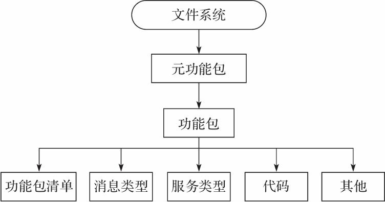

消息(Message)类型：消息是ROS节点之间发布/订阅的通信信息，可以使用ROS提供的消息类型，也可以使用.msg文件在功能包的msg文件夹下自定义所需要的消息类型。

服务(Service)类型：服务类型定义了ROS客户端/服务器通信模型下的请求与应答数据类型，可以使用ROS系统提供的服务类型；也可以使用.srv文件在功能包的srv文件夹中进行定义。

代码(Code)：用来放置功能包节点源代码的文件夹。

#### 3.4 开源社区

ROS开源社区中的资源非常丰富，而且可以通过网络共享以下软件和知识(见图2-9)。

发行版(Distribution)：类似于Linux发行版，ROS发行版包括一系列带有版本号、可以直接安装的功能包，这使得ROS的软件管理和安装更加容易，而且可以通过软件集合来维持统一的版本号。

软件源(Repository)：ROS依赖于共享网络上的开源代码，不同的组织机构可以开发或者共享自己的机器人软件。

ROS wiki：记录ROS信息文档的主要论坛。所有人都可以注册、登录该论坛，并且上传自己的开发文档、进行更新、编写教程。

邮件列表(Mailing List)：ROS邮件列表是交流ROS更新的主要渠道，同时也可以交流ROS开发的各种疑问。

ROS Answers：ROS Answers是一个咨询ROS相关问题的网站，用户可以在该网站提交自己的问题并得到其他开发者的回答。

博客(Blog)：发布ROS社区中的新闻、图片、视频 (http：//www.ros.org/news)。

#### 3.5 通信机制

ROS是一个分布式框架，为用户提供多节点(进程)之间的通信服务，所有软件功能和工具都建立在这种分布式通信机制上，所以ROS的通信机制是最底层也是最核心的技术。在大多数应用场景下，尽管我们不需要关注底层通信的实现机制，但是了解其相关原理一定会帮助我们在开发过程中更好地使用ROS。以下就ROS最核心的三种通信机制进行介绍。

##### 3.5.1 话题通信机制

话题在ROS中使用最为频繁，其通信模型也较为复杂。如下图所示，在ROS中有两个节点：一个是发布者Talker，另一个是订阅者Listener。两个节点分别发布、订阅同一个话题，启动顺序没有强制要求，此处假设Talker首先启动，可分成图中所示的七步来分析建立通信的详细过程。


1.Talker注册

Talker启动，通过1234端口使用RPC向ROS Master注册发布者的信息，包含所发布消息的话题名；ROS Master会将节点的注册信息加入注册列表中。

2.Listener注册

Listener启动，同样通过RPC向ROS Master注册订阅者的信息，包含需要订阅的话题名。

3.ROS Master进行信息匹配

Master根据Listener的订阅信息从注册列表中进行查找，如果没有找到匹配的发布者，则等待发布者的加入；如果找到匹配的发布者信息，则通过RPC向Listener发送Talker的RPC地址信息。

4.Listener发送连接请求

Listener接收到Master发回的Talker地址信息，尝试通过RPC向Talker发送连接请求，传输订阅的话题名、消息类型以及通信协议(TCP/UDP)。

5.Talker确认连接请求

Talker接收到Listener发送的连接请求后，继续通过RPC向Listener确认连接信息，其中包含自身的TCP地址信息。

6.Listener尝试与Talker建立网络连接

Listener接收到确认信息后，使用TCP尝试与Talker建立网络连接。

7.Talker向Listener发布数据

成功建立连接后，Talker开始向Listener发送话题消息数据。

从上面的分析中可以发现，前五个步骤使用的通信协议都是RPC，最后发布数据的过程才使用到TCP。ROS Master在节点建立连接的过程中起到了重要作用，但是并不参与节点之间最终的数据传输。

节点建立连接后，可以关掉ROS Master，节点之间的数据传输并不会受到影响，但是其他节点也无法加入这两个节点之间的网络。

##### 3.5.2 参数管理机制

参数类似于ROS中的全局变量，由ROS Master进行管理，其通信机制较为简单，不涉及TCP/UDP的通信，如下图所示。


1.Talker设置变量

Talker使用RPC向ROS Master发送参数设置数据，包含参数名和参数值；ROS Master会将参数名和参数值保存到参数列表中。

2.Listener查询参数值

Listener通过RPC向ROS Master发送参数查找请求，包含所要查找的参数名。

3.ROS Master向Listener发送参数值

Master根据Listener的查找请求从参数列表中进行查找，查找到参数后，使用RPC将参数值发送给Listener。

这里需要注意的是，如果Talker向Master更新参数值，Listener在不重新查询参数值的情况下是无法知晓参数值已经被更新的。所以在很多应用场景中，需要一种动态参数更新的机制，第12章会具体讲解ROS中动态参数配置功能的实现。


### 附录4、ROS基础

#### 4.1 工作空间

使用ROS实现机器人开发的主要手段当然是写代码，那么这些代码文件就需要放置到一个固定的空间内，也就是工作空间。

##### 4.1.2 什么是工作空间

工作空间(workspace)是一个存放工程开发相关文件的文件夹。Fuerte版本之后的ROS默认使用的是Catkin编译系统，一个典型Catkin编译系统下的工作空间结构如下。

典型的工作空间中一般包括以下四个目录空间。

（1）src：代码空间，开发过程中最常用的文件夹，用来存储所有ROS功能包的源码文件。

（2）build：编译空间，用来存储工作空间编译过程中产生的缓存信息和中间文件。

（3）devel：开发空间，用来放置编译生成的可执行文件。

（4）lib：安装库空间，编译成功后，可以使用make install命令将可执行文件安装到该空间中，运行该空间中的环境变量脚本，即可在终端中运行这些可执行文件。安装库空间并不是必需的，很多工作空间中可能并没有该文件夹。

##### 4.2.2 创建工作空间

创建工作空间的命令比较简单，首先使用系统命令创建工作空间目录，然后运行ROS的工作空间初始化命令即可完成创建过程：

创建一个名为catkin_ws的文件夹并在catkin_ws下继续创建一个名为src的文件夹

```
 mkdir -p ~/catkin_ws/src
```

切换到catkin_ws文件夹下的src文件夹

```
 cd ~/catkin_ws/src
```

初始化文件夹

```
 catkin_init_workspace
```

创建完成后，可以在工作空间的根目录下使用catkin_make命令编译整个工作空间：

切换到catkin_ws文件夹下

```
cd ~/catkin_ws/
```

运行编译命令

```
 catkin_make
```

编译过程中，在工作空间的根目录里会自动产生build和devel两个文件夹及其中的文件。编译完成后，在devel文件夹中已经产生几个setup.*sh形式的环境变量设置脚本。使用source命令运行这些脚本文件，则工作空间中的环境变量可以生效。

```
 source devel/setup.bash
```

为了确保环境变量已经生效，可以使用如下命令进行检查：

```
 echo $ROS_PACKAGE_PATH
```

如果打印的路径中已经包含当前工作空间的路径，则说明环境变量设置成功(见下图)。


在终端中使用source命令设置的环境变量只能在当前终端中生效，如果希望环境变量在所有终端中有效，则需要在终端的配置文件中加入环境变量的设置：

```
echo"source/WORKSPACE/devel/setup.bash">>~/.bashrc
```

请使用工作空间路径代替WORKSPACE。

##### 4.2.3 创建功能包

ROS中功能包的形式如下：

```
my_package/
	CMakeLists.txt
	package.xml

	......
```

package.xml文件提供了功能包的元信息，也就是描述功能包属性的信息。CMakeLists.txt文件记录了功能包的编译规则。

ROS不允许在某个功能包中嵌套其他功能包，多个功能包必须平行放置在代码空间中。

ROS提供直接创建功能包的命令catkin_create_pkg，该命令的使用方法如下：

```
 catkin_create_pkg <package_name> [depend1] [depend2] [depend3]...
```

在运行catkin_create_pkg命令时，用户需要输入功能包的名称(package_name)和所依赖的其他功能包名称(depend1、depend2、depend3)。例如，我们需要创建一个learning_limo功能包，该功能包依赖于std_msgs、roscpp、rospy等功能包。

首先进入代码空间，使用catkin_create_pkg命令创建功能包：

切换到catkin_ws文件夹下的src文件夹

```
cd ~/catkin_ws/src
```

运行创建功能包的命令

```
catkin_create_pkg learning_limo std_msgs rospy roscpp
```

创建完成后，代码空间src中会生成一个learning_limo功能包，其中已经包含package.xml和CMakeLists.txt文件。

然后回到工作空间的根目录下进行编译，并且设置环境变量：

切换到catkin_ws文件夹下

```
cd ~/catkin_ws
```

运行编译命令

```
 catkin_make
```

设置环境变量

```
source ~/catkin_ws/devel/setup.bash
```

以上便是创建一个功能包的基本流程。

注意：在同一个工作空间下，不允许存在同名功能包，否则在编译时会报错。

#### 4.3 编写功能包控制limo

使用话题通信机制控制limo运动，需要编写Publisher和Subscriber两个节点，Publisher负责向limo发布速度控制指令，Subscriber负责监听limo接收到的速度大小。

##### 4.3.1 如何创建Publisher

Publisher的主要作用是针对指定话题发布特定数据类型的消息。我们尝试使用代码实现一个节点，节点中创建一个Publisher并控制limo运动。源码文件位置为~/agilex_ws/src/limo_ros/learning_limo/src/talker.cpp，其内容如下：

```
#include <sstream>
#include "ros/ros.h"
#include "std_msgs/String.h"
#include <geometry_msgs/Twist.h>

int main(int argc, char **argv)
{
    // ROS节点初始化
    ros::init(argc, argv, "talker");

	// 创建节点句柄
	ros::NodeHandle n;

	// 创建一个Publisher，发布名为chatter的topic，消息类型为geometry_msgs::Twist
	ros::Publisher chatter_pub = n.advertise<geometry_msgs::Twist>("cmd_vel", 1000);

	// 设置循环的频率
	ros::Rate loop_rate(10);

   for ( int count = 0; count<10;count++ )
   {
   //设置需要发布的速度大小
    geometry_msgs::Twist twist;
    geometry_msgs::Vector3 linear;
    linear.x=0.1;
    linear.y=0;
    linear.z=0;
    geometry_msgs::Vector3 angular;
    angular.x=0;
    angular.y=0;
    angular.z=0;
   
   //将设置好的速度赋值给twist
    twist.linear=linear;
    twist.angular=angular;

	//将设置好的速度发布出去
    chatter_pub.publish(twist);

    // 循环等待回调函数
    ros::spinOnce();

    // 按照循环频率延时
    loop_rate.sleep();

   }

return 0;

}

```

##### 4.3.2 如何创建Subscriber

接下来，我们尝试创建一个Subscriber以订阅Publisher节点发布的控制指令。源码文件位置为~/agilex_ws/src/limo_ros/learning_limo/src/listener.cpp，其内容如下：

```
#include "ros/ros.h"
#include "std_msgs/String.h"
#include <geometry_msgs/Twist.h>

// 接收到订阅的消息后，会进入消息回调函数
void chatterCallback(const geometry_msgs::TwistConstPtr& msg )
{
	//提取msg中的数据并赋值
    double x = msg->linear.x;
    double y = msg->linear.y;
    double z = msg->angular.z;
    
    // 将接收到的消息打印出来
    ROS_INFO("I get x: [%f]", x);
    ROS_INFO("I get y: [%f]", y);
    ROS_INFO("I get z: [%f]", z);
    
}

int main(int argc, char **argv)
{
    // 初始化ROS节点
    ros::init(argc, argv, "listener");

// 创建节点句柄
ros::NodeHandle n;

// 创建一个Subscriber，订阅名为chatter的topic，注册回调函数chatterCallback
ros::Subscriber sub = n.subscribe("cmd_vel", 1000, chatterCallback);

// 循环等待回调函数
ros::spin();

return 0;

}
```

##### 4.3.3 编译功能包

节点的代码已经完成，C++是一种编译语言，在运行之前需要将代码编译成可执行文件，如果使用Python等解析语言编写代码，则不需要进行编译，可以省去此步骤。

ROS中的编译器使用的是CMake，编译规则通过功能包中的CMakeLists.txt文件设置，使用catkin命令创建的功能包中会自动生成该文件，已经配置多数编译选项，并且包含详细的注释，我们几乎不用查看相关的说明手册，稍作修改就可以编译自己的代码。

打开功能包中的CMakeLists.txt文件，找到以下配置项，去掉注释并稍作修改：

```
include_directories(include ${catkin_INCLUDE_DIRS})

add_executable(talker src/talker.cpp)
target_link_libraries(talker ${catkin_LIBRARIES})
add_dependencies(talker ${PROJECT_NAME}_generate_messages_cpp)

add_executable(listener src/listener.cpp)
target_link_libraries(listener ${catkin_LIBRARIES})
add_dependencies(talker ${PROJECT_NAME}_generate_messages_cpp)
```

##### 4.3.4 运行Publisher与Subscriber

编译完成后，我们终于可以运行Publisher和Subscriber节点了。在运行节点之前，需要在终端中设置环境变量，否则无法找到功能包最终编译生成的可执行文件：

切换至catkin_ws目录下

```
 cd ~/catkin_ws
```

设置环境变量

```
source ./devel/setup.bash
```

也可以将环境变量的配置脚本添加到终端的配置文件中：

```
echo "source ~/catkin_ws/devel/setup.bash" >> ~/.bashrc
source ~/.bashrc
```

在limo中，环境变量已经设置好了，可以按照以下步骤启动例程：

1.启动底盘节点

注：在运行命令之前，请确保其他终端中的程序已经终止，终止命令为：Ctrl+c

在运行节点之前，首先需要确保底盘节点已经成功启动：

```
roslaunch limo_base limo_base.launch 
```

2.启动Subscriber

先使用rosrun命令启动Subscriber节点，订阅Publisher即将发布的消息：

```
rosrun learning_limo listener 
```

如果消息订阅成功，会在终端中显示接收到的消息内容。

3.启动Publisher

接下来使用rosrun命令启动Publisher：

```
rosrun learning_limo talker
```

如果Publisher节点运行正常，小车会动起来，Subscriber节点也会接收到消息。

#### 4.4 ROS常用组件

##### 4.4.1 launch启动文件

启动文件(LaunchFile)便是ROS中一种同时启动多个节点的途径，它还可以自动启动ROS Master节点管理器，并且可以实现每个节点的各种配置，为多个节点的操作提供很大便利。

（1）launch 标签

launch标签就像一个有容乃大的括号，规定了一片区域，所有的launch文件都由< launch >开头，由< /launch>结尾，所有的描述标签都要写在< launch>< /launch>之间

```
<launch>
……
……
</launch>
```

（2）node 标签

node标签可以说是launch文件里最常见的标签了，每个node标签里包括了ROS图中节点的名称属性name、该节点所在的包名pkg以及节点的类型type，常见的使用方式如下：

```
<node pkg="package-name" type="executable-name" name="node-name" />
```

| 标签属性           | 属性作用                                               |
| ------------------ | ------------------------------------------------------ |
| name="NODE_NAME"   | 为节点指派名称，这将会覆盖掉ros::init()定义的node_name |
| pkg="PACKAGE_NAME" | 节点所在的功能包名称                                   |
| type="FILE_NAME"   | 定义节点的可执行文件名称                               |
| output="screen"    | 将节点的标准输出打印到终端屏幕，默认输出为日志文档。   |
| respawn="true"     | 复位属性，该节点停止时，会自动重启，默认为false。      |
| ns = "NAME_SPACE"  | 命名空间，为节点内的相对名称添加命名空间前缀。         |
| args="arguments"   | 节点需要的输入参数。                                   |

（3）include 标签

该标签可以导入另一个roslaunch XML文件到当前文件。

| 标签属性                                   | 属性作用               |
| ------------------------------------------ | ---------------------- |
| file ="$(find pkg-name)/path/filename.xml" | 指明想要包含进来的文件 |

使用起来就像下面这样

```
<include file="$(find demo)/launch/demo.launch" />
```

（4）remap 标签

remap标签顾名思义重映射，ROS支持topic的重映射，remap标签里包含一个original-name和一个new-name，及原名称和新名称。

比如现在你拿到一个节点，这个节点订阅了"/chatter"topic，然而你自己写的节点只能发布到"/demo/chatter"topic，由于这两个topic的消息类型是一致的，你想让这两个节点进行通讯，那么可以在launch文件中这样写：

```
<remap from="chatter" to="demo/chatter"/>
```

这样就可以直接把/chattertopic重映射到/demo/chatter，这样子不用修改任何代码，就可以让两个节点进行通讯。

（5）param标签

param标签的作用相当于命令行中的rosparam set。

比如现在在参数服务器中添加一个名为demo_param，值为1.0的参数

```
<param name="demo_param" type="int" value="1.0"/>
```

（6）rosparam  标签

rosparam标签允许从YAML文件中一次性导入大量参数。

使用方式如下：

```
<rosparam command="load" file="$(find pkg-name)/path/name.yaml"/>
```

（7）arg 标签

argument是另外一个概念，类似于launch文件内部的局部变量，仅限于launch文件使用，便于launch文件的重构，与ROS节点内部的实现没有关系。

设置argument使用arg标签元素，语法如下：

```
<arg name="arg-name" default= "arg-value"/>
```

##### 4.4.2 Rviz

rviz是一款三维可视化工具,很好地兼容了各种基于ROS软件框架的机器人平台。在rviz中,可以使用XML对机器人、周围物体等任何实物进行尺寸、质量、位置、材质、关节等属性的描述,并且在界面中呈现出来。同时,rviz还可以通过图形化方式,实时显示机器人传感器的信息、机器人的运动状态、周围环境的变化等。总而言之,rviz可以帮助开发者实现所有可监测信息的图形化显示,开发者也可以在rviz的控制界面下,通过按钮、滑动条、数值等方式控制机器人的行为。下图为构建地图过程中，rviz图形化显示的栅格地图和激光数据。

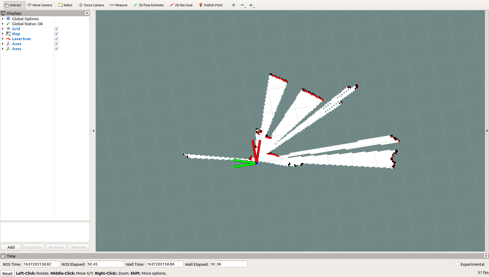

##### 4.4.3 Qt工具箱

计算图可视化工具(rqt_graph)

rqt_graph工具可以图形化显示当前ROS系统中的计算图。在运行建图功能时,使用如下命令即可启动该工具：

```
rqt_graph
```

启动成功后的计算图显示如下图所示。

 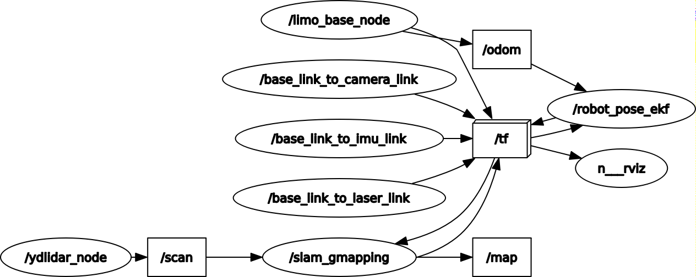


TF关系可视化工具（rqt_tf_tree）

rqt_tf_tree工具可以图形化显示当前运行节点之间的TF关系，在运行建图功能时，使用如下命令即可启动该工具：

```
rosrun rqt_tf_tree rqt_tf_tree 
```

启动成功后的TF关系图显示如下图所示

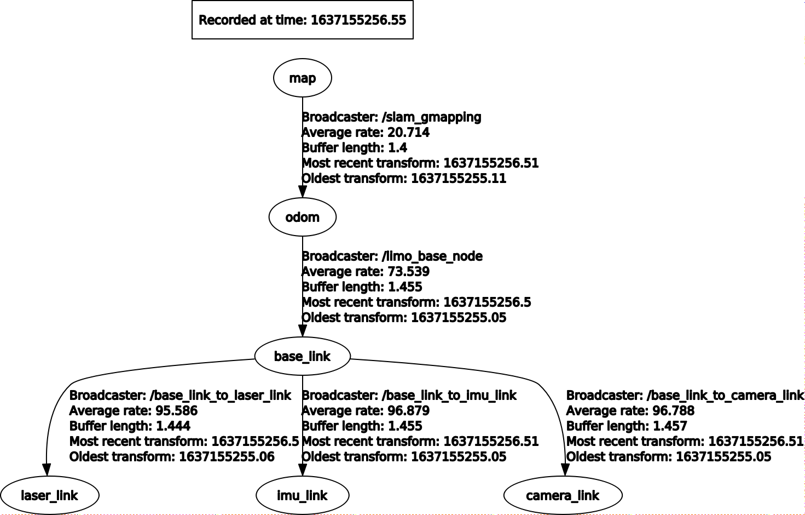


### 附录5、系统烧录

Limo有两个版本的nano，分别为SD卡版本和emmc版本，两个版本的烧录方式不一样，烧录的时候注意区分。

#### 5.1 SD卡版本烧录方式：

##### 5.1 下载安装balenaetcher

​	在个人PC电脑上下载安装balenaetcher，下载链接：https://www.balena.io/etcher/，根据个人电脑的操作系统和架构下载不同的版本。

##### 5.2 下载需要烧录的镜像

​	这里以我司提供的官方镜像为例，使用百度云盘下载镜像，下载链接为：https://pan.baidu.com/s/1-zu6W9URFPwzxGgB9bOQlw 提取码: k2t1 

##### 5.3 软件使用说明

软件使用说明以在Linux系统下为例子。

1、打开软件，选择需要烧录的镜像


2、选择需要进行烧录的SD卡


3、点击Flash，开始烧录


### 附录 6、固件升级

固件升级的软件在limo的主目录下，文件名称为LimonTest_Nano，升级所需要的固件在我司官方GitHub中，链接为：https://github.com/agilexrobotics/limo-doc

注：如limo中的LimonTest_Nano不能正常打开，请到我司官方GitHub中下载最新的软件，链接为：https://github.com/agilexrobotics/limo-doc

下载完所需要升级的固件，接下来开始操作步骤：

#### 1、进入固件升级模式

关机状态下连续按两下开机键进入固件升级模式，当开机键闪烁时，成功进入固件升级模式，等待几秒钟之后，nano会正常启动。

#### 2、赋予LimonTest_Nano软件运行权限

打开终端，在终端中输入命令：

```
chmod +x LimoTestV1.1_Nano
```

#### 3、启动软件，开始升级固件

在终端中输入命令：

```
./LimoTestV1.1_Nano 
```

软件成功打开之后，点击升级按钮，显示的画面如下图所示：


选择对应的串口，一般情况下，选择串口ttyTHS1，点击Open Serial，打开串口，然后点击Load Firmware File 选择需要升级的固件

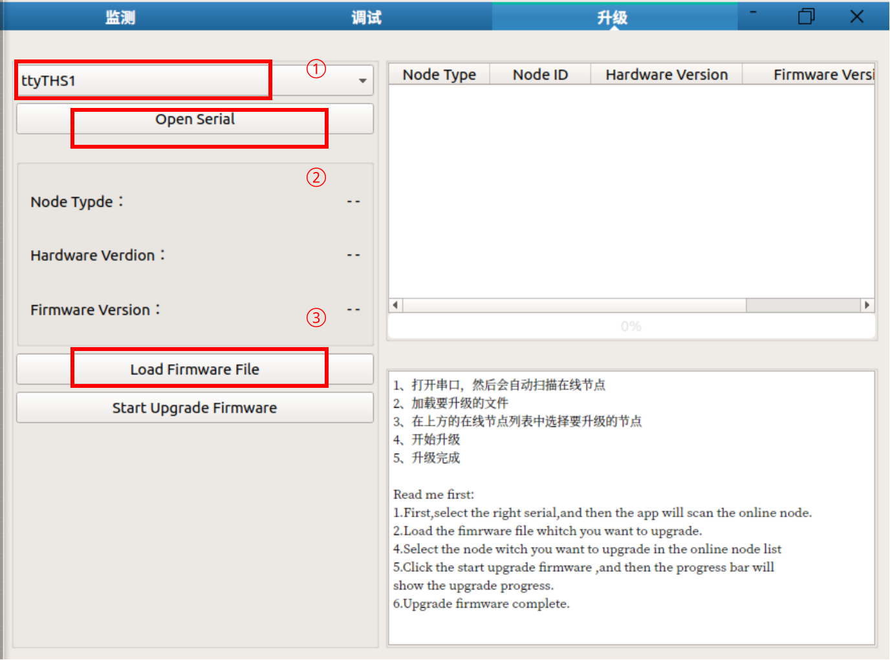


选择固件列表中的固件信息，然后点击Start Upgrade按钮开始固件升级。

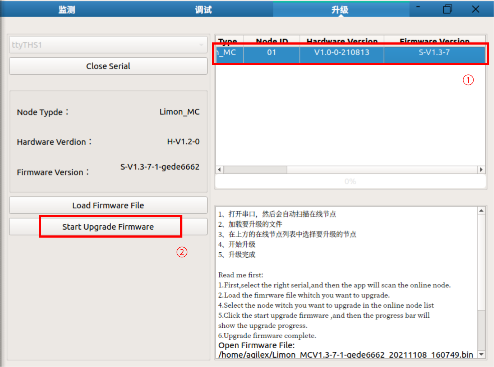

升级成功，点击 Close Serial按钮，关闭串口

### 附录7、导航功能包参数配置

如需要自己尝试调试功能包中的参数，可参考以下列表。

#### 7.1 gmapping功能包中可供配置的参数

注：gmapping功能包的参数的配置文件为：~/agilex_ws/src/limo_ros/limo_bringup/launch/limo_gmapping.launch

| 参数                      | 类型   | 默认值    | 描述                                                         |
| ------------------------- | ------ | --------- | ------------------------------------------------------------ |
| ~throttle_scans           | int    | 1         | 处理的扫描数据门限，默认每次处理1个扫描数据（可以设置更大跳过一些扫描数据） |
| ~base_frame               | string | base_link | 机器人基坐标系                                               |
| ~map_frame                | string | map       | 地图坐标系                                                   |
| ~odom_frame               | string | odom      | 里程计坐标系                                                 |
| ~map_update_interval      | float  | 5.0       | 地图更新频率                                                 |
| ~maxUrange                | float  | 80        | 探测最大可用范围，即光束能到达的范围                         |
| ~sigma                    | float  | 0.05      | 端点匹配的标准差                                             |
| ~kernelSize               | int    | 1         | 用于查找对应的kernel size                                    |
| ~lstep                    | float  | 0.05      | 平移优化步长                                                 |
| ~astep                    | float  | 0.05      | 旋转优化步长                                                 |
| ~iterations               | int    | 5         | 扫描匹配迭代次数                                             |
| ~lsigma                   | float  | 0.075     | 似然计算的激光标准差                                         |
| ~ogain                    | float  | 3.0       | 似然计算时用于平滑重采样效果                                 |
| ~lskip                    | int    | 0         | 每次扫描跳过的光束数.                                        |
| ~minimumScore             | float  | 0.0       | 扫描匹配结果的最低值                                         |
| ~srr                      | float  | 0.1       | 平移时里程误差作为平移函数(rho/rho)                          |
| ~srt                      | float  | 0.2       | 平移时的里程误差作为旋转函数(rho/theta)                      |
| ~str                      | float  | 0.1       | 旋转时的里程误差作为平移函数(theta/rho)                      |
| ~stt                      | float  | 0.2       | 旋转时的里程误差作为旋转函数(theta/theta)                    |
| ~linearUpdate             | float  | 1.0       | 机器人平移一定距离后处理一次激光数据                         |
| ~                         | float  | 0.5       | 机器人旋转一定距离后处理一次激光数据                         |
| ~temporalUpdate           | float  | -1.0      | 如果最新扫描处理比更新慢，则处理一次扫描。该值为负数时关闭基于时间的更新 |
| ~resampleThreshold        | float  | 0.5       | 基于Neff的重采样阀值                                         |
| ~particles                | int    | 30        | 滤波器中粒子数目                                             |
| ~xmin                     | float  | -100.0    | 地图x方向初始最小尺寸                                        |
| ~ymin                     | float  | -100.0    | 地图y方向初始最小尺寸                                        |
| ~xmax                     | float  | 100.0     | 地图x方向初始最大尺寸                                        |
| ~ymax                     | float  | 100.0     | 地图y方向初始最大尺寸                                        |
| ~delta                    | float  | 0.05      | 地图分辨率                                                   |
| ~llsamplerange            | float  | 0.01      | 似然计算的平移采样距离                                       |
| ~llsamplestep             | float  | 0.01      | 似然计算的平移采样步长                                       |
| ~lasamplerange            | float  | 0.005     | 似然计算的角度采样距离                                       |
| ~lasamplestep             | float  | 0.005     | 似然计算的角度采样步长                                       |
| ~transform_publish_period | float  | 0.05      | TF变换发布时间间隔                                           |
| ~occ_thresh               | float  | 0.25      | 栅格地图占用率的阀值                                         |
| ~maxRange                 | float  | ——        | 传感器的最大范围                                             |

#### 7.2 cartographer功能包中可供配置的参数

注：cartographer功能包的参数文件为~/agilex_ws/src/limo_ros/limo_bringup/param/build_map_2d.lua

| 参数                            | 默认值         | 解析                                                         |
| ------------------------------- | -------------- | ------------------------------------------------------------ |
| map_frame                       | map            | 用于发布submaps的ROS坐标系ID，位姿的父坐标系，通常使用“map”  |
| tracking_frame                  | base_footprint | 由SLAM算法追踪的ROS坐标系ID，如果使用IMU，应该使用其坐标系，通常选择是 “imu_link” |
| published_frame                 | odom           | 用于发布位姿子坐标系的ROS坐标系ID，例如“odom”坐标系，如果一个“odom”坐标系由系统的不同部分提供，在这种情况下，map_frame中的“odom”姿势将被发布。 否则，将其设置为“base_link”可能是合适的 |
| odom_frame                      | odom           | 在provide_odom_frame为真才启用，坐标系在published_frame和map_frame之间用于发布局部SLAM结果，通常是“odom” |
| provide_odom_frame              | true           | 如果启用，局部，非闭环，持续位姿会作为odom_frame发布在map_frame中发布。 |
| use_odometry                    | false          | 如果启用，订阅关于“odom”话题的nav_msgs/Odometry消息。里程信息会提供，这些信息包含在SLAM里 |
| num_laser_scans                 | 1              | 订阅的激光扫描话题数量。在一个激光扫描仪的“scan”话题上订阅sensor_msgs/LaserScan或在多个激光扫描仪上订阅话题“scan_1”，“scan_2”等 |
| num_multi_echo_laser_scans      | 0              | 订阅的多回波激光扫描主题的数量。在一个激光扫描仪的“echoes”话题上订阅sensor_msgs/MultiEchoLaserScan或者为多个激光扫描仪订阅话题“echoes_1”，“echoes_2”等。 |
| num_subdivisions_per_laser_scan | 1              | 将每个接收到的（多回波）激光扫描分成的点云数。细分扫描可以在扫描仪移动时取消扫描获取的扫描。有一个相应的轨迹构建器选项可将细分扫描累积到将用于扫描匹配的点云中。 |
| num_point_clouds                | 0              | 要订阅的点云话题的数量。在一个测距仪的“points2”话题上订阅sensor_msgs/PointCloud2或者为多个测距仪订阅话题“points2_1”，“points2_2”等。 |
| lookup_transform_timeout_sec    | 0.2            | 使用tf2查找变换的超时秒数                                    |
| submap_publish_period_sec       | 0.3            | 发布submap的间隔（以秒为单位），例如， 0.3秒                 |
| pose_publish_period_sec         | 5e-3           | 发布姿势的间隔（以秒为单位），例如 5e-3，频率为200 Hz。      |
| trajectory_publish_period_sec   | 30e-3          | 以秒为单位发布轨迹标记的时间间隔，例如， 30e-3持续30毫秒     |

#### 7.3 amcl功能包中可供配置的参数

注：amcl功能包参数配置文件为：amcl_param_diff.yaml（该文件为四轮差速、全向轮、履带运动模式所用的amcl参数文件）、amcl_param.yaml（该文件为阿克曼运动模式所用的amcl参数文件）

| 参数                | 类型   | 默认值         | 描述                                                         |
| ------------------- | ------ | -------------- | ------------------------------------------------------------ |
| min_particles       | int    | 100            | 最小允许的颗粒数。                                           |
| max_particles       | int    | 5000           | 允许的最大粒子数。                                           |
| kld_err             | double | 0.01           | 真实分布和估计分布之间的最大误差。                           |
| kld_z               | double | 0.99           | （1-p）的上标准正常分位数，其中p是估计的失谐上的误差将小于kld_err的概率。 |
| update_min_d        | double | 0.2米          | 执行过滤器更新之前需要执行平移运动。                         |
| update_min_a        | double | π/ 6.0 radians | 执行过滤器更新之前需要执行旋转运动。                         |
| resample_interval   | int    | 2              | 重新采样之前所需的过滤器更新数。                             |
| transform_tolerance | double | 0              | 将发布的变换后期化的时间，以指示此变换在未来有效。           |
| recovery_alpha_slow | double | 0              | 慢平均权重滤波器的指数衰减率，用于决定何时通过添加随机姿态来恢复。良好的值可能为0.001。 |
| recovery_alpha_fast | double | 0.0米          | 快速平均权重滤波器的指数衰减率，用于决定何时通过添加随机姿态来恢复。好的值可能为0.1。 |
| initial_pose_x      | double | 0.0米          | 初始姿态均（x），用于初始化具有高斯分布的滤波器。            |
| initial_pose_y      | double | 0.0弧度        | 初始姿态平均值（y），用于初始化具有高斯分布的滤波器。        |
| initial_pose_a      | double | 0.5 * 0.5米    | 初始姿态平均（偏航），用于初始化具有高斯分布的滤波器。       |
| initial_cov_xx      | double | 0.5 * 0.5米    | 初始姿态协方差（x * x），用于初始化具有高斯分布的滤波器。    |
| initial_cov_yy      | double | -1.0 Hz        | 初始姿态协方差（y * y），用于初始化具有高斯分布的滤波器。    |
| initial_cov_aa      | double | 0.5 Hz         | 初始姿态协方差（yaw * yaw），用于初始化具有高斯分布的滤波器。 |
| gui_publish_rate    | double | FALSE          | 发布可视化扫描和路径的最大速率（Hz），禁用-1.0。             |
| save_pose_rate      | double | FALSE          | 在变量〜initial_pose_ 和〜initial_cov_ 中存储参数服务器的最后估计姿态和协方差的最大速率（Hz）。此保存的姿势将用于后续运行以初始化过滤器。-1.0禁用。 |
| use_map_topic       | bool   | -1             | 当设置为true时，AMCL将订阅地图主题，而不是进行服务调用以接收其地图。 |
| first_map_only      | bool   | -1             | 当设置为true时，AMCL将只使用它订阅的第一个映射，而不是每次接收到新的映射时更新。 |

#### 7.4 DWA中可供配置的参数

注：DWA配置参数文件为~/agilex_ws/src/limo_ros/limo_bringup/param/diff/planner.yaml

| 参数                    | 类型   | 默认值 | 描述                                                         |
| ----------------------- | ------ | :----: | ------------------------------------------------------------ |
| acc_lim_x               | double |  2.5   | 机器人的 x 加速度限制（m/s2）                                |
| acc_lim_y               | double |  2.5   | 机器人的 y 加速度限制（m/s2）                                |
| acc_lim_th              | double |  3.2   | 机器人的旋转加速度限制（m/s2）                               |
| max_vel_trans           | double |  0.55  | 机器人最大平移速度的绝对值 （m/s）                           |
| min_vel_trans           | double |  0.1   | 机器人最小平移速度的绝对值（m/s）                            |
| max_vel_x               | double |  0.55  | 机器人的最大 x 速度（m/s）                                   |
| min_vel_x               | double |  0.0   | 机器人的最小 x 速度（m/s），反向运动时为负                   |
| max_vel_y               | double |  0.1   | 机器人的最大 y 速度（m/s）                                   |
| min_vel_y               | double |  -0.1  | 机器人的最小 y 速度（m/s）                                   |
| max_rot_vel             | double |  1.0   | 机器人最大旋转速度的绝对值（rad/s）                          |
| min_rot_vel             | double |  0.4   | 机器人最小旋转速度的绝对值（rad/s）                          |
| yaw_goal_tolerance      | double |  0.05  | 控制器在实现其目标时偏航/旋转的弧度公差                      |
| xy_goal_tolerance       | double |  0.10  | 实现目标时控制器在 x 和 y 距离内的公差（m/s）                |
| latch_xy_goal_tolerance | bool   | false  | 如果目标容差被锁定，如果机器人到达目标 xy 位置，它将简单地旋转到位，即使它在这样做时最终超出了目标容差。 |
| sim_time                | double |  1.7   | 以秒为单位向前模拟轨迹的时间                                 |
| sim_granularity         | double | 0.025  | 在给定轨迹上的点之间采取的步长（m/s）                        |
| vx_samples              | int    |   3    | 探索 x 速度空间时使用的样本数                                |
| vy_samples              | int    |   10   | 探索 y 速度空间时使用的样本数                                |
| vth_samples             | int    |   20   | 探索 theta 速度空间时使用的样本数                            |
| controller_frequency    | double |  20.0  | 调用此控制器的频率。如果未在控制器的命名空间中设置，则使用 searchParam 从父命名空间读取参数。与move_base 一起使用，这意味着您只需要设置它的“controller_frequency”参数并且可以安全地不设置这个参数。 |
| path_distance_bias      | double |  32.0  | 控制器应该在多大程度上靠近给定的路径的权重                   |
| goal_distance_bias      | double |  24.0  | 控制器应该尝试达到其本地目标的权重，也控制速度               |
| occdist_scale           | double |  0.01  | 控制器应尝试避开障碍物的权重                                 |
| forward_point_distance  | double | 0.325  | 机器人中心点到放置附加记分点的距离，单位为米                 |
| stop_time_buffer        | double |  0.2   | 机器人在碰撞前必须停止以使轨迹以秒为单位有效的时间量         |
| scaling_speed           | double |  0.25  | 开始缩放机器人足迹的速度的绝对值（m/s）                      |
| max_scaling_factor      | double |  0.2   | 缩放机器人足迹的最大因素                                     |
| publish_cost_grid       | bool   | false  | 是否发布计划员在计划时将使用的成本网格。当为 true 时，sensor_msgs/PointCloud2 将在 ~<name>/cost_cloud 主题上可用。每个点云代表成本网格，并有一个字段用于每个单独的评分函数组件以及每个单元格的总成本，并将评分参数考虑在内。 |
| oscillation_reset_dist  | double |  0.05  | 在重置振荡标志之前机器人必须以米为单位移动多远               |
| prune_plan              | bool   |  true  | 定义机器人沿路径移动时是否吃掉计划。如果设置为 true，一旦机器人移动超过它们 1 米，点就会从计划的末端掉下来。 |

#### 7.5 TEB可供配置的参数

注：TEB参数配置文件为：~/agilex_ws/src/limo_ros/limo_bringup/param/carlike2/teb_local_planner_params.yaml

| 参数                                        | 类型   | 默认值           | 描述                                                         |
| ------------------------------------------- | ------ | ---------------- | ------------------------------------------------------------ |
| acc_lim_x                                   | double | 0.5              | 机器人的最大平移加速度（米/秒^2）                            |
| acc_lim_theta                               | double | 0.5              | 机器人的最大角加速度（弧度/秒^2）                            |
| max_vel_x                                   | double | 0.4              | 机器人的最大平移速度（米/秒）                                |
| max_vel_x_backwards                         | double | 0.2              | 机器人向后行驶时的最大绝对平移速度（以米/秒为单位）。        |
| max_vel_theta                               | double | 0.3              | 机器人的最大角速度（弧度/秒）                                |
| min_turning_radius                          | double | 0.0              | 汽车机器人的最小转弯半径（对于差速驱动机器人设置为零）。     |
| wheelbase                                   | double | 1.0              | 后轴与前轴之间的距离。对于后轮机器人，该值可能为负（仅当cmd_angle_instead_rotvel设置为true时才需要）。 |
| cmd_angle_instead_rotvel                    | bool   | false            | 用相应的转向角[-pi/2,pi/2]代替指令速度消息中的旋转速度。请注意，根据应用程序更改偏航率的语义不是可取的。在这里，它只是符合舞台模拟器所需的输入。ackermann_msgs中的数据类型更合适，但 move_base 不支持。本地规划器本身并不打算发送命令。 |
| max_vel_y                                   | double | 0.0              | 机器人的最大扫射速度（非完整机器人应该为零！）               |
| acc_lim_y                                   | double | 0.5              | 机器人最大扫射加速度                                         |
| footprint_model/type                        | double | point            | 指定用于优化的机器人足迹模型类型。不同的类型是“点”、“圆形”、“线”、“two_circles”和“多边形”。模型的类型会显着影响所需的计算时间。 |
| footprint_model/radius                      | double | 0.2              | 此参数仅与“圆形”类型相关。它包含圆的半径。圆心位于机器人的旋转轴上。 |
| footprint_model/line_start                  | double | [-0.3, 0.0]      | 此参数仅与“行”类型相关。它包含线段的起始坐标。               |
| footprint_model/line_end                    | double | [0.3, 0.0]       | 此参数仅与“行”类型相关。它包含线段的结束坐标。               |
| footprint_model/front_offset                | double | 0.2              | 此参数仅与“two_circles”类型相关。它描述了前圆的中心沿机器人的 x 轴移动了多少。假设机器人的旋转轴位于 [0,0]。 |
| footprint_model/front_radius                | double | 0.2              | 此参数仅与“two_circles”类型相关。它包含前圆的半径。          |
| footprint_model/rear_offset                 | double | 0.2              | 此参数仅与“two_circles”类型相关。它描述了后圆的中心沿机器人的负 x 轴移动了多少。假设机器人的旋转轴位于 [0,0]。 |
| footprint_model/rear_radius                 | double | 0.2              | 此参数仅与“two_circles”类型相关。它包含后圆的半径。          |
| footprint_model/vertices                    | double | [0.25,-0.05]     | 此参数仅与“多边形”类型相关。它包含多边形顶点列表（每个都是二维坐标）。多边形始终是封闭的：不要在末尾重复第一个顶点。 |
| is_footprint_dynamic                        | bool   | false            | 如果为 true，则在检查轨迹可行性之前更新足迹                  |
| xy_goal_tolerance                           | double | 0.2              | 允许到目标位置的最终欧几里得距离（以米为单位）               |
| yaw_goal_tolerance                          | double | 0.2              | 允许的最终方向误差（以弧度为单位）                           |
| free_goal_vel                               | bool   | false            | 去除目标速度约束，使机器人能够以最大速度到达目标             |
| dt_ref                                      | double | 0.3              | 轨迹的所需时间分辨率（轨迹不固定为dt_ref，因为时间分辨率是优化的一部分，但如果违反dt_ref +-dt_hysteresis，将在迭代之间调整轨迹大小。 |
| dt_hysteresis                               | double | 0.1              | 根据当前时间分辨率自动调整大小的滞后，通常约为 建议使用dt_ref 的10% |
| min_samples                                 | int    | 3                | 最小样本数（应始终大于 2）                                   |
| global_plan_overwrite_orientation           | bool   | true             | 覆盖全局规划器提供的局部子目标的方向（因为它们通常只提供二维路径） |
| global_plan_viapoint_sep                    | double | -0.1 (disabled)) | 如果为正，则从全局计划中提取通孔点（路径跟随模式）。该值决定了参考路径的分辨率（沿全局平面每两个连续通孔点之间的最小间隔，如果为负 |
| max_global_plan_lookahead_dist              | double | 3.0              | 指定考虑优化的全局计划子集的最大长度（累积欧几里德距离）。实际长度由本地代价图大小和这个最大界限的逻辑结合决定。设置为零或负数以取消激活此限制。 |
| force_reinit_new_goal_dist                  | double | 1.0              | 如果先前的目标更新间隔大于指定值（以米为单位），则重新初始化轨迹（跳过热启动） |
| feasibility_check_no_poses                  | bool   | 4                | 指定每个采样间隔应检查预测计划上的哪个姿势的可行性。         |
| publish_feedback                            | bool   | false            | 发布包含完整轨迹和活动障碍物列表的规划器反馈（应仅在评估或调试时启用）。请参阅上面的出版商列表。 |
| shrink_horizon_backup                       | bool   | true             | 允许规划者在自动检测到问题（例如不可行性）的情况下临时缩小范围 (50%)。另见参数shrink_horizon_min_duration。 |
| allow_init_with_backwards_motion            | bool   | false            | 如果为 true，则可能会使用向后运动初始化基础轨迹，以防目标在本地成本图中的起点后面（仅当机器人配备有后部传感器时才推荐这样做）。 |
| exact_arc_length                            | double | false            | 如果为真，规划器在速度、加速度和转弯率计算中使用精确的弧长（-> 增加的 CPU 时间），否则使用欧几里得近似。 |
| shrink_horizon_min_duration                 | double | 10.0             | 如果检测到不可行的轨迹，请指定缩小地平线的最短持续时间（请参阅参数shrink_horizon_backup以激活缩小地平线模式）。 |
| min_obstacle_dist                           | double | 0.5              | 与障碍物的最小期望距离（以米为单位）                         |
| include_costmap_obstacles                   | double | true             | 指定是否应考虑本地成本图的障碍。每个标记为障碍物的单元格都被视为一个点障碍物。因此不要选择非常小的代价地图分辨率，因为它会增加计算时间。在未来的版本中，这种情况将得到解决，并为动态障碍提供额外的 api。 |
| costmap_obstacles_behind_robot_dist         | bool   | 1.0              | 限制在机器人后面进行规划时考虑到的占用的本地成本图障碍（以米为单位指定距离）。 |
| obstacle_poses_affected                     | double | 30               | 每个障碍物位置都附加到轨迹上最近的姿势以保持距离。也可以考虑额外的邻居。请注意，此参数可能会在未来版本中删除，因为在 kinetic+ 中已修改了障碍关联策略。参考legacy_obstacle_association的参数说明。 |
| inflation_dist                              | double | pre kinetic      | 具有非零惩罚成本的障碍物周围的缓冲区（应大于min_obstacle_dist才能生效）。另请参阅权重weight_inflation。 |
| include_dynamic_obstacles                   | string | false            | 如果此参数设置为 true，则在优化过程中通过恒速模型预测和考虑具有非零速度的障碍物的运动（通过用户提供的障碍物~/obstacles 提供或从costmap_converter获得）。 新的 |
| legacy_obstacle_association                 | bool   | false            | 连接轨迹姿势与优化障碍的策略已被修改（参见变更日志）。您可以通过将此参数设置为true来切换到旧的/以前的策略。旧策略 |
| obstacle_association_force_inclusion_factor | double | 1.5              | 非遗留障碍关联策略试图在优化过程中仅将相关障碍与离散化轨迹连接起来。但是指定距离内的所有障碍物都被强制包括在内（作为min_obstacle_dist 的倍数）。例如，选择 2.0 以在2.0* min_obstacle_dist的半径内强制考虑障碍。[仅当参数legacy_obstacle_association为false时才使用此参数] |
| obstacle_association_cutoff_factor          | int    | 5                | 见obstacle_association_force_inclusion_factor，但超出[值]的倍数* min_obstacle_dist一切障碍，在优化过程中被忽略。参数障碍_association_force_inclusion_factor被首先处理。[仅当参数legacy_obstacle_association为false时才使用此参数] |
| costmap_converter_plugin                    | int    | ""               | 定义插件名称以将成本图单元格转换为点/线/多边形。设置一个空字符串以禁用转换，以便将所有单元格视为点障碍。 |
| costmap_converter_spin_thread               | double | true             | 如果设置为 true，则成本图转换器在不同的线程中调用其回调队列。 |
| costmap_converter_rate                      | double | 5.0              | Rate 定义 costmap_converter 插件处理当前成本图的频率（该值不应高于成本图更新率）[以赫兹为单位]。 |
| no_inner_iterations                         | double | 5                | 每次外循环迭代中调用的实际求解器迭代次数。请参阅参数no_outer_iterations。 |
| no_outer_iterations                         | double | 4                | 每个外循环迭代都会根据所需的时间分辨率dt_ref自动调整轨迹大小并调用内部优化器（执行no_inner_iterations）。因此，每个规划周期中求解器迭代的总数是两个值的乘积。 |
| penalty_epsilon                             | double | 0.1              | 为硬约束逼近的惩罚函数添加一个小的安全裕度                   |
| weight_max_vel_x                            | double | 2.0              | 满足最大允许平移速度的优化权重                               |
| weight_max_vel_theta                        | double | 1.0              | 满足最大允许角速度的优化权重                                 |
| weight_acc_lim_x                            | double | 1.0              | 满足最大允许平移加速度的优化权重                             |
| weight_acc_lim_theta                        | double | 1.0              | 满足最大允许角加速度的优化权重                               |
| weight_kinematics_nh                        | double | 1000.0           | 用于满足非完整运动学的优化权重（此参数必须很高，因为运动学方程构成了等式约束，由于与其他成本相比，“原始”成本值较小，因此即使值为 1000 也不意味着矩阵条件不好） . |
| weight_kinematics_forward_drive             | double | 1.0              | 强制机器人仅选择向前方向（正平移速度）的优化权重。小重量（例如 1.0）仍然允许向后行驶。1000 左右的值几乎可以防止向后行驶（但不能保证）。 |
| weight_kinematics_turning_radius            | double | 1.0              | 强制最小转弯半径的优化权重（仅适用于汽车机器人）。           |
| weight_optimaltime                          | double | 1.0              | 缩短轨迹wrt转换/执行时间的优化权重                           |
| weight_obstacle                             | bool   | 50.0             | 与障碍物保持最小距离的优化权重                               |
| weight_viapoint                             | bool   | 1.0              | 用于最小化到通过点的距离的优化权重（相应的参考路径）。0.4 新版本 |
| weight_inflation                            | int    | 0.1              | 通货膨胀惩罚的优化权重（应该很小）。                         |
| weight_adapt_factor                         | double | 2.0              | 在每次外部 TEB 迭代（weight_new = weight_old*factor）中，一些特殊的权重（当前是weight_obstacle）被这个因子重复缩放。迭代地增加权重而不是设置一个巨大的先验值会导致基础优化问题的更好的数值条件。 |
| enable_homotopy_class_planning              | double | true             | 在不同的拓扑中激活并行规划（需要更多的 CPU 资源，因为多个轨迹一次被优化） |
| enable_multithreading                       | double | true             | 激活多个线程以便在不同线程中规划每个轨迹                     |
| max_number_classes                          | bool   | 4                | 指定考虑的不同轨迹的最大数量（限制计算工作量）               |
| selection_cost_hysteresis                   | int    | 1.0              | 指定新候选者必须具有与先前选择的轨迹相比多少轨迹成本才能被选中（如果 new_cost < old_cost*factor 则选择）。 |
| selection_obst_cost_scale                   | double | 100.0            | 仅用于选择“最佳”候选者的障碍成本项的额外缩放。               |
| selection_viapoint_cost_scale               | double | 1.0              | 仅用于选择“最佳”候选者的额外缩放通过点成本条款。0.4 新版本   |
| selection_alternative_time_cost             | double | false            | 如果为真，则时间成本（时间差的平方和）将替换为总转换时间（时间差的总和）。 |
| roadmap_graph_no_samples                    | double | 15               | 指定为创建路线图生成的样本数量                               |
| roadmap_graph_area_width                    | bool   | 6                | 在起点和目标之间的矩形区域中对随机关键点/航路点进行采样。以米为单位指定该区域的宽度。 |
| h_signature_prescaler                       | bool   | 1.0              | 用于区分同伦类的比例内部参数 ( H-signature )。警告           |
| h_signature_threshold                       | double | 0.1              | 如果实部和复部的差异都低于指定的阈值，则假定两个 H 签名相等。 |
| obstacle_heading_threshold                  | string | 1.0              | 指定障碍航向和目标航向之间的标量积的值，以便在探索时将它们（障碍物）考虑在内。 |
| visualize_hc_graph                          | string | false            | 可视化为探索独特轨迹而创建的图形（在 rviz 中检查标记消息）   |
| viapoints_all_candidates                    | bool   | true             | 如果为真，则不同拓扑的所有轨迹都附加到一组通孔点，否则只有与初始/全局计划共享相同拓扑的轨迹与它们连接（对test_optim_node没有影响）。0.4 新版本 |
| switching_blocking_period                   | double | 0.0              | 指定在允许切换到新等价类之前需要到期的持续时间（以秒为单位）。 |
| odom_topic                                  | double | odom             | 里程计消息的主题名称，由机器人驱动程序或模拟器提供。         |
| map_frame                                   | bool   | odom             | 全局规划框架（如果是静态地图，这个参数通常必须改为“/map”。   |

### 附录8、配套课程

#### 	8.1免费课程视频

​	百度云盘下载链接：https://pan.baidu.com/s/1z1H38D2uHPLuOQ4_xnkHrw，提取码：1234 

#### 	8.2免费课程课件

​	百度云盘下载链接：https://pan.baidu.com/s/1wpvWjYo3ME9ljzj9Eb2wJg，提取码：1234 

 

 

 

 

 

 

 

 

 
