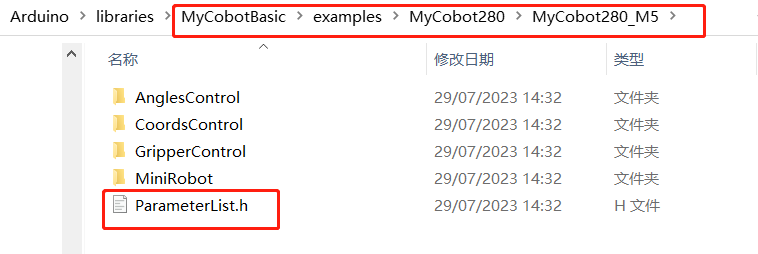

# Simple use of Arduino

## 1 Connecting a device
Take **myCobot 280-M5** for example. Connect the M5Stack-basic on the stand of the robot arm with a PC by using a Tyep-C data cable. 
 

## 2 Firmware requirements

•	ATOM: burn the latest version of AtomMain by using [**MyStudio**](../4-BasicApplication/README.md). 

•	M5Stack-basic: no requirements 

## 3 Detecting link

Open the computer device manager to see whether there is a device. If no device is detected, replace the USB cable. If "it cannot be used" is shown, click to download [**CP210X driver or CP34X**](../4-BasicApplication/4.1-myStudio/4.1.1-myStudio_download_driverinstalled.md). After the downloading is complete, unzip and install the required version of the driver for use. 

Open **Arduino IDE --> Tools --> Port** to check whether there is a device. If no device is detected, replace the USB cable for test, or check whether the driver is installed successfully. 

## 4 Starting development

Take burning an official demo as an example. Open **Arduino IDE --> File --> Examples --> MyCobotBasic**, and you will see all project examples. Choose to burn a simple demo, for example **MyCobotBasic --> MyCobot280--> MyCobot280-M5--> AnglesControl**. 

Open AnglesControl.ino from the example file. 

 

**Notice:** Select the board as **M5Stack-Core-ESP32** and corresponding **COM port**. 

 

If you are using the myCobot280-M5, **Please use the ParameterList.h under the MyCobot280-M5 folder to replace the ParameterList.h under the MyCobotBasic folder**. Please refer to the figure below for details:

 

 

**Note:** When using different models, please use the "ParameterList.h" file in the respective case directory to replace the "MyCobotBasic\ParameterList.h" file
Click Download and wait for the progress bar at the bottom right to finish. 

Click upload and wait for the progress bar at the bottom right to complete 

 

Wait until the bottom right shows that the uploading is successful, which means that the downloading of the program has been completed. 

 

At this point we can see the **robot** start working. 

The interface and drivers for the use of the **basic buttons with the screen** can be found in the following documents:

button: https://docs.m5stack.com/en/api/core/button

screen: https://docs.m5stack.com/en/api/core/lcd

## 5 Part of the case introduction
5.1 At present, different models have angle, coordinate, and gripper control. MyCobot320 supports adaptive gripper and electric gripper control.  
5.2 miniRobot: 
MyCobot280, 320m5, and mechArm270-M5 use cases can perform zero calibration, drag teaching, communication, etc. (on this basis, use RoboFlow, python, myblockly, etc. to control the robotic arm), information acquisition (obtain the connection status of the servo atom , and basic, atom firmware version).  
5.3 Transponder: 
myCobot280-Arduino uno and Mega2560 development board use case, the function is mainly communication, on this basis, use RoboFlow, python, myblockly, etc. to control the robotic arm and perform io control.  
5.4 MyPalletizerRoboFlow: 
MyPalletizer260 use case, can perform zero calibration, drag teaching, communication (on this basis, use RoboFlow, python, myblockly, etc. to control the robotic arm), information acquisition (obtain the connection status of the servo atom, and the firmware version of basic and atom ).  

**Note:** Arduino environment configuration and case compilation can be found in our gitbook documentation（ https://docs.elephantrobotics.com/docs/gitbook-en/10-ArduinoEnv/ ） and the videos on Bilibili （ https://www.bilibili.com/video/BV1Vi4y1c7DQ/ ）。
