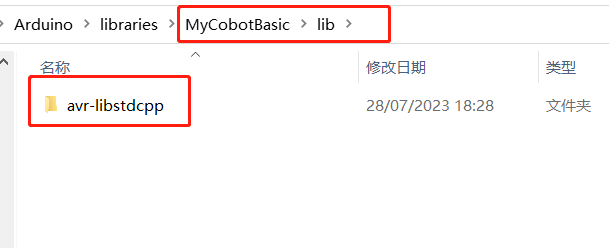
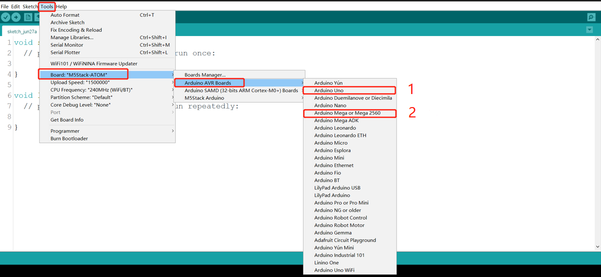
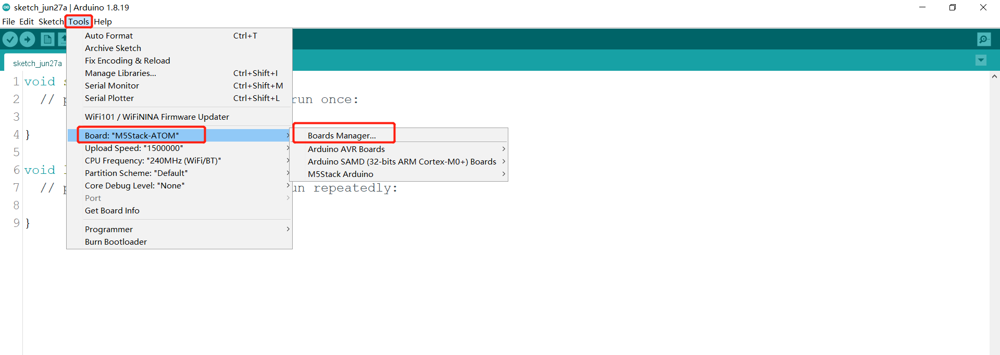
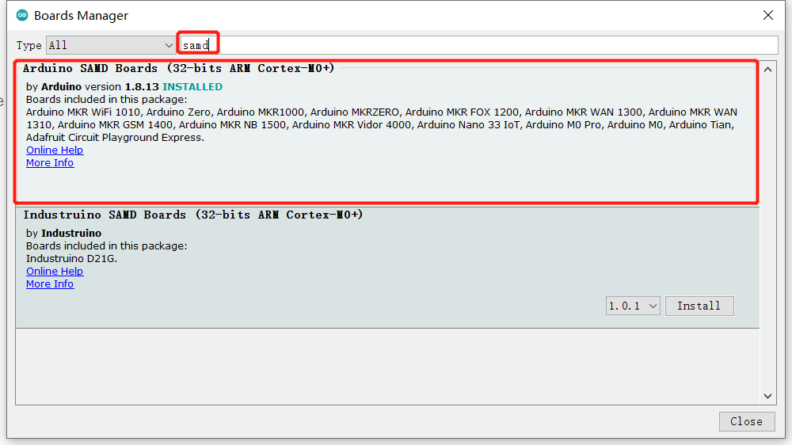
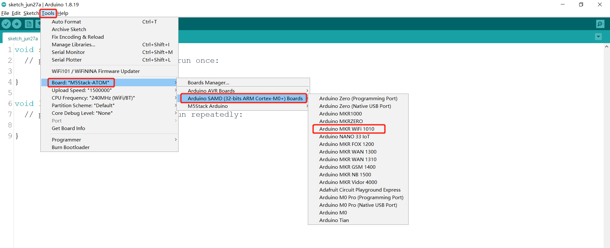

# 10.3 Use of the Arduino library

Support robotic arm types: **myCobot280-Arduino** 

Use Cases: eg:Open **C:\Users\User\Documents\Arduino\libraries\MyCobotBasic\examples\MyCobot280\MyCobot280_Arduino\Mega\AnglesControl\AnglesControl.ino**, This case requires the board to be burned first and then connected to the robot arm, otherwise the upload will fail. 

Using the bottom basic library you can freely develop and control our company's robotic arm under Arduino. 

## 10.3.1 Modifications before compilation

Import the library file, if your robot arm is myCobot280-Arduino, please check if the board is Mega2560 or Uno, if it is: 

1.Please put **MyCobotBasic\lib\avr-libstdcpp** under **C:\Users\User\Documents\Arduino\libraries**: 

 

 

## 10.3.2 Selection of boards before compilation

1.Board for Uno、Mega2560, Tools --> Board --> Arduino AVR Boards --> Arduino Uno（ or Arduino MEAG or Mega2560 ), see the following chart for details: 

 
1 When using uno,select 
2 When using Mega2560, select 

2.Board for mkr wifi1010 
Boards manager search samd, if not installed, install, first Tools --> Board --> Boards Manager, then search samd, see the following figure:

 

 

Board for mkr wifi1010, Tools --> Board --> Arduino SAMD --> Arduino MKR WiFi1010

 
