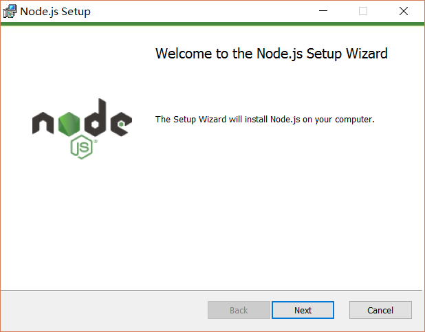
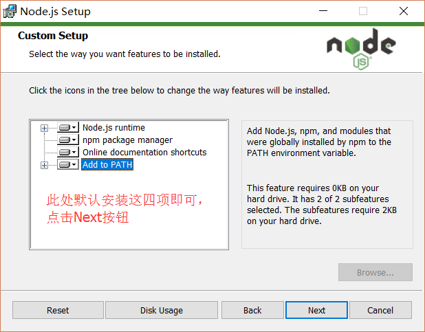
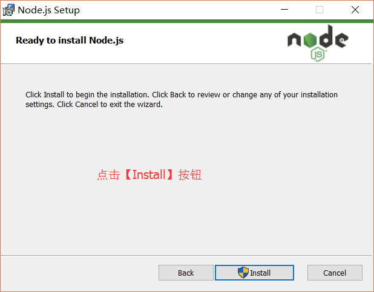
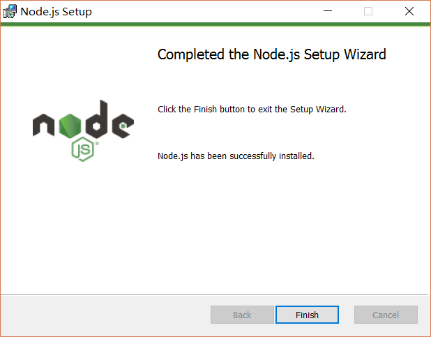
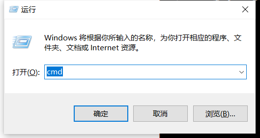
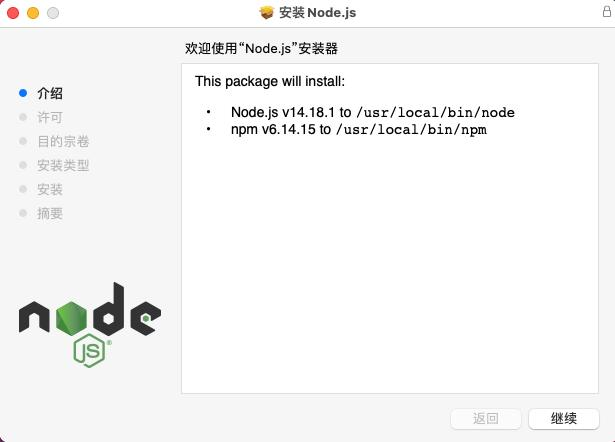
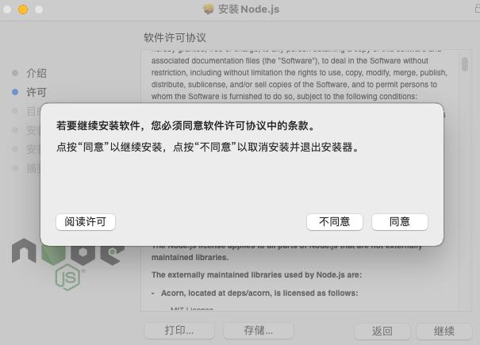
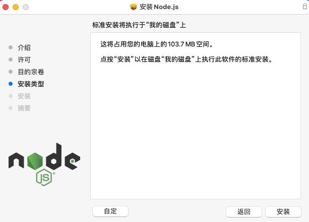
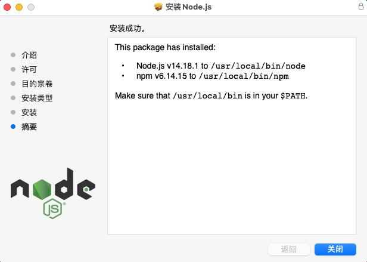
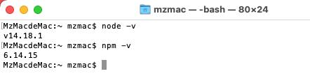

### Preparations before development
> ```node environment building```

[windows 32-bit downloading address](https://npmmirror.com/mirrors/node/v16.13.2/node-v16.13.2-x86.msi)

[windows 64-site downloading address](https://npmmirror.com/mirrors/node/v16.13.2/node-v16.13.2-x64.msi)

[macOs downloading address](https://npmmirror.com/mirrors/node/v16.13.2/node-v16.13.2.pkg)

#### 1 windows Node environment building
> ```Step 1: After downloading is completed, double-click the downloaded installation package to start installing Node.js. Click the Next button```

> ```Step 2: Check the option in the lower left red box, and click Next```

> ```Step 3: customize the installation directory```

> ```Step 4: click the Next button (default)```

> ```Step 5: click Install```

> ```Step 6: click Finish to complete the installation```

> ```Step 7: open and urn with `win+r`, input `cmd` to a command indicator```

> ```Step 8: input node -v get the node version; when the version is displayed, its means that the installation is completed successfully.```


#### 2 MacOs node environment building
> ```Step 1: After downloading is completed, double-click the downloaded installation package to start installing Node.js. Click the Next button, click Continue```

> ```Step 2: Click Continue again```

> ```Step 3: Click Agree to go to the next step```

> ```Step 4: Click Customize, choose the installation address, or click Install to continue the installation and input your password to install```

> ```Step 5: When successful installation is prompted, click Close to exit The installation process```

> ```Right-click on the desktop and select a ``punching terminal``, enter the terminal and input node -v. If the node version number is displayed, it means that installation is done successfully```


#### 3 Linux node environment building
> ```Step 1: The official Node website has changed the linux downloading version to a compiled version, so we can directly download and unzip it for use：```
```
# wget https://nodejs.org/dist/v10.9.0/node-v10.9.0-linux-x64.tar.xz    // download
# tar xf  node-v10.9.0-linux-x64.tar.xz       // unzip
# cd node-v10.9.0-linux-x64/                  // enter the unzipping directory
# ./bin/node -v                               // execute node command, and check version
v10.9.0
```
> ```Step 2: The bin directory of the unzipped file contains commands such as node, npm, etc. We can use the ln command to set up a soft connection:```
```
ln -s /usr/software/nodejs/bin/npm   /usr/local/bin/ 
ln -s /usr/software/nodejs/bin/node   /usr/local/bin/
```
####Installing source code (Node.js)
> ```Step 1: In the following part, we will introduce the installation of Node.js in Ubuntu Linux using source code. For other Linux systems, such as Centos, perform the installation steps below. Get Node.js source code from ``Github``.```
```
$ sudo git clone https://github.com/nodejs/node.git
Cloning into 'node'...
```
> ```Modify the permission of the directory.```
```
$ sudo chmod -R 755 node
```
> ```Step 3: Create a compiling file ``using ./``configure and follows:```
```
$ cd node
$ sudo ./configure
$ sudo make
$ sudo make install
```
> ```Step 4: Check the node version```
```
$ node --version
v0.10.25
```