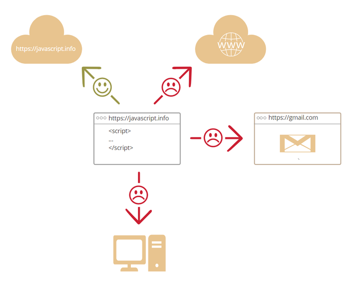

##### What is js?

```
The original purpose of JavaScript was to "vivify webpages". 

This programming language is called a script. They can be written in HTML and executed automatically when a page is being loaded. 

Scripts exist and execute as plain text. They can run without special preparations or compilation.
```

##### What can JavaScript in a browser do?
```
Modern JavaScript is a "safe" language. It doesn't provide low-level access to memory or CPU, because it was originally created for browsers and doesn't require those features. 
The power of JavaScript is largely dependent on the environment in which it is executed. 
For example, Node.js allows JavaScript to read and write arbitrary files, perform network requests, etc. JavaScript in a browser can do everything related to webpage operations, user interaction, and web servers. 
For example, JavaScript in the browser can do the following: 

- insert a new HTML in a webpage, modify contents and styles of an existing webpage; 
- respond to user actions, mouse clicks or movements, and keyboard strokes; 
- send network requests to a remote server to download or upload files (so-called AJAX and COMET technologies); 
- get or modify cookies, ask questions and send messages to visitors; 
- remember client's data (local storage).
```

##### What can\'t JavaScript in a browser do?
```
For its users'(information) security, the power of JavaScript in browsers are limited. This is mainly to prevent malicious websites from obtaining or modifying users' private data. 
Examples of these restrictions are: 
- JavaScript in webpages cannot read, write, copy and execute files or programs on the user's disk. It hasn't the function for direct access to a operating system. 
Modern browsers allow JavaScript to do some file-related operations, but this operation is limited. 
only when the user uses a certain action, JavaScript can manipulate a file. 
For example, "dragging" a file into the browser, or selecting a file via the input tag. There are many ways for JavaScript to interact with cameras/microphones or other devices, but these all require prior authorization from the user. 
So, a JavaScript-enabled webpage shouldn't surreptitiously launch a webcam to watch you and send your information to the American National Security Agency(NSA). 
- Different browser tabs are basically unrelated to each other. 
Sometimes, they also have some relationships with each other. For example, a tab opens another new tab via JavaScript. But even in this case, if two tabs are not open to the same website (a website in which anything is different in domain name, protocol, or port), they cannot communicate with each other. 
This is the "same origin policy". In order to solve the problem of "same-origin policy", both tabs must contain some special JavaScript codes to deal with this problem, and both allow data exchange, so that data exchange between two same-origin tabs can be achieved. 
- JavaScript can easily communicate with the server of the current webpage domain name via the Internet. 
But the ability to get data from the server of other websites/domains is limited. 
Although this is possible, it requires explicit protocol (in HTTP headers) from the remote server. 
This is also for the user's data security.
```


##### What makes javascript different
```
+ Full integration with HTML/CSS. 
+ Use simple tools to accomplish simple tasks. 
+ Supported by all 

The browser that meets these three browser technologies is JavaScript only. 

That's why JavaScript is different! That's also why it's the most common tool for creating browser interfaces. 

In addition, JavaScript also supports the creation of servers, mobile applications, etc.
```