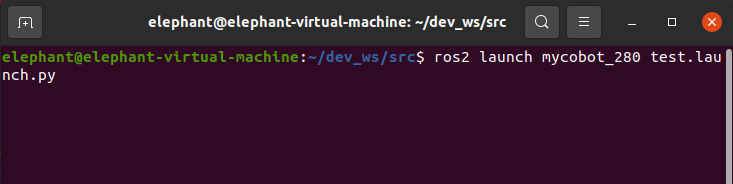

# Brief introduction and use of rviz2

rviz is a three-dimensional visualization platform in ROS. On the one hand, it can realize the graphical display of external information, and on the other hand, it can also release control information to the object through rviz, so as to realize the monitoring and control of the robot.

## 1  Introduction to rviz2

The successful installation of ros2 indicates that rviz2 is also successfully installed together, because the installation of ros2 includes rviz2.

Open a new terminal (shortcut<kbd>Ctrl</kbd>+<kbd>Alt</kbd>+<kbd>T</kbd>)enter the command to open rviz2

```bash
rviz2
```

Open rviz2 and display the following interface:


## 2 Introduction of each area

+ On the left is the list of monitors, a monitor is something that draws something in the 3D world and may have some options available in the display list.
+ Above is the toolbar, which allows users to use various function buttons to select tools with multiple functions
+ The middle part is the 3D view: it is the main screen where various data can be viewed in 3D. The background color, fixed frame, grid, etc. of the 3D view can be set in detail in the Global Options and Grid items displayed on the left.
+ Below is the time display area, including system time and ROS time.
+ The right side is the observation angle setting area, and different observation angles can be set.

We only give a rough introduction in this part. If you want to know more detailed content, you can go to the [user guide ](http://wiki.ros.org/rviz/UserGuide)to view it.

## 3 mycobot_ros2 installation and update

- **M5 verrsion:** Please refer to the end of the [13.2.1 Installation of ROS2](../12.2.1-ROS2的安装.md) chapter.

- **PI版本(Ubuntu 20.04)：**

`mycobot_ros2` is a ROS2 package from ElephantRobotics that works with all types of desktop robots.

The address of the project: https://github.com/elephantrobotics/mycobot_ros2

The official default ROS2 workspace is `colcon_ws`.

Click the `ROS2 Shell` icon on the desktop or the corresponding icon in the lower bar of the desktop to open the ROS2 environment terminal:


Then enter the following command:

```bash
cd ~/colcon_ws/src  # Enter the src folder of the workspace
# Clone the code on github
git clone https://github.com/elephantrobotics/mycobot_ros2.git
cd ..       # return to the workspace
colcon build --symlink-install # Build the code in the workspace, --symlink-install: Avoid having to recompile python scripts every time you adjust them
source install/setup.bash # add environment variables
```

**Note:** If the `/home/er/colcon/src(equivalent to ~/colcon_ws/src)` already exists in the `mycobot_ros2` folder, you need to delete the `mycobot_ros2` folder before running the above command.

## 4 Simple use

#### Launch via launch.py file

This example is based on the fact that you have completed the [environment setup ](../12.2.1-ROS2的安装.md)and successfully copied the company's code from GitHub.。

Open a console terminal (shortcut<kbd>Ctrl</kbd>+<kbd>Alt</kbd>+<kbd>T</kbd>)
Enter the following command to **configure the ROS2 environment** .

```
cd ~/colcon_ws
colcon build --symlink-install
source install/setup.bash
```

Enter again:

- mycobot 280-M5 version:

```bash
ros2 launch mycobot_280 test.launch.py
```



Open rviz and get the following result:


If you want to know more information about rviz, you can go to the [official documentation ](http://wiki.ros.org/rviz2)to view it

## 5 M5 Version Prerequisites

- Type Ctrl+Shift+T in the command terminal to open another terminal window in the same directory to view the device name:

```bash
# View the device name of the robotic arm
ls /dev/ttyUSB* # old version myCobot280 M5   

# If the terminal does not display the /dev/ttyUSB related name, you need to use the following command
ls /dev/ttyACM* # new version myCobot280 M5
```

- Grant the serial port permission to the robotic arm:

```bash
# The default device name is /dev/ttyUSB0, if the device name is not the default value, it needs to be modified.
sudo chmod 777 /dev/ttyUSB0 # old version myCobot280 M5 

sudo chmod 777 /dev/ttyACM0 # new version myCobot280 M5
```

Then enter the user password(**Note:** The password is not displayed, just enter it correctly).