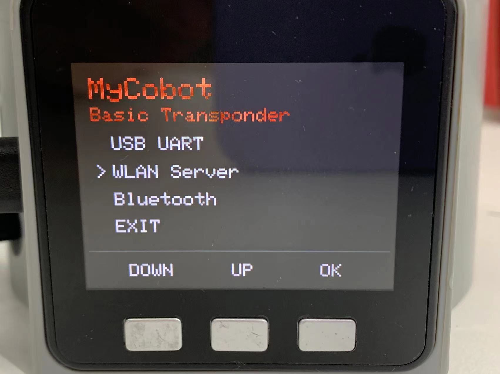

# Compound Robot

myAGV now supports three robotic arms: myCobot 280 M5/Pi, myPalletizer 260 M5/Pi, and mechArm 270 M5/Pi. myAGV can control the robotic arm through the USB serial port or wirelessly to realize mobile grabbing, expand the working space, and complete more tasks.

## 1 Installation Notes
### 1.1 Install the robotic arm

First, you need to install the robotic arm to myAGV. You can use Lego keys or screws to install the robotic arm on the upper part of myAGV, and you can install it on the front or rear according to your needs.


### 1.2 Connect the arm

Use the DC power cable to connect to the power supply interface of the robot arm, and connect the other end to the power interface of the robot arm. The car can supply power to the robot arm (12V 5A).


Example: myPalletizer 260 Pi, other Pi robotic arms are the same.


## 2 myAGV and robotic arm communication control
### 2.1 M5 Version
#### 2.1.1 USB serial communication control
**Note：** only support myCobot 280 M5、myPalletizer 260 M5、mechArm 270 M5

This section uses the myPalletizer 260 M5 version as an example.

1、Connect the arm

When using the usb serial communication control, first use the type-c to usb cable to connect the car and the robot arm.


2、USB communication connection

Click on Transponder, then click on USB UART, and the robotic arm stays on the Atom: ok interface.


3、myAGV communication control

The car is turned on normally and connected to the display screen and keyboard and mouse. The above steps ensure that the connection is good, and then the car can be used to control the robotic arm.


For more detailed myBlockly tutorial, see
[**6.1 myBlockly**](../../5-ProgramingApplication-myblockly-uiflow-mind/README.md)

#### 2.1.2 WIFI communication control
**Note：** only support myCobot 280 M5、myPalletizer 260 M5

1、 mobile network settings

**Step 1:** It is necessary to modify the wifi or mobile hotspot to be consistent with the robotic arm network:
* namely "MyCobotWiFi2.4G". Meanwhile, change the password of hotspot as "mycobot123".

* namely "MyPalWiFi2.4G". Meanwhile, change the password of hotspot as "mypal123".


2、WIFI connection

**Step 1:** Press WLAN Server, and "WIFI Connecting" appears, signaling that the robotic arm is connecting with WIFI.




**Step 2:** If the screen shows WIFI Connected, IP and Port, it means that robotic arm is successfully connected with WIFI.


> **Notice:** If it fails to connect, go back to press USB UART and then try the steps above again.

>If you still can't connect to WIFI, please refer to Chapter 8：[**7 TCP/IP**](../../7-ApplicationBasePython/7.6_TCPIP.md/) - 1.3 WIFI can't connect to the solution.

3、myAGV communication control case

The car is turned on normally and connected to the display screen and keyboard and mouse. The above steps ensure that the connection is good, and then the car can be used to control the robotic arm.

* myCobot 280：

```python
from pymycobot import MyCobotSocket
# Use port 9000 by default
# Where "192.168.10.22" is the IP of the robot arm
mc = MyCobotSocket("192.168.10.22",9000)

#After the connections is normal, the robot arm can be controlled.
res = mc.get_angles()
print(res)
mc.send_angles([0,0,0,0,0,0],20)
...
```

* myPalletizer 260：

```python
from pymycobot import MyPalletizerSocket
# Use port 9000 by default
# Where "192.168.10.22" is the IP of the robot arm
mc = MyPalletizerSocket("192.168.10.22",9000)

#After the connections is normal, the robot arm can be controlled.
res = mc.get_angles()
print(res)
mc.send_angles([0,0,0,0],20)
...
```

### 2.2 Pi version
#### 2.2.1 WIFI communication control
**Note：** only support myCobot 280 Pi、myPalletizer 260 Pi、mechArm 270 Pi

1、Configure the robotic arm

**Step 1**	First, connect the robotic arm to the display screen and turn it on, click the WIFI icon to connect to WIFI, enter the WIFI password, click Connection, and connect successfully.

**Step 2**	Click the desktop pymycobot file, click the demo file, and copy the Server.py file to the desktop.

**Step 3**	Open command terminal


**Step 4**	Enter the following code to run the script:

```python
sudo python3 Server.py
```

**Step 5** The operation is successful as shown in the figure:


2、myAGV communication control case

The car is turned on normally and connected to the display screen and keyboard and mouse. The above steps ensure that the connection is good, and then the car can be used to control the robotic arm.

**Note: The robot arm needs to be on the same network segment as the car, that is, the same WIFI.**

* myCobot 280、mechArm 270：

```python
from pymycobot import MyCobotSocket
# Use port 9000 by default
# Where "192.168.10.22" is the IP of the robot arm
mc = MyCobotSocket("192.168.10.22",9000)
mc.connect()  

#After the connections is normal, the robot arm can be controlled.
res = mc.get_angles()
print(res)
mc.send_angles([0,0,0,0,0,0],20)
...
```

* myPalletizer 260：

```python
from pymycobot import MyPalletizerSocket
# Use port 9000 by default
# Where "192.168.10.22" is the IP of the robot arm
mc = MyPalletizerSocket("192.168.10.22",9000)
mc.connect()   

#After the connections is normal, the robot arm can be controlled.
res = mc.get_angles()
print(res)
mc.send_angles([0,0,0,0],20)
...
```

