# **myCobot 280 20.04 System Instructions**

## **HDMI interface selection**

It is recommended to choose the interface selected in the figure below, with a resolution of 1920X1080.

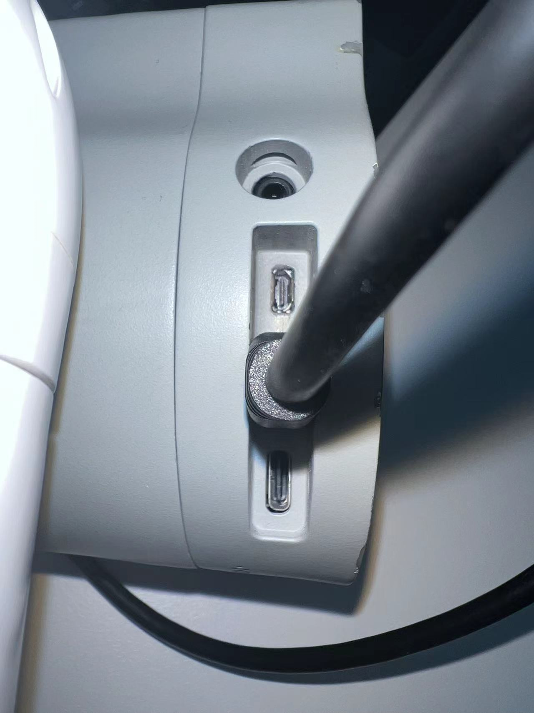

## **python**

### **Use python directly through the file**

1. Right-click the mouse directly on the desktop and select Create Document -> Empty File

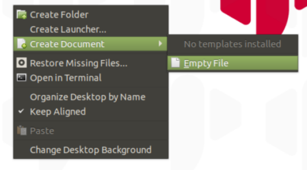

2. Name and add a suffix to the newly created file, .py is the suffix of the python file

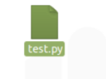

3. Click to open and start python programming

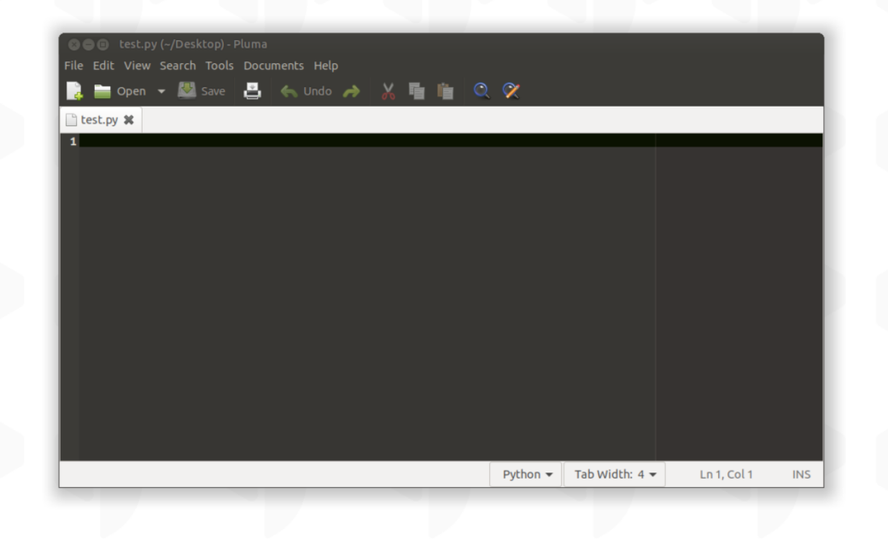

4. For python tutorials and more cases, please refer to the chapter: [Development and use based on python](https://docs.elephantrobotics.com/docs/gitbook-en/7-ApplicationBasePython/)

### **Using python through the terminal**

1. Right-click the mouse directly on the desktop, select Open in Terminal (shortcut key CTRL+ALT+T), open the terminal

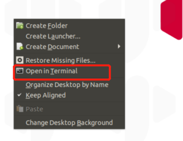

2. Enter 'python3' in the terminal to start programming

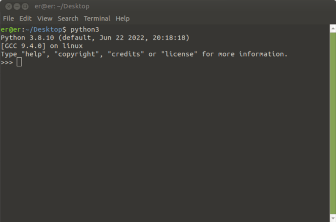

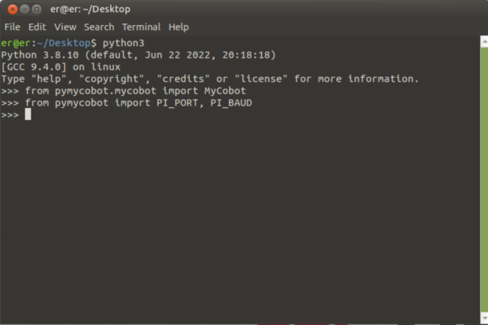

3. Use the shortcut key (CTRL+Z) or enter 'exit()' to exit the programming interface

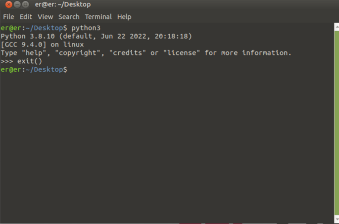

4. For python tutorials and more cases, please refer to the chapter: [Development and use based on python](https://docs.elephantrobotics.com/docs/gitbook-en/7-ApplicationBasePython/)

### **Use python with VSCode**

1. Search for VS in the upper right menu and open VSCode

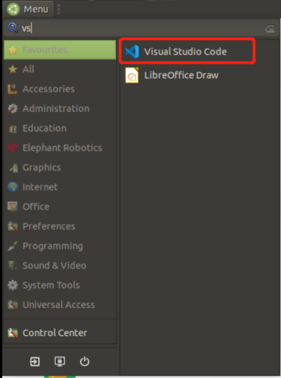

2. After entering VSCode, select File -> New File to create a python file

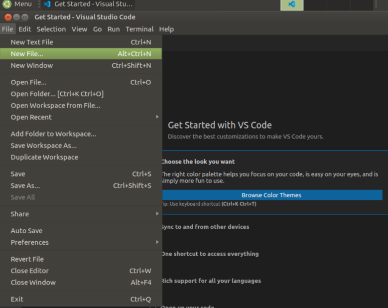

3. Name the file

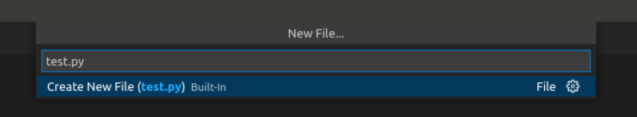

4. Select the file storage location

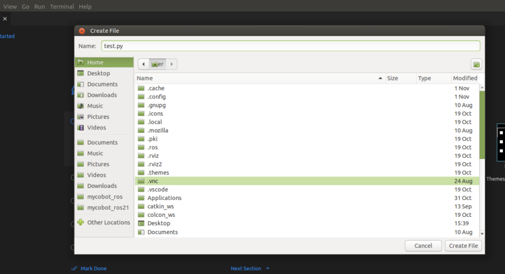

5. For python tutorials and more cases, please refer to the chapter: [Development and use based on python](https://docs.elephantrobotics.com/docs/gitbook-en/7-ApplicationBasePython/)

## **myStudio**

1. Click the desktop myStudio icon to open

After opening, as shown in the figure below

2. For the myStudio tutorial, please refer to the chapter: [5.1 myStudio](https://docs.elephantrobotics.com/docs/gitbook-en/4-BasicApplication/4.1-myStudio/)

## **myBlockly**

1. Click the desktop myBlockly icon to open

After opening, as shown in the figure below

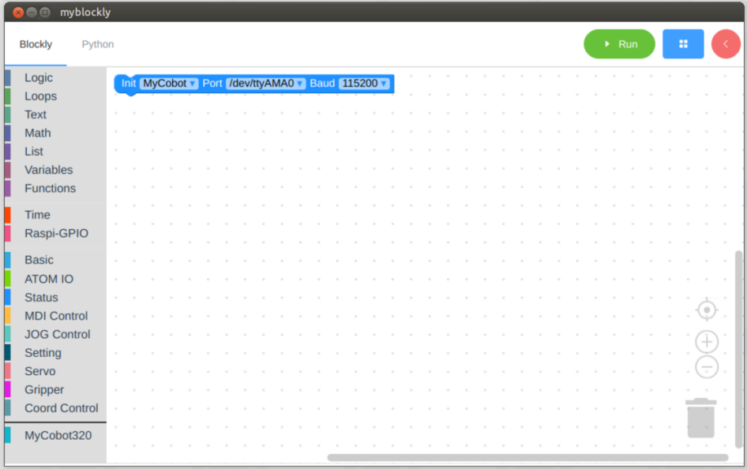

2. For myBlockly tutorial, please refer to the chapter: [6.1 myBlockly](https://docs.elephantrobotics.com/docs/gitbook-en/5-ProgramingApplication-myblockly-uiflow-mind/)

## **ROS**

### **ROS1**

1. Click the desktop ros1 icon to open

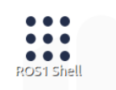

After opening, as shown in the figure below, the ros command can be entered in the terminal below

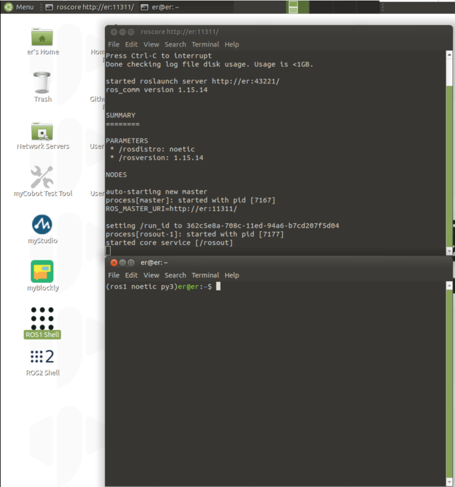

2. For the tutorial of ros1, please refer to the chapter: [Brief introduction and use of rviz](https://docs.elephantrobotics.com/docs/gitbook-en/12-ApplicationBaseROS/12.1-ROS1/12.1.4-rivz%E4%BB%8B%E7%BB%8D%E5%8F%8A%E4%BD%BF%E7%94%A8/)

### **ROS2**

1. Click the desktop ros1 icon to open

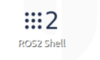

After opening, as shown in the figure below, the ros command can be entered in the terminal below

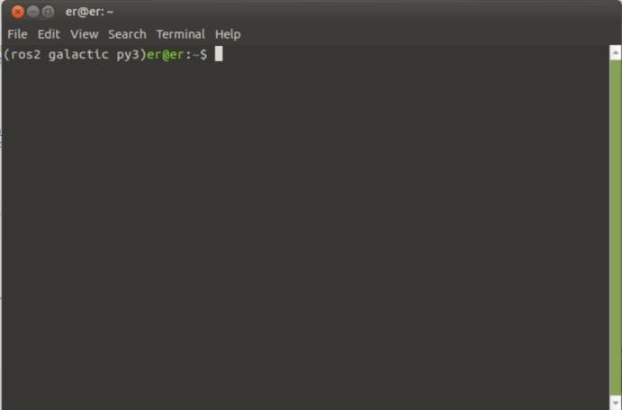

2. For the ros2 tutorial, please refer to the chapter: [Brief introduction and use of rviz2](https://docs.elephantrobotics.com/docs/gitbook-en/12-ApplicationBaseROS/12.2-ROS2/12.2.7-rivz%E4%BB%8B%E7%BB%8D%E5%8F%8A%E4%BD%BF%E7%94%A8/)
