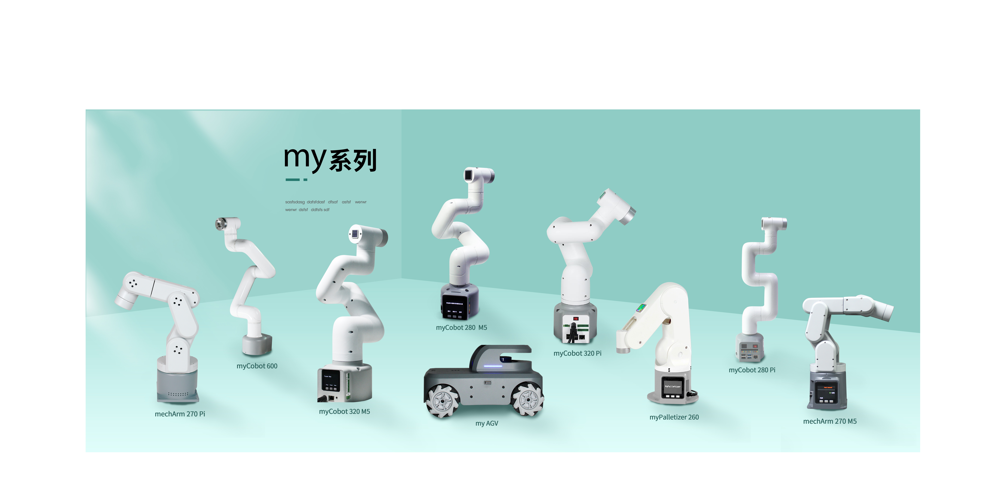

# Equipment Purchase Guide

At present, there are six-axis robot arms, four-axis robot arms, mobile robots, advanced packages, product accessories, etc. on sale. Please select the model according to your needs.

**Six-axis robot** 
- baby elephant collaborative robot arm
  - [myCobot 280 M5/Pi](2.1-280/2.1-280.md) ------maker and education
  - [myCobot 320 M5/Pi](2.2-320/2.2-320.md) ------maker and scientific research
  - [mechArm 270 M5/Pi](2.6-mecharm_270/2.6.1_270-PI/2.6.1-mecharm.md) ------maker and education

-   Commercial baby elephant collaborative robot arm
    -   [myCobot Pro 600----teaching and commercial use](2.3-myCobot_Pro_600.md)

**Four-axis robot**
- baby elephant palletizing robot arm 
- [myPalletizer 260](2.4-myPalletizer260.md)----maker and scientific research

**Mobile robot** 
- [myAGV](2.5-myAGV.md) ------maker

**Advanced package** 
- [AI package](2.7-kit/2.7.1-kit.md) ------maker,teaching, and scientific research

**Product accessories**

-   [Base](2.6-accessories/2.6-accessories.md)
-   [End-effector](2.6-accessories/2.6-accessories.md)
