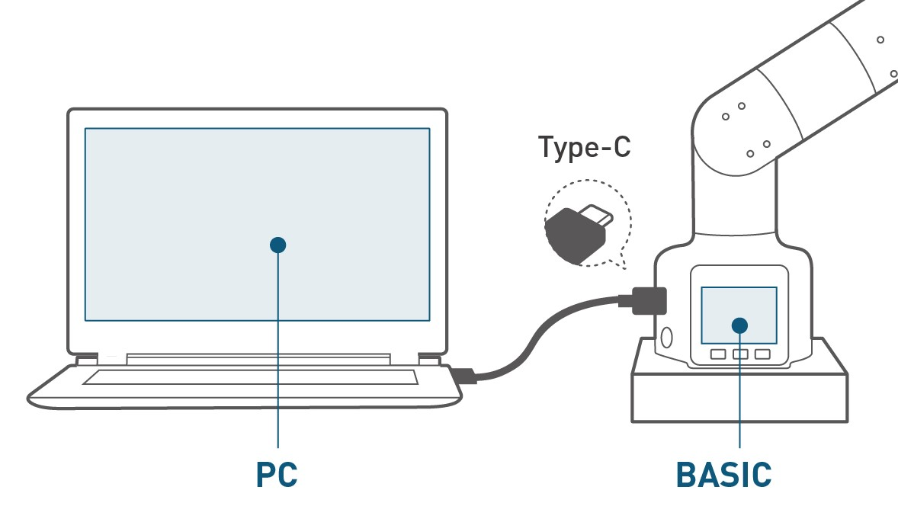
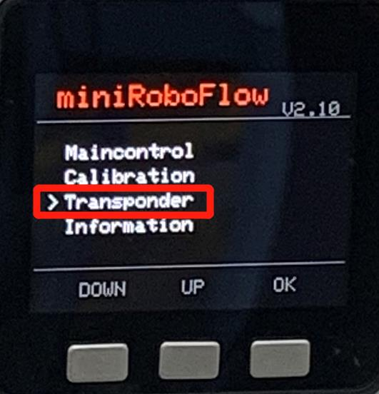
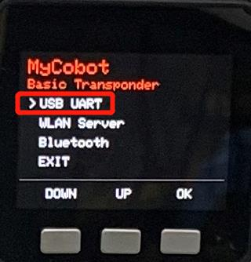
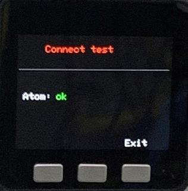
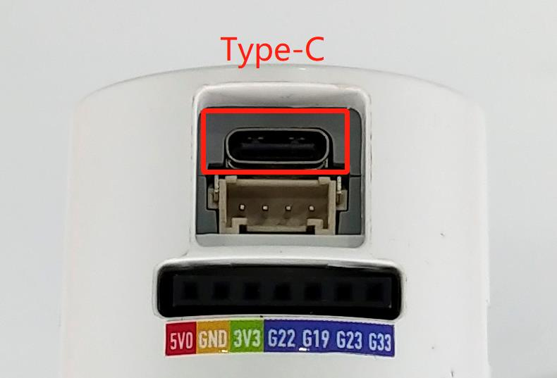
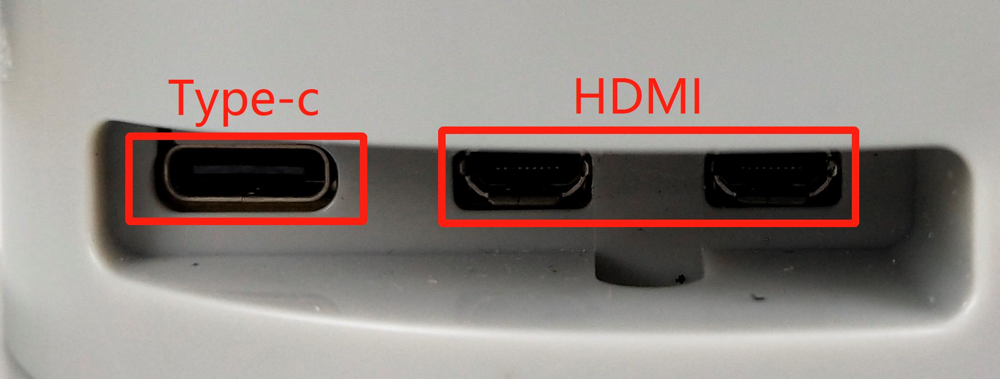
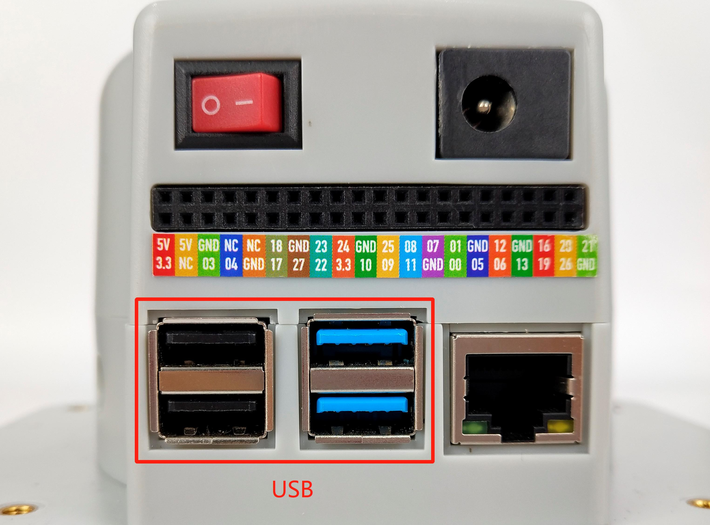

# Different connecting way to PC for robotic arms in M5 version and PI version

## M5

- M5 version robotic arms is jointly produced by Elephant Robotics and Shenzhen Mingzhan Technology Co., Ltd. - M5STACK. It is the first robotic arm of myCobot series made for sale. It adopts **Esp32** as its core processor, and applies **two screens and several physical buttons** so that it can be used on a table-sized ground. Deeply integrated with M5 expensive ecosystem, users are able to control robots via **UIFlow**, **Python,** **Arduino** in accordance with tutorial provided on our official website.

- M5 version robotic arms is equipped with two screens and several physical buttons，M5Stack-basic works as the main control on pedestal , and M5STACK Atom works as the secondary control on the end.

- M5 version robotic arms itself only has the ** recording and playback ** function, that is, recording action and playing action，If you need to use **UIFlow**, **python**, **Arduino** for further development, you need to connect to PC or laptop. The connection methods are as follows：

- After the connection is complete, turn on the manipulator communication according to the following steNote：
  **❗❗❗❗❗❗❗❗❗❗Note⚠：The following steps are extremely important, please be sure to carry out, otherwise the mechanical arm can not communicate normally❗❗❗❗❗❗❗❗❗❗**
  **❗❗❗❗❗❗❗❗❗❗Note⚠：The following steps are extremely important, please be sure to carry out, otherwise the mechanical arm can not communicate normally❗❗❗❗❗❗❗❗❗❗**

  - M5Stack-basic choose and press the **Transponder**
  
  

  
  

  
  

  
  

  - Check the connection of Atom
  > **Notice:** `ok` means in a normal state, otherwise `no` is displayed.

  **❗❗❗❗❗❗❗❗❗❗Note⚠：After arriving at this page, you need to stay on this page to maintain communication❗❗❗❗❗❗❗❗❗❗**
  **❗❗❗❗❗❗❗❗❗❗Note⚠：After arriving at this page, you need to stay on this page to maintain communication❗❗❗❗❗❗❗❗❗❗**

  

  
  

- The appropriate development methods are：[myBlockly](../5-ProgramingApplication-myblockly-uiflow-mind/5.1-myblockly/README.md), [Python](../7-ApplicationBasePython/README.md), [C++](../8-ApplicationBaseCPlus/README.md), [C#](../9-ApplicationBaseCSharp/README.md), [Arduino](../10-ArduinoEnv/README.md), [JavaScript](../11-ApplicationBaseJavaScript/README.md), [ROS](../12-ApplicationBaseROS/README.md)，how to program the operation, please click the corresponding link above

## PI

- PI version robotic arms is a joint product developed by Elephant Robotics and **Raspberry Pi**. Adopting the **Raspberry PI 4B** as its core processor, and reserving the origin hardware interface of RaspBerry PI 4B, the robotic arm meets the application needs of **Linux system** with one-in-all structure for portable robot development. Featuring built-in **Ubuntu 18.04. system** as well as  development environments like **Python**, **ROS** and **myBlockly**, it can be developed after connecting with displayer without matching with PC.

- PI version robotic arms is embedded with Raspberry PI 4B, 1.5GHz 4-core microprocessor, runs Debian/Ubuntu platform, supports 4 USB channels, 2 HDMI channels, standardized GPIO interface, TF card is removable

- The essence of the PI version robotic arms is a development board with an independent system, which can be seen as a miniature computer host. The communication between the host and the host cannot be simply constituted by a wire. It can only be connected to an independent monitor, and equipped with power supply, mouse and keyboard, and can be developed and operated after entering the built-in system of the development board

**❗❗❗❗❗❗❗❗❗❗Note⚠：The Type-C ports, HDMI ports, and USB ports circled in the figure below are all unavailable for communication with PCs and laptop❗❗❗❗❗❗❗❗❗❗**
**❗❗❗❗❗❗❗❗❗❗Note⚠：The Type-C ports, HDMI ports, and USB ports circled in the figure below are all unavailable for communication with PCs and laptop❗❗❗❗❗❗❗❗❗❗**

**❗❗❗❗❗❗❗❗❗❗Note⚠：Use the delivered HDMI cable to connect the monitor and use the built-in system for development❗❗❗❗❗❗❗❗❗❗**
**❗❗❗❗❗❗❗❗❗❗Note⚠：Use the delivered HDMI cable to connect the monitor and use the built-in system for development❗❗❗❗❗❗❗❗❗❗**

- PI version robotic arms does not need to be equipped with a PC, laptop and other equipment, and can be connected to the display for application development
  - Plug the HDMI cable into the HDMI port of the monitor.
  

  
  

  
  
  - Plug the other end into the HDMI port of the robotic arm.
  
  

  
  

  
  

  
  

  
  

  
  

  
- The appropriate development methods are：[myBlockly](../5-ProgramingApplication-myblockly-uiflow-mind/5.1-myblockly/README.md), [Python](../7-ApplicationBasePython/README.md), [C++](../8-ApplicationBaseCPlus/README.md), [C#](../9-ApplicationBaseCSharp/README.md), [ROS](../12-ApplicationBaseROS/README.md)，how to program the operation, please click the corresponding link above