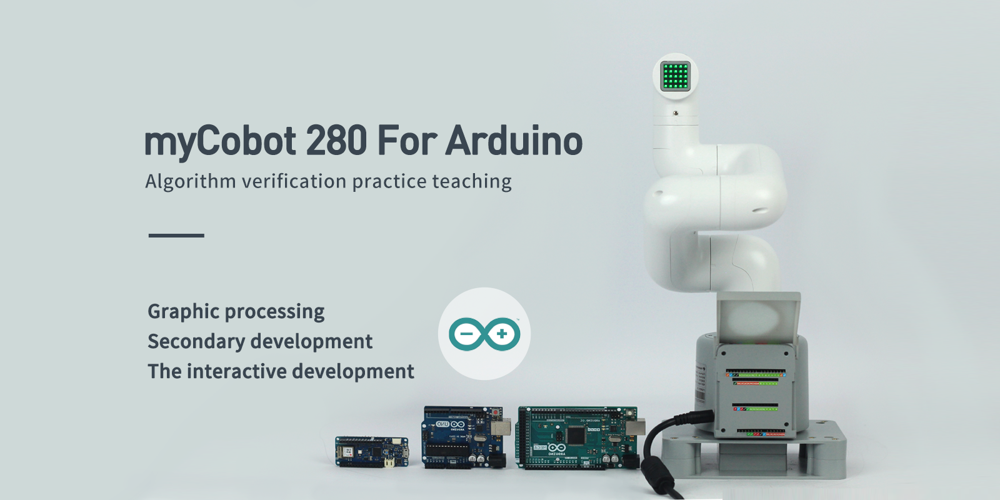

#  myCobot 280
> 280mm refers to the effective working radius of the robotic arm
>
> The cumulative sales of myCobot series products are 10,000+, sold to 50+ countries around the world

## 1 Profile

**myCobot 280 series is the world's smallest and lightest six-axis collaborative robot**. Although it is small in size, it boasts multiple interactive functions between softwares and hardwares and expensive interface compatible with various devices. It supports further development on many platforms to meet users' demands under different circumstances.

myCobot 280 is suitable for: artificial intelligence-related subject education, personal creative development, business application exploration and other application scenarios, the choice of users in 50+ countries around the world.

The **open-source driver library** of myCobot series products supports multiple development control methods such as secondary development, jigsaw programming, code programming, manual drag application, robot simulation programming, etc., and meets the development needs of different age groups.

- **myCobot 280 for Pi** is a joint product developed by **Elephant Robotics** and **Raspberry Pi**. Adopting the **RaspBerry PI 4B** as it core processor, and reserving the origin hardware interface of RaspBerry PI 4B, the robotic arm meets the application needs of **Linux system** with one-in-all structure for portable robot development. Featuring built-in **Ubuntu Mate 20.04 OS** as well as  development environments like **Python**, **ROS** and **myBlockly**, it can be developed after connecting with displayer, keyboard and mouse without matching with PC. It is an industrial robot of real meaning.

- **myCobot 280 for M5** is jointly produced by Elephant Robotics and Shenzhen Mingzhan Technology Co., Ltd. It is the first robotic arm of myCobot series made for sale. It adopts **M5Stack - Esp32** as its core processor, and applies **two screens and several physical buttons** so that it can be used on a table-sized ground. Deeply integrated with M5 rich ecosystem, users are able to control robots via **UIFlow**, **Python,** **Arduino,** **myBlockly, C++, C#, JS** in accordance with tutorial provided on our official website.

- **myCobot 280 Jetson Nano** is a joint product developed by Elephant Robotics and **NVIDIA Jetson Nano**. It is designed  for **image and visual processing** and **greater performance of the integrated robot processor**. Based on the premise of guaranteeing industrial design, **NVIDIA JetsonNano kit** is integrated as small as possible, and the origin hardware interface of Nano is also reserved. With built-in development environments like **ROS**, **Python** and **myBlockly** provided by our company, it is the product of greatest performance of 280 series. and one of the core products developed for robotic and intelligent education ecology.

- **myCobot 280 for Arduino** is a joint product developed by Elephant Robotics and **Arduino**. It is an extendable robotic arm that provides standardized serial port and can be extended into various types. It supports the expansion of various series of development boards such as **UNO, MEGA and MKR** under the Arduino platform.Users can download the official driver library provided by our company to apply **any specifications and models** of Arduino extensions. Development board for further development without migrating the main control platform.

## 2 New Features by 2023

### 7 major performance enhancements

- The repeated positioning accuracy is improved, up to ±0.5mm;

- A new self-interference detection algorithm is added to effectively prevent misoperation;

- The communication speed is increased by 5 times, and the dynamic response is millisecond level;

- The joint module is optimized, and the life span is increased by 100%;

- Increased structural rigidity;

- The whole is not easy to damage;

- The built-in system is newly upgraded;

### 3 new functions to unlock more ways to play

- Support myCobot_Gamepad wireless remote controller control;
- The kinematics algorithm is newly upgraded to support simple painting;
- Support mobile phone wireless control with myCobot_Control App;

## 3 Comparison of Different Versions
* Pi — built-in Raspberry Pi ecology and unlimited development possibilities
  * I/O port：40

  * Raspberry Pi 4B, 1.5GHz quad-core microprocessor and Debian/Ubuntu platform

  * It supports 4-way USB, 2-way HDMI, standardized GPIO interface and pluggable TF card.

* M5 — equipped with two screens and several physical buttons
  * I/O port：20

  * M5Stack-basic works as the main control on pedestal , and M5STACK Atom works as the secondary control on the end.

  * It supports thousands of application ecosystems of M5, which is convenient for expanding application interaction output.

* Jetson Nano — great performance, one step forward in development 
  * I/O port：40
  
  * NVIDIA JetsonNano kit core processor, providing visual rendering GPU, supporting the image recognition and processing environment officially provided by NVIDIA, following the official NVIDIA tutorial, you can start image recognition development

  * Support 3-way USB, 1-way HDMI, standardized GPIO interface.

* Arduino version -- expandable Arduino various development boards
  * I/O port：6

  * The base supports the expansion of most types of Arduino development boards, such as: Arduino UNO\MEGA\MKR, etc.

  * Support Arduino official development environment, provide official tutorials and driver libraries

## 4 Buy

  * Taobao：https://shop504055678.taobao.com

  * shopify：https://shop.elephantrobotics.com/

For details, please check：

- [280 Pi 2023](../../2-serialproduct/2.1-280/2.1.5-PI-2023.md)

- [280 M5 2023 ](../../2-serialproduct/2.1-280/2.1.6-M5-2023.md)  
- [280 JetsonNano 2023](../../2-serialproduct/2.1-280/2.1.7-JN-2023.md)
- [280 for Arduino 2023](../../2-serialproduct/2.1-280/2.1.8-Arduino-2023.md)
- [280 Pi 2020](../../2-serialproduct/2.1-280/2.1.2-PI.md)
- [280 M5 2020 ](../../2-serialproduct/2.1-280/2.1.1-M5.md)  
- [280 JetsonNano 2020](../../2-serialproduct/2.1-280/2.1.3-JN.md)
- [280 for Arduino 2020](../../2-serialproduct/2.1-280/2.1.4-Arduino.md)
