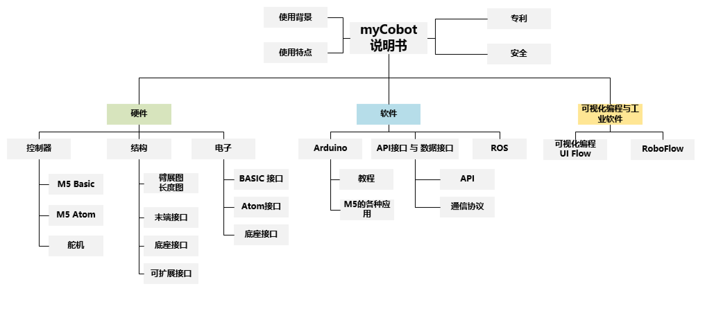
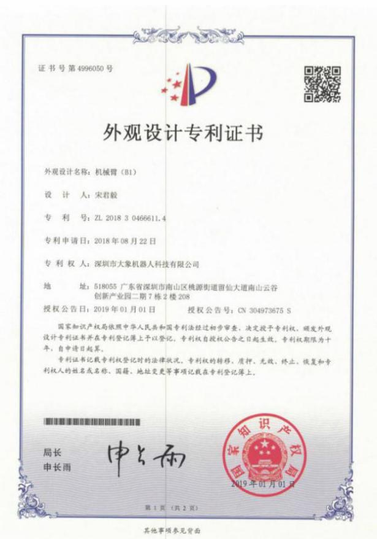

# myCobot 280 M5

## 1 Profile

**myCobot-M5** is jointly produced by **Elephant Robotics** and **M5stack**. As the **world\'s smallest and lightest six-axis collaborative robot** (also called cobot for short), it supports secondary development to the personalized needs of users. It is also both a productive tool and a tool for expanding the boundary of imagination.

myCobot has a net weight of 850g, a payload of 250g,and an effective working radius of 280mm. Although it is small-sized, it boasts multiple functions. It not only works various types of end effectors to conform to different applications, but also supports secondary development based on multi-platform softwares to meet the needs of **scientific research, education, smart home, business exploration**, etc.

## 2 Diagram of Function and Necessities

## 3 Product Performance

### Unique industrial design and a compact structure

-   With an integrated design, it has a compact structure, weighting only 850g, which makes it portable.
-   Featuring a modular design and a concise shape, it is convenient to detach or change components so as to lower maintenance cost.
-   It can begin to work the moment plugged in.

### Powerful performance with two screens equipped

-   With 6 built-in servo motors, the product responds quickly and rotates smoothly due to little inertia.
-   The body is equipped with two screens and supports the fastLED repository, which is convenient to the expansion of interactive output of applications.

### LEGO connector and multiple application ecology of M5

-   With M5Stack-basic as the main control on pedestal, it meets various types of application.
-   LEGO interfaces on the pedestal and end enable the development of micro embedded devices.

### Supporting graphical programming and industrial robotic software

-   Adopting myBlockly, a visual programming software to ensure free and easy programming.
-   Supporting Arduino + ROS open-source system.

### Supporting record of tracks and coordinate

-   Supporting drag teaching and recorded paths saving.
-   Different paths up to 60 minus can be saved by new model instead of traditional model.

## 4 Patent on myCobot

> myCobot is protected by patent.

| No. | Name                                             | Patent Code |
| ---- | ------------------------------------------------ | ------------------- |
| 1    | Collaborative Robotic Arm                                 | 2020030683471.3     |
| 2    | Robot Arm Link and its Robotic Arm                       | CN 208196791 U      |
| 3    | Robotic Arm Joint Connectors and its Robotic Arm             | CN 208196840 U      |
| 4    | A Drag-Teaching Method and A System for Posture Keeping | ZL 2018 1 1634649.3 |
| 5    | An Online Detecting Method and System for Collision Based on Momentum Model | ZL 2019 1 0030748.9 |
| 6    | A Method for Parameters Identifying independent of Acceleration Joint Angle | ZL 2019 1 0773865.4 |

