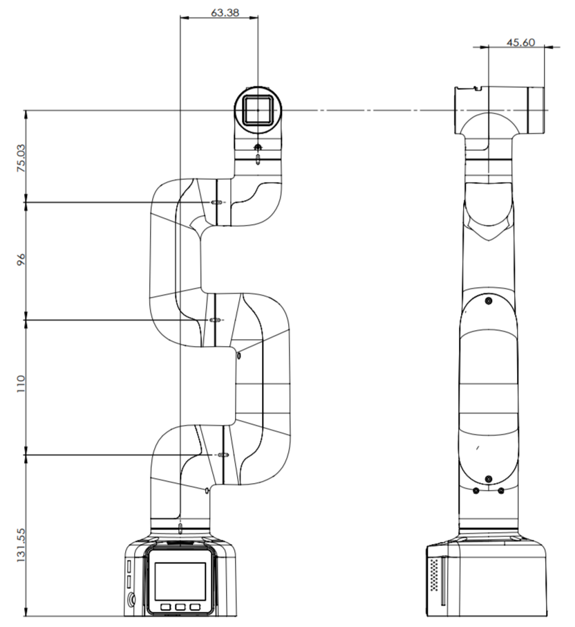
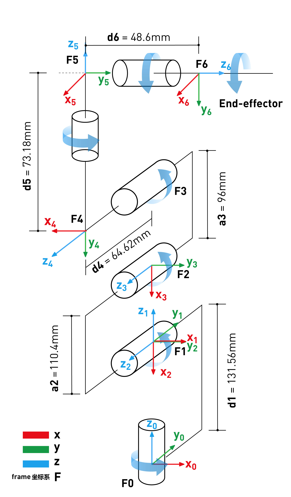

# myCobot 280 for M5

## 1 Structural Parameters

### 1.1 Parameters of Robotic Arm

| Indicator       | Parameter |
| :-----------: | :---------: |
| Name         | Baby-Elephant Collaborative Robotic Arm |
| Type      | M5 |
| Degree of Freedom      | 6          |
| Effective Load | 250g       |
| Effective Working Radius | 280mm      |
| Repeated Positioning Precision | ±0.5mm |
| Net Weight      | 850g       |
| Power Input    | 8-12V，5A     |
| Operational Temperature | -5-45℃     |
| Communication        | Type-C     |

### 1.2 Space Parameters of Working

### 1.3 Diagram of Specification

### 1.4 Available Angle of Joints

| joint       | range |
| :---------: | :----------: |
| J1        | -165 ~ +165     |
| J2        | -165 ~ +165      |
| J3  | -165 ~ +165                   |
| J4        | -165 ~ +165 |
| J5   | -165 ~ +165                   |
| J6   | -175 ~ +175         |

### 1.5 Installation Based on Positions of Holes

- Pedestal is installed with flange. It is also compatible with installation of LEGO parts and M4 screws.

- The end is installed with flange. It is compatible with both LEGO holes and holes for threaded holes of screw.

## 2 Parameters of Hardware

|  Items  | Parameter |
| :---------: | :----------: |
| Core | 240MHz dual core. 600 DMIPS, 520KB SRAM. Wi-Fi, dual mode Bluetooth |
| Flash   | 4MB    |
| IO | G19, G21, G22, G23, G25, G33 |
| Bluetooth | 2.4G/5G |
| Wireless type | 2.4G 3D Antenna  |
| Type of Core | M5Stack-basic/Atom |

## 3 Parameters of DH

SDH：

