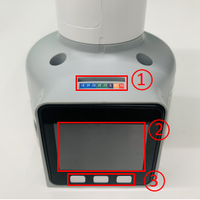
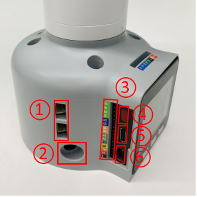
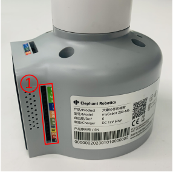
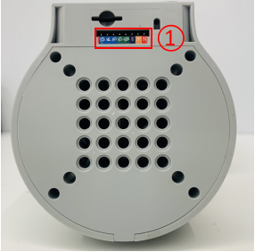
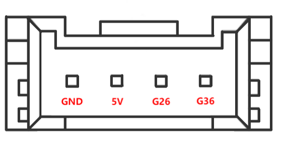
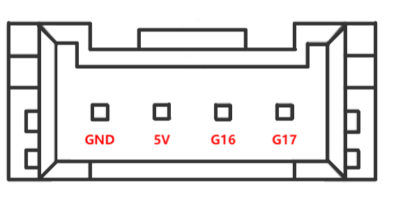
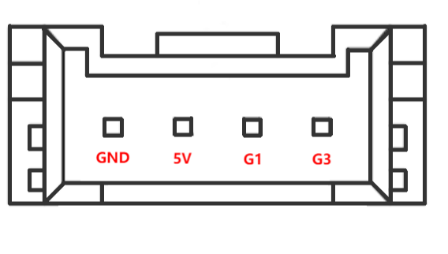

# Electrical Interface of myCobot 280 M5 2020

## 1 Introduction

### 1.1 Pedestal

* A. The interface, screen for displaying detailed information and buttons are shown in Figure 2.1.6.2-1:

   

  Figure 2.1.1.2-1 Front view of the base
  - ① Functional Interface Group 1  
  - ② Basic display
  - ③ Button 1 , Button 2 , Button 3 

* B. The interface on the left side of the pedestal is shown in Figure 2.1.1.2-2:

  

  Figure 2.1.1.2-2 Left side view of the base
  - ① Grove 1 , Grove 2
  - ② DC Interface of power
  - ③ Functional Interface Group 2
  - ④ Reset Button
  - ⑤ Type C
  - ⑥ Grove 3

* C. The interface on the right side of the base is shown in Figure 2.1.1.2-3:

  

   Figure 2.1.1.2-3 Right side of the base
   - ① Functional InterFace Group 3

* D. The interface on the bottom side of the base is shown in Figure 2.1.1.2-4:

  

   Figure 2.1.1.2-4 Right side of the base
   - ① Functional InterFace Group 4
									
### 1.2 Introduction to Interfaces on Pedestal

> **Notice:** The functional interface groups are all 2.54mm DuPont interfaces, and 2.54mm DuPont cables can be used externally.

* A. The corresponding interfaces of functional interface group 1 and functional interface group 4 are consistent, and the definitions of each interface are shown in Table 2.1.1.2-1:
  

Table 2.1.1.2-1

| Label | Signal | Type | Function | Remark |
| :---: | :----: | :--: | :------: | :----: |
| 18 | G18 | I/O | GPIO18 | Unavailable when using TF card |
| 19 | G19 | I/O | GPIO19 | Unavailable when using TF card |
| 23 | G23 | I/O | GPIO23 | Unavailable when using TF card |
| 22 | G22 | I/O | GPIO22 |  |
| 21 | G21 | I/O | GPIO21 |  |
| G | GND | P | GND |  |
| 3V3 | 3V3 | P | DC 3.3V |  |
| 5V | 5V | P | DC 5V |  |

* B. The corresponding interfaces of functional interface group 1 and functional interface group 4 are consistent, and the definitions of each interface are shown in Table 2.1.1.2-2:
  

Table 2.1.1.2-2

| Label | Signal | Type | Function | Remark |
| :---: | :----: | :--: | :------: | :----: |
| 3 | G3 | I/O | GPIO3 | Not available when using USB-TypeC or Grove 2 |
| 1 | G1 | I/O | GPIO1 | Not available when using USB-TypeC or Grove 2 |
| 16 | G16 | I/O | GPIO16 | Not supported yet |
| 17 | G17 | I/O | GPIO17 | Not supported yet |
| 2 | G2 | I/O | GPIO2 |  |
| 5 | G5 | I/O | GPIO5 |  |
| 25 | G25 | I/O | GPIO25 | Not supported yet |
| 26 | G26 | I/O | GPIO26 | Not available when using Grove1 |
| 35 | G35 | I/O | GPIO35 | Not supported yet |
| 36 | G36 | I/O | GPIO36 | Not available when using Grove1 |
| RST | RST | - | Controller reset | Not supported yet |
| BAT | BAT | - | BTTERY | Not supported yet |
| 3V3 | 3V3 | P | DC 3.3V |  |
| 5V | 5V | P | DC 5V |  |
| G | GND | P | GND |  |

> **Notice:** 
> 1. I: input only.
> 
> 2. I/O: This function signal includes input and output combination.
> 
> 3. When the single tube corner is set as the output terminal, it will output 3.3V voltage.
> 
> 4. The source current of a single tube angle decreases with the increase of the number of pins, from about 40mA to 29mA.
> 
> 5. If a certain GPIO is set to the output mode and outputs a high level signal, the circuit connected to the LED is shown in Figure 2.1.1.2-5, and the LED will light up.
> 
> 
> 
> Figure 2.1.1.2-5
> 
> 6. In the case of using other functions, the IO function is unavailable, and the other function table of the function interface is shown in Figure 2.1.1.2-6.
> 
> 
> 
> Figure 2.1.1.2-6

* C. DC Interface of power: use a DC power socket with an outer diameter of 6.5mm and an inner diameter of 2.0mm. The 8.4V 5A DC power adapter provided by the manufacturer can be used to power myCobot 280.

* D. Grove interface: The definition of Grove interface is shown in Figure 2.1.1.2-7, Figure 2.1.1.2-8, and Figure 2.1.1.2-9.
  
  

  Figure 2.1.1.2-7 Grove 1 

  

  Figure 2.1.1.2-8 Grove 2

  

  Figure 2.1.1.2-9 Grove 3

* E. Type C Interface: It can be used to connect and communicate with the PC. At the time that this interface is used, the G1 and G3 interfaces are occupied.
  
* F. Reset Button: It is used to reset the main control system.

* G. Button A, Button B and Button C: It is used with the screen.

* H. Basic display: It is used with a 2-inch IPS screen for displaying the communication status and calibrating the robot in cooperation with the button.

## 2 Electrical Interface of the End

### 2.1 Introduction to the End of Robotic Arm

* A. Figure 2.1.1.2-10 and Figure 2.1.1.2-11 show the side interface of the end:

  

  Figure 2.1.1.2-10 Side view of the end of the robotic arm
  - ① Servo Interface
  - ② Atom

  	

  Figure 2.1.1.2-11 Side view of the end of the robotic arm
  - ① Functional InterFace Group 5
  - ② Grove 4
  - ③ Type C

### 2.2 Introduction to Terminal Interface

* A. The definitions of each interface of functional interface group 5 are shown in Table 2.1.1.2-3:
  

Table 2.1.1.2-3

| Label | Signal | Type | Function | Remark |
| :---: | :----: | :--: | :------: | :----: |
| 5V | 5V | P | DC 5V |  |
| GND | GND | P | GND |  |
| 3V3 | 3V3 | P | DC 3.3V |  |
| G22 | G22 | I/O | GPIO22 |  |
| G19 | G19 | I/O | GPIO19 |  |
| G23 | G23 | I/O | GPIO23 |  |
| G33 | G33 | I/O | GPIO33 |  |

> **Notice:** 
> 1. I: input only.
> 
> 2. I/O: This function signal includes input and output combination.
> 
> 3. When the single tube corner is set as the output terminal, it will output 3.3V voltage.
> 
> 4. The source current of a single tube angle decreases with the increase of the number of pins, from about 40mA to 29mA.
> 
> 5. If a certain GPIO is set to the output mode and outputs a high level signal, the circuit connected to the LED is shown in Figure 2.1.1.2-12, and the LED will light up.
> 
> 
> 
> Figure 2.1.1.2-12

* B. Type C interface: It can be used to communicate with PC and update firmware.

* C. Grove interface 4: The definition of Grove interface 4 is shown in Figure 2.1.1.2-13
  
  	

​  Figure 2.1.1.2-13 Grove 4

* D. Servo Interface. It is used when expanding the gripper at the end, and currently supports the use of the matchable adaptive gripper.

* E. Atom. Displaying 5X5 RGB LED (G27) and key function (G39).

 