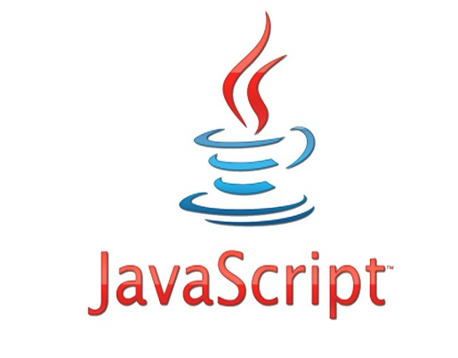

# Development Environment Construction

## 1 Using Environment

myCobot 280 for M5 is developed and used based on the basis of PC. As there is no built-in system inside the robotic arm, the combination of the robotic arm and the PC is required during use. Prepare a PC firstly before use.

## 2 Development Environment

Here are the development environments supported by myCobot 280 for M5. Read to download and install:

- [2.1 Development based on myBlockly and UIFlow](../../5-ProgramingApplication-myblockly-uiflow-mind/README.md), which are both graphical programming software and visualization tools. Users can create programs dragging modules, the process of which is very similar to building blocks. After [installing myblockly ](../../5-ProgramingApplication-myblockly-uiflow-mind/5.1-myblockly/README.md)and [UIFlow ](../../5-ProgramingApplication-myblockly-uiflow-mind/5.2-UIFlow/5.2.1UIFlow_enviorment_building.md), refer to [myblockly use cases ](../../5-ProgramingApplication-myblockly-uiflow-mind/5.1-myblockly/README.md)and [UIFlow use cases](../../5-ProgramingApplication-myblockly-uiflow-mind/5.2-UIFlow/5.2.7UIFlow_Use_Cases.md). 
  

- [2.2 Development based on Python](../../7-ApplicationBasePython/README.md). Our robots support Python and the development of the Python API library has become increasingly complete. The joint angle, coordinates, gripper and other aspects of the robot can be controlled via Python. Refer to [installing the python environment , ](../../7-ApplicationBasePython/7.1_download.md)for more information.

  

- [2.3 Development based on C++ ](../../8-ApplicationBaseCPlus/README.md). C++ is the inheritance of C Language. It can not only carry out the procedural programming of the C Language, but also the object-based programming characterized by abstract data types, as well as inheritance and polymorphism as the Features of object-oriented programming. With C++ language, you can freely develop programms(coordinate control, angle control, io control, gripper control, etc.) through the C++ dynamic library developed by our company, and control some of the robots. After [installing the C++ environment ](../../8-ApplicationBaseCPlus/8.1-download.md), refer to [the use cases ](../../8-ApplicationBaseCPlus/8.8-example.md) for more infromation.

  
  
- [2.4 Development based on C#](../../9-ApplicationBaseCSharp/README.md). C# is an object-oriented programming language derived from C and C++ released by Microsoft, an advanced programming language running on .NET Framework and .NET Core (completely open source and cross-platform) . Using the C#, you can freely develop programs (coordinate control, angle control, io control, gripper control, etc.) through the C# dynamic library provided by our company, and control some of the robots. After [installing the C# environment ](../../9-ApplicationBaseCSharp/9.1-environment.md), refer to  [the use cases ](../../9-ApplicationBaseCSharp/9.8-example.md) for more information.

  
  
- [2.5 Development based on Arduino](../../10-ArduinoEnv/README.md). Arduino is an easy-to-use, open-source electronic prototyping platform that includes hardware (various Arduino-compliant development boards) and software (Arduino IDE and related development kits). The hardware part (or development board) consists of a microcontroller (MCU), flash memory (Flash), and a set of general-purpose input/output interfaces (GPIO), etc. It can be understood as a microcomputer motherboard. The software part is mainly composed of Arduino IDE on the PC side, related board support packages (BSP) and rich third-party function libraries. Users can use Arduino IDE to easily download the BSP related to the development board and the required function library to write program.At the same time, on github, we have an open source program MyCobotBasic. It is an open source robot control library developed by our company, which can be used only after using the robot developed by our company. Using this library, you can control our robot through Bluetooth, WiFi, serial port, etc. It also supports functions such as external sensors, IIC communication, and LED lights. You can DIY different application scenarios according to your own needs, or you can refer to the MiniRobot sample code or control cases such as angles, coordinates, and grippers we provide. The MiniRobot sample code includes Bluetooth, WiFi, drag teaching, distance sensor and other control-related content. Refer to [simple use of Arduino](../../10-ArduinoEnv/10.2-arduino_use.md)  and [the API](../../10-ArduinoEnv/10.4-api.md) for more information. 
  
  
- [2.6 Development based on JavaScript](../../11-ApplicationBaseJavaScript/README.md). JavaScript is a scripting language that runs on the client application and does not require compilation. js interpreter is used to interpret and execute codes one by one in the process of running. , some of our robots can be controlled through our company's ecological library of JavaScript language. After [installing the JavaScript environment ](../../11-ApplicationBaseJavaScript/11.1开发前准备.md), refer to [use cases](../../11-ApplicationBaseJavaScript/11.7使用案例.md) for more infromation.

  
  
- [2.7 Development based on ROS](../../12-ApplicationBaseROS/README.md). ROS is open-source and is a post operating system, or secondary operating system, used for robot control. With the use of ROS, the simulation control of the manipulator can be realized in the virtual environment. The robotic arm can be visualized through the rviz platform, and operate the robotic arm in a variety of ways. It can also be used to plan and execute the robotic arm's action path through to freely control the robotic arm. After [installing the ROS development environment ](../../12-ApplicationBaseROS/12.1-ROS1/12.1.2-环境搭建.md), refer to [use cases ](../../12-ApplicationBaseROS/12.1-ROS1/12.1.4-rivz介绍及使用/README.md)and [use of moveit](../../12-ApplicationBaseROS/12.1-ROS1/12.1.5-Moveit/README.md) for more information.
  
  
  

## 3 Updating Firmware

The basic firmware of myCobot 280 M5 and the update of Atom firmware need to be updated via myStudio.

Go to the address below for more information about myStudio:

- [4.1 myStudio](../../4-BasicApplication/4.1-myStudio/README.md)
  - [4.1.2 Serial Port Driver Installation](../../4-BasicApplication/4.1-myStudio/4.1.1-myStudio_download_driverinstalled.md)

- [4.2 Burning and Updating Firmwares](../../4-BasicApplication/4.1-myStudio/4.1.2-myStudio_flash_firmwares.md)

 

 
