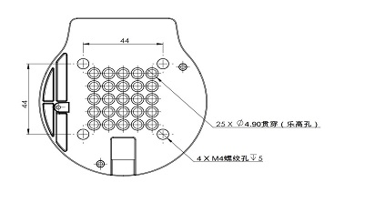

# myCobot 280 Raspberry Pi

## 1 Structural Parameters

### 1.1 Parameters of Robotic Arm

|Indicator    |Parameter  |
| :-----------: | :---------: |
|Name	|Baby-Elephant Collaborative Robot Arm|
| Model         | Raspberry Pi                          |
| Degree of freedom       | 6          |
| Load     | 250g       |
| Effective Working Radius   | 280mm      |
| Repeated Positioning Precision | ±0.5mm |
| Net Weight | 860g       |
| Power Input    | 8-12V，5A     |
| Operational Temperature | -5-45℃     |
| Communication         | Type-C     |

### 1.2 Space Parameters of Working

### 1.3 Diagram of Specification

### 1.4 Available Angle of Joints

| Joint      | Angle |
| :-----------: | :---------: |
| J1        | -165 ~ +165     |
| J2        | -165 ~ +165      |
| J3  | -165 ~ +165                   |
| J4        | -165 ~ +165 |
| J5   | -165 ~ +165                   |
| J6   | -175 ~ +175         |

### 1.5 Installation Based on Positions of Holes

- Pedestal is installed with flange. It is also compatible with installation of LEGO parts and M4 screws.

- The end is installed with flange. It is compatible with both LEGO holes and holes for threaded holes of screw .

### 2 Electronic Parameters

|  Indicator      | Parameter |
| :-----------: | :---------: |
| SOC        | Broadcom BCM2711     |
| CPU        | 64-bit 1.5GHz quad-core      |
| Bluetooth/Wireless  | have                   |
| USB        | USB3.0 x2; USB2.0 x2 |
| display screen   | without                 |
| HDMI interface   | microHDMI x2         |
| custom button | without                   |
| IO interface    | 40                 |

### 3 DH Parameters

SDH：

