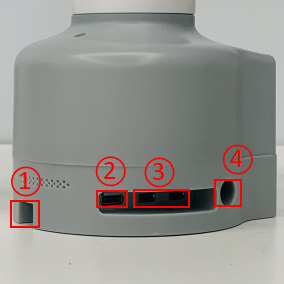

# Electrical Interface of myCobot 280 M5 Pi 2020

## 1 Introduction

### 1.1 Pedestal

* A. Figure 2.1.2.2-1 shows the front ports and buttons of the pedestal：

   

  Figure 2.1.2.2-1 Front view of the base
  - ① Switch
  - ② Functional Interface Group 1
  - ③ USB2.0 , USB3.0 
  - ④ DC Interface of power
  - ⑤ The network interface
					
* B. Figure 2.1.2.2-1 Showing the ports on the side of the base:

   

  Figure 2.1.2.2-2 side of base
  - ① SD card slot
  - ② Type C interface
  - ③ HDMI interface
  - ④ Headphone jack

### 1.2 Introduction to Bottom Electrical Interfaces

> **Notice:** Functional interface group is Dupont interface of 2.54mm, and 2.54mm Dupont wire can be used externally.

* A. Table 2.1.2.2-1 shows the definition of each interface of the functional interface group 1.

Table 2.1.2.2-1

| Label | Signal | Type | Function | Remark |
| :---: | :----: | :--: | :------: | :----: |
| 5V | 5V | P | DC 5V |  |
| 5V | 5V | P | DC 5V |  |
| GND | GND  | p | GND |  |
| NC | NC | - | - | Currently not supported |
| NC | NC | - | - | Currently not supported |
| 18 | GPIO18 | I/O | GPIO18 |  |
| GND | GND  | p | GND |  |
| 23 | GPIO23 | I/O | GPIO23 |  |
| 24  | GPIO24 | I/O | GPIO24 |  |
| GND | GND  | p | GND |  |
| 25 | GPIO25 | I/O | GPIO25 |  |
| 08 | GPIO8 | I/O | GPIO8 |  |
| 07 | GPIO7 | I/O | GPIO7 |  |
| 01 | GPIO1 | I/O | GPIO1 |  |
| GND | GND  | p | GND |  |
| 12 | GPIO12 | I/O | GPIO12 |  |
| GND | GND  | p | GND |  |
| 16 | GPIO16 | I/O | GPIO16 |  |
| 20 | GPIO20 | I/O | GPIO20 |  |
| 21 | GPIO21 | I/O | GPIO21 |  |
|3.3 | 3.3V | P | DC 3.3V |  |
| NC | NC | - | - | Currently not supported |
| 03 | GPIO3 | I/O | GPIO3 |  |
| 04 | GPIO4 | I/O | GPIO4 |  |
| GND | GND  | p | GND |  |
| 17 | GPIO17 | I/O | GPIO17 |  |
| 27 | GPIO27 | I/O | GPIO27 |  |
| 22 | GPIO22 | I/O | GPIO22 |  |
|3.3 | 3.3V | P | DC 3.3V |  |
| 10 | GPIO10 | I/O | GPIO10 |  |
| 09 | GPIO9 | I/O | GPIO9 |  |
| 11 | GPIO11 | I/O | GPIO11 |  |
| GND | GND  | p | GND |  |
| 00 | GPIO0 | I/O | GPIO0 |  |
| 05 | GPIO5 | I/O | GPIO5 |  |
| 06 | GPIO6 | I/O | GPIO6 |  |
| 13 | GPIO13 | I/O | GPIO13 |  |
| 19 | GPIO19 | I/O | GPIO19 |  |
| 26 | GPIO26 | I/O | GPIO26 |  |
| GND | GND  | p | GND |  |

> **Notice:** 
> 1. I/O: This function signal includes input and output combination.
> 
> 2. When the single tube corner is set as the output terminal, it will output 3.3V voltage.
> 
> 3. The source current of a single tube angle decreases with the increase of the number of pins, from about 40mA to 29mA.
> 
> 4. If a certain GPIO is set to the output mode and outputs a high level signal, the circuit connected to the LED is shown in Figure 2.1.5.2-3, and the LED will light up.
> 
>  
> 
> Figure 2.1.2.2-3
> 
> 5. In the case of using other functions, the IO function is unavailable, and the other function table of the function interface is shown in Figure 2.1.2.2-4.
> 
>  
> 
> Figure 2.1.2.2-4

* B. Power DC interface: The myCbot280 is powered by a 6.5mm od, 2.0mm OD, and a manufacturer's 8.4V 5A DC power adapter.
  
* C. Switch: Red means switch. I means powering on, while O means powering off.

* D. USB2.0 interface. Serial port with the standard of main line for 2.0 interface. The USB port is used to copy program files and connect peripherals such as mouse and keyboard.

* E. USB3.0 port (blue) : The port that uses serial bus 3.0 for data connection. The USB port is used to copy program files and connect peripherals such as mouse and keyboard.

   

  Figure 2.1.2.2-5

* F. The network interface: Ports for network data connection, as shown in figure 2.1.2.2-5. Ethernet interfaces can be used for communication between a PC and a robot system or for Ethernet communication with other devices.

   

  Figure 2.1.2.2-6

* G. HDMI port: The HDMI D-type port connects with the monitor. HDMI port 2 has a priority, and HDMI port 1 is recommended.

* H. Type-C port: connecting to the PC.

* I. SD card slot: The SD card can be inserted and removed. The size of the SD card is 32mm x 24mm x 2.1mm

## 2 Electrical Interface of the End

### 2.1 Introduction to the End

* A.  Figure 2.1.2.2-7 and Figure 2.1.2.2-8 show the side interface of the end:

   

  Figure 2.1.2.2-7 Side view of the end of the robotic arm
  - ① Servo Interface
  - ② Atom

   	

  Figure 2.1.2.2-8 Side view of the end of the robotic arm
  - ① Functional InterFace Group 2
  - ② Grove
  - ③ Type C

### 2.2 Terminal Electrical Ports

* A.  The definitions of each interface of functional interface group 2 are shown in Table 2.1.2.2-2:
  

Table 2.1.2.2-2

| Label | Signal | Type | Function | Remark |
| :---: | :----: | :--: | :------: | :----: |
| 5V | 5V | P | DC 5V |  |
| GND | GND | P | GND |  |
| 3V3 | 3V3 | P | DC 3.3V |  |
| G22 | G22 | I/O | GPIO22 |  |
| G19 | G19 | I/O | GPIO19 |  |
| G23 | G23 | I/O | GPIO23 |  |
| G33 | G33 | I/O | GPIO33 |  |

> **Notice:** 
> 1. I: input only.
> 
> 2. I/O: This function signal includes input and output combination.
> 
> 3. When the single tube corner is set as the output terminal, it will output 3.3V voltage.
> 
> 4. The source current of a single tube angle decreases with the increase of the number of pins, from about 40mA to 29mA.
> 
> 5. If a certain GPIO is set to the output mode and outputs a high level signal, the circuit connected to the LED is shown in Figure 2.1.2.2-9, and the LED will light up.
> 
> 
> 
> Figure 2.1.2.2-9

* B. Type C interface: It can be used to communicate with PC and update firmware.

* C. Grove interface : The definition of Grove interface is shown in Figure 2.1.2.2-10
* 
  
  
​  Figure 2.1.2.2-10 Grove 

* D. Servo Interface. It is used when expanding the gripper at the end, and currently supports the use of the matchable adaptive gripper.
  
* E. Atom. Displaying 5X5 RGB LED (G27) and key function (G39).