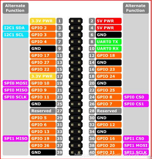
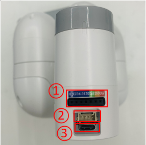

# Electrical Interface of myCobot 280 Jetson Nano 2020

## 1 Introduction

### 1.1 Pedestal

A. Figure 2.1.3.2-1 shows the front ports and buttons of the pedestal：

   

  Figure 2.1.3.2-1 Front view of the base
  - ① Switch
  - ② DC Interface of power
  - ③ Functional Interface Group 1
  - ④ Type C interface
  - ⑤ HDMI interface
  - ⑥ USB3.0
  - ⑦ USB2.0 
  - ⑧ The network interface
  - ⑨ Micro USB interface

### 1.2 Introduction to Interfaces on Pedestal

> **Notice:** Functional interface group is Dupont interface of 2.54mm, and 2.54mm Dupont wire can be used externally.

* A. Table 2.1.3.2-1 shows the definition of each interface of the functional interface group 1.

Table 2.1.3.2-1

| Label | Signal | Type | Function | Remark |
| :---: | :----: | :--: | :------: | :----: |
| GND | GND  | p | GND |  |
| 26 | GPIO26 | I/O | GPIO26 |  |
| 19 | GPIO19 | I/O | GPIO19 |  |
| 13 | GPIO13 | I/O | GPIO13 |  |
| 06 | GPIO6 | I/O | GPIO6 |  |
| 05 | GPIO5 | I/O | GPIO5 |  |
| 00 | GPIO0 | I/O | GPIO0 |  |
| GND | GND  | p | GND |  |
| 11 | GPIO11 | I/O | GPIO11 |  |
| 09 | GPIO9 | I/O | GPIO9 |  |
| 10 | GPIO10 | I/O | GPIO10 |  |
|3.3 | 3.3V | P | DC 3.3V |  |
| 22 | GPIO22 | I/O | GPIO22 |  |
| 27 | GPIO27 | I/O | GPIO27 |  |
| 17 | GPIO17 | I/O | GPIO17 | PAD serial port occupation |
| GND | GND  | p | GND |  |
| 04 | GPIO4 | I/O | GPIO4 |  |
| 03 | GPIO3 | I/O | GPIO3 | Occupied by SCL (serial clock line) in the I2C bus |
| NC | NC | - | - | Currently not supported |
|3.3 | 3.3V | P | DC 3.3V |  |
| 21 | GPIO21 | I/O | GPIO21 |  |
| 20 | GPIO20 | I/O | GPIO20 |  |
| 16 | GPIO16 | I/O | GPIO16 |  |
| GND | GND  | p | GND |  |
| 12 | GPIO12 | I/O | GPIO12 |  |
| GND | GND  | p | GND |  |
| 01 | GPIO1 | I/O | GPIO1 |  |
| 07 | GPIO7 | I/O | GPIO7 |  |
| 08 | GPIO8 | I/O | GPIO8 |  |
| 25 | GPIO25 | I/O | GPIO25 |  |
| GND | GND  | p | GND |  |
| 24  | GPIO24 | I/O | GPIO24 |  |
| 23 | GPIO23 | I/O | GPIO23 |  |
| GND | GND  | p | GND |  |
| 18 | GPIO18 | I/O | GPIO18 | PAD serial port occupation |
| NC | NC | - | - | Currently not supported |
| NC | NC | - | - | Currently not supported |
| GND | GND  | p | GND |  |
| 5V | 5V | P | DC 5V |  |
| 5V | 5V | P | DC 5V |  |

> **Notice:** 
> 1. I/O: This function signal includes input and output combination.
> 
> 2. When the single tube corner is set as the output terminal, it will output 3.3V voltage.
> 
> 3. The source current of a single tube angle decreases with the increase of the number of pins, from about 40mA to 29mA.
> 
> 4. If a certain GPIO is set to the output mode and outputs a high level signal, the circuit connected to the LED is shown in Figure 2.1.3.2-2, and the LED will light up.
> 
> 
> 
> Figure 2.1.3.2-2
> 
> 5. In the case of using other functions, the IO function is unavailable, and the other function table of the function interface is shown in Figure 2.1.3.2-3.
> 
>  
> 
> Figure 2.1.3.2-3

* B. Power DC interface： It is a DC power socket with an outer diameter of 6.5 mm and an inner diameter of 2.0 mm; the 8.4V 5A DC power adapter provided by the manufacturer can be used to power the mycobot280.

* C. Switch: After pressing it, the internal power turnes on, and the key lights up with a white light; when it is pressed again, the white light turns off, so does the internal power.
  
* D. Type C interface： It can be used to connect and communicate with the PC.
 
* E. HDMI interface: This interface is HDMI type A interface. If you want to display the robot operation interface, show the operation page to other equipment terminals by connecting the HDMI display interface.

* F. USB2.0 interface: it is an interface for data connection conforming to the standard of main interface of 2.0; The USB port is used to copy program files and connect peripherals such as mouse and keyboard.

* G. USB3.0 interface: it is an interface for data connection conforming to the standard of main interface of 3.0; The USB port is used to copy program files and connect peripherals such as mouse and keyboard.

  

  Figure 2.1.3.2-4

* H. The network interface. They are (as shown in figure 2.1.3.2-5) ports for network data connection. Ethernet interfaces can be used for communication between a PC and a robotic system or for Ethernet communication with other devices.

  

  Figure 2.1.3.2-5

* I. Micro USB interface: it is an interface for data connection conforming to the standard of main interface of 2.0; users can use the Android cable to copy program files.

## 2 Electrical Interface of the End

### 2.1 Introduction to the End

* A.   Figure 2.1.3.2-7 and Figure 2.1.5.2-8 show the side interface of the end:

   

  Figure 2.1.3.2-6 Side view of the end of the robotic arm
  - ① Servo Interface
  - ② Atom

  

  Figure 2.1.3.2-7 Side view of the end of the robotic arm
  - ① Functional InterFace Group 2
  - ② Grove
  - ③ Type C

### 2.2 Terminal Electrical Ports

* A.  The definitions of each interface of functional interface group 2 are shown in Table 2.1.3.2-2:
  

Table 2.1.3.2-2

| Label | Signal | Type | Function | Remark |
| :---: | :----: | :--: | :------: | :----: |
| 5V | 5V | P | DC 5V |  |
| GND | GND | P | GND |  |
| 3V3 | 3V3 | P | DC 3.3V |  |
| G22 | G22 | I/O | GPIO22 |  |
| G19 | G19 | I/O | GPIO19 |  |
| G23 | G23 | I/O | GPIO23 |  |
| G33 | G33 | I/O | GPIO33 |  |

> **Notice:** 
> 1. I: input only.
> 
> 2. I/O: This function signal includes input and output combination.
> 
> 3. When the single tube corner is set as the output terminal, it will output 3.3V voltage.
> 
> 4. The source current of a single tube angle decreases with the increase of the number of pins, from about 40mA to 29mA.
> 
> 5. If a certain GPIO is set to the output mode and outputs a high level signal, the circuit connected to the LED is shown in Figure 2.1.3.2-8, and the LED will light up.
> 
> 
> 
> Figure 2.1.3.2-8

* B. Type C interface: It can be used to communicate with PC and update firmware.

* C. Grove interface : The definition of Grove interface is shown in Figure 2.1.3.2-9
  
  

​  Figure 2.1.3.2-9 Grove 

* D. Servo Interface. It is used when expanding the gripper at the end, and currently supports the use of the matchable adaptive gripper.
  
* E. Atom. Displaying 5X5 RGB LED (G27) and key function (G39).