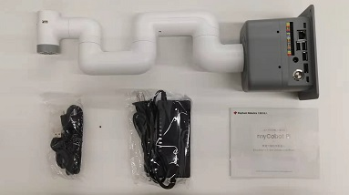
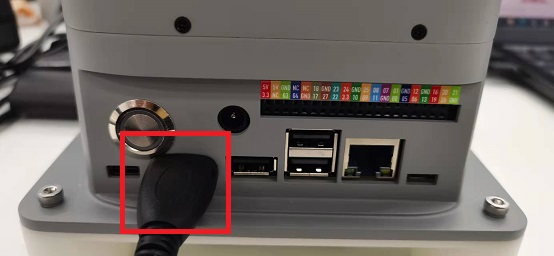

# Unboxing and the First-Time Use

## 1 Unboxing and Working Environment

> **Notice:** Before using, check the packaging first. If there is any damage, please contact with the logistics company and the supplier in your area in time. After unpacking, please check the total items according to the item list.

​																 

​																	Table 2-2 myCobot Robot Arm [Standard Set]

| List [Standard Set] | **-Robotic Arm (myCobot 280 Jetson Nano)** -Camera Module -Product Manual -Power Supply -USB-Type C -Jumper Wire  |
| ------------------- | ------------------------------------------------------------ |

Operate the robot only for applications that meet the conditions listed in the table below.

​																		Table 2-3 Working Environment and Conditions

| Working Environment              | Conditions                                                   |
| -------------------------------- | ------------------------------------------------------------ |
| Temperature                      | -5°C~45°C                                                    |
| Relative Humidity                | 20%~70%                                                      |
| Space Requirements               | indoor                                                       |
| Other Environmental Requirements | -Avoid direct sunlight exposure.  -Avoid getting dust, oil fume, salt, iron filings, water etc on robot.  -Avoid flammable and corrosive liquids and gases.  -Avoid shock and vibration, etc.  -Avoid strong electromagnetic interference sources. |

## 2 Installation Requirements

myCobot 280 for Jetson Nano robot weights 1030g. Considering that during use, the center of gravity will move with the movement of the robot, so the robot needs to be fixed on a solid base before it can be used normally. Base weight requirements: fixed base, or mobile base.

### Size of Base Interface 

* The base fixing holes act as the interface between robot and other bases or planes. The specific hole size is shown in the figure below. There are 4 countersunk holes with a diameter of 4.5 mm, which can be fixed with M4 bolts.

​																		

* Please make sure that there are corresponding threaded holes on the fixed base before installing.

#### *Before the installation, please confirm:*

- The environmental condition meets the requirements listed in Section 2.2.1.3.1 above.

- The installation position is no smaller than the working range of the robot, and there is enough space for installation, use, maintenance and repair.

- Put the base in a suitable position.

- Installation-related tools are prepared, such as screws, wrenches, etc.

- After confirming the above, please move the robot to the base installation table, adjust the robot position, and align the fixing holes of the robot base with the holes on the base mounting table. After aligning the holes, align the screws with the holes and tighten them.

> **Notice:** When adjusting the position of the robot on the base installation table, do not pushing or pulling the robot directly on the base installation table to avoid scratches. When manually moving the robot, do not applying external force to the fragile parts of the robot body, so as to avoid unnecessary damage to the robot.
>
> **For more installation details, scan the code to watch the video:**
>
> 

## 3 Power on the Robot

Before operation, confirm that you have read **Chapter 1 Safety Instructions** to ensure safe operation. At the same time, connect the power adapter with the robotic arm, and fix the base of the robotic arm on the table. The connection method is shown in Figure 3-1.

​																			

​																	Figure 3-1 Location of the power connector

myCobot must be powered on with an external power supply to provide sufficient power:

- Rated voltage: 8-12V

- Rated current: 3-5A

- Plug Type: DC 5.5mm x 2.1

You cannot just use the Type-C plugged into the M5Stack-basic for power supply. Please use the official power supply to avoid damage to the robotic arm.

## 4 Connecting PC via USB

Using the matchable HDMI cable to connect the robotic arm with the monitor:

- Plug the HDMI cable into the HDMI port of the monitor.

  

- Plug the other end into the HDMI port of the robotic arm.

  

  

## 5 End Tools

### 5.1 Sucking Pump

Details: [4 Sucking Pump](../../2-serialproduct/2.7-accessories/2.7.4-pump.md)

Please scan the code to watch the installation tutorial of the suction pump:

​																						

### 5.2 Adaptive Gripper

Details: [5 Adaptive gripper](../../2-serialproduct/2.7-accessories/2.7.5-ag.md)

Adaptive gripper installation video to be added...

## Unboxing vedio

