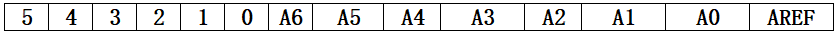

# Electrical Interface of myCobot 280 Arduino 2020

## 1 Introduction

### 1.1 Pedestal

* A. The front interface of the pedestal is shown in Figure 2.1.4.2-1 :

   
  
  Figure 2.1.4.2-1 Front view of the base
  - ① Functional Interface Group 1  
  - ② Functional Interface Group 2 
  - ③ Functional Interface Group 3 
  - ④ Functional Interface Group 4 

* B. The interface on the pedestal is shown in Figure 2.1.4.2-2 :

   

  Figure 2.1.4.2-2 The top view of the base
  - ① Functional Interface Group 5
​													
* C. The interface on the right side of the pedestal is shown in Figure 2.1.4.2-3 :

  

  Figure 2.1.4.2-3 Right side view of the base
  - ① DC Interface of power 

### 1.2 Introduction to Interfaces on Pedestal

> **Notice:** The functional interface groups are all 2.54mm DuPont interfaces, and 2.54mm DuPont cables can be used externally.

A. Figure 2.1.4.2-4, Figure 2.1.4.2-5, Figure 2.1.4.2-6, and Figure 2.1.4.2-7 are the signal names of the four expansion interface groups on the front of the base, which are used to connect different Arduino development boards.

Expansion interface group 1 and expansion interface group 4 can be used to expand development board with interface as same as Arduino UNO, such as Arduino UNO, Arduino MEGA 2560, etc;

Expansion interface group 2 and expansion interface group 3 can be used to extend the development board, whose pin is consistent with Arduino MKR WiFi 1010 interface.

   

  Figure 2.1.4.2-4 Signal names of extended interface group 1

   

  Figure 2.1.4.2-5 Signal names of extended interface group 2

   

  Figure 2.1.4.2-6 Signal names of extended interface group 3

   

  Figure 2.1.4.2-7 Signal names of extended interface group 4

B. Figure 2.1.4.2-8 shows the signal of the expansion interface group 5 on the pedestal. This part of the interface corresponds to each functional interface of the connected Arduino development board.

   

  Figure 2.1.4.2-8 Signal names of extended interface group 5

C. Power DC interface : It uses DC power socket, with an outer diameter of 6.5mm and an inner diameter of 2.0 mm. Users can use the 8.4V 5A DC power adapter provided by the manufacturer to mycobot 280 for power supply.

## 2 Electrical Interface of the End

### 2.1 Introduction to the End of Robotic Arm

A. The schematic diagram of the side interface of the end is shown in Figure 2.1.4.2-9 and Figure 2.1.4.2-10 :

   

  Figure 2.1.4.2-9 Side view of the end of the robotic arm
  - ① Servo Interface
  - ② Atom

  

  Figure 2.1.4.2-10 Side view of the end of the robotic arm
  - ① Functional InterFace Group 6
  - ② Grove 
  - ③ Type C

### 2.2 Introduction to Terminal Interface

* A. The definitions of each interface of functional interface group 6 are shown in Table 2.1.4.2-1:
  

Table 2.1.4.2-1

| Label | Signal | Type | Function | Remark |
| :---: | :----: | :--: | :------: | :----: |
| 5V | 5V | P | DC 5V |  |
| GND | GND | P | GND |  |
| 3V3 | 3V3 | P | DC 3.3V |  |
| G22 | G22 | I/O | GPIO22 |  |
| G19 | G19 | I/O | GPIO19 |  |
| G23 | G23 | I/O | GPIO23 |  |
| G33 | G33 | I/O | GPIO33 |  |

> **Notice:** 
> 1. I: input only.
> 
> 2. I/O: This function signal includes input and output combination.
> 
> 3. When the single tube corner is set as the output terminal, it will output 3.3V voltage.
> 
> 4. The source current of a single tube angle decreases with the increase of the number of pins, from about 40mA to 29mA.
> 
> 5. If a certain GPIO is set to the output mode and outputs a high level signal, the circuit connected to the LED is shown in Figure 2.1.4.2-11, and the LED will light up.
> 
> 
> 
> Figure 2.1.4.2-11
> 

* B. Type C interface: It can be used to communicate with PC and update firmware.

* C. Grove interface: The definition of Grove interface is shown in Figure 2.1.4.2-12

  	

​  Figure 2.1.4.2-12 Grove

* D. Servo Interface. It is used when expanding the gripper at the end, and currently supports the use of the matchable adaptive gripper.

* E. Atom. Displaying 5X5 RGB LED (G27) and key function (G39).

 