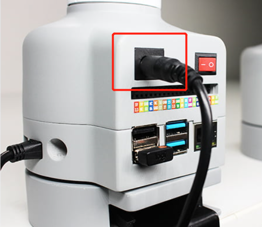

# Power on and preliminary detection

## 1 Power on the Robot

Before operation, confirm that you have read Chapter 1 Safety Instructions to ensure safe operation. At the same time, connect the power adapter with the robotic arm, and fix the base of the robotic arm on the table. The connection method is shown in the figure.

myCobot must be powered on with an external power supply to provide sufficient power:

- Rated voltage: 12V
- Rated current: 3-5A
- Plug Type: DC 5.5mm x 2.1

## 2 Link Peripherals

Using the matchable HDMI cable to connect the robotic arm with the monitor:

- Plug the HDMI cable into the HDMI port of the monitor.

  

- Plug the other end into the HDMI port of the robotic arm.

  

  

  

- myCobot 280 Raspberry Pi supports 4-way USB, you can directly plug in the mouse, keyboard and other peripherals to use.

  

## 3 boot

After connecting the required peripherals, press the red power button to start the machine

## Unboxing vedio

