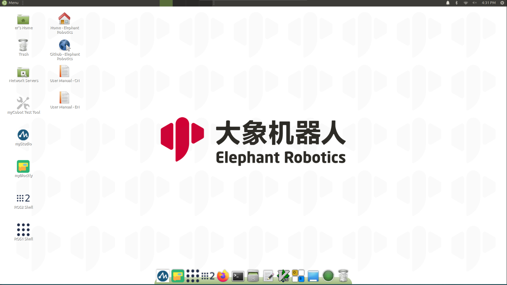
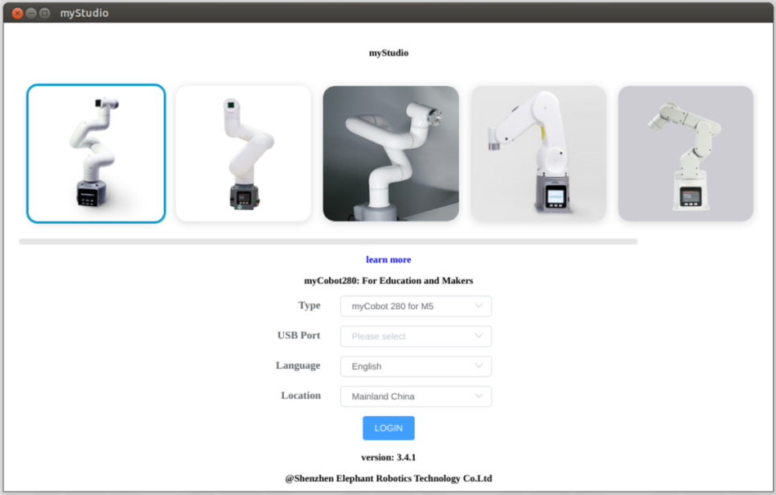
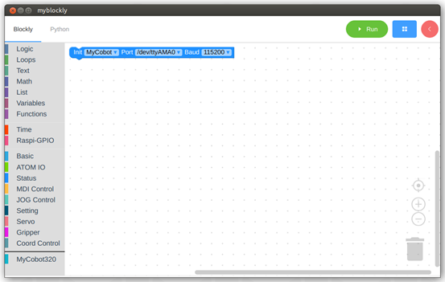
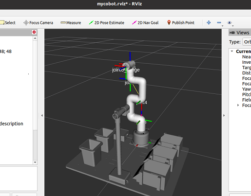

# Development Environment Construction

## 1 Ubuntu Mate 20.04 System Introduction

**What is Ubuntu**

Ubuntu is the most widely used linux operating system for personal desktop operating systems. It is a good choice for beginners to get familiar with the linux environment or some embedded hardware operating systems. And the ubuntu official website also released a dedicated operating system for the Raspberry Pi.

### 1.1 System basic function introduction

#### 1.1.1 The difference between the system and the official release version

**Compared with the official system, we have made the following changes：**

- Integrating python/Ros1/Ros2 and other environments, users can directly use the built-in software provided by our company without setting up additional environments
- Have already installed our operating software (myStudio, myBlockly), no need to install it yourself
- Configure VNC screen sharing, it will have its own hotspot after booting, and you can connect to the screen through the remote connection tool-VNC without connecting to the display screen

#### 1.1.2 System basic function introduction

***Because  the myCobot 280 for Raspberry Pi version has a built-in development environment, the software introduced below can be used directly.***

##### 1 Desktop

1 System Folders and Recycle bin

2 A test tool to test whether myCobot is functioning normally

3 myStudio: It can burn firmware to the robot arm

4 myBlockly: Visual modular programming software

5 Ros1/Ros2：It is a highly flexible software architecture for writing robot software programs.

6 Browser and link：Can jump to our official website and Gitbook (need to be connected to the Internet)

##### 2 Tool bar

1 Terminal：the command line interface

2 File manager ：Can view the stored resources of the system

3 Notepad：Also used to open some script files, view code

4 Vim：Text editor.For more detailed please check [introduction](https://zh.wikipedia.org/zh-hans/Vim)

5 Show Desktop：Click to display the desktop directly

6 Used to view CPU usage and memory usage

7 Recycle bin： It is used to store the documents temporarily deleted by the user, and the files stored in the recycle bin can be recovered

##### 3 Built-in Software

###### myStudio

- Burning and updating firmwares
- Providing tutorial data, such as user manuals and tutorial video
- Providing information about maintenance and repair

For a detailed introduction and how to use it, [click here to jump](https://docs.elephantrobotics.com/docs/gitbook-en/4-BasicApplication/4.1-myStudio/)

###### myBlockly

It is a piece of puzzle programming software based on python environments and pymycobot dependent libraries, which allows the user to do programming in a block building way to control mycobot. It is suitable for programming learners and can train their programming logic skills. myblockly also provides a python display interface, which can convert the myblockly program built by the user to a python language one to help the user learn python statements.

If you want to view the software usage methods and cases,  [click here to jump](https://docs.elephantrobotics.com/docs/gitbook-en/5-ProgramingApplication-myblockly-uiflow-mind/5.1-myBlockly/5.1.1The_First-Time_Use.html##running-program)

##### 4 link network

**wired connection**

After powered on the robot, it will connect to the wireless network hotspots configured by the system by default: **ElephantRobotics_AP_XXXX**

Click **“Disconnect”**，disconnect the default hotspot connection

Connect the network cable to the network port of the robot

Connect the network cable of the normal Internet to the network port of the robot

**wireless connection**

**There are two wireless connection modes. The first mode requires an external monitor to do some operations on the system. The specific steps are as follows:**

Click **“Disconnect”**，disconnect the default hotspot connection

Click **"Enable Wi-Fi"** , and the currently available WiFi will appear

Click on the WiFi you need to connect to, enter the password

After connect successfully，click **"Connection Information"** to check IP address of the robot

As shown in the example，**“192.168.10.64”** is the current IP address of the robot

Connect your PC and the robot to the same WiFi，open the VNC viewer，enter the IP address（examples :  input **192.168.10.64**），enter the password **Elephant**，The user name is not specified by default. The following is an example of a successful connection：

**The second method doesn't need to connect the monitor, directly connect the Ubuntu system hotspot with a PC for remote control, but this connection method does not have the function of Internet surfing, and can only remotely control the robot arm system. The specific steps are as follows:：**

Connect tp the hotspot **ElephantRobotics_AP_XXXX**，enter the password **Elephant**

Open VNC viewer，input IP address  **10.42.0.1** ，enter，and then enter the password **Elephant**，The user name is not specified by default. The following is an example of a successful connection：

### 1.2 Introduction to the development environment included in the system

#### 1 Ros1/Ros2

[Development based on ROS](../../12-ApplicationBaseROS/README.md). ROS is open-source and is a post operating system, or secondary operating system, used for robot control. With the use of ROS, the simulation control of the manipulator can be realized in the virtual environment. The robotic arm can be visualized through the rviz platform, and operate the robotic arm in a variety of ways. It can also be used to plan and execute the robotic arm's action path through to freely control the robotic arm. After [installing the ROS development environment ](../../12-ApplicationBaseROS/12.1-ROS1/12.1.2-环境搭建.md), refer to [use cases ](../../12-ApplicationBaseROS/12.1-ROS1/12.1.4-rivz介绍及使用/README.md)and [use of moveit](../../12-ApplicationBaseROS/12.1-ROS1/12.1.5-Moveit/README.md) for more information.

#### 2 Python

[Development based on Python](https://docs.elephantrobotics.com/docs/gitbook-en/7-ApplicationBasePython/). Our robots support Python and the development of the Python API library has become increasingly complete. The joint angle, coordinates, gripper and other aspects of the robot can be controlled via Python. Refer to [installing the python environment , ](https://docs.elephantrobotics.com/docs/gitbook-en/7-ApplicationBasePython/7.1_download.html)for more information.

#### 1.3 How to reset the system

When the system is damaged or the settings are wrong due to improper operation and cannot be changed, we can re-burn the system image and restore the initial settings（You will need an SD card reader）

[The specific operation steps can click here to jump](https://docs.elephantrobotics.com/docs/gitbook-en/19-mirroring/%E9%95%9C%E5%83%8F%E4%B8%8E%E7%83%A7%E5%BD%95/15.2-burning.html)

## 2 MyCobot Controller

### 2.1 What is MyCobot Controller
  MyCobot Controller is an app that controls the MyCobot series robotic arm by Bluetooth. You can use your mobile phone to move the mechanical arm.

### 2.2 How to install MyCobot Controller
  If you are an Android user, please go to the [Google Play Store](https://play.google.com/store/apps/details?id=com.elephantrobotics.mycobot_controller) to download.

  

   
  

  If you are an IOS user, please wait for the software to be released before searching and downloading.

### 2.3 Software introduction

  

  
  

  **1** Joint Control , click this to jump to the joint control page

  **2** Bluetooth switch , if you do not have a connected device, click the button to search for a Bluetooth device, otherwise it will display your currently connected device

  **3** Power on and off button, please connect your device before clicking, otherwise the device cannot be powered on or powered off. When the button is clicked, the background turns yellow, and the robotic arm will be powered on. After clicking again, the original color will be restored, and the robotic arm will be powered off.

  **4** Joint zero button , click the button and your robotic arm will return to zero, please use it after connecting Bluetooth and powering on

  **5** Software information

  **6** Coords Control,  click this to jump to the coords control page

  **7** Operation page, if you choose joint control, this page will display all joints, otherwise it will display all coordinates

  **8** Coordinate information

### 2.4 How to use MyCobot Controller
  Before you start using, please download the MyCobot Controller App to your mobile phone
    
  Then follow the steps below to connect your device
    
  If you are using `MyCobot M5` device，please burn `minirobot v2.2` for your device

  1. Power on your device
  2. Select Transponder -> Bluetooth in turn, and then click OK, you will enter a page with some information about the current device and the Mac address of Bluetooth

  If you are using ` MyCobot PI` device , please follow the steps below

  1. Clone the pymycobot source code from [github](https://github.com/elephantrobotics/pymycobot) to your desktop
  2. Enter `mycobot_pi_bluetooth` under the ` demo` folder, open the command line, and run `sudo systemctl restart bluetooth`
  3. Next run `python uart_peripheral_serial.py `
  4. Then your PI device can be found, if your device does not appear on the list, please perform the third step again

  5. Next start the MyCobot Controller app, click the Bluetooth switch , Please allow all permissions required by the software, otherwise your device may not be scanned.Then wait for the device scanning to complete, the list will update all scanned devices, then confirm the mac address of the device you want to connect and click connect.

  > **`Notice:`** When connecting a PI device, the mobile phone and the device need to be paired after clicking connect, otherwise the bluetooth will be disconnected.

  6. After connecting to Bluetooth, you need to click the power on button, and then you can control the movement of the robot arm.

## [3 Gamepad control](../../7-ApplicationBasePython/7.8_Handle_control.md)

The movement of the machine can be controlled by the gamepad, and the grasping of objects can be realized with the gripper or the suction pump.

## [4 Development based on Python](../../7-ApplicationBasePython/README.md)
Our robots support Python and the development of the Python API library has become increasingly complete. The joint angle, coordinates, gripper and other aspects of the robot can be controlled via Python. Refer to [installing the python environment , ](../../7-ApplicationBasePython/7.1_download.md)for more information.

## [5 Development based on myBlockly](../../5-ProgramingApplication-myblockly-uiflow-mind/README.md) 
myBlockly is a fully visual modular programming software that belongs to the graphical programming language.

## [6 Development based on ROS](../../12-ApplicationBaseROS/README.md)
ROS is open-source and is a post operating system, or secondary operating system, used for robot control. With the use of ROS, the simulation control of the manipulator can be realized in the virtual environment. The robotic arm can be visualized through the rviz platform, and operate the robotic arm in a variety of ways. It can also be used to plan and execute the robotic arm's action path through to freely control the robotic arm. After [installing the ROS development environment ](../../12-ApplicationBaseROS/12.1-ROS1/12.1.2-环境搭建.md), refer to [use cases ](../../12-ApplicationBaseROS/12.1-ROS1/12.1.4-rivz介绍及使用/README.md)and [use of moveit](../../12-ApplicationBaseROS/12.1-ROS1/12.1.5-Moveit/README.md) for more information.
The emergence of Ros solved the communication problem of each component of the robot. Later, more and more robot algorithms were integrated into ROS. **ROS2** inherited **ROS**, which is more powerful and better than **ROS**.
Compared with **ROS** that only supports Linux systems, **ROS2** also supports **windows**, **mac**, and even **RTOS** platforms.
After [installing the ROS2 development environment ](../../12-ApplicationBaseROS/12.2-ROS2/12.2.1-ROS2的安装.md), refer to [ROS2 Use Cases ](../../12-ApplicationBaseROS/12.2-ROS2/12.2.3-rivz介绍及使用/README.md) for more information.

