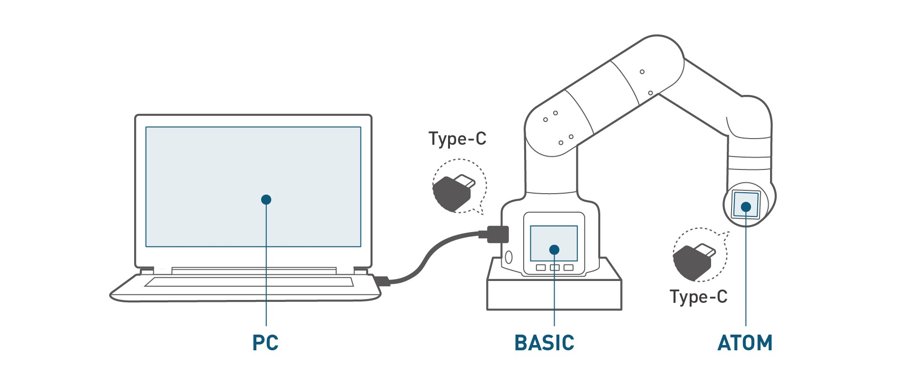

# Development Environment Construction

##  1 Instructions for setting up the secondary development environment

### 1.1 Support system

myCobot 280 M5 is developed and used based on PC. There is no built-in system in the robot arm, so the combination of robot arm and PC is required during use, so please prepare a PC before using.

#### 1 Windows

The Microsoft operating system (Microsoft System) is a Windows series windowing operating system developed by Microsoft in the United States. The server version is up to Windows Server 2022, and the personal version is up to Windows 11. Because the personal version is simple and easy to operate, it has always been the biggest seller for individual users.

#### 2 linux

The Linux kernel was originally written as a hobby by Finn Linus Torvalds while he was a student at the University of Helsinki.

Linux is a set of Unix-like operating systems that are free to use and spread freely. It is a POSIX and UNIX-based multi-user, multi-task, multi-thread and multi-CPU operating system.

Linux can run major UNIX utility software, application programs and network protocols. It supports 32-bit and 64-bit hardware. Linux inherits Unix's network-centric design philosophy and is a multi-user network operating system with stable performance.

If you want to use the linux environment on your PC, you can install a virtual machine and ubuntu system

Since Python2 has been removed from Ubuntu 20.04 LTS, python3 is installed by default. It is recommended to use the 20.04 system here

For detailed installation introduction of virtual machine and Ubuntu system, [click here to view](https://docs.elephantrobotics.com/docs/gitbook/12-ApplicationBaseROS/12.1-ROS1/12.1.2-%E7%8E%AF%E5%A2%83%E6%90%AD%E5%BB%BA.html)

#### 3 Mac

Macintosh (Mac for short) is a personal consumer computer developed by Apple Inc. since 1984, including computers such as iMac, Mac mini, Macbook Air, Macbook Pro, Macbook, and Mac Pro. Use an independent macOS system. The latest macOS series is developed based on the NeXT system and does not support compatibility. It is a complete and independent operating system.

It should be noted that before installing the driver and updating the device firmware, make sure the system "Preferences->Security and Privacy->General" and allow apps from the App Store and approved developers.

### 1.2 Supported software environment

- [Development based on myBlockly and UIFlow](../../5-ProgramingApplication-myblockly-uiflow-mind/README.md), which are both graphical programming software and visualization tools. Users can create programs dragging modules, the process of which is very similar to building blocks. After [installing myblockly ](../../5-ProgramingApplication-myblockly-uiflow-mind/5.1-myblockly/README.md)and [UIFlow ](../../5-ProgramingApplication-myblockly-uiflow-mind/5.2-UIFlow/5.2.1UIFlow_enviorment_building.md), refer to [myblockly use cases ](../../5-ProgramingApplication-myblockly-uiflow-mind/5.1-myblockly/README.md)and [UIFlow use cases](../../5-ProgramingApplication-myblockly-uiflow-mind/5.2-UIFlow/5.2.7UIFlow_Use_Cases.md).

  

- [Development based on Python](../../7-ApplicationBasePython/README.md). Our robots support Python and the development of the Python API library has become increasingly complete. The joint angle, coordinates, gripper and other aspects of the robot can be controlled via Python. Refer to [installing the python environment , ](../../7-ApplicationBasePython/7.1_download.md)for more information.

  

- [Development based on C++ ](../../8-ApplicationBaseCPlus/README.md). C++ is the inheritance of C Language. It can not only carry out the procedural programming of the C Language, but also the object-based programming characterized by abstract data types, as well as inheritance and polymorphism as the Features of object-oriented programming. With C++ language, you can freely develop programms(coordinate control, angle control, io control, gripper control, etc.) through the C++ dynamic library developed by our company, and control some of the robots. After [installing the C++ environment ](../../8-ApplicationBaseCPlus/8.1-download.md), refer to [the use cases ](../../8-ApplicationBaseCPlus/8.8-example.md) for more infromation.

  

- [Development based on C#](../../9-ApplicationBaseCSharp/README.md). C# is an object-oriented programming language derived from C and C++ released by Microsoft, an advanced programming language running on .NET Framework and .NET Core (completely open source and cross-platform) . Using the C#, you can freely develop programs (coordinate control, angle control, io control, gripper control, etc.) through the C# dynamic library provided by our company, and control some of the robots. After [installing the C# environment ](../../9-ApplicationBaseCSharp/9.1-environment.md), refer to  [the use cases ](../../9-ApplicationBaseCSharp/9.8-example.md) for more information.

  

- [ Development based on Arduino](../../10-ArduinoEnv/README.md). Arduino is an easy-to-use, open-source electronic prototyping platform that includes hardware (various Arduino-compliant development boards) and software (Arduino IDE and related development kits). The hardware part (or development board) consists of a microcontroller (MCU), flash memory (Flash), and a set of general-purpose input/output interfaces (GPIO), etc. It can be understood as a microcomputer motherboard. The software part is mainly composed of Arduino IDE on the PC side, related board support packages (BSP) and rich third-party function libraries. Users can use Arduino IDE to easily download the BSP related to the development board and the required function library to write program. It is an open source robot control library developed by our company, which can be used only after using the robot developed by our company. Using this library, you can control our robot through Bluetooth, WiFi, serial port, etc. It also supports functions such as external sensors, IIC communication, and LED lights. You can DIY different application scenarios according to your own needs, or you can refer to the MiniRobot sample code or control cases such as angles, coordinates, and grippers we provide. The MiniRobot sample code includes Bluetooth, WiFi, drag teaching, distance sensor and other control-related content. Refer to [simple use of Arduino](../../10-ArduinoEnv/10.2-arduino_use.md)  and [the API](../../10-ArduinoEnv/10.4-api.md) for more information.
  
  
  
- [ Development based on JavaScript](../../11-ApplicationBaseJavaScript/README.md). JavaScript is a scripting language that runs on the client application and does not require compilation. js interpreter is used to interpret and execute codes one by one in the process of running. , some of our robots can be controlled through our company's ecological library of JavaScript language. After [installing the JavaScript environment ](../../11-ApplicationBaseJavaScript/11.1开发前准备.md), refer to [use cases](../../11-ApplicationBaseJavaScript/11.7使用案例.md) for more infromation.

  

- [Development based on ROS](../../12-ApplicationBaseROS/README.md). ROS is open-source and is a post operating system, or secondary operating system, used for robot control. With the use of ROS, the simulation control of the manipulator can be realized in the virtual environment. The robotic arm can be visualized through the rviz platform, and operate the robotic arm in a variety of ways. It can also be used to plan and execute the robotic arm's action path through to freely control the robotic arm. After [installing the ROS development environment ](../../12-ApplicationBaseROS/12.1-ROS1/12.1.2-环境搭建.md), refer to [use cases ](../../12-ApplicationBaseROS/12.1-ROS1/12.1.4-rivz介绍及使用/README.md)and [use of moveit](../../12-ApplicationBaseROS/12.1-ROS1/12.1.5-Moveit/README.md) for more information.

  

- The basic firmware of myCobot 280 M5 and the update of Atom firmware need to be updated via myStudio.

  Go to the address below for more information about myStudio:

  - [4.1 myStudio](../../4-BasicApplication/4.1-myStudio/README.md)
    - [4.1.2 Serial Port Driver Installation](../../4-BasicApplication/4.1-myStudio/4.1.1-myStudio_download_driverinstalled.md)

  - [4.2 Burning and Updating Firmwares](../../4-BasicApplication/4.1-myStudio/4.1.2-myStudio_flash_firmwares.md)

   

### 1.3 Device function settings

- [Drag teaching](https://docs.elephantrobotics.com/docs/gitbook-en/4-BasicApplication/4.2-firmwares_intro/4.2.1-moving/4.2.1.1-micro_controller.html)
- [Calibration](https://docs.elephantrobotics.com/docs/gitbook-en/4-BasicApplication/4.2-firmwares_intro/4.2.2-calibration/4.2.2.1-micro_controller.html)
- [Communication](https://docs.elephantrobotics.com/docs/gitbook-en/4-BasicApplication/4.2-firmwares_intro/4.2.3-transponder/4.2.3.1-micro_controller.html)
- [Connection Detection](https://docs.elephantrobotics.com/docs/gitbook-en/4-BasicApplication/4.2-firmwares_intro/4.2.4-connection/4.2.4.1-micro_controller.html)

## [2 Development based on Python](../../7-ApplicationBasePython/README.md)
Our robots support Python and the development of the Python API library has become increasingly complete. The joint angle, coordinates, gripper and other aspects of the robot can be controlled via Python. Refer to [installing the python environment , ](../../7-ApplicationBasePython/7.1_download.md)for more information.

## [3 Development based on myBlockly](../../5-ProgramingApplication-myblockly-uiflow-mind/README.md) 
myBlockly is a fully visual modular programming software that belongs to the graphical programming language.[Click here to view myblockly description](../../5-ProgramingApplication-myblockly-uiflow-mind/README.md)

## [4 Development based on ROS](../../12-ApplicationBaseROS/README.md)
ROS is open-source and is a post operating system, or secondary operating system, used for robot control. With the use of ROS, the simulation control of the manipulator can be realized in the virtual environment. The robotic arm can be visualized through the rviz platform, and operate the robotic arm in a variety of ways. It can also be used to plan and execute the robotic arm's action path through to freely control the robotic arm. After [installing the ROS development environment ](../../12-ApplicationBaseROS/12.1-ROS1/12.1.2-环境搭建.md), refer to [use cases ](../../12-ApplicationBaseROS/12.1-ROS1/12.1.4-rivz介绍及使用/README.md)and [use of moveit](../../12-ApplicationBaseROS/12.1-ROS1/12.1.5-Moveit/README.md) for more information.
The emergence of Ros solved the communication problem of each component of the robot. Later, more and more robot algorithms were integrated into ROS. **ROS2** inherited **ROS**, which is more powerful and better than **ROS**.
Compared with **ROS** that only supports Linux systems, **ROS2** also supports **windows**, **mac**, and even **RTOS** platforms.
After [installing the ROS2 development environment ](../../12-ApplicationBaseROS/12.2-ROS2/12.2.1-ROS2的安装.md), refer to [ROS2 Use Cases ](../../12-ApplicationBaseROS/12.2-ROS2/12.2.3-rivz介绍及使用/README.md) for more information.

## [5 Development based on C++ ](../../8-ApplicationBaseCPlus/README.md)
C++ is the inheritance of C Language. It can not only carry out the procedural programming of the C Language, but also the object-based programming characterized by abstract data types, as well as inheritance and polymorphism as the Features of object-oriented programming. With C++ language, you can freely develop programms(coordinate control, angle control, io control, gripper control, etc.) through the C++ dynamic library developed by our company, and control some of the robots. After [installing the C++ environment ](../../8-ApplicationBaseCPlus/8.1-download.md), refer to [the use cases ](../../8-ApplicationBaseCPlus/8.8-example.md) and [the API ](../../8-ApplicationBaseCPlus/8.7-API.md) for more infromation.

  

## 6 MyCobot Controller

### 1 What is MyCobot Controller

MyCobot Controller is an app that controls the MyCobot series robotic arm by Bluetooth. You can use your mobile phone to move the mechanical arm.

### 2 How to install MyCobot Controller

If you are an Android user, please go to the [Google Play Store](https://play.google.com/store/apps/details?id=com.elephantrobotics.mycobot_controller) to download.

 

If you are an IOS user, please wait for the software to be released before searching and downloading.

### 3 Software introduction

**1** Joint Control , click this to jump to the joint control page

**2** Bluetooth switch , if you do not have a connected device, click the button to search for a Bluetooth device, otherwise it will display your currently connected device

**3** Power on and off button, please connect your device before clicking, otherwise the device cannot be powered on or powered off. When the button is clicked, the background turns yellow, and the robotic arm will be powered on. After clicking again, the original color will be restored, and the robotic arm will be powered off.

**4** Joint zero button , click the button and your robotic arm will return to zero, please use it after connecting Bluetooth and powering on

**5** Software information

**6** Coords Control,  click this to jump to the coords control page

**7** Operation page, if you choose joint control, this page will display all joints, otherwise it will display all coordinates

**8** Coordinate information

### 4 How to use MyCobot Controller

Before you start using, please download the MyCobot Controller App to your mobile phone

Then follow the steps below to connect your device

If you are using `MyCobot M5` device，please burn `minirobot v2.2` for your device

1. Power on your device
2. Select Transponder -> Bluetooth in turn, and then click OK, you will enter a page with some information about the current device and the Mac address of Bluetooth

If you are using ` MyCobot PI` device , please follow the steps below

1. Clone the pymycobot source code from [github](https://github.com/elephantrobotics/pymycobot) to your desktop
2. Enter `mycobot_pi_bluetooth` under the ` demo` folder, open the command line, and run `sudo systemctl restart bluetooth`
3. Next run `python uart_peripheral_serial.py `
4. Then your PI device can be found, if your device does not appear on the list, please perform the third step again

Next start the MyCobot Controller app, click the Bluetooth switch , Please allow all permissions required by the software, otherwise your device may not be scanned.Then wait for the device scanning to complete, the list will update all scanned devices, then confirm the mac address of the device you want to connect and click connect.

> **`Notice:`** When connecting a PI device, the mobile phone and the device need to be paired after clicking connect, otherwise the bluetooth will be disconnected.

After connecting to Bluetooth, you need to click the power on button, and then you can control the movement of the robot arm.

## [7 Gamepad control](../../7-ApplicationBasePython/7.8_Handle_control.md)
The movement of the machine can be controlled by the gamepad, and the grasping of objects can be realized with the gripper or the suction pump.

