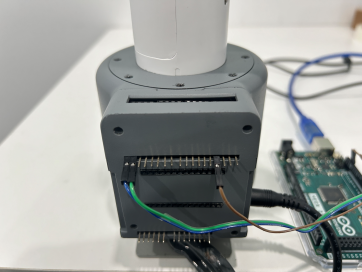
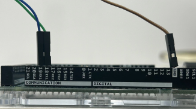
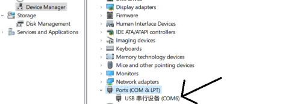
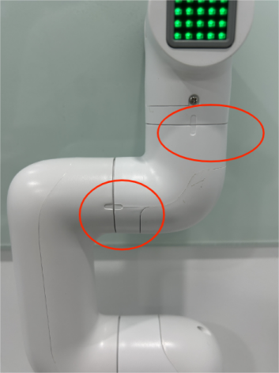
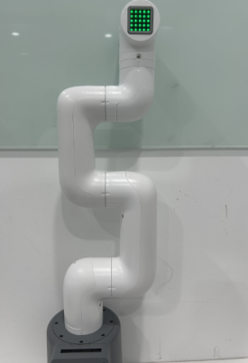

# Power on and preliminary detection

## 1 Power on the Robot

Before operation, confirm that you have read Chapter 1 Safety Instructions to ensure safe operation. At the same time, connect the power adapter with the robotic arm, and fix the base of the robotic arm on the table. The connection method is shown in the figure.


myCobot must be powered on with an external power supply to provide sufficient power:

- Rated voltage: 12V
- Rated current: 3-5A
- Plug Type: DC 5.5mm x 2.1

You cannot just use the TypeC plugged into the M5Stack-basic for power supply. Please use the official power supply to avoid damage to the robotic arm.

## 2 Connecting with PC via USB

- Connecting with PC via USB

  

  Figure 3-2 Schematic diagram of the USB interface

  1. Use Type-C cable to connect with PC and the corresponding USB interface of the robotic arm M5Stack-basic, and then check the connection. Connection detection is a function to check the connection status of the motors and Atoms, making it easy for customers to troubleshoot the robot.

  *Refer to MyCobot-280 for M5 Product Manual-3.4.3 Status Query Teaching for more information.*

  2. After successful connection, the communication forwarding detection can be performed. As commands is send to the M5Satck-basic of the base,immediate transponder is of great importance for the microcontroller manipulator.  The end effector will parse the commands and then take the target action with the aid of transponder.

  *Refer to MyCobot-280 for M5 Product Manual-3.4.4 Communication Forwarding Teaching for more information.*

  

## 3 Robot body working status detection

  For host working status detection, please refer to the [First-time Use](https://docs.elephantrobotics.com/docs/gitbook-en/4-BasicApplication/4.3-quick_start.html) chapter

## Unboxing vedio

[](https://youtu.be/SjfV7bbcq7o "q")

## 4 How to perform the zero calibration operation

**Note: Please strictly follow the steps below**

1、First to the robotic arm energised (if the green light is on indicates that the arm has been energised)


2、Connect the Arduino board (the connection position is shown below)






3、Connect the serial port to the computer (if the green light is on, it indicates a successful connection to the computer)


Once connected, you can check the connection port number by following these steps

Click on this computer --> click on right mouse button Manage --> click on Device Manager --> click on Ports




Calibration Zero Case

```python
from pymycobot.mycobot import MyCobot

from pymycobot import PI_PORT, PI_BAUD  # When using the Raspberry Pi version of mycobot, these two variables can be referenced for MyCobot initialisation,
# but if they are not, you can leave out this line of code
import time

# The above needs to be written at the beginning of the code, meaning that the import project package

# The MyCobot class takes two parameters for initialisation: the serial port and the baud rate.
#   The first is the serial port string, e.g:
#       linux： "/dev/ttyUSB0"
#       windows: "COM6"
#   The second is the baud rate:
#      The M5 version is： 115200
#   The following are examples：
#       mycobot-M5:
#           linux:
#              mc = MyCobot("/dev/ttyUSB0", 115200)
#           windows:
#              mc = MyCobot("COM6", 115200)
#       mycobot-raspi:
#           mc = MyCobot(PI_PORT, PI_BAUD)
#
# Initialise a MyCobot object
# Here is the code to create the object for the windows version
mc = MyCobot("COM6", 115200)

# Robotic arm powers down, relaxes joints
time.sleep(2)
mc.release_all_servos()
# After relaxing the joints, break the arm so that the arm zero scale is aligned
time.sleep(2)

# Joint-by-joint calibration of robotic arms
for i in range(1, 7):
    mc.set_servo_calibration(i)
    time.sleep(1)

# Power up the robot arm
mc.power_on()
time.sleep(2)

# Print current angle
print(mc.get_angles())
time.sleep(1)
```


Example of robot arm calibration zero position（The zero position of a joint is determined by aligning the zero position scale lines of neighbouring joints）




Example of robot arm joint zero position


