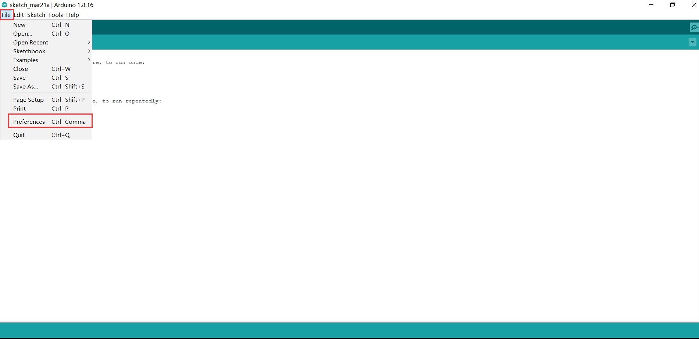
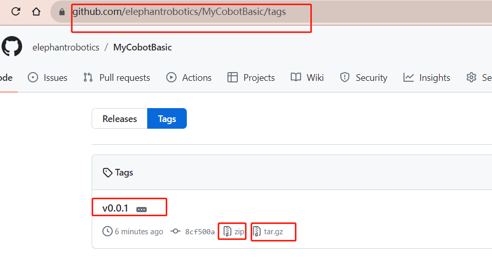

# Development Environment Construction

## 1 How to build the environment

### 1 **Arduino IDE** download

 
 **Arduino IDE Download Address** 

- [Arduino Official Website](https://www.arduino.cc/en/software) 

- [Windows X64](https://downloads.arduino.cc/arduino-1.8.16-windows.exe)

- [Mac OS X](https://downloads.arduino.cc/arduino-1.8.16-macosx.zip)

- [Linux ARM 64](https://downloads.arduino.cc/arduino-1.8.16-linuxaarch64.tar.xz)

### 2 Installed drivers

Before burning the program, M5Core host (including M5Stack-basic/GRAY/M5GO/FIRE/FACES) / **micro control types of equipment** users according to the operating system you are using, please download the corresponding driver package. After decompressing the package, select the installation package of the corresponding OPERATING system bit.

For Mac OS, ensure correct settings of the system **Preferred settings --> Security and privacy --> General** before installation, and allow the user to get it from App Store or an approved developer.

   Download the **M5Stack-basic** serial port driver **CP210X** or **CP34X**

  **CP210X**

  - [ **Windows10** ](https://download.elephantrobotics.com/software/drivers/CP210x_VCP_Windows.zip)

  - [ **MacOS** ](https://download.elephantrobotics.com/software/drivers/CP210x_VCP_MacOS.zip)

  - [ **Linux** ](https://download.elephantrobotics.com/software/drivers/CP210x_VCP_Linux.zip)

After extracting the zip package, select the corresponding installation package to install according to your computer **operating system** (win10 and win11 select x64 or x86 for installation).

 

  **CP34X**

  - [ **Windows10** ](https://download.elephantrobotics.com/software/drivers/CH9102_VCP_SER_Windows.exe)

  - [ **MacOS** ](https://download.elephantrobotics.com/software/drivers/CH9102_VCP_MacOS.zip)

### 3 Add board

* Open the Arduino IDE and select **File --> Preferences --> Settings** to add the url address below to the additional board manager:

  https://m5stack.oss-cn-shenzhen.aliyuncs.com/resource/arduino/package_m5stack_index.json

 

 

* After adding, select the **Tools --> Board --> Boards Manager**, in the new pop-up dialog, input and search  **M5Stack** , click Install (in case of search failure, you can try to restart  **Arduino**  program), as shown below:

 

* After adding, select **Tools --> Board**, check whether it is successful, as shown below:

 

### 4 Add related libraries

Install the MyCobotBasic library 
**Note:** Please download the latest library, the first version is v0.0.1.

  - [**MycobotBasic**](https://github.com/elephantrobotics/MyCobotBasic/tags)(After the Mycobot280-Arduino model is imported, you can refer to [10.3-arduinolib_use](10.3-arduinolib_use.md) for use). Please see the figure below for details, .zip is suitable for Windows systems, and .tar.gz is suitable for Linux systems: 

 

* Library Installation Instructions

  First check the location of the Arduino project folder by clicking **File --> Preferences** (you can copy the path to your hard drive to find the libraries folder) 

Library Installation Instructions

  First check the location of the Arduino project folder by clicking File --> Preferences (you can copy the path to your hard drive to find the libraries folder) 

 

 

 
1 Copy the path here and press enter to find the libraries folder

  Unzip it into the corresponding folder in the **libraries** directory. If you are using **Arduino**, don't overwrite it, just add to the existing **Library**.

 

  Congratulations, you have built a **Arduino** related development environment. 

**Note:** Arduino environment configuration and case compilation can be seen in our beep video  ( https://www.bilibili.com/video/BV1Vi4y1c7DQ/ ) .

## [2 Development based on Arduino](../../10-ArduinoEnv/README.md)
Arduino is an easy-to-use, open-source electronic prototyping platform that includes hardware (various Arduino-compliant development boards) and software (Arduino IDE and related development kits). The hardware part (or development board) consists of a microcontroller (MCU), flash memory (Flash), and a set of general-purpose input/output interfaces (GPIO), etc. It can be understood as a microcomputer motherboard. The software part is mainly composed of Arduino IDE on the PC side, related board support packages (BSP) and rich third-party function libraries. Users can use Arduino IDE to easily download the BSP related to the development board and the required function library to write program.It is an open source robot control library developed by our company, which can be used only after using the robot developed by our company. Using this library, you can control our robot through Bluetooth, WiFi, serial port, etc. It also supports functions such as external sensors, IIC communication, and LED lights. You can DIY different application scenarios according to your own needs, or you can refer to the MiniRobot sample code or control cases such as angles, coordinates, and grippers we provide. The MiniRobot sample code includes Bluetooth, WiFi, drag teaching, distance sensor and other control-related content. Refer to [simple use of Arduino](../../10-ArduinoEnv/10.2-arduino_use.md) and [the API](../../10-ArduinoEnv/10.4-api.md) for more information. 

## [3 Development based on Python](../../7-ApplicationBasePython/README.md)
Our robots support Python and the development of the Python API library has become increasingly complete. The joint angle, coordinates, gripper and other aspects of the robot can be controlled via Python. Refer to [installing the python environment , ](../../7-ApplicationBasePython/7.1_download.md)for more information.

## [4 Development based on myBlockly](../../5-ProgramingApplication-myblockly-uiflow-mind/README.md) 
myBlockly is a fully visual modular programming software that belongs to the graphical programming language.[Click here to view myblockly description](../../5-ProgramingApplication-myblockly-uiflow-mind/README.md)

## [5 Development based on ROS](../../12-ApplicationBaseROS/README.md)
ROS is open-source and is a post operating system, or secondary operating system, used for robot control. With the use of ROS, the simulation control of the manipulator can be realized in the virtual environment. The robotic arm can be visualized through the rviz platform, and operate the robotic arm in a variety of ways. It can also be used to plan and execute the robotic arm's action path through to freely control the robotic arm. After [installing the ROS development environment ](../../12-ApplicationBaseROS/12.1-ROS1/12.1.2-环境搭建.md), refer to [use cases ](../../12-ApplicationBaseROS/12.1-ROS1/12.1.4-rivz介绍及使用/README.md)and [use of moveit](../../12-ApplicationBaseROS/12.1-ROS1/12.1.5-Moveit/README.md) for more information.
The emergence of Ros solved the communication problem of each component of the robot. Later, more and more robot algorithms were integrated into ROS. **ROS2** inherited **ROS**, which is more powerful and better than **ROS**.
Compared with **ROS** that only supports Linux systems, **ROS2** also supports **windows**, **mac**, and even **RTOS** platforms.
After [installing the ROS2 development environment ](../../12-ApplicationBaseROS/12.2-ROS2/12.2.1-ROS2的安装.md), refer to [ROS2 Use Cases ](../../12-ApplicationBaseROS/12.2-ROS2/12.2.3-rivz介绍及使用/README.md) for more information.

