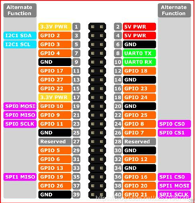
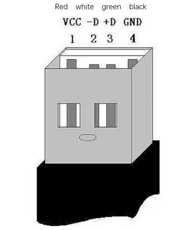
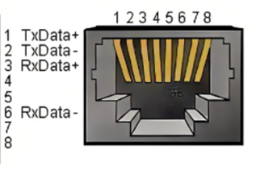
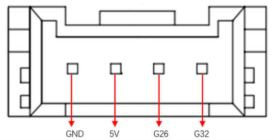

## Robotic Arm Electrical Interface

### 1 Base Electrical Interface

#### 1.1 Base Introduction

A. The front interface and switch of the base are shown in Figure 1:  

                                                                         
Figure 1 Base View

B. The left side of the base is shown in Figure 2:  
 
                                      
Figure 2 Left Side of the Base

Features:  

① Robotic Arm Charging Port: Uses a DC power socket with an outer diameter of 6.5mm and inner diameter of 2.0mm. An 8.4V 5A DC power adapter provided by the manufacturer can be used to power the robotic arm.

② Bottom Pin Port: See the table below.

③ USB2.0 and USB3.0 Interface: Uses serial bus standard 2.0 and 3.0 for data connection. Users can use the USB port to transfer program files or connect peripherals like mouse and keyboard.

④ Ethernet Port: Data connection port for networking. Users can use the Ethernet interface for communication between the PC and the robot system or for Ethernet communication with other devices.

⑤ Switch Button: Red represents the power switch, with "I" indicating "ON" and "O" indicating "OFF."

⑥ Raspberry Pi 4B built-in USB ports

⑦ Display Port: HDMI port. This is an HDMI Type-D port. When connecting to a monitor, HDMI Interface 2 has a priority, so it is recommended to use HDMI Interface 1.

⑧ Speaker and Headphone Jack

#### 1.2 Base Interface Details

Note: All functional interfaces are 2.54mm DuPont connectors. External connectors can be connected using 2.54mm DuPont cables.

A. The table below provides the definitions for each functional interface.

| 标签名 | 信号名 | 功能                          | 备注     |
| ------ | :------: | :------------: | -------- |
| 5V     | 5V     | Power，DC5V                |          |
| 5V     | 5V     | Power，DC5V                |          |
| GND    | GND    | GND                |          |
| NC     | NC     | --                            | None |
| NC     | NC     | --                            | None |
| 18     | GPIO18 | 3.3V-OUT-PNP/3.3V-INT |          |
| GND    | GND    | GND                |          |
| 23     | GPIO23 | 3.3V-OUT-PNP/3.3V-INT |          |
| 24     | GPIO24 | 3.3V-OUT-PNP/3.3V-INT |          |
| GND    | GND    | GND                |          |
| 25     | GPIO25 | 3.3V-OUT-PNP/3.3V-INT |          |
| 08     | GPIO08 | 3.3V-OUT-PNP/3.3V-INT |          |
| 07     | GPIO07 | 3.3V-OUT-PNP/3.3V-INT |          |
| 01     | GPIO01 | 3.3V-OUT-PNP/3.3V-INT |          |
| GND    | GND    | GND                |          |
| 12     | GPIO12 | 3.3V-OUT-PNP/3.3V-INT |          |
| GND    | GND    | GND                |          |
| 16     | GPIO16 | 3.3V-OUT-PNP/3.3V-INT |          |
| 20     | GPIO20 | 3.3V-OUT-PNP/3.3V-INT |          |
| 21     | GPIO21 | 3.3V-OUT-PNP/3.3V-INT |          |
| 3.3    | 3.3V   | DC3.3V                    |          |
| NC     | NC     | --                            | None |
| 03     | GPIO03 | 3.3V-OUT-PNP/3.3V-INT |          |
| 04     | GPIO04 | 3.3V-OUT-PNP/3.3V-INT |          |
| GND    | GND    | GND                |          |
| 17     | GPIO17 | 3.3V-OUT-PNP/3.3V-INT |          |
| 27     | GPIO27 | 3.3V-OUT-PNP/3.3V-INT |          |
| 22     | GPIO22 | 3.3V-OUT-PNP/3.3V-INT |          |
| 3.3    | 3.3V   | DC3.3V                    |          |
| 10     | GPIO10 | 3.3V-OUT-PNP/3.3V-INT |          |
| 09     | GPIO09 | 3.3V-OUT-PNP/3.3V-INT |          |
| 11     | GPIO11 | 3.3V-OUT-PNP/3.3V-INT |          |
| GND    | GND    | GND                |          |
| 00     | GPIO00 | 3.3V-OUT-PNP/3.3V-INT |          |
| 05     | GPIO05 | 3.3V-OUT-PNP/3.3V-INT |          |
| 06     | GPIO06 | 3.3V-OUT-PNP/3.3V-INT |          |
| 13     | GPIO13 | 3.3V-OUT-PNP/3.3V-INT |          |
| 19     | GPIO19 | 3.3V-OUT-PNP/3.3V-INT |          |
| 26     | GPIO26 | 3.3V-OUT-PNP/3.3V-INT |          |
| GND    | GND    | GND                |          |

Explanation: For additional functional interface details, refer to Figure 2-5. When other functions are in use, the IO functions are disabled:  

Figure 2-5

B. DC Power Interface: Rated voltage: DC 12V5A;Plug Type: DC 5.5mm x 2.1mm.

C. Switch: The red is the power switch, with "I" indicating "ON" and "O" indicating "OFF."

D. USB2.0 Interface: Uses serial bus standard 2.0 for data connection. Users can use the USB port to transfer program files or connect peripherals like a mouse and keyboard.

E. USB3.0 Interface (Blue): Uses serial bus standard 3.0 for data connection. Users can use the USB port to transfer program files or connect peripherals like a mouse and keyboard.

Figure 2-6 USB Interface Definition

F. Ethernet Interface: (As shown in Figure 2-7) Data connection port for networking. Users can use the Ethernet interface for communication between the PC and the robot system or for Ethernet communication with other devices.

Figure 2-7 Ethernet Interface Definition

G. HDMI Interface: This is an HDMI Type-D port (Refer to Figures 2-8). When connecting to a monitor, HDMI Interface 2 has a priority, so it is recommended to use HDMI Interface 1.

  

Figure 2-8

H. SD Card Slot: A removable SD card slot. The SD card stores the system internally, and its dimensions are 32mm×24mm×2.1mm.

### 2 Robotic Arm End Electrical Interface

#### 2.1 Robotic Arm End Introduction

A. The side interface of the robotic arm end is shown in Figure 2-1:  

Figure 2-1 Robotic Arm End

Features:  

⑨ End IO Interface

⑩ End Grove Interface

⑾ Type C Interface

⑿ End Atom

⒀ Servo Interface

#### 2.2 End Interface Details

A. The definitions for the end IO ports are provided in Table 2-1.

| Label Name | Signal Name | Function                                   | Remarks |
| ---------- | :-----------: | :------------------------: | ------- |
| 5V0        | 5V          | 5V Power Supply                            |         |
| GND        | GND         | Mainboard Power Signal Ground              |         |
| 3V3        | 3V3         | 3.3V Power Supply                          |         |
| G22        | G22         | 3.3V-OUT-PIN Output / 3.3V-INT Input       |         |
| G19        | G19         | 3.3V-OUT-PIN Output / 3.3V-INT Input       |         |
| G23        | G23         | 3.3V-OUT-PIN Output / 3.3V-INT Input       |         |
| G33        | G33         | 3.3V-OUT-PIN Output / 3.3V-INT Input       |         |

Table 2-1 End IO Ports

B. End Grove Interface: The Grove Interface 4 is defined in Figure 2-2.

Figure 2-2 End Grove Interface

C. Type C Interface: Can be used for communication with the PC and for firmware updates.

D. Atom: Used for 5X5 RGB LED (G27) display and key function (G39).

E. Servo Interface: Used when expanding the terminal gripper. Currently supports the use of the matching adaptive gripper.