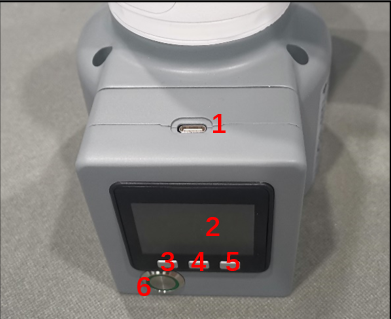
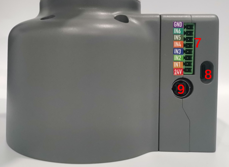
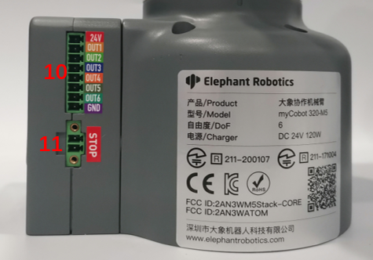
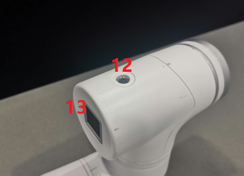
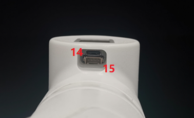

# Electrical Interface

## 1 Electrical Interface of the Base

### 1.1 Base

A. The lateral interface, screen and buttons of the base are shown on Figure 2-3:

Figure 2-3 Front view of the base

B. The interface on the left side of the base is shown on Figure 2-4:

 

Figure 2-4 Left side view of the base

C. The interface on the right side of the base is shown on Figure 2-5: 

Figure 2-5 Right side of the base

### 1.2 Ports of Base Interface

| **Number** | **Interface**            | Definition              | Function                         | **Remarks**             |
| ---------- | ------------------------ | ----------------------- | -------------------------------- | ----------------------- |
| 1          | Type C                   | Communication Interface | Communicate with PC              | development use         |
| 2          | screen                   | displaying              | Use with buttons                 |                         |
| 3          | button                   | button A                | Use with the display             |                         |
| 4          |                          | button B                |                                  |                         |
| 5          |                          | button C                |                                  |                         |
| 6          | switch                   | switch for power        | Control input power on and off   | With lights (lights on) |
| 7          | DC/IO interface          | GND                     | GND                              |                         |
|            |                          | IN6                     | Digital input signal 1~6         | Input only in NPN mode  |
|            |                          | IN5                     |                                  |                         |
|            |                          | IN4                     |                                  |                         |
|            |                          | IN3                     |                                  |                         |
|            |                          | IN2                     |                                  |                         |
|            |                          | IN1                     |                                  |                         |
|            |                          | 24V                     | DC24V                            |                         |
| 8          | Type C                   | Communication Interface | Communicate with PC              | development use         |
| 9          | Power DC input interface | DC24V input             | DC24V input                      |                         |
| 10         | DC/IO interface          | 24V                     | DC24V                            |                         |
|            |                          | OUT1                    | Digital output signal 1~6        | PNP mode only           |
|            |                          | OUT2                    |                                  |                         |
|            |                          | OUT3                    |                                  |                         |
|            |                          | OUT4                    |                                  |                         |
|            |                          | OUT5                    |                                  |                         |
|            |                          | OUT6                    |                                  |                         |
|            |                          | GND                     | GND                              |                         |
| 11         | Emergency stop interface | STOP                    | Emergency stop circuit interface |                         |

1. Type C interface is used to connect and communicate with the PC, available for developers.
2. Screen is used to display the communication status of myCobot and calibrate the robot move to starting point with a 2-inch IPS screen.
3. Button A, Button B and Button C is used to work with the screen in a coordinated way.
4. Power switch is used to control the main power input. If it is switched off, the controller is also powered off.
5. 24V output: Internal DC24V, available for users.
6. Digital Input/Digital Output includes 6 digital input signals and 6 digital output signals. They are mainly used to interact with and constitute an important part of the automation system with other devices. It should be noted that the output signal is in the form of PNP. The following picture is a schematic diagram of the external wiring:

* The input signal is in NPN form, the following picture is the schematic diagram of external wiring:

* Power DC input interface: 

  It uses KPPX-4P R7BFDC power socket. The 24V10A DC power adapter provided by the manufacturer can also be used to power myCobot320.

* Emergency stop circuit terminal is connected to the emergency stop button box, which can be used to control the emergency stop of the robot.

>  **Notice**: The emergency stop switch must be connected when the robot is in use, and make sure that the emergency stop switch circuit is always connected.

## 2 Electrical Interface at the end of the Robot Arm

### 2.1 End of the Robot Arm

A. The the end interfaces are shown in Figure 2-12 and Figure 2-13:

Figure 2-12 side view of the end of the robot arm

Figure 2-13 side view of the end of the robotic arm

### **2.2 Terminal Interface**

| **Number** | **Interface**      | **Definition**          | **Function**                   | **Remark**                 |
| ---------- | ------------------ | ----------------------- | ------------------------------ | -------------------------- |
| 12         | M8 aviation socket | End tool IO interface   | Interact with external devices |                            |
| 13         | Atom               | Led + button            | Status view/drag to teach      |                            |
| 14         | Type C             | Communication Interface | Communicate with PC            | Update Atom firmware using |
| 15         | Grove              |                         |                                | developers use             |

9. IO interface. The tool I/O diagram is shown on the figure below. myCobot 320 robot has one-way input and two-way output.

​															 			

The definition of each tool I/O port is shown in the table below. Note that both the input and output of the I/O are in a form of PNP. and the wire connection method is as same as the bottom output interface.

| Number | Signal | Explanation             | Matchable Color of M8 Line |
| ------ | ------ | ----------------------- | -------------------------- |
| 1      | GND    | DC24V negative pole     | White                      |
| 2      | OUT1   | Tool output interface 1 | brown                      |
| 3      | OUT2   | Tool output interface 2 | green                      |
| 4      | 485A   | reserved, undeveloped   | yellow                     |
| 5      | 24V    | DC24V positive          | Ash                        |
| 6      | IN1    | Tool input interface 1  | pink                       |
| 7      | IN2    | unavailable             | blue                       |
| 8      | 485B   | reserved, undeveloped   | purple                     |

10. Atom is used for 5X5 RGB LED to display the state of the robot arm and key function (used when the robot performs the drag teaching)

 