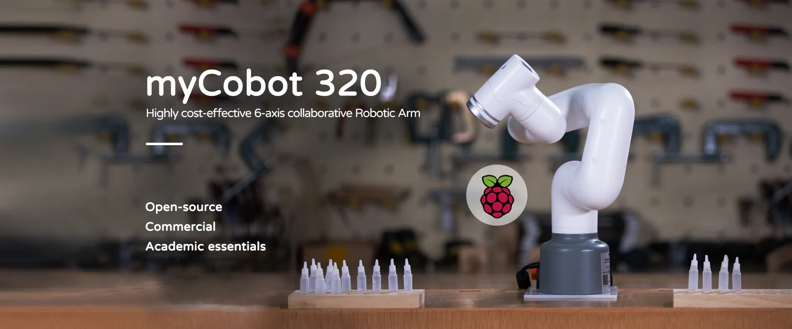

myCobot 320 for Pi 2022
==============

### 1 Profile

**myCobot 320 Pi** belongs to myCobot 320 series and adopts a Raspberry Pi microprocessor. Its body weights 3kg with a load of 1kg and a working radius of 320 mm. The small-sized product is endowed with powerful functions. It is characterized by easy operation, ability to work with human safely and features three advantages of usability, safety and economy, making it a cost-effective product.

### 2 Product Parameters

#### 2.1 Robot Parameters

| Indicator                      | Parameter                  |
| ------------ | ----------------- |
| Name                           | Baby elephant collaborative robot arm |
| Model                          | myCobot 320 for Pi                       |
| Freedom                        | 6                           |
| Payload                        | 1kg                           |
| Working radius                 | 350mm                         |
| Repeated positioning precision | ±0.5mm                           |
| Weight                         | 3kg                            |
| Power input                    | 24V，9.2A                      |
| Operating temperature          | 0-45℃                        |
| Communication                  | Type-C                       |

### 2.2 Electronic Parameters

| Indicator                              | Parameter |
| ---------------- | -------------------- |
| SOC                                    | Broadcom BCM2711          |
| CPU                                    | 64-bit 1.5GHz quad-core |
| Bluetooth/wireless                     | Available          |
| USB                                    | USB3.0 x2; USB2.0 x2          |
| Screen                        | None          |
| HDMI interface                         | microHDMI x2          |
| Customized Key                       | None          |
| IO Interface                          | 8 pcs     |
| Emergency stop switch                  | Available |
| Teaching pendant or keyboard and mouse | Optional  |

### 2.3 Software Platform

| Indicator                    | Parameter                   |
| ---------------- | -------------------- |
| Applicable Status          | Work Independently         |
| Programming Platform        | Debian/Ubuntu               |
| ROS/Python                   | Embedded                    |
| Blocky graphical programming | Embedded                    |
| Equipped with a camera       | Any camera can be selected. |
| ModelBus RTU                 | Ethernet                    |

### 2.4 Work Scope

## 3  Features

* **Embedded Raspberry Pi Ecology Providing Unlimited Possibilities**

  -   Raspberry Pi 4B, 1.5GHz quad-core microprocessor, running with Debian/Ubuntu platform.

  -   Supports 4-way USB, 2-way HDMI, standardized GPIO interface, and a pluggable TF card.

-   **Unique Industrial Design**
    -   With all-in-one design, the product has a compact structure, and the net weight is only 3kg.
    -   With a modular design, the product is characterized by less spare parts, low maintenance cost, quick disassembly and replacement.

-   **Easy Operation and Open-Source**
    -   The users can operate the product in a short time through drag teaching.
    -   It supports ROS/moveIt and other development systems.

-   **High-Level Configuration and Powerful Performance**
    -   Since a brushless DC servo is applied, a repeated positioning precision of ±0.5mm can be reached.
    -   Being equipped with installation interfaces, the base and end are suitable for the development of various periphery devices.

-   **Economical and Cost-Effective**
    -   Worth over 10,000 RMB, it reduces costs and synergizes efforts for high-efficiency scientific research.

-   **Integrated Design and Safe Collaborative Work**
    -   With delicate structure, it optimizes space and integrates with application in a coordinated way.
    -   It also has kinematics self-interference detection, which can effectively avoid motion collisions.

### 4  Application

Like myCobot 320 M5, myCobot 320 Pi is not only a productivity tool but also an expanding tool for imagination boundary. It can work with multiple types of end effectors to adapt to a variety of application, such as scientific research, education and function showing, etc. The user experience is excellent.
