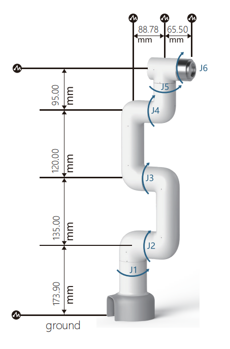
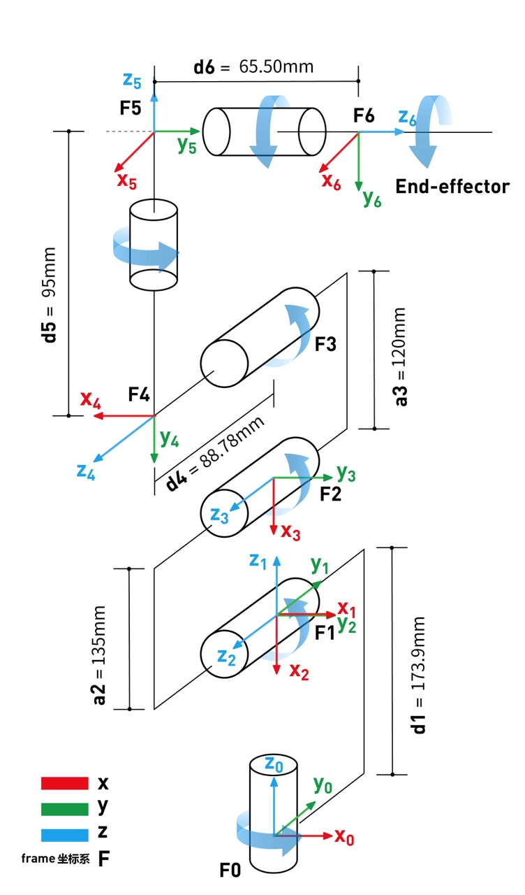

# **myCobot 320 for Pi**

 

## 1 Structural Parameters

### 1.1 Robot Parameters

| Index                          | Parameter                          |
| ------------------------------ | ---------------------------------- |
| Name                           | Elephant Collaborative Robotic Arm |
| Model                          | Pi                                 |
| Degrees of Freedom             | 6                                  |
| Efficient Load                 | 1kg                                |
| Working Radius                 | 350mm                              |
| Repeated Positioning Precision | ±0.5mm                             |
| Weight                         | 3kg                                |
| Power Input                    | 24V, 9.2A                          |
| Operating Temperature          | 0-45℃                              |
| Communication Interface        | Type-C                             |

### 1.2 Workspace

### 1.3 Specifications and Dimensions

​														 

### 1.4 Motion Angles of Joints

| Joint | Angle       |
| ----- | ----------- |
| J1    | -165 ~ +165 |
| J2    | -165 ~ +165 |
| J3    | -165 ~ +165 |
| J4    | -165 ~ +165 |
| J5    | -165 ~ +165 |
| J6    | -175 ~ +175 |

### 1.5 Installation of Hole

- The base is mounted with flange and is compatible with both installation of LEGO and M6 screw.

- The end of the arm is compatible with both LEGO component holes and screw threaded holes.

## 2 Hardware Parameters

| Index                               | Parameter               |
| ----------------------------------- | ----------------------- |
| SOC                                 | Broadcom BCM2711        |
| CPU                                 | 64-bit 1.5GHz quad-core |
| Bluetooth/Wireless                  | avialable               |
| USB                                 | USB3.0 x2; USB2.0 x2    |
| Screen                              | None                    |
| NN                                  | microHDMI x 2           |
| Custom Button                       | none                    |
| IO                                  | 8                       |
| Emergency Stop Switch               | 1                       |
| Teach Pendant or Keyboard and Mouse | optional                |

## 3 DH Parameters

