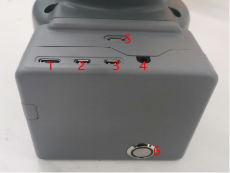
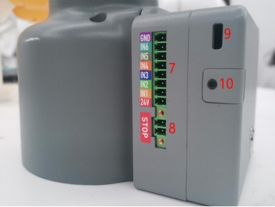
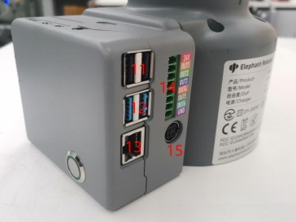
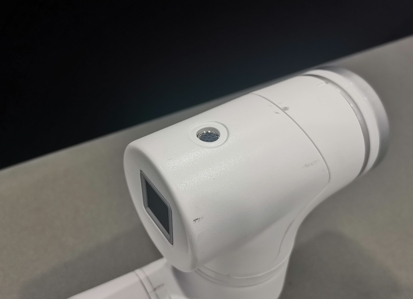
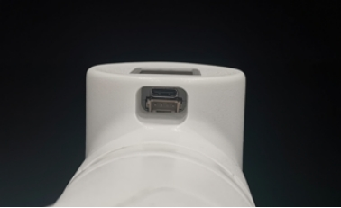

# Electrical Interface

## 1 Electrical Interface of the Base

### 1.1 Base

A. The interface, screen and buttons at the top of the base are shown in Figure 2-3:

 

Figure 2-3 Front view of the base

B. The interface on the left side of the base is shown in Figure 2-4:

 

Figure 2-4 Left side view of the base

C. The interface on the right side of the base is shown in Figure 2-5:

 

Figure 2-5 Right side of the base

### 1.2 Base Interface

| Number | Interface                   | Definition                   | Function                                             | Remark                  |
| ------ | --------------------------- | ---------------------------- | ---------------------------------------------------- | ----------------------- |
| 1      | Type C                      | Communication Interface      | communicate with PC                                  | development use         |
| 2      | MircoHDMI                   | HDMI1                        | use to connect a screen                              |                         |
| 3      | HDMI2                       |                              |                                                      |                         |
| 4      | speaker, headphone jack     | speaker, headphone jack      |                                                      |                         |
| 5      | Type C                      | Communication Interface      | communicate with PC                                  | development use         |
| 6      | Switch                      | Switch                       | control input power on and off                       | With lights (lights on) |
| 7      | DC / IO interface           | GND                          | GND                                                  |                         |
| I N6   | digital input signal1 to 6  | Input only N PN mode         |                                                      |                         |
| IN5    |                             |                              |                                                      |                         |
| IN4    |                             |                              |                                                      |                         |
| IN3    |                             |                              |                                                      |                         |
| IN2    |                             |                              |                                                      |                         |
| IN1    |                             |                              |                                                      |                         |
| 2 4V   | D C24V                      |                              |                                                      |                         |
| 8      | Emergency stop interface    | S TOP                        | emergency stop circuit interface                     |                         |
| 9      | indicator light             | Main Control Power indicator | feedback master power-on status                      |                         |
| 10     | SD card slot                | SD card slot                 | use to replace SD card                               |                         |
| 11     | USB2.0                      | USB2.0*2                     | Can be connected to external devices or U disk shion |                         |
| 12     | USB3.0                      | USB3.0*2                     | External device or U disk                            |                         |
| 13     | network port                | Ethereum                     | Ethernet port communication                          |                         |
| 1 4    | DC / IO interface           | 2 4V                         | D C24V                                               |                         |
| OUT1   | digital output signal1 to 6 | P NP mode only               |                                                      |                         |
| OUT2   |                             |                              |                                                      |                         |
| OUT3   |                             |                              |                                                      |                         |
| OUT4   |                             |                              |                                                      |                         |
| OUT5   |                             |                              |                                                      |                         |
| OUT6   |                             |                              |                                                      |                         |
| GND    | GND                         |                              |                                                      |                         |
| 15     | Power DC Input interface    | DC24V                        | power input                                          |                         |

1. Type C interface is used to connect and communicate with the PC, available for developers.
2. MircoHDMI interface is an HDMI D-type interface, which is connected to the monitor. HDMI interface 1 is recommended as HDMI interface 2 is prioritized.
3. Power switch is used to control the main power input. If it is switched off, the controller is also powered off.
4. Digital Input/Digital Output includes 6 digital input signals and 6 digital output signals. They are mainly used to interact with and constitute an important part of the automation system with other devices. It should be noted that the output signal is in the form of PNP. The following picture is a schematic diagram of the external wiring:

     

 

 

5. 24V output: Internal DC24V, available for users.
6. Emergency stop circuit terminal is connected to the emergency stop button box, which can be used to control the emergency stop of the robot.

> **Notice**: The emergency stop switch must be connected when the robot is in use, and make sure that the emergency stop switch circuit is always connected.

7. Power DC input interface:

   It uses KPPX-4P R7BFDC power socket. The 24V10A DC power adapter provided by the manufacturer can also be used to power myCobot320.

8. USB interface is an interface for data connection with serial standards 2.0 and 3.0. Users can use the USB interface to copy program files, or use the USB interface to connect peripherals such as mouse and keyboard.

9. Network port is the port for network data connection.  Users can use the Ethernet interface for communication and interaction between the PC and the robot system, and for Ethernet communication with other devices.

## 2 Electrical Interface at the End of the Robot Arm

### 2.1 End of the Robot Arm

A. The schematic diagram of the end interface of the robot arm is shown in Figure 2-12 and Figure 2-13:

 

Figure 2-12 Side view of the end of the robotic arm

 

Figure 2-13 Side view of the end of the robotic arm

 

### 2.2 Terminal Interface

| Number | Interface name     | Definition              | Function                       | Remark                     |
| ------ | ------------------ | ----------------------- | ------------------------------ | -------------------------- |
| 16     | M8 aviation socket | End tool IO interface   | Interact with external devices |                            |
| 17     | Atom               | Led + button            | Status view/drag to teach      |                            |
| 18     | Type C             | Communication Interface | Communicate with PC            | Update Atom firmware using |
| 19     | Grove              |                         |                                | developers use             |

10. IO interface. As shown is the tool I/O diagram, myCobot 320 has one-way input and two-way output.

 

The definition of each tool I/O port is shown in the table below. Note that both the input and output of the I/O are in a form of PNP. and the wire connection method is as same as the bottom output interface.

| Number | Signal | Explanation             | Matchable Color of M8 Line |
| ------ | ------ | ----------------------- | -------------------------- |
| 1      | GND    | DC24V negative pole     | White                      |
| 2      | OUT1   | Tool output interface 1 | brown                      |
| 3      | OUT2   | Tool output interface 2 | green                      |
| 4      | 485A   | reserved, undeveloped   | yellow                     |
| 5      | 24V    | DC24V positive          | Ash                        |
| 6      | IN1    | Tool input interface 1  | pink                       |
| 7      | IN2    | unavailable             | blue                       |
| 8      | 485B   | reserved, undeveloped   | purple                     |

11. Atom is used for 5X5 RGB LED to display the state of the robot arm and key function (used when the robot performs the drag teaching)

 