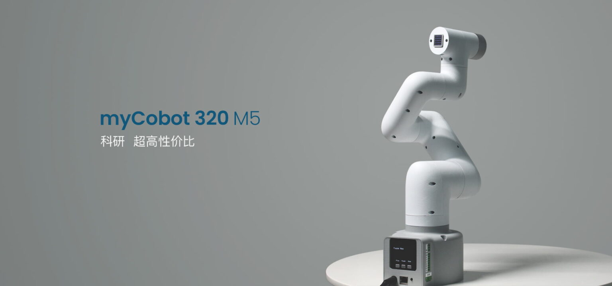
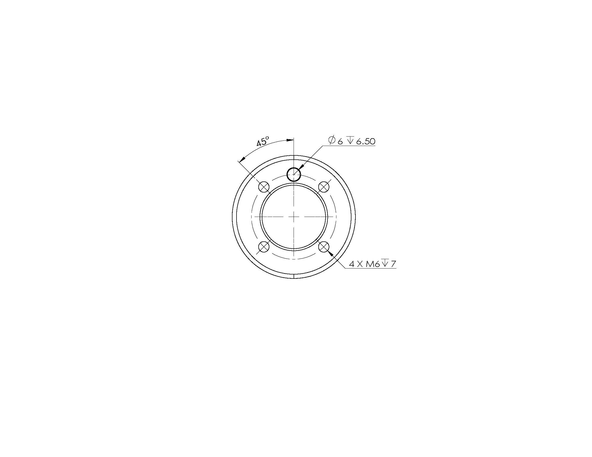

# myCobot 320 for M5

 

## **1 Structural Parameters**

### 1.1 Robot Parameters

| Indicator                      | Parameter                       |
| ------------------------------ | ------------------------------- |
| Name                           | myCobot 320 for M5              |
| Model                          | M5                              |
| Effective working radius       | 320 mm                          |
| Efficient Load                 | 1kg                             |
| Effective Arms Span            | 320mm                           |
| Repeated Positioning Precision | ±0.5mm                          |
| Net Weight                     | 3kg                             |
| Power Input                    | 24V,5A                          |
| Operational Environment        | -5°~45°                         |
| Communications                 | Network Interface USB Type-C |

### 1.2 Workspace

### 1.3 Joints Motion Angle

| Joint | Angle       |
| ----- | ----------- |
| J1    | -165~ +165  |
| J2    | -165~ +165  |
| J3    | -165~ +165  |
| J4    | -165~ +165  |
| J5    | -165~ +165  |
| J6    | -175 ~ +175 |

### 1.4 Hole Installation

- The base is mounted with flange and is compatible with both installation of LEGO and M6 screw.

- The end of the arm is mounted with flange and are compatible with threaded holes.

### 2 Electronic Parameters

| Index              | Parameter |
| ------------------ | --------- |
| Master             | ESP32     |
| Auxiliary Control  | ESP32*2   |
| Bluetooth/Wireless | Available |
| TYPE-C             | x 1       |
| Screen             | x1        |
| custom button      | Available |
| IO Interface       | 4         |
| emergency stop     | Available |
| LED                | 2-inch    |
