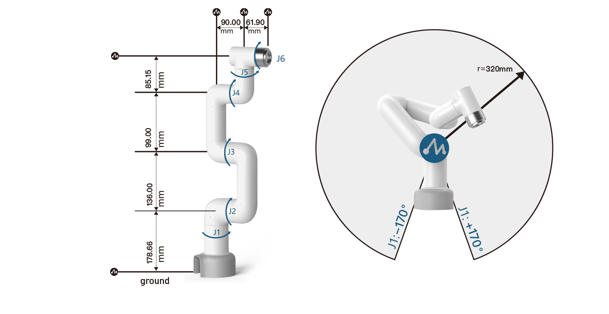
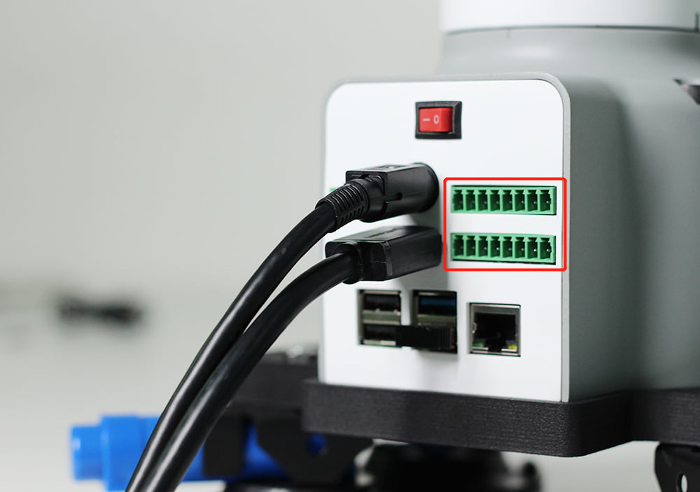

myCobot 320-Pi
==============

## 1 Profile

**myCobot 320-Pi** belongs to myCobot 320 series of products. It adopts a Raspberry Pi microprocessor and is embedded with roboFlow visual programming software. It acts as a machine \"helper\" developed by Elephant Robotics. The body weights 3kg with a load of 1kg and a working radius of 320 mm. The product is small-sized but powerful in function. It is characterized by easy operation and the ability to work with human safely. It features three advantages of usability, safety and economy, making it a cost-effective product.

## 2 Product Parameters

#### 1) Robot Arm Parameters

| Indicator                      | Parameter                  |
| ------------ | ----------------- |
| Name                           | Baby elephant collaborative robot arm |
| Model                          | myCobot 320-Pi                           |
| Degree of Freedom              | 6                           |
| Efficient Load           | 1 kg                          |
| Working Radius                | 320 mm                        |
| Repeated Positioning Precision | ±0.5 mm                          |
| Weight                         | 3kg                            |
| Power Input                   | 24V, 5A                      |
| Operating Temperature         | 0-50℃                         |
| Communication                  | Type-C                       |

#### 2) Electronic parameters

| Indicator                              | Parameter |
| ---------------- | -------------------- |
| SOC                                    | Broadcom BCM2711          |
| CPU                                    | 64-bit 1.5GHz quad-core |
| Bluetooth/wireless                     | Available          |
| USB                                    | USB3.0 x2; USB2.0 x2          |
| Screen                         | None          |
| HDMI Interface                        | microHDMI x2          |
| Customized Key                        | None          |
| IO Interface                          | 8 pcs     |
| Emergency Stop Switch                | Available |
| Teaching Pendant or Keyboard and Mouse | Optional  |

#### 3) Software platform

| Indicator                    | Parameter                   |
| ---------------- | -------------------- |
| Applicable Status          | Work independently          |
| Programming Platform        | Debian/Ubuntu               |
| ROS/Python                   | Embedded                    |
| Blocky Graphical Programming | Embedded                    |
| Equipped with a Camera      | Any camera can be selected. |
| ModelBus RTU                 | Ethernet                    |

#### 4)  Work Scope

### 3 Pin 

* **OUT**	24V	17	27	22	05	06	19	GND

* **IN**	24V	26	21	20	16	24	23	GND

### 4  Product Performance

-   **Embedded Raspberry Pi ecology and unlimited possibilities**
    -   Raspberry Pi 4B, 1.5GHz quad-core microprocessor, running with Debian/Ubuntu platform.
    -   Supporting 4-way USB, 2-way HDMI, standardized GPIO interface, and a pluggable TF card.
    
-   **Unique industrial design**
    -   With all-in-one design, the product has a compact body structure, and the net weight is only 3kg.
    -   With a modular design, the product is characterized by less spare parts, low maintenance cost, quick disassembly and replacement.
    
-   **Easy to operate and open-source**
    -   The users can operate the product in a short time through drag teaching.
    -   It supports ROS/moveIt and other development systems and roboflow, an operating software independently developed by Elephant Robotics.
    
-   **High configuration and powerful performance**
    -   Because a brushless DC servo is used, a repeated positioning precision of ±0.5mm can be obtained.
    -   Being equipped with installation interfaces, the base and end are suitable for the development of various periphery devices.
    
-   **Economical and super cost-effective**

    -   It adopts a standard 8-hour working system and can take the place of human to do highly repetitive and standard jobs.
    -   As a robot arm with a price at ten thousand yuan level, it can effectively reduce costs and increase efficiency for the universities and enterprises needing high performance and low cost.
    
-   **Integrated design and safe collaborative work**
    -   The structure elaborately designed makes the product possible to make full use of space and to perfectly integrate the product into the actual environment.
    -   It also has kinematics self-interference detection, which can effectively avoid motion collisions.

### 5 Application Scenarios

Like myCobot 320-M5, myCobot 320-Pi is not only a productivity tool but also an expanding tool for imagination boundary. It can be provided with multiple types of end effectors to adapt to many application scenarios, such as scientific research, education, display, etc. The user experience is excellent.

### 6 Development Support
- [3 Quick learning of robot arm knowledge](../../3-RobotKnowledge/README.md)
  * [3.1 Serial robot](../../3-RobotKnowledge//3.1-series_robot.md)
  * [3.2 Electronic background knowledge](../../3-RobotKnowledge/3.2-electric_knowledge.md)
  * [3.3 Mechanics background knowledge](../../3-RobotKnowledge/3.3-mechanics_knowledge.md)
  * [3.4 Knowledge of motor and servo](../../3-RobotKnowledge/3.4-motors_and_servos.md)
- [4 Basic function application](../../4-BasicApplication/README.md)
  - [4.1 myStudio](../../4-BasicApplication/4.1-myStudio/README.md)
    * [4.1.1 Installing driver](../../4-BasicApplication/4.1-myStudio/4.1.1-myStudio_download_driverinstalled.md)
    * [4.1.2 Updating equipment firmware](../../4-BasicApplication/4.1-myStudio/4.1.2-myStudio_flash_firmwares.md)
  - [4.2 Factory firmware introduction](../../4-BasicApplication/4.2-firmwares_intro/README.md)
    - [4.2.1 Drag teaching](../../4-BasicApplication/4.2-firmwares_intro/4.2.1-moving/README.md)
      * [4.2.1.2 Microprocessor class](../../4-BasicApplication/4.2-firmwares_intro/4.2.1-moving/4.2.1.2-micro_CPU.md)
    - [4.2.2 Zero point calibration](../../4-BasicApplication/4.2-firmwares_intro/4.2.2-calibration/README.md)
      * [4.2.2.2 Microprocessor class](../../4-BasicApplication/4.2-firmwares_intro/4.2.2-calibration/4.2.2.2-micro_CPU.md)
    - [4.2.3 Communication forwarding](../../4-BasicApplication/4.2-firmwares_intro/4.2.3-transponder/README.md)
      * [4.2.3.2 Microprocessor class](../../4-BasicApplication/4.2-firmwares_intro/4.2.3-transponder/4.2.3.2-micro_CPU.md)
    - [4.2.4 Connection Detection](../../4-BasicApplication/4.2-firmwares_intro/4.2.4-connection/README.md)
      * [4.2.4.2 Microprocessor class](../../4-BasicApplication/4.2-firmwares_intro/4.2.4-connection/4.2.4.2-micro_CPU.md)
  * [4.3 Use for the first time](../../4-BasicApplication/4.3-quick_start.md)
- [5 Blockly Development Guide](../../5-ProgramingApplication-myblockly-uiflow-mind/README.md)
  - [5.1 myblockly](../../5-ProgramingApplication-myblockly-uiflow-mind/5.1-myblockly/README.md)
    * [5.1.1 Controlling the RGB light board](../../5-ProgramingApplication-myblockly-uiflow-mind/5.1-myblockly/5.1.1Controlling the RGB light panel.md)
    * [5.1.2 Controlling the robot arm to make it return to the origin](../../5-ProgramingApplication-myblockly-uiflow-mind/5.1-myblockly/5.1.2Controlling the robot arm to make it return to the origin.md)
    * [5.1.3 Controlling single-joint motion](../../5-ProgramingApplication-myblockly-uiflow-mind/5.1-myblockly/5.1.3Controlling single-joint motion.md)
    * [5.1.4 Controlling multiple joints](../../5-ProgramingApplication-myblockly-uiflow-mind/5.1-myblockly/5.1.4Controlling multiple joints.md)
    * [5.1.5 Controlling the robot arm to make it sway left and right](../../5-ProgramingApplication-myblockly-uiflow-mind/5.1-myblockly/5.1.5Controlling the robot arm to make it sway left and right.md)
    * [5.1.6 Controlling the robot arm to make it dance](../../5-ProgramingApplication-myblockly-uiflow-mind/5.1-myblockly/5.1.6Controlling the robot arm to make it dance.md)
    * [5.1.7 Gripper installation and use](../../5-ProgramingApplication-myblockly-uiflow-mind/5.1-myblockly/5.1.7Installation and use of clamping jaws.md)
    * [5.1.8 Installation and use of sucking pump](../../5-ProgramingApplication-myblockly-uiflow-mind/5.1-myblockly/5.1.8Installation and use of suction pump.md)
- [6 Roboflow Development Guide](../../6-ApplicationBaseRoboFlow/README.md)
  * [6.1 Environment building](../../6-ApplicationBaseRoboFlow/6.1-roboflow_download.md)
  * [6.2 Simple use](../../6-ApplicationBaseRoboFlow/6.2-operation.md)
  * [6.3 Joint control & coordinate control](../../6-ApplicationBaseRoboFlow/6.3-angle&coord.md)
  * [6.4 IO control](../../6-ApplicationBaseRoboFlow/6.4-io.md)
  * [6.5 Gripper control](../../6-ApplicationBaseRoboFlow/6.5-gripper.md)
  * [6.6 MODBUS](../../6-ApplicationBaseRoboFlow/6.6-modbus.md)
- [7 Python Development Guide](../../7-ApplicationBasePython/README.md)
  * [7.1 Environment building](../../7-ApplicationBasePython/7.1_download.md)
  * [7.2 Joint control](../../7-ApplicationBasePython/7.2_angle.md)
  * [7.3 Coordinate control](../../7-ApplicationBasePython/7.3_coord.md)
  * [7.4 IO control](../../7-ApplicationBasePython/7.4_IO.md)
  * [7.5 Gripper control](../../7-ApplicationBasePython/7.5_gripper.md)
  * [7.6 TCPIP](../../7-ApplicationBasePython/7.6_TCPIP.md)
  * [7.7 Use cases](../../7-ApplicationBasePython/7.7_example.md)
  * [7.8 API Description](../../7-ApplicationBasePython/7.8_API.md)
- [12 ROS Development Guide](../../12-ApplicationBaseROS/README.md)
  * [12.1 Introduction](../../12-ApplicationBaseROS/12.1-介绍.md)
  * [12.2 Environment building](../../12-ApplicationBaseROS/12.2-环境搭建.md)
  * [12.3 ROS Basics](../../12-ApplicationBaseROS/12.3-ROS基础.md)
  * [12.4 Introduction and use of rviz](../../12-ApplicationBaseROS/12.4-rivz介绍及使用.md)
  * [12.5 moveit](../../12-ApplicationBaseROS/12.5-moveit.md)
- [13 Use of senior packages](../../13-AdvancedKit/README.md)
  * [13.1 Introduction](../../13-AdvancedKit/13.1-介绍.md)
  * [13.2 Environment](../../13-AdvancedKit/13.2-环境.md)
  * [13.3 Knowledge preparations](../../13-AdvancedKit/13.3-知识准备.md)
  * [13.4 Color recognition](../../13-AdvancedKit/13.4-颜色识别.md)
  * [13.5 Image recognition](../../13-AdvancedKit/13.5-图像识别.md)
  * [13.6 Aruco code recognition](../../13-AdvancedKit/13.6-aruco码识别.md)
- [14 FAQ](../../14-IssueFAQ/14-FAQ.md)
  * [14.0 How to ask questions gracefully](../../14-IssueFAQ/14.0-how_to_ask.md)
  * [14.1 Driver-related](../../14-IssueFAQ/14.1-driver.md)
  * [14.2 Software](../../14-IssueFAQ/14.2-software.md)
  * [14.3 Hardware](../../14-IssueFAQ/14.3-hardware.md)

