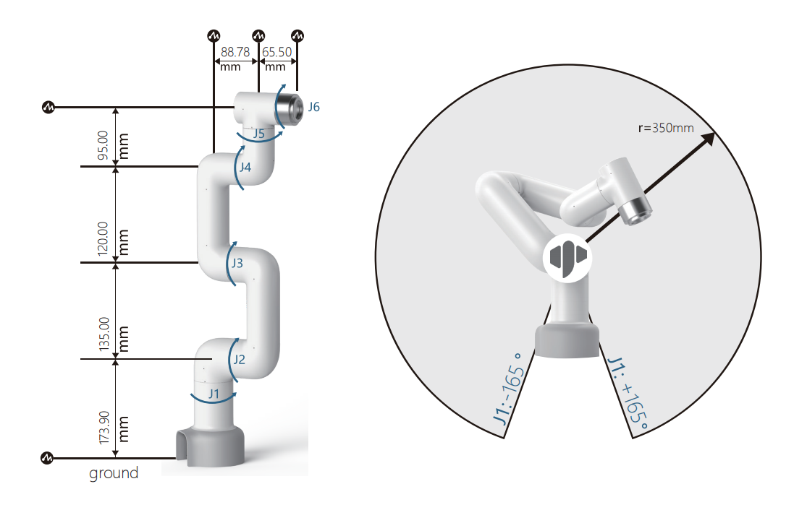
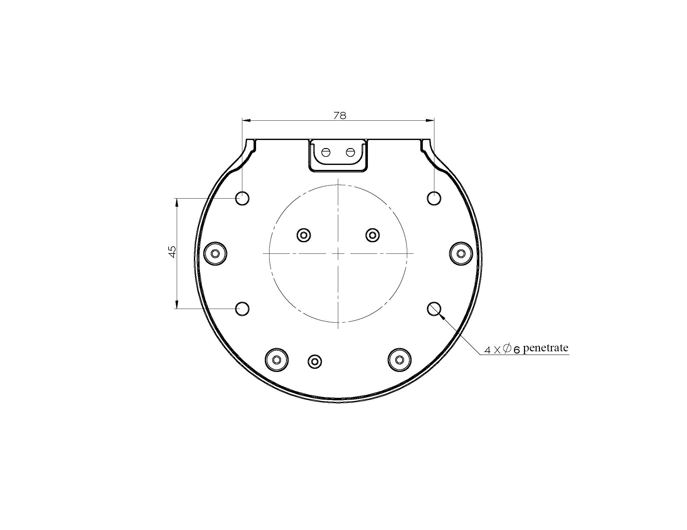
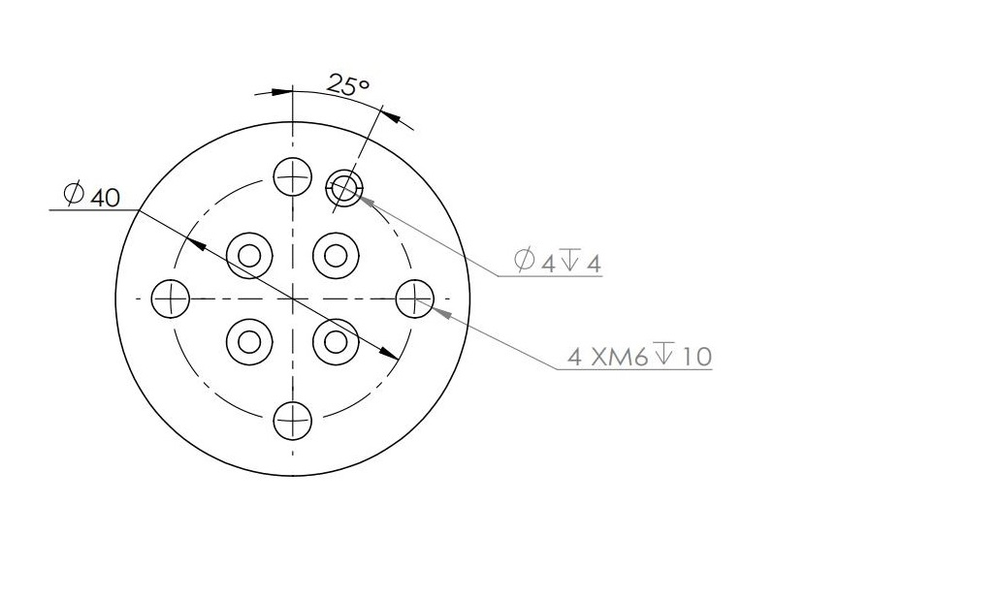

# myCobot 320 Pi

## 1 Structural Parameters

### 1.1 Robot parameters

| **index**                      | **parameter**                      |
| ------------------------------ | ---------------------------------- |
| Name                           | Elephant Collaborative Robotic Arm |
| Model                          | myCobot 320 for Pi                 |
| Degrees of Freedom             | 6                                  |
| Efficient Load                 | 1 kg                               |
| Working Radius                 | 320 mm                             |
| Repeated Positioning Precision | ±0.5 mm                            |
| Weight                         | 3 kg                               |
| Power Input                    | 24V, 9.2A                          |
| Operating Temperature          | 0-45℃                              |
| Communication                  | Type-C                             |

### 1.2 Workspace

### 1.3 Joints Motion Angle

| Joint | **scope**   |
| ----- | ----------- |
| J1    | -165 ~ +165 |
| J2    | -165 ~ +165 |
| J3    | -165 ~ +165 |
| J4    | -165 ~ +165 |
| J5    | -165 ~ +165 |
| J6    | -175 ~ +175 |

### 1.5 Hole Installation

- The base is mounted with flange and is compatible with M6 screw installation.

- Robot arm ends is mounted with flange and are compatible with threaded holes.

### 2 Electronic Parameters

| Index                               | Parameter               |
| ----------------------------------- | ----------------------- |
| SOC                                 | Broadcom BCM2711        |
| CPU                                 | 64-bit 1.5GHz quad-core |
| Bluetooth/Wireless                  | Available               |
| USB                                 | USB3.0 x2; USB2.0 x2    |
| Screen                              | none                    |
| HDMI Interface                      | microHDMI x2            |
| Custom Button                       | none                    |
| IO Interface                        | 8                       |
| Emergency Stop Switch               | Available               |
| Teach pendant or keyboard and mouse | Optional                |
