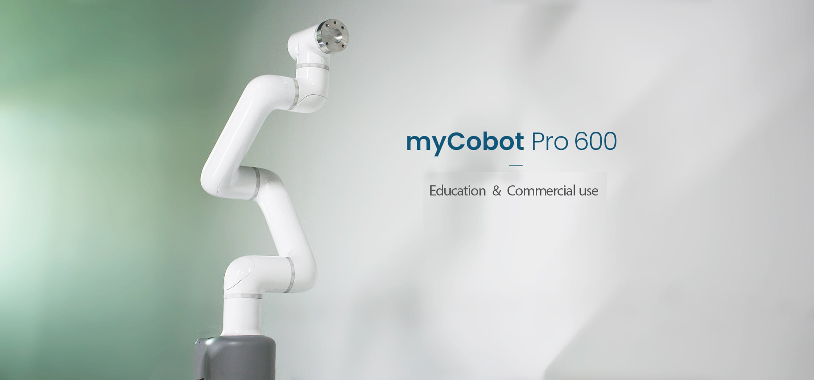

# myCobot Pro 600

### 1 Product Introduction

The original design purpose of **myCobot Pro 600** is to provide people with a machine that can work repeatedly at any commmerical use-cases. Using a Raspberry Pi microprocessor and embedded with roboFlow visual programming software, it is a machine "helper" developed by Elephant Robotics for teaching and commercial use.

The body has a weight of 8.8kg, an effective load of 2kg, and a working radius of 600mm. It is characterized by delicate design, powerful function, easy operation and ability to work with human safely. With three advantages of usability, safety and economy, it is a cost-effective product. It can be quickly deployed in a working
environment, which can reduce costs and increase efficiency for universities and enterprises.

### 2 Product Performance

-   **Integrated design and safe collaborative work**
    -   The integrated design makes the product possible to make full use of the production space and to perfectly integrate itself into the actual environment.
    -   The anti-collision detection function based on an accurate dynamics model enables the product to work safely with human.

-   **Powerful performance and easy operation**
    -   The product adopts a harmonic reducer and a servo motor, and commercial robotic arms, with high-performance teaching.
    -   It features an exquisite structure, modular design, easy installation, quick disassembly and replacement.

-   **Raspberry Pi Control**
    -   Supports development systems such as ROS/Python, etc.
    -   Installed with a roboflow operating system independently developed by Elephant Robotics, which makes the product easy to  use.

-   **Economical and super cost-effective**
    -   It adopts a standard 7×24-hour working system and can perfectly replace highly repetitive and standard jobs.
    -   Being super cost-effective, it can effectively reduce costs and increase efficiency for the universities and enterprises with high performance and low cost.

### 3  Product Parameters

#### 3.1 Robot arm parameters

| Indicator                         | Parameter                         |
| ---------------- | -------------------- |
| Name            | Commercial baby elephant collaborative robot arm|
| Model                   | myCobot pro 600                |
| Freedom                 | 6             |
| Payload                 | 2kg                     |
| Working radius                    | 600mm          |
| Repeated positioning precision    |  ±0.5mm                             
| Weight                            |  8.8kg                  |
| Power supply                      |  AC100-240V ,50/60HZ                  |
| Joint range                       |  J1 +/- 180°  J2 -270~90° J3 +/- 150° J4 -260~80° J5 +/- 168° J6 +/- 174°               |
| IP ating                          |  IP42                |
| Material         | Aluminum alloy, plastics, and rubber     |
| Operating temperature        |  0-50℃                      |

#### 3.2 Electronic parameters

| Indicator                              | Parameter |
| ---------------- | -------------------- |
| Bluetooth/wireless                     | Available          |
| USB                      | USB3.0 x2; USB2.0 x2          |
| Display screen                         | None          |
| HDMI interface                         | microHDMI x2          |
| Customized key                         | None          |
| IO interface                           | 8 pcs     |
| Emergency stop switch                  | Available |

#### 3.3 Motor parameters

| Indicator                              | Parameter |
| ---------------- | -------------------- |
| Servo motor-motor      | Servo motor/brushless DC motor    |
| Servo motor-reducer    | J1, J2, J3-harmonic reducer; J4,  J5, J6 gear set                   |
| Servo motor-encoder      |   19/12位                             |
| Servo motor-maximum speed    | 2300RPM                         |
| Noise                 |  <70 dB                                 |

### 4  Application Scenarios

-   Commercial
    -   Robot cafe
    -   Paper loading and unloading
    -   Key test

-   Medical treatment
    -   Providing a tool to support the screen
    -   Able to achieve repetitive scan jobs

-   Education
    -   Robot vocational education platforms
    -   Research and development
