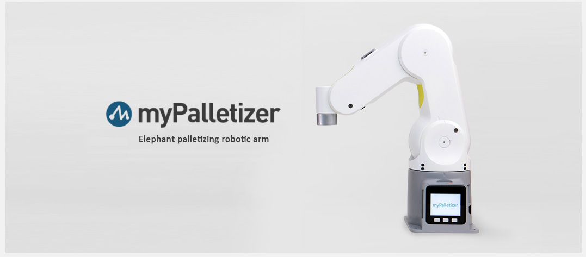

# myPalletizer 260

> 260mm: refers to the effective working radius of the robotic arm

### 1 Product Introduction

​		The fully packaged lightweight four-axis palletizing robot arm has an overall finless design, which is compact and easy to carry. Designed for makers and education, it is easy to use, provides rich expansion interfaces, and can be developed twice; a variety of AI suits, machine vision, composite robots, etc. are available.

​		The 260 series is divided into: M5 version, Pi version, JN version and Arduino version.

- myPalletizer 260 for M5 is a joint product of Elephant Robotics and M5STACK;

- myPalletizer 260 for Pi uses a Raspberry Pi processor and is one of the core products of Elephant Robotics for robotics and artificial intelligence education ecology;

- myPalletizer 260 for JN is an official cooperation product between Elephant Robotics and NVIDIA;

- myPalletizer 260 for Arduino uses the M5STACK-ATOM ESP32 core controller, which is an entry-level product for elephant robots.

### 2 Product comparison

- M5--The body is equipped with two displays

  - I/O port: 6
  
  
  - The base uses M5Stack-basic as the main control, and the end uses M5STACK Atom as the secondary control. 
  
  
  - It supports thousands of application ecosystems of M5, which is convenient for expanding application interaction output.
  

- Pi--Embedded Raspberry Pi ecology, unlimited development possibilities

  - I/O port: 12

  - Raspberry Pi 4B, 1.5GHz quad-core microprocessor, running Debian/Ubuntu platform.
  
  
  - Support 4-way USB, 2-way HDMI, standardized GPIO interface, TF card pluggable.
  

- JN--NVIDIA official cooperation product, using JETSONNANO + ATOM dual-core main control

  - I/O port: 12
  - JETSONNANO, 1.5GHz quad-core microprocessor, running Debian/Ubuntu platform.
  - Support 4-way USB, 2-way HDMI, standardized GPIO interface, TF card pluggable.

- Arduino--M5STACK-ATOM ESP32 core master, infinite possibilities for development
  - I/O port: 6

  - The device can be controlled by a serial port cable, or it can be extended with various types of development versions. There is no need to migrate code, just a simple link to start expansion development.

  - Built-in robot forward and inverse kinematics; open various control interfaces such as angle, coordinates, speed, current, voltage, IO, etc.; support RVIZ simulation and MOVEIT interface development.

### 3 Purchase link

- Taobao: https://shop504055678.taobao.com

- shopify: https://shop.elephantrobotics.com/

For details, please check: [260 M5 chapter ](../../2-serialproduct/2.4-myPalletizer260/2.4.1-M5.md), [260 Pi chapter ](../../2-serialproduct/2.4-myPalletizer260/2.4.2 260-Pi.md), [260 JN chapter ](../../2-serialproduct/2.4-myPalletizer260/2.4.3-JN.md)and [260 Arduino chapter ](../../2-serialproduct/2.4-myPalletizer260/2.4.4-Arduino.md).

 
