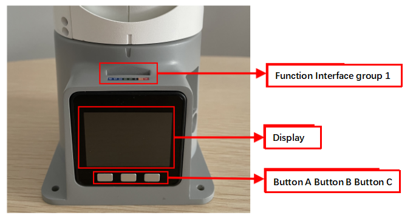
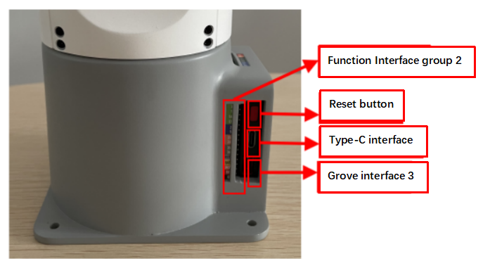
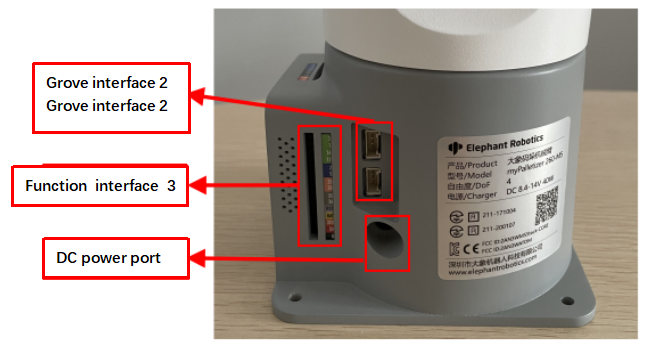
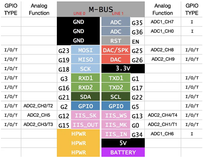
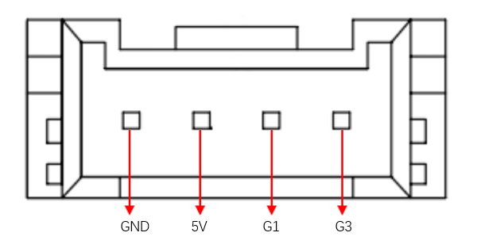
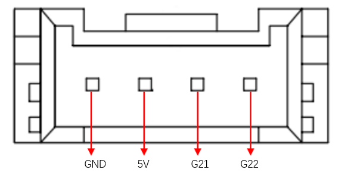
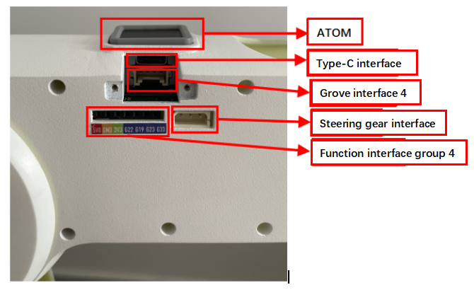
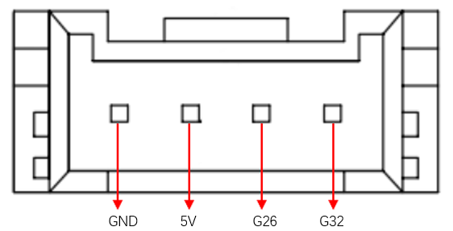

## **Robotic Arm Electrical Interface**

### 1 Base electrical interface

#### 1.1 Introduction to the base

​		A，Figure 1-1 shows the front ports and buttons on the base：

​														 

​																			Figure 1-1 Front view of the base

​		B,  Figure 1-2 shows the ports on the left of the base：

​											 

​																		Figure 1-2 Left view of the base

​		C, Figure 1-3 shows ports on the right of the base：

​				 

​																	Figure 1-3 Right view of the base

#### 1.2 Description of the bottom electrical interface

Note: Function interface group is 2.54mm Dupont interface, external can use 2.54mm Dupont wire.

​		A. Table 1-1shows the definition of each interface in a functional interface group 1.

 

| Tag  | Signal | Function                              | Note                 |
| ---- | ------ | ------------------------------------- | -------------------- |
| 18   | G18    | -                                     | Temporarily not open |
| 19   | G19    | 3.3 V-out-PNP output /3.3 V-int input |                      |
| 23   | G23    | -                                     | Temporarily not open |
| 22   | G22    | 3.3 V-out-PNP output /3.3 V-int input |                      |
| 21   | G21    | 3.3 V-out-PNP output /3.3 V-int input |                      |
| G    | GND    | Motherboard power signal ground       |                      |
| 3V3  | 3V3    | DC3.3 V power supply                  |                      |
| 5V   | 5V     | Power supply, DC5V                    |                      |

 

​																			Table 1-1 Functional interface group 1

 

​		B. The definitions of interfaces in functional interface group 2 are the same as those in functional interface group 3, as shown in Table 1-2.

 

| Tag  | Signal | Function                              | Note                                                  |
| ---- | ------ | ------------------------------------- | ----------------------------------------------------- |
| 3    | G3     | 3.3 V-out-PNP output /3.3 V-int input | This parameter is unavailable when usB-Type-c is used |
| 1    | G1     | 3.3 V-out-PNP output /3.3 V-int input | This parameter is unavailable when usB-Type-c is used |
| 16   | G16    | -                                     | Temporarily not open                                  |
| 17   | G17    | -                                     | Temporarily not open                                  |
| 2    | G2     | 3.3 V-out-PNP output /3.3 V-int input |                                                       |
| 5    | G5     | 3.3 V-out-PNP output /3.3 V-int input |                                                       |
| 25   | G25    | 3.3 V-out-PNP output /3.3 V-int input |                                                       |
| 26   | G26    | 3.3 V-out-PNP output /3.3 V-int input |                                                       |
| 35   | G35    | 3.3 V-int input                       |                                                       |
| 34   | G34    | 3.3 V-int input                       |                                                       |
| RST  | RST    | Master reset                          |                                                       |
| BAT  | BAT    | -                                     | Temporarily not open                                  |
| 3V3  | 3V3    | DC3.3 V power supply                  |                                                       |
| 5V   | 5V     | Power supply, DC5V                    |                                                       |
| G    | GND    | Motherboard power signal ground       |                                                       |

 

​																	Table 1-2 Functional interface groups 2 and 3

 

Description: Figure 1-5 shows other functions of the interface. If other functions are used, the I/O function is unavailable.

​														 

​																									Figure 1-4

​		C. Power DC interface: The myPalletizer is powered by a 6.5mm od, 2.0mm OD, and a manufacturer's 8.4V 5A DC power adapter

 

​		D. Grove interface: Figure 1-5, Figure 1-6, and Figure 1-7 show the Grove interface definitions

​											 

​																								图1-5 Grove port 1

​										 

​																								图1-6 Grove pin port 2

​											 

​																									图1-7 Grove port 3

 

​		E. type C interface: used to communicate with the PC. G1 and G3 ports are occupied when this interface is used.

 

​		F. Reset button: used when the main control system is reset

 

​		G. Buttons A, B, and C: Cooperate with the display

 

​		H. Display: The 2-inch IPS screen can be used to display mycobot communication status and adjust robot origin with buttons.

 

 

### 2 Mechanical arm end electrical interface

#### 2.1 The end of the manipulator is introduced

​		A. Figure 2-1 show the side interfaces at the end of the manipulator.

​									  

​																Figure 2-1 End of the manipulator

#### 2.2 Description of terminal electrical ports

​		A. Table 2-1 shows the definition of each interface in a function interface group 4.

 

| Tag name | Signal name | Function                              | Note |
| -------- | ----------- | ------------------------------------- | ---- |
| 5V0      | 5V          | Power supply, DC5V                    |      |
| GND      | GND         | Motherboard power signal ground       |      |
| 3V3      | 3V3         | DC3.3 V power supply                  |      |
| G22      | G22         | 3.3 V-out-PNP output /3.3 V-int input |      |
| G19      | G19         | 3.3 V-out-PNP output /3.3 V-int input |      |
| G23      | G23         | 3.3 V-out-PNP output /3.3 V-int input |      |
| G33      | G33         | 3.3 V-out-PNP output /3.3 V-int input |      |

 

​																			Table 2-1 Functional port group 4

 

​		B. Type C interface: used to communicate with PC and update firmware.

​	 

​		C. Grove interface 4: Figure 2-2 shows the definition of Grove interface 4

​								  

​																				Figure 2-2 Grove port 4

 

​		D. Steering gear interface: used for expanding the end of the gripper, currently supporting the use of adaptive gripper.

 

​		E. Atom: For 5X5 RGB LED (G27) display and button function (G39)