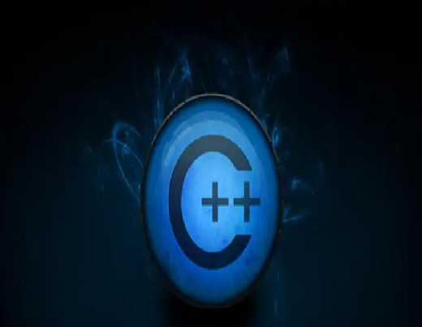
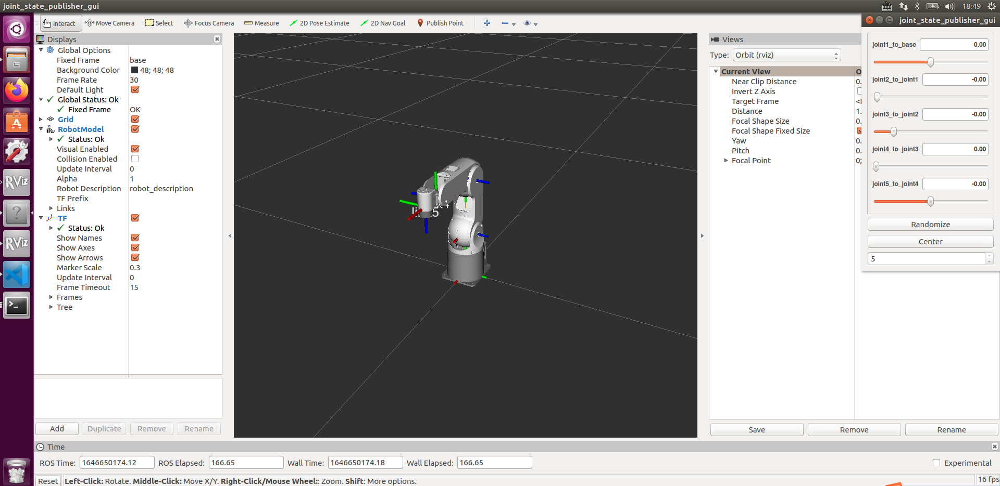

## **Development environment and construction**

### **1 Use environment**

​		The myPalletizer 260 for M5 version is developed and used based on PC. There is no built-in system inside the robotic arm, so the combination of the robotic arm and the PC is required during use, so please prepare a PC before use.

### **2 Development Environment**

​		Because myPalletizer 260 for M5 has no built-in development environment, you need to use a PC to install the development environment for the robotic arm.

**The following are the development environments supported by myPalletizer 260 for M5 and the installation and usage tutorials:**

- [2.1 Development and use based on Blockly](../../5-ProgramingApplication-myblockly-uiflow-mind/README.md)
  Both myBlockly and UIFlow embody the idea of drag-and-drop programming. Both are graphical programming software and visualization tools. Users can build code logic by dragging and dropping modules. The process is very similar to building blocks. After users [install myblockly](../../5-ProgramingApplication-myblockly-uiflow-mind/5.1-myblockly/README.md) as well as [install UIFlow](../../5-ProgramingApplication-myblockly-uiflow-mind/5.2-UIFlow/5.2.1UIFlow_enviorment_building.md) ，can be viewed directly [myblockly use case](../../5-ProgramingApplication-myblockly-uiflow-mind/5.1-myblockly/README.md) and [UIFlow use case](../../5-ProgramingApplication-myblockly-uiflow-mind/5.2-UIFlow/5.2.1UIFlow_enviorment_building.md)。

​												  
​    

- [2.2 Developed and used based on RoboFlow](../../6-ApplicationBaseRoboFlow/README.md)
  The RoboFlow operating system is the operating system of the elephant collaborative robot, providing a human-machine interface (its functions include coordinate control, angle control, io control, trajectory recording, gripper control, etc.).Since the RoboFlow operating system runs in the teach pendant, the user can use the teach pendant as a carrier to manually operate the robot, program and other operations.After users [Install RoboFlow](../../6-ApplicationBaseRoboFlow/6.1-roboflow_download.md) ，can be viewed directly [Simple use case](../../6-ApplicationBaseRoboFlow/6.2-operation.md)。

  

- [2.3 Developed and used based on Python](../../7-ApplicationBasePython/README.md)
  Our products are more friendly to python, and the development of python API library is also increasingly perfect. Through python, the joint angle, coordinates, gripper and other aspects of the robot can be controlled, and there are many choices.After users [install the python environment](../../7-ApplicationBasePython/7.1_download.md) ，can be viewed directly [use case](../../7-ApplicationBasePython/7.7_example.md)。

  

- [2.4 Developed and used based on C++](8-ApplicationBaseCPlus/README.md)
  C++ is the inheritance of C language. It can carry out procedural programming of C language, object-based programming characterized by abstract data types, and object-oriented programming characterized by inheritance and polymorphism. design. Using C++ language, you can freely develop (coordinate control, angle control, io control, gripper control, etc.) through the C++ dynamic library developed by our company, and control some of the robots that our company has developed.After users [install C++ environment](../../8-ApplicationBaseCPlus/8.1-download.md) ，can be viewed directly [use case](../../8-ApplicationBaseCPlus/8.8-example.md)。

  

- [2.5 Developed and used based on C#](../../9-ApplicationBaseCSharp/README.md)
  C# is an object-oriented programming language derived from C and C++ released by Microsoft, a high-level programming language running on .NET Framework and .NET Core (completely open source, cross-platform). Using the c# language, you can freely develop (coordinate control, angle control, io control, gripper control, etc.) through the c# dynamic library provided by our company, and control some of the robots that our company has developed.After users [install C# environment](../../9-ApplicationBaseCSharp/9.1-environment.md) ，can be viewed directly [use case](../../9-ApplicationBaseCSharp/9.8-example.md)。

  

- [2.6 Developed and used based on Arduino](../../10-ArduinoEnv/README.md)

  Arduino is an easy-to-use, easy-to-use, open-source electronic prototyping platform that includes hardware (various Arduino-compliant development boards) and software (Arduino IDE and associated development kits). The hardware part (or development board) consists of a microcontroller (MCU), flash memory (Flash), and a set of general-purpose input/output interfaces (GPIO), etc. You can understand it as a microcomputer motherboard. The software part is mainly composed of Arduino IDE on the PC side, related board support packages (BSP) and rich third-party function libraries. Users can easily download the BSP related to the development board you hold and the required function library through the Arduino IDE to write your program.After users [install Arduino environment](../../10-ArduinoEnv/10.1-arduino_download.md) ，can be viewed directly [Arduino is easy to use](../../10-ArduinoEnv/10.2-arduino_use.md)。
   

- [2.7 Developed and used based on JavaScript](../../11-ApplicationBaseJavaScript/README.md)
  JavaScript is a scripting language that runs on the client side; it does not need to be compiled, and is interpreted and executed by the js interpreter one by one during the running process. Using the JavaScript language, some of our robots can be controlled through our company's ecological library.After users [install JavaScript environment](../../11-ApplicationBaseJavaScript/11.1开发前准备.md) ，can be viewed directly [use case](../../11-ApplicationBaseJavaScript/11.7使用案例.md)。

  

- [2.8 Developed and used based on ROS](../../12-ApplicationBaseROS/README.md)
  ROS is open source and a post-operating system, or secondary operating system, for robot control. Through ROS, we can realize the simulation control of the manipulator in the virtual environment. We will visualize the robotic arm through the rviz platform, and operate our robotic arm in a variety of ways; plan and execute the robotic arm's action path through the moveit platform to achieve the effect of freely controlling the robotic arm.After users [Install the ROS development environment](../../12-ApplicationBaseROS/12.1-ROS1/12.1.2-环境搭建.md) ，can be viewed directly [use case](../../12-ApplicationBaseROS/12.1-ROS1/12.1.4-rivz介绍及使用/README.md) 和 [use of moveit](../../12-ApplicationBaseROS/12.1-ROS1/12.1.5-Moveit/README.md)。

  

### **3 Firmware update**

​		M5Stack-basic firmware for myPalletizer 260 for M5 and Atom firmware updates need to be updated using myStudio.

**Installation and usage tutorial of myStudio:**

- [myStudio](../../4-BasicApplication/4.1-myStudio/README.md)

 

 