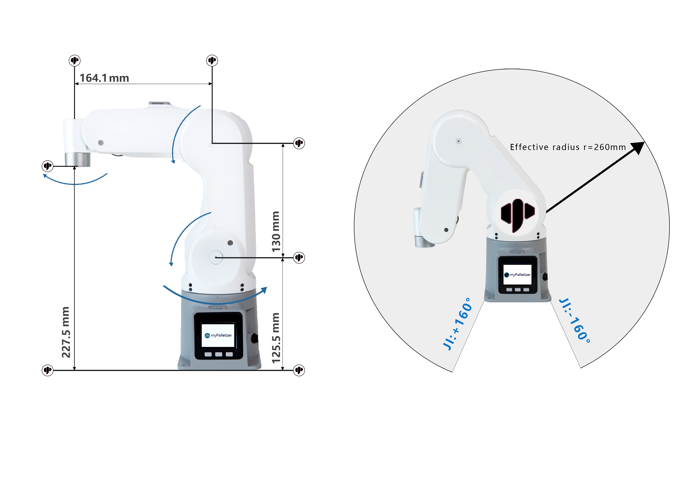
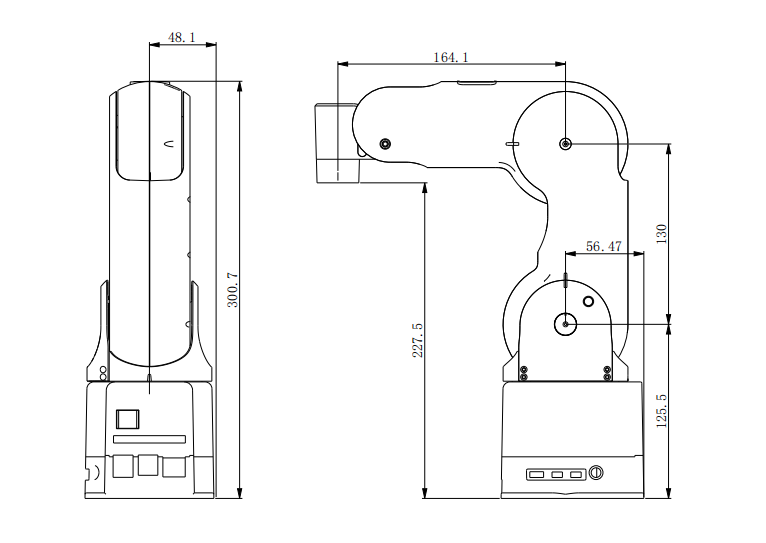
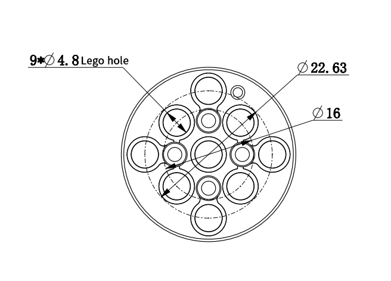

# **myPalletizer 260 for Pi**

## **1 Structural parameters**

#### **1.1 Robot arm parameters**

| **index**              | **parameter**                               |
| ---------------------- | ------------------------------------------- |
| name                   | Elephant palletizing robotic arm            |
| model                  | myPalletizer 260      Pi                      |
| degrees of freedom     | 4                                           |
| Repeatability          | ±2 mm                                       |
| load                   | 250g                                        |
| dead weight            | 960g                                        |
| working radius         | 260mm                                       |
| Material               | Photosensitive resin SLA                    |
| Charging voltage       | 8~12V 5A                                    |
| Motor type             | High Precision Magnetic Encoder Servo Servo |
| Movement maximum speed | 120°/s                                      |
| control                | Raspberry Pi 4B                               |

#### **1.2 Workspace**

#### **1.3 Specifications and dimensions**

#### **1.4 Range of motion of joints**

| The essential | Scope       |
| ------------- | ----------- |
| J1            | -160 ~ +160 |
| J2            | 0 ~ +90     |
| J3            | 0 ~ +60     |
| J4            | -∞ ~ +∞     |

#### **1.5 Hole installation**

- The Robot Base Mounting Flange Base supports the installation of LEGO components.

  ​														

- Robot end mounting flange The end of the robot arm supports the installation of LEGO components.

#### **1.6 DH parameter**
