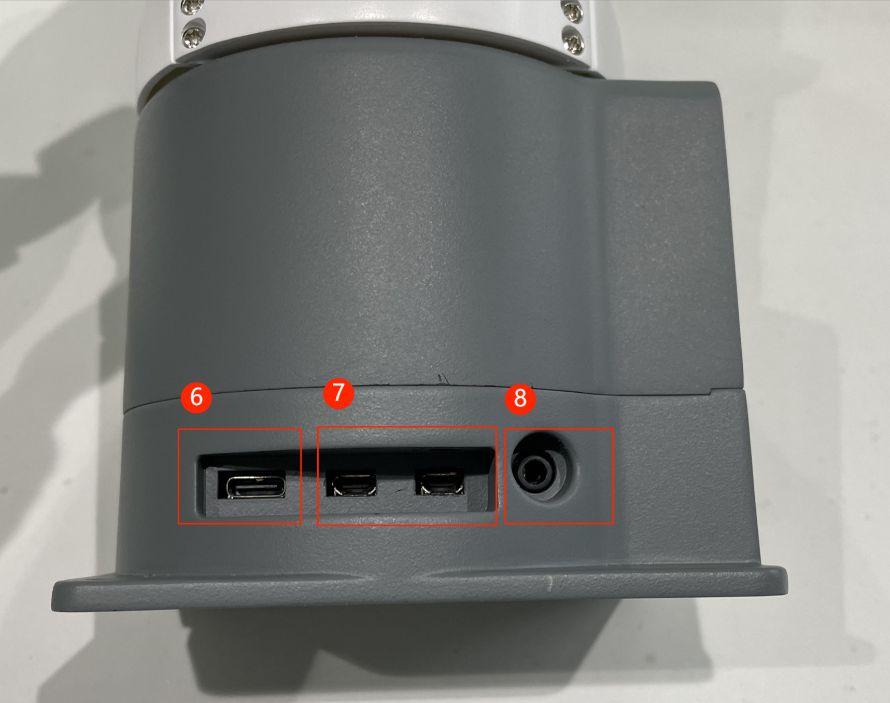
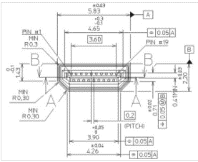

## **Robotic Arm Electrical Interface**

### 1 Base electrical interface

#### 1.1 Introduction to the base

A，Figure 1-1 shows the front ports and buttons on the base：

​                                                     
​                                                                                                       Figure 1-1 Front view of the base

​		B,  Figure 1-2 shows the ports on the left of the base：

​                                   

​                                                                                                      Figure 1-2 Left view of the base

①：Robotic arm charging port: use a DC power socket with an outer diameter of 6.5mm and an inner diameter of 2.0mm; the 8.4V 5A DC power adapter provided by the manufacturer can be used to power the robot arm.

②：Bottom pinout: see table in next paragraph

③：USB2.0 and USB3.0 interfaces: interfaces for data connection with serial bus standards 2.0 and 3.0; users can use the USB interface to copy program files, or use the USB interface to connect peripherals such as mouse and keyboard.

④：Network port: the port for network data connection, the user can use the Ethernet interface for the communication and interaction between the PC and the robot system, and also for Ethernet communication with other devices.

⑤：Switch button: red is switch, I is power on, O is power off.

⑥：Raspberry Pi 4B comes with a USB port

⑦：Display interface: HDMI interface, which is HDMI D-type interface ， connected to the display. HDMI interface 2 has priority, and HDMI interface 1 is recommended.

⑧：Speaker, headphone jack

#### **1.2 Description of the bottom electrical interface**

Note: Function interface group is 2.54mm Dupont interface, external can use 2.54mm Dupont wire.

​		A. Figure 1-4 shows the definition of each interface in a functional interface group.

| Tag name | Signal name | Function                              | Note                 |
| -------- | ----------- | ------------------------------------- | -------------------- |
| 5V       | 5V          | Power supply, DC5V                    |                      |
| 5V       | 5V          | Power supply, DC5V                    |                      |
| GND      | GND         | Motherboard power signal ground       |                      |
| NC       | NC          | --                                    | Temporarily not open |
| NC       | NC          | --                                    | Temporarily not open |
| 18       | GPIO18      | 3.3 V-out-PNP output /3.3 V-int input |                      |
| GND      | GND         | Motherboard power signal ground       |                      |
| 23       | GPIO23      | 3.3 V-out-PNP output /3.3 V-int input |                      |
| 24       | GPIO24      | 3.3 V-out-PNP output /3.3 V-int input |                      |
| GND      | GND         | Motherboard power signal ground       |                      |
| 25       | GPIO25      | 3.3 V-out-PNP output /3.3 V-int input |                      |
| 08       | GPIO08      | 3.3 V-out-PNP output /3.3 V-int input |                      |
| 07       | GPIO07      | 3.3 V-out-PNP output /3.3 V-int input |                      |
| 01       | GPIO01      | 3.3 V-out-PNP output /3.3 V-int input |                      |
| GND      | GND         | Motherboard power signal ground       |                      |
| 12       | GPIO12      | 3.3 V-out-PNP output /3.3 V-int input |                      |
| GND      | GND         | Motherboard power signal ground       |                      |
| 16       | GPIO16      | 3.3 V-out-PNP output /3.3 V-int input |                      |
| 20       | GPIO20      | 3.3 V-out-PNP output /3.3 V-int input |                      |
| 21       | GPIO21      | 3.3 V-out-PNP output /3.3 V-int input |                      |
| 3.3      | 3.3V        | DC3.3 V power supply                  |                      |
| NC       | NC          | --                                    | Temporarily not open |
| 03       | GPIO03      | 3.3 V-out-PNP output /3.3 V-int input |                      |
| 04       | GPIO04      | 3.3 V-out-PNP output /3.3 V-int input |                      |
| GND      | GND         | Motherboard power signal ground       |                      |
| 17       | GPIO17      | 3.3 V-out-PNP output /3.3 V-int input |                      |
| 27       | GPIO27      | 3.3 V-out-PNP output /3.3 V-int input |                      |
| 22       | GPIO22      | 3.3 V-out-PNP output /3.3 V-int input |                      |
| 3.3      | 3.3V        | DC3.3 V power supply                  |                      |
| 10       | GPIO10      | 3.3 V-out-PNP output /3.3 V-int input |                      |
| 09       | GPIO09      | 3.3 V-out-PNP output /3.3 V-int input |                      |
| 11       | GPIO11      | 3.3 V-out-PNP output /3.3 V-int input |                      |
| GND      | GND         | Motherboard power signal ground       |                      |
| 00       | GPIO00      | 3.3 V-out-PNP output /3.3 V-int input |                      |
| 05       | GPIO05      | 3.3 V-out-PNP output /3.3 V-int input |                      |
| 06       | GPIO06      | 3.3 V-out-PNP output /3.3 V-int input |                      |
| 13       | GPIO13      | 3.3 V-out-PNP output /3.3 V-int input |                      |
| 19       | GPIO19      | 3.3 V-out-PNP output /3.3 V-int input |                      |
| 26       | GPIO26      | 3.3 V-out-PNP output /3.3 V-int input |                      |
| GND      | GND         | Motherboard power signal ground       |                      |

​																				Figure 1-4 Functional interface group

 

Description: Figure 1-5 shows other functions of the interface. If other functions are used, the I/O function is unavailable.

​																

​																						Figure 1-5

 

​		B. Power DC interface: The MYCObot280 is powered by a 6.5mm od, 2.0mm OD, and a manufacturer's 8.4V 5A DC power adapter.

 

​		C. Switch: red is switch, I is power on, O is power off.

 

​		D. USB2.0 interface: serial port bus standard 2.0 interface for data connection; The USB port is used to copy program files and connect peripherals such as mouse and keyboard.

 

​		E. USB3.0 port (blue) : The port that uses serial bus 3.0 for data connection. The USB port is used to copy program files and connect peripherals such as mouse and keyboard.

​																

​																		Figure 1-6 Defining USB ports

 

​		F. The network interface: (as shown in figure 1-7) ports for network data connection. Ethernet interfaces can be used for communication between a PC and a robot system or for Ethernet communication with other devices.

​	

​																		Figure 1-7 Network interface definition

 

​		G. HDMI port: The HDMI D-type port (as shown in Figure 1-8,1-9) connects to the monitor. HDMI port 2 has a priority, and HDMI port 1 is recommended.

​			

​																					Figure 1-8 HDMI TYPE D port 1

 

​			
​																				Figure 1-9 HDMI TYPE D port 2

 

​		H. Type C port: connects to the PC.

 

​		I. SD card socket: an SD card can be inserted and removed. The size of the SD card is 32mm x 24mm x 2.1mm

 

### 2 Mechanical arm end electrical interface

#### 2.1 The end of the manipulator is introduced

​		A. Figure 2-1 show the side interfaces at the end of the manipulator.

​																Figure 2-1 End of the manipulator

#### 2.2 Description of terminal electrical ports

​		A. Table 2-1 shows the definition of each interface in a function interface group 4.

 

| Tag name | Signal name | Function                              | Note |
| -------- | ----------- | ------------------------------------- | ---- |
| 5V0      | 5V          | Power supply, DC5V                    |      |
| GND      | GND         | Motherboard power signal ground       |      |
| 3V3      | 3V3         | DC3.3 V power supply                  |      |
| G22      | G22         | 3.3 V-out-PNP output /3.3 V-int input |      |
| G19      | G19         | 3.3 V-out-PNP output /3.3 V-int input |      |
| G23      | G23         | 3.3 V-out-PNP output /3.3 V-int input |      |
| G33      | G33         | 3.3 V-out-PNP output /3.3 V-int input |      |

 

​																			Table 2-1 Functional port group 4

 

​		B. Type C interface: used to communicate with PC and update firmware.

​	 

​		C. Grove interface 4: Figure 2-2 shows the definition of Grove interface 4

​						

​																				Figure 2-2 Grove port 4

 

​		D. Steering gear interface: used for expanding the end of the gripper, currently supporting the use of adaptive gripper.

 

​		E. Atom: For 5X5 RGB LED (G27) display and button function (G39)