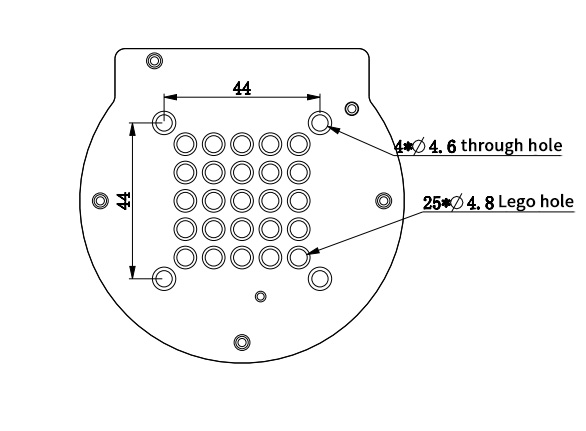

## **Introduction**

### **1 Unpacking and working environment**

Note: After the packaging box is in place, please confirm that the robot packaging is intact. If there is any damage, please contact the logistics company and the supplier in your area in time. After unpacking, please check the actual items in the box according to the item list.

​																	Table 2-2 myPalletizer Robot Arm [Standard Set]

| Product Contents of myPalletizer Robot Arm [Standard Set] | **-myPalletizer robotic arm (model myPalletizer 260 for Pi)** **-myPalletizer Robot Arm -Product Album -myPalletizer Robot Arm -Supporting Power Supply -USB-Type C -HDMI** |
| --------------------------------------------------------- | ------------------------------------------------------------ |

​		Install the robot system in an environment that meets the conditions described in the table in order to develop and maintain the performance of this machine and use it safely.

​																					Table 2-3 Working Environment and Conditions

| Working Environment              | Conditions                                                   |
| -------------------------------- | ------------------------------------------------------------ |
| temperature                      | -10°C~45°C                                                   |
| Relative humidity                | 20%~70%                                                      |
| Indoor and outdoor requirements  | indoor                                                       |
| Other environmental requirements | - Avoid sunlight exposure.  - Keep away from dust, oil fume, salt, iron filings, etc.  - Keep away from flammable and corrosive liquids and gases.  - Must not come into contact with water.  - Does not transmit shock and vibration etc.  - Keep away from strong electromagnetic interference sources. |

### **2 Installation conditions and requirements**

​		The actual weight of the myPalletizer robot is 960g. Considering that during use, as the robot moves, its center of gravity will move, so the robot needs to be fixed on a solid base before it can be used normally. Base weight requirements: fixed base, or mobile base.

**Robot base interface size**

​		The base fixing hole is the interface between the fixed robot and other bases or planes. The specific hole size is shown in the figure below, and it is installed with LEGO components.

Please make sure there are corresponding holes on the fixed base before installing.

Before the official installation, please confirm:

- The environment to be installed meets the requirements of Section 2.4.1.3.2 above.

- The installation position is not smaller than the working range of the robot, and there is enough space for installation, use, maintenance and repair.

- Put the stand in a suitable position.

- Installation related tools are ready.

​		After confirming the above, please move the robot to the base mounting table, adjust the robot position, and align the fixing holes of the robot base with the holes on the base mounting table. After aligning the hole, press it.

​		**Note**: When adjusting the position of the robot on the base installation table, please try to avoid pushing and pulling the robot directly on the base installation table to avoid scratches. When manually moving the robot, try to avoid applying external force to the fragile parts of the robot body, so as to avoid unnecessary damage to the robot.

**For more installation details, scan the code to watch the video:**

### **3 Power on the robot**

Before operation, please confirm that you have read and ensured that you have followed the contents of Chapter 1 Safety Instructions to ensure safe operation. At the same time, connect the power adapter to the robotic arm, and fix the base of the robotic arm on the table. The connection method is shown in Figure 3-1.

​																		Figure 3-1 Location of the power connector

​		myPalletizer must be powered with an external power supply to provide sufficient power:

- Rated voltage: 8-12V

- Rated current: 5A

- Plug Type: DC 5.5mm x 2.5

Note that you can't just use the TypeC plugged into the M5Stack-basic for powering. Use an official power supply to avoid damage to the robotic arm.

### **4 Driver Installation**

Users can download the corresponding CP210X or CP34X driver compressed package according to the operating system they are using, and after decompressing the compressed package, select the installation package with the corresponding operating system digits for installation.

There are currently two driver chip versions, CP210X (applicable to CP2104 version) / CP34X (applicable to CH9102 version) driver package. If you are not sure which USB chip your device is using, you can install both drivers at the same time.

The installation tutorial can be viewed by scanning the QR code:

### **5 Use USB to connect computer**

Use the matching HDMI cable to connect the robotic arm and the monitor:

- First plug the HDMI cable into the HDMI port of the monitor.

- Then plug the other end into the HDMI port of the robotic arm.

### **6 Use of end tools**

#### **6.1 Suction pump**

Details: [4 Suction pump](https://docs.elephantrobotics.com/docs/elephant-gitbook/2-BuyingGuide/2.6-accessories/2.6.4-pump.html)

Please scan the code to watch the installation tutorial of the suction pump:

​														

#### **6.2 Adaptive gripper**

Details: [5 Adaptive gripper](https://docs.elephantrobotics.com/docs/elephant-gitbook/2-BuyingGuide/2.6-accessories/2.6.5-ag.html) 

Adaptive gripper installation video to be added...

 