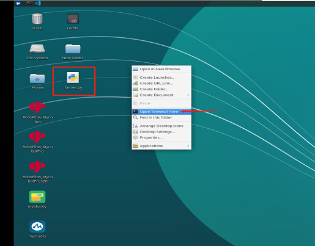
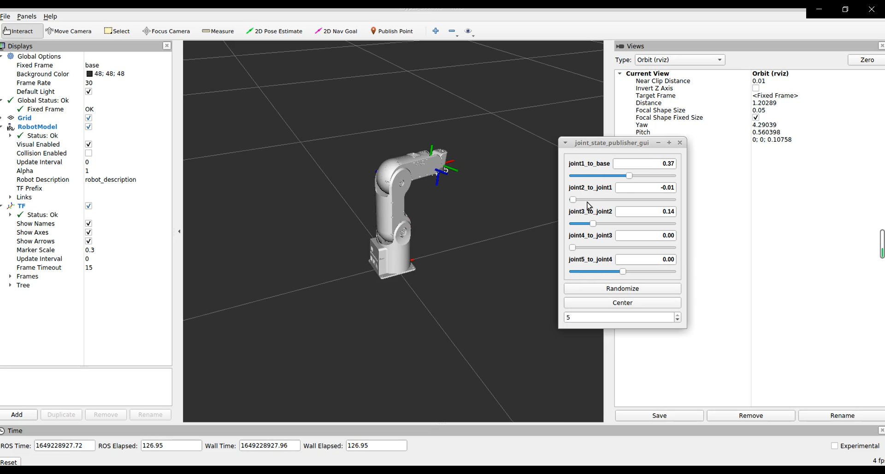

## **Development environment and construction**

### **1 Use environment**

​		myPalletizer 260 for Raspberry Pi version comes with Ubantu (V-18.04) system, built-in Python, myStudio, myBlockly, ROS, OpenCV and driver libraries, so there is no need to download development software and install development environment (additional Python libraries need to be installed by yourself), You only need to prepare a monitor to connect the robotic arm.

### **2 Development Environment**

​		Because myPalletizer 260 for Raspberry Pi has a built-in development environment, it can be used directly.

**The following are the development environments supported by the myPallerizer 260 for Raspberry Pi version and the installation and usage tutorials:**

- [2.1 Development and use based on Blockly](../../5-ProgramingApplication-myblockly-uiflow-mind/README.md)
 myBlockly embodies the idea of drag-and-drop programming and is a graphical programming software and visualization tool. Users can build code logic by dragging and dropping modules. The process is very similar to building blocks.Can be viewed directly [myblockly use case](../../5-ProgramingApplication-myblockly-uiflow-mind/5.1-myblockly/README.md) 。

​		

- [2.2 Developed and used based on Python](../../7-ApplicationBasePython/README.md)
  Our products are more friendly to python, and the development of python API library is also increasingly perfect. Through python, the joint angle, coordinates, gripper and other aspects of the robot can be controlled, and there are many choices.Can be viewed directly [use case](../../7-ApplicationBasePython/7.7_example.md)。

- [2.3 Developed and used based on ROS](../../12-ApplicationBaseROS/README.md)
  ROS is open source and a post-operating system, or secondary operating system, for robot control. Through ROS, we can realize the simulation control of the manipulator in the virtual environment. We will visualize the robotic arm through the rviz platform, and operate our robotic arm in a variety of ways; plan and execute the robotic arm's action path through the moveit platform to achieve the effect of freely controlling the robotic arm.Can be viewed directly [use case](../../12-ApplicationBaseROS/12.1-ROS1/12.1.4-rivz介绍及使用/README.md) 和 [use of moveit](../../12-ApplicationBaseROS/12.1-ROS1/12.1.5-Moveit/README.md)。

### **3 Firmware update**

​		The M5Stack-basic firmware and Atom firmware of myCobot 280 for Raspberry Pi need to be updated using myStudio. MyCobot 280 for Raspberry Pi has built-in myStudio, which can be used directly.

**Installation and usage tutorial of myStudio:**

- [4.1 myStudio](./../4-BasicApplication/4.1-myStudio/README.md)
  - [1 Install the driver](../../4-BasicApplication/4.1-myStudio/4.1.1-myStudio_download_driverinstalled.md)
  
  - [2 Updating device firmware](../../4-BasicApplication/4.1-myStudio/4.1.2-myStudio_flash_firmwares.md)

 

 