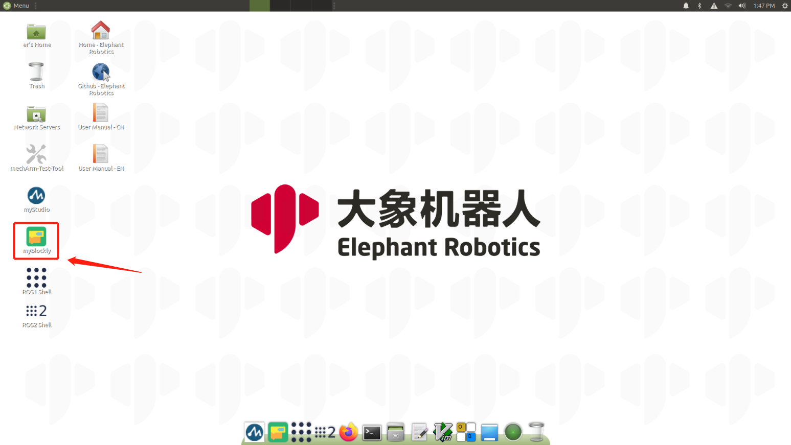
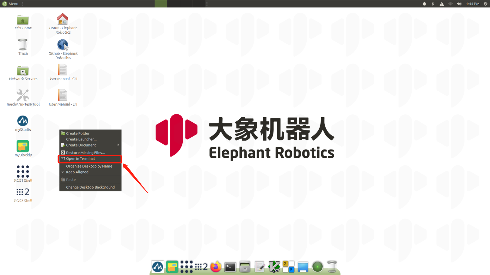
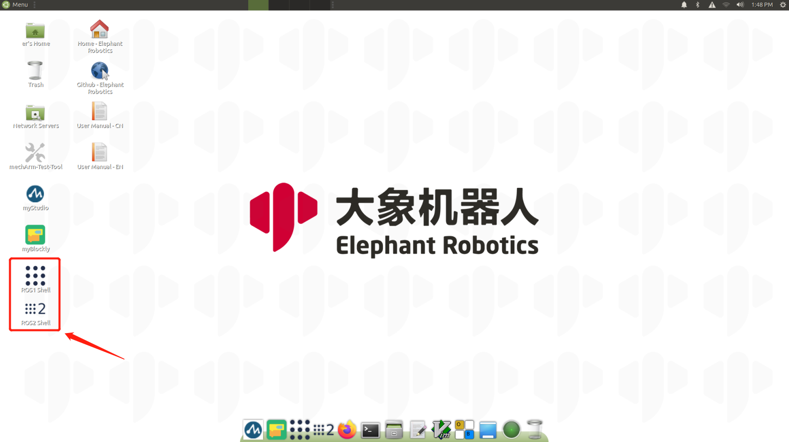
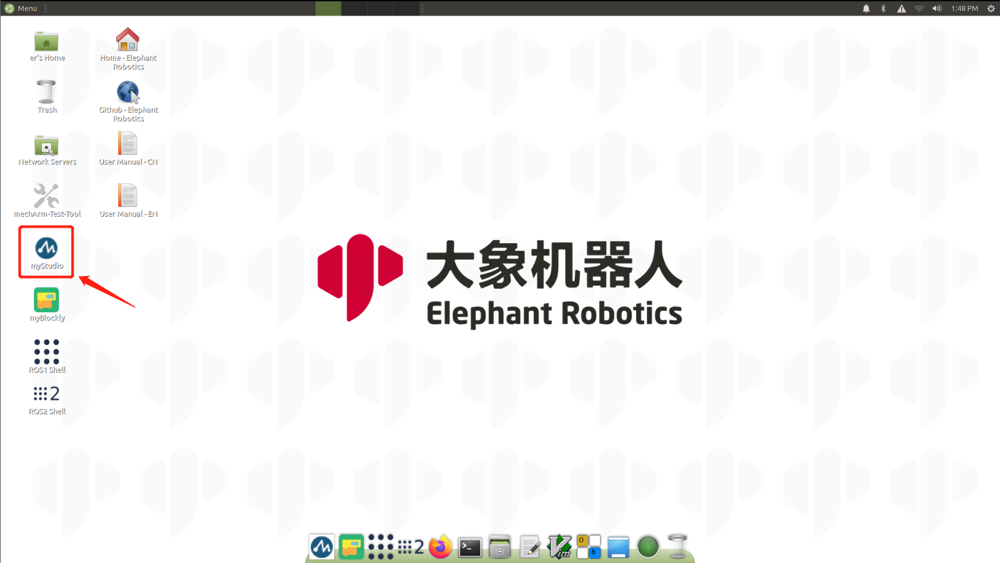

## Development environment and construction

### 1 Use environment

#### Ubuntu（V-20.04）
  mechArm 270-Pi  version comes with Ubantu (V-20.04) system, built-in Python, myStudio, myBlockly, ROS, OpenCV and driver libraries, so there is no need to download development software and install development environment (additional Python libraries need to be installed by yourself), In addition, this system can be directly connected to the built-in network of the robotics and controlled remotely through VNC , without connecting the monitor **.

#### Ubuntu（V-18.04）
  mechArm 270-Pi  version comes with Ubantu (V-18.04) system, built-in Python, myStudio, myBlockly, ROS, OpenCV and driver libraries, so there is no need to download development software and install development environment (additional Python libraries need to be installed by yourself), You only need to prepare a monitor to connect the robotic arm.This system can be [download](https://download-elephantrobotics.oss-cn-shenzhen.aliyuncs.com/Product_software/iMage-ISO/mechArm-270/mechArm270_V221030-shrink.zip), for details, see Section [15.2 Burning Mirroring](../../19-mirroring/镜像与烧录/15.2-mirroring-burning.md).

### 2 Development Environment

Because mechArm 270-Pi has a built-in development environment, it can be used directly. Currently we offer Ubuntu (V-20.04) and Ubuntu (V-18.04).

**The following are the development environments supported by the mechArm 270 Pi version and the installation and usage tutorials:**

#### Ubuntu（V-20.04）

- Before using this system, if no device such as the monitor is available, please download [VNC Viewer](https://www.realvnc.com/en/connect/download/viewer/) first. If you have monitor, you don't need to download this software for remote control. You can directly connect the robotic and control it.

- [2.1 Development and use based on Blockly](../../5-ProgramingApplication-myblockly-uiflow-mind/README.md)
   myBlockly embodies the idea of drag-and-drop programming and is a graphical programming software and visualization tool. Users can build code logic by dragging and dropping modules. The process is very similar to building blocks.Can be viewed directly [myblockly use case](../../5-ProgramingApplication-myblockly-uiflow-mind/5.1-myblockly/README.md) 。
  
  
  
  

- [2.2 Developed and used based on Python](../../7-ApplicationBasePython/README.md)
  Our products are more friendly to python, and the development of python API library is also increasingly perfect. Through python, the joint angle, coordinates, gripper and other aspects of the robot can be controlled, and there are many choices.Can be viewed directly [use case](../../7-ApplicationBasePython/7.7_example.md)。

  

- [2.3 Developed and used based on ROS](../../12-ApplicationBaseROS/README.md)
  ROS is open source and a post-operating system, or secondary operating system, for robot control. Through ROS, we can realize the simulation control of the manipulator in the virtual environment. We will visualize the robotic arm through the rviz platform, and operate our robotic arm in a variety of ways; plan and execute the robotic arm's action path through the moveit platform to achieve the effect of freely controlling the robotic arm.Can be viewed directly [Install ROS](../../12-ApplicationBaseROS/12.1-ROS1/12.1.2-环境搭建.md) 后，即可查看 [rviz use cases](../../12-ApplicationBaseROS/12.1-ROS1/12.1.4-rivz介绍及使用/README.md) 、[ROS1 use cases](../../12-ApplicationBaseROS/12.1-ROS1/12.1.4-rivz介绍及使用/mechArm_270.md) 、[ROS2 use cases](../../12-ApplicationBaseROS/12.2-ROS2/12.2.7-rivz介绍及使用/mechArm-270.md) 、 [use of moveit](../../12-ApplicationBaseROS/12.1-ROS1/12.1.5-Moveit/mechArm_270.md)。
  
  
  
  

#### Ubuntu（V-18.04）

- [2.1 Development and use based on Blockly](../../5-ProgramingApplication-myblockly-uiflow-mind/README.md)
   myBlockly embodies the idea of drag-and-drop programming and is a graphical programming software and visualization tool. Users can build code logic by dragging and dropping modules. The process is very similar to building blocks.Can be viewed directly [myblockly use case](../../5-ProgramingApplication-myblockly-uiflow-mind/5.1-myblockly/README.md) 。

  

- [2.2 Developed and used based on Python](../../7-ApplicationBasePython/README.md)
  Our products are more friendly to python, and the development of python API library is also increasingly perfect. Through python, the joint angle, coordinates, gripper and other aspects of the robot can be controlled, and there are many choices.Can be viewed directly [use case](../../7-ApplicationBasePython/7.7_example.md)。

- [2.3 Developed and used based on ROS](../../12-ApplicationBaseROS/README.md)
  ROS is open source and a post-operating system, or secondary operating system, for robot control. Through ROS, we can realize the simulation control of the manipulator in the virtual environment. We will visualize the robotic arm through the rviz platform, and operate our robotic arm in a variety of ways; plan and execute the robotic arm's action path through the moveit platform to achieve the effect of freely controlling the robotic arm.Can be viewed directly [use case](../../12-ApplicationBaseROS/12.1-ROS1/12.1.4-rivz介绍及使用/README.md) 和 [use of moveit](../../12-ApplicationBaseROS/12.1-ROS1/12.1.5-Moveit/README.md).

### 3 Firmware update

​		The Atom firmware of mechArm 270-Pi need to be updated using myStudio. mechArm 270-Pi built-in myStudio, which can be used directly.

**Installation and usage tutorial of myStudio:**

- [4.1 myStudio](../../4-BasicApplication/4.1-myStudio/README.md)
  - [1 Install the driver](../../4-BasicApplication/4.1-myStudio/4.1.1-myStudio_download_driverinstalled.md)

  - [2 Updating device firmware](../../4-BasicApplication/4.1-myStudio/4.1.2-myStudio_flash_firmwares.md)

 

