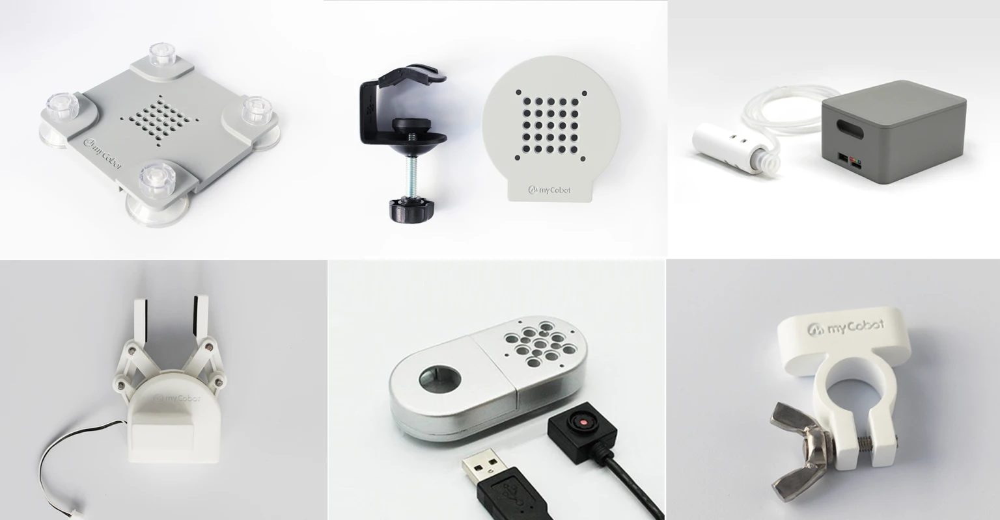
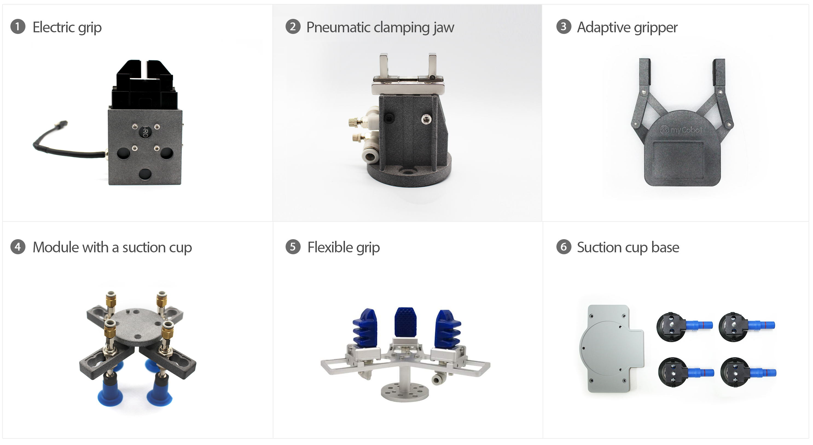

# Product Accessories

The product accessories of my series include **a base and end
effector.**

> Accessories applicable for myCobot 280 and myPalletizer 260 and mechArm 270:

> Accessories applicable for myCobot 320 and Pro 600:

**base**
- [flat stand](../../2-serialproduct/2.7-accessories/2.7.1-fsta.md)
- [G-stand](../../2-serialproduct/2.7-accessories/2.7.2-Gstands.md)
- [sucking discbase](../../2-serialproduct/2.7-accessories/2.7.3-xiata.md)
- [Large suction cup base](../../2-serialproduct/2.7-accessories/2.7.4-Big suction cup base.md)

**end effector** 

- [adsorption pump](../../2-serialproduct/2.7-accessories/2.7.5-pump.md) 
- [adaptive gripper](../../2-serialproduct/2.7-accessories/2.7.6-ag.md) 
- [camera flange](../../2-serialproduct/2.7-accessories/2.7.7-camera.md) 
- [module sucking disc](../../2-serialproduct/2.7-accessories/2.7.8-320pump.md)
- [electric gripper](../../2-serialproduct/2.7-accessories/2.7.9-GE.md)
- [pneumatic gripper](../../2-serialproduct/2.7-accessories/2.7.10-air.md)
