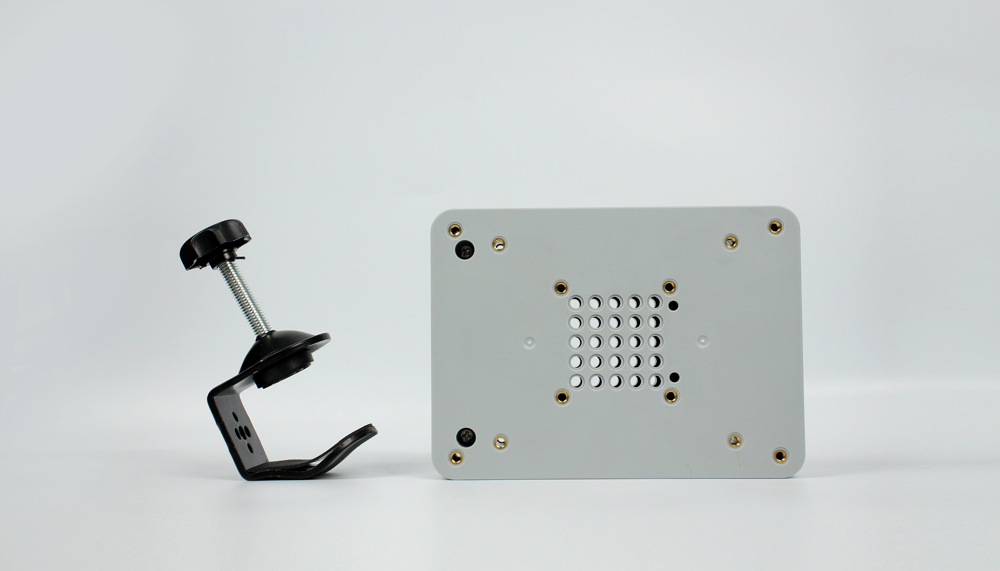
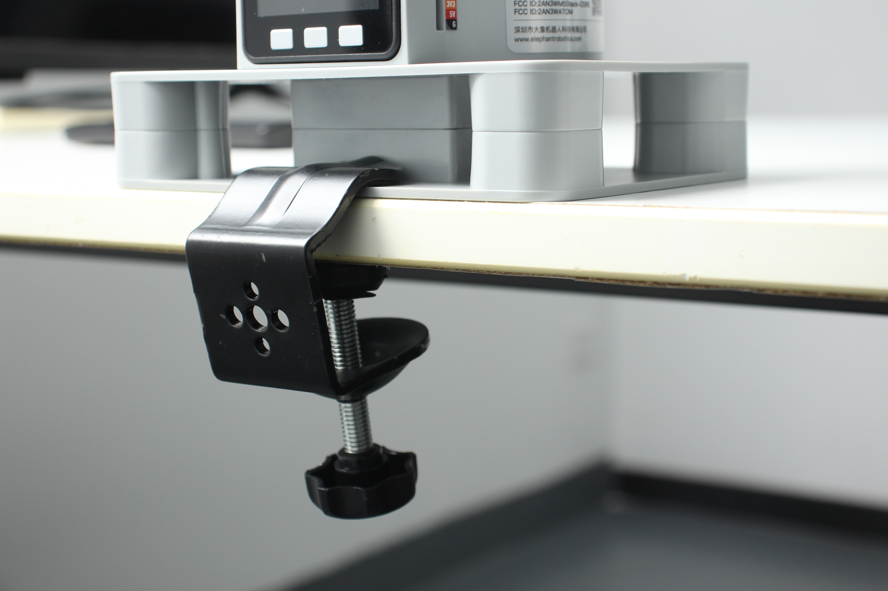

# **G-base 2.0**

**Compatible models:** myCobot 280, myPalletizer 260, mechArm 270

- **Specifications:**

  | **name**                     | **G-base 2.0**                                               |
  | ---------------------------- | ------------------------------------------------------------ |
  | Model Model                  | myCobot_Gstand_grey_V2                                       |
  | color                        | grey black                                                   |
  | craft                        | ABS compression molding                                      |
  | size                         | 174.8x166x31                                                 |
  | Fixed method Fixed           | Lego connectors/screw fixing                                 |
  | Use environment requirements | Temperature and pressure                                     |
  | Applicable equipment Fit     | ER myCobot Series 280, ER myPalletizer Series 260, mecharm Series 270, myBuddy Series 280 |

  ### **Instructions for use:**

  **G-base - fixed to the edge of the table**

- Fix the base to the edge of the table with G-clip

- Connect the base and the bottom of the robotic arm with the included LEGO tech parts

- Make sure it is stable before starting to use it

***

**Mall link：**https://shop-elephantrobotics-com.translate.goog/collections/mycobot/products/g-shape-base-2-0?_x_tr_sl=auto&_x_tr_tl=zh-CN

