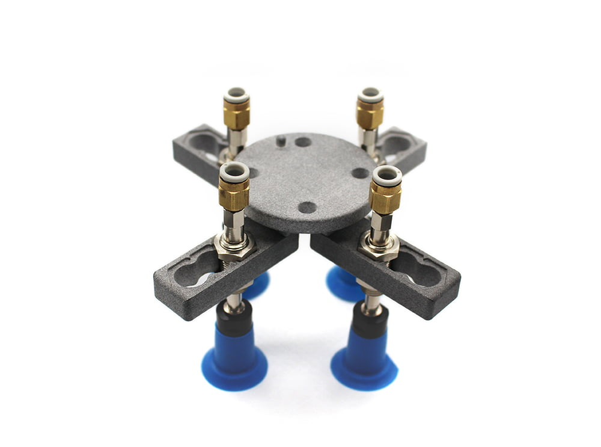
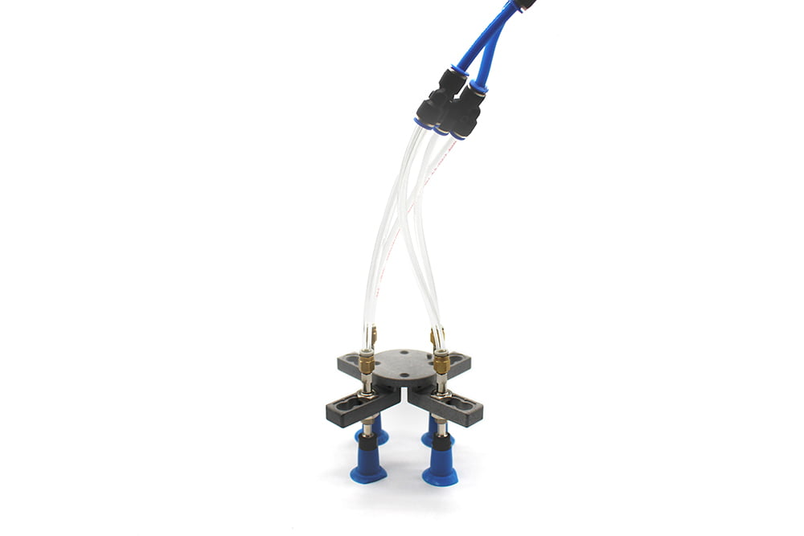
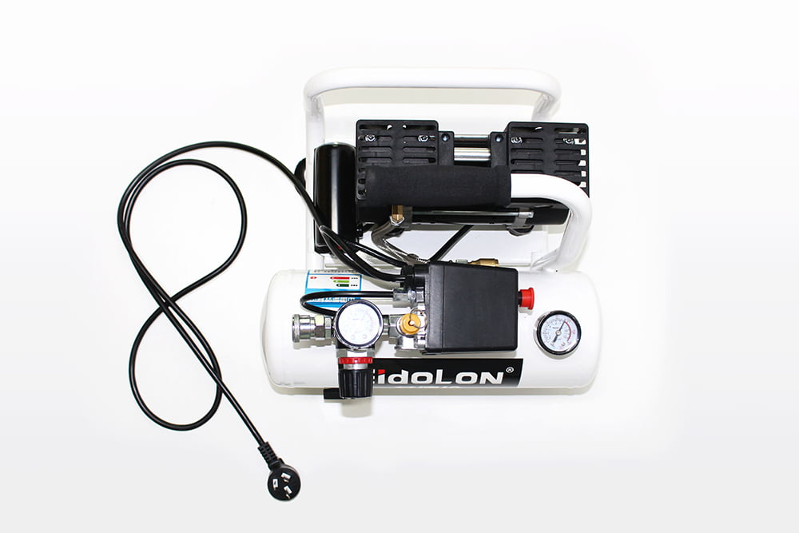
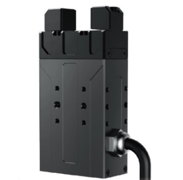
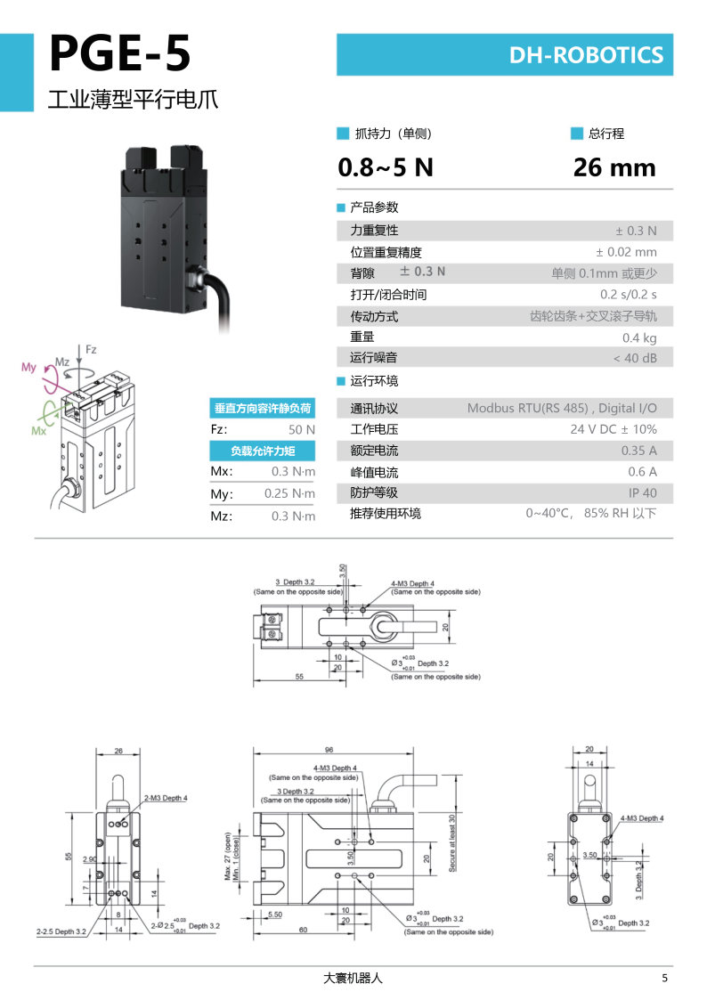
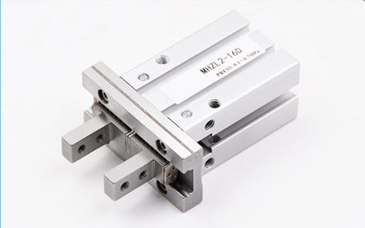
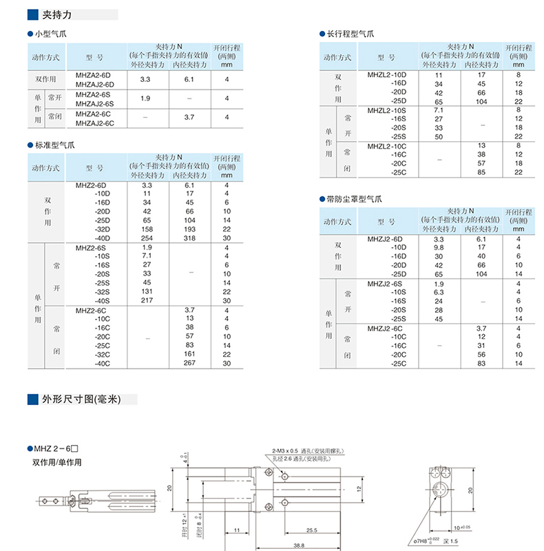
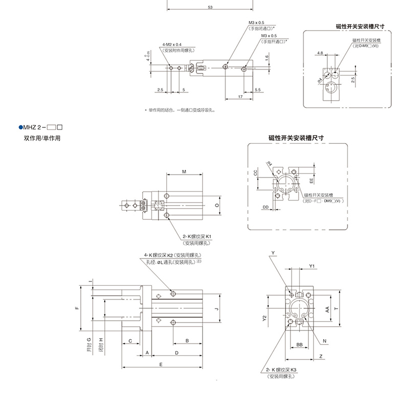

# 末端执行器

## 1. myCobot 280、myPalletizer 系列末端执行器：

[**吸泵**](../../../7-EndOperator\7.2-pump.md): 吸附物体使用

**产品图示**

**简介**

- 吸泵，即真空吸附泵，具备一进一出的抽气嘴、排气嘴各一个，它结构简单、体积小巧、使用方便、噪音较低、并有良好的自吸能力等优点。通过控制吸泵套件作为机械臂的末端执行器，执行吸附物体的功能。

- 吸泵配件：电源线 x1、杜邦线 x10、一入两出连接线 x1、乐高科技件 x若干

**工作原理**
- 吸取物品时：气泵启动抽气吸附物品即可停止，短时不会漏气。
- 放下物品时：电子阀门启动，泄气阀门打开，空气进入真空吸盘脱离被吸物品。

**适用物体**
- 纸片/塑料片
- 平面光滑物体
- 卡片等

***
 [**自适应夹爪**](../../../7-EndOperator/7.1-gripper/7.1-gripperAg.md): 夹取物体使用

**产品图示**

**简介**
- 夹爪是一种可以实现类似人手功能的机器人部件。其结构较复杂、抓取物体牢固、不易掉落、易操作的优点。夹爪套件包括夹爪配件和乐高科技件，通过可编程系统控制机械臂的末端执行器，实现物件的抓取、多点定位等功能。在所有的开发环境下都可以使用夹爪，如ROS、Arduino、Roboflow等。

**工作原理**
- 由电机驱动，夹爪的指面作直线往复运动来实现张开或闭合动作的，电动夹爪的加减速可控，对工件的冲击可以减至最小，定位点位可控，夹持可控。

**适用物体**
- 小方块
- 小球
- 长条物体

***
[**摄像头法兰**](../../../7-EndOperator/7.4-camera_flange.md): 机器视觉

**产品图示**

**简介**
- USB高清摄像头可搭配吸泵、自适应夹爪、人工智能套装等，eye in hand 实现精确定位与标定。

***
## 2. myCobot 320、Pro 600 系列末端执行器：

[**吸盘吸泵**](../../../7-EndOperator/7.3-320pump.md):吸附物体使用

**产品图示**

**简介**

* 吸盘吸泵是抽气口通过吸盘、管子等元件与待吸附物体连接，对吸盘抽真空，造成内部气压由常压变为负压，利用外界大气压和这个负压之间的压差作用，达到吸附住物体的目的。
* 整体结构是多功能可扩展吸盘，最多可安装4个；耐高压软管，可多次重复使用；吸吹一体空压机，可扩展其他功能。

**工作原理**
* 起动真空设备抽吸，使吸盘内产生负气压，从而将待提升物吸牢，即可开始搬送待提升物。
* 当待提升物搬送到目的地时，平稳地充气进真空吸盘内，使真空吸盘内由负气压变成零气压或稍为正的气压，真空吸盘就脱离待提升物,从而完成了提升搬送重物的任务。

**适用物体** 适用于带有平面物体

**外观介绍**

- 多功能可扩展吸盘，可最多安装 4 个
  

- 耐高压软管，可多次重复使用

  

- 吸吹一体空压机，可扩展其他功能

  

**规格参数**

| 规格           | 参数          |
| -------------- | ------------- |
| 额定功率       | 37 W          |
| 压力           | 0.8 mpa       |
| 转速           | 1400 R/Min    |
| 电压           | 220 V/50Hz    |
| 排气量         | 49 L/Min      |
| 最大可吸附重量 | 1 kg          |
| 可安装吸盘数量 | **1 / 2 / 4** |
| 空压机重量     | 10 KG         |
| 吸盘重量       | **>300 g**    |

***

[**电动夹爪**](../../../7-EndOperator/7.1-gripper/7.4-gripper_GE.md): 夹取物体使用

**产品图示**

**简介**
* PGE系列为工业薄型平行电爪，数字代表夹爪的最大夹持力。夹爪配有一对平行指尖，运动过程中对称运行，夹爪主体结构为平滑的长方形结构，体积小、节约安装空间，拥有 5 面安装孔位，可以满足设备的不同安装条件。

* 快速响应，抓取频率高，并配有一个 8 芯的通讯接口，主要实现夹住或者卡住物体，适用于相对较轻的物体。

**工作原理**
* 由电机驱动齿轮齿条和交叉滚子导轨，实现夹爪张开或闭合动作的，电动夹爪的定位点位可控，夹持可控。

**适用物体**
* 体积小于夹持行程
* 重量小于最大夹持重量
* 自定义的指尖可以扩展更多的物品

**产品参数**

**运行环境**

| 环境         | 说明     |
| -------------- | ---------- |
| 通讯协议     | RS - 485 |
| 工作电压     | 24V      |
| 额定电流     | 0.25A    |
| 峰值电流     | 0.5A     |
| 防护等级     | IP40     |
| 推荐使用环境 | 0-40℃   |

***
[**气动夹爪**](../../../7-EndOperator/7.1-gripper/7.3-gripper_Air.md): 夹取物体使用

**产品图示**

**简介**

* 气动夹爪又名气动手指或气动夹指，是利用压缩空气作为动力，用来夹取或抓取工件的执行装置。它体积小，重量轻，外形紧凑，能实现单双向抓取，可自动对中，重复精度高，并且磁性开关可实现自动化的控制。

* 气动夹爪套装包括夹爪法兰、气泵、φ8气管、φ6气管、φ8-6快速接头、电磁阀以及线缆。其主要作用是替代人的抓取工作，可有效地提高生产效率及工作的安全性。需要附带外部的吸泵。

**工作原理**

* 单活塞：则是轴心带动曲柄，气爪由活塞驱动开闭运动。两片爪片上各有一个相对应的曲柄槽。为减小磨擦阻力，爪片与本体连接为钢珠滑轨结构。

* 双活塞：是通过两个活塞动作的，每一活塞由一个滚轮和一个双曲柄与气动手指相连，形成一个特殊的驱动单元。实现气动手指总是轴向对心移动，每个手指是不能单独移动的。平行夹爪气缸如果手指反向移动，则先前受压的活塞处于排气状态，而另一个活塞处于受压状态。

**适用物体**
* 体积小于夹持行程
* 重量小于最大夹持重量
* 自定义的指尖可以扩展更多的物品

**外观介绍**

**规格参数**

<table Align="lift">
	<tr>
	    <th>缸体（mm）</th>
	    <th>6</th>
	    <th>10</th>  
        <th>16</th> 
        <th>20</th> 
	</tr >
	<tr>
	    <td >导向轴承宽度</td>
	    <td >5</td>
	    <td >7</td>
        <td >9</td>
        <td >12</td>
	</tr>
	<tr>
	    <td >使用流体</td>
        <td colspan="4">空气</td>
	</tr>
    <tr>
	    <td >动作方式</td>
	    <td colspan="4",align="left">双作用</td>
	</tr>
    <tr>
	    <td >最低使用压力</td>
	    <td >0.15MPa</td>
		<td  colspan="2">0.06MPa</td>
        <td >0.05MPa</td>
	</tr>
    <tr>
	    <td >最高使用压力</td>
	    <td  colspan="4">0.7MPa</td>
	</tr>
    <tr>
	    <td >环境及流体温度</td>
		<td  colspan="4">不带磁性开关：-10~+70℃,带磁性开关：-10~+60℃(但为冻结)
		</td>
	</tr>
    <tr>
	    <td >活塞速度</td>
	    <td colspan="4">50-500mm/s</td>
	</tr>
    <tr>
	    <td >允许动能J</td>
	    <td >0.0125</td>
	    <td >0.025</td>
        <td >0.05</td>
        <td >0.1</td>
	</tr>
	<tr>
		<td>给油</th>
		<td colspan="4">不需要</th>
	</tr>
		<tr>
		<td>缓冲</th>
		<td colspan="4">两端带橡胶缓冲</th>
	</tr>
</table>

***

[**自适应夹爪**](../../../7-EndOperator/7.1-gripper/7.2-320gripperAg.md):夹取物体使用

**产品图示**

**简介**

* 夹爪是一种可以实现类似人手功能的机器人部件。其结构较复杂、抓取物体牢固、不易掉落、易操作的优点。

* 夹爪套件包括夹爪连接线和法兰，通过可编程系统控制机械臂的末端执行器，实现物件的抓取、多点定位等功能。在所有的开发环境下都可以使用夹爪，如ROS、Arduino、Roboflow等。

**工作原理**
* 由电机驱动，夹爪的指面作直线往复运动来实现张开或闭合动作的，电动夹爪的加减速可控，对工件的冲击可以减至最小，定位点位可控，夹持可控。

**适用物体**
* 小方块
* 小球
* 长条物体

