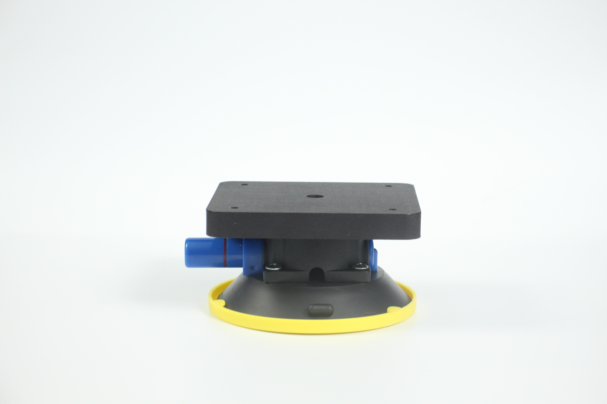
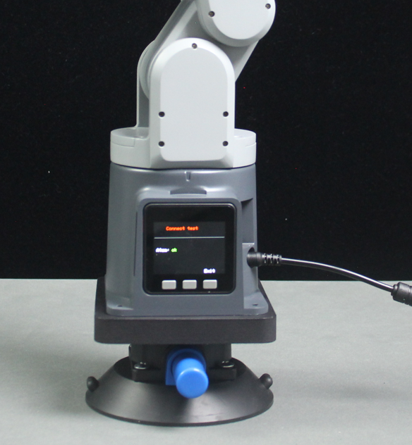

# **Large suction cup base**

**Compatible models:** myPalletizer 260, mechArm 270

- **Specifications:**

  | **name**                     | **Large suction cup base**          |
  | ---------------------------- | ----------------------------------- |
  | Model Model                  | myCobot_Vacuumbase_gaey             |
  | color                        | grey black                          |
  | craft                        | 3D printing + ABS injection molding |
  | Fixed method Fixed           | Lego connectors/screw fixing        |
  | Use environment requirements | Temperature and pressure            |
  | Applicable equipment Fit     | ER mypalletizer 260, ER mechArm 270 |

  ### **Instructions for use:**

  **Suitable for flat and smooth surfaces**

- Remove the cover at the bottom of the suction cup of the self-priming pump, place it on a smooth table, and press the suction cup of the self-priming pump to pump air. After the suction cup of the suction pump is pumped, you can test whether the base chassis has been fixed.

- Next, fix the robotic arm to the base chassis, align the holes of the robotic arm base with the holes of the base chassis, and place four M6x90 screws in the four holes of the robotic arm. Place the nuts on the base chassis at the same position, and tighten the screws with an Allen wrench to fix the robotic arm on the base chassis.

***

**Mall link**：No...
