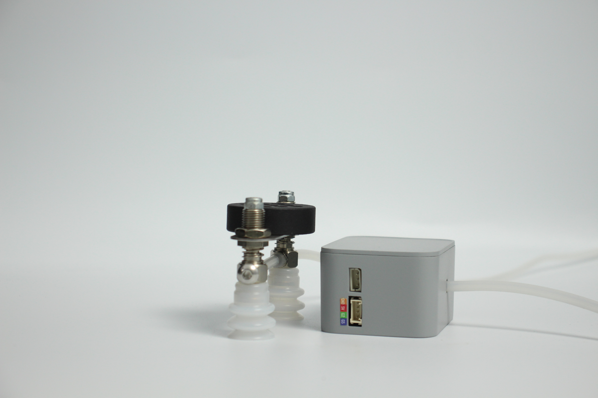
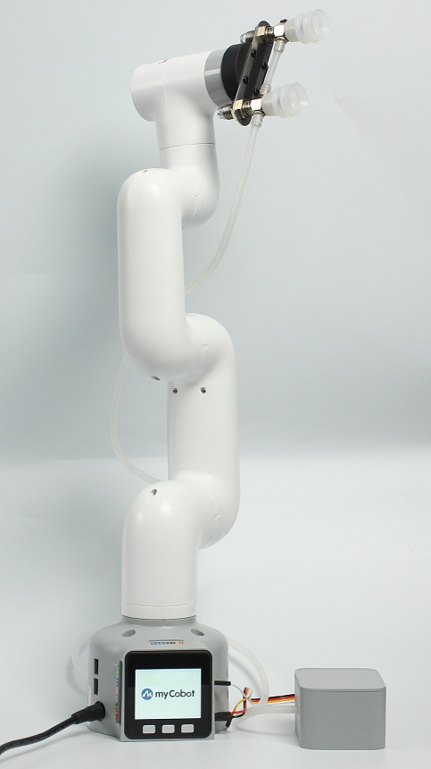
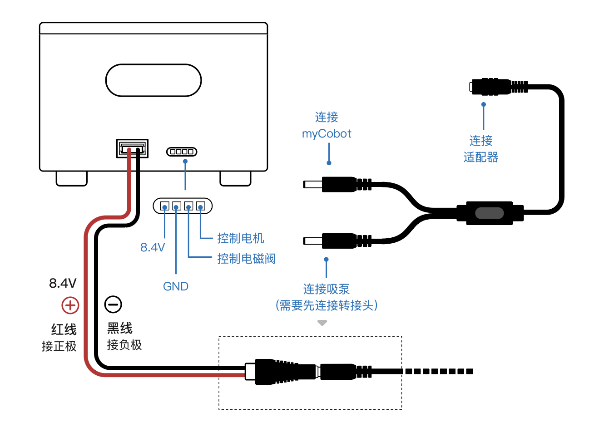
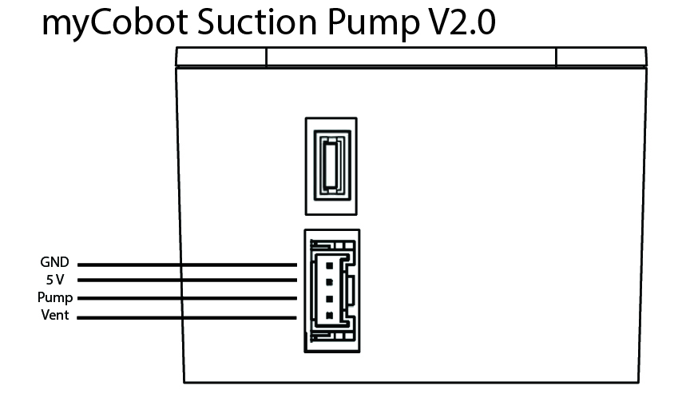

# **Double suction pump**

**Compatible models:** myCobot 280, myPalletizer 260, mechArm 270

**product icon**



Specifications

| **name**                     | **Double suction pump**                                      |
| ---------------------------- | ------------------------------------------------------------ |
| model                        | myCobot_DualPump_grey                                        |
| Material                     | Photosensitive resin/Nylon 7100                              |
| color                        | white+black                                                  |
| size                         | Suction pump end: 63x24.5x26.7                               |
| Number of suction cups       | 2                                                            |
| Suction cup size             | diameter 20mm                                                |
| absorb weight                | 150g                                                         |
| Power source equipment       | Suction box                                                  |
| service life                 | one year                                                     |
| a fixed way                  | Lego Connectors                                              |
| control interface            | I/O control                                                  |
| Use environment requirements | Temperature and pressure                                     |
| Applicable equipment         | ER myCobot Series 280, ER myPalletizer Series 260, ER mechArm Series 270, ER myBuddy Series 280 |

**Suction pump:** used for adsorbing objects

**Introduction**

- Suction pump, that is, vacuum adsorption pump, has a suction nozzle with one inlet and one outlet, and one exhaust nozzle. It has the advantages of simple structure, small size, convenient use, low noise, and good self-priming ability. By controlling the suction pump kit as the end effector of the robotic arm, it performs the function of absorbing objects.

- Suction pump accessories: power cord x1, DuPont line x10, one-in-two-out connection line x1, Lego tech parts x several

**working principle**

- When absorbing items: the air pump starts to pump air to absorb the items and then stops, and there will be no air leakage for a short time.

- When putting down the item: the electronic valve is activated, the air release valve is opened, and the air enters the vacuum suction cup and separates from the sucked item.

· 

**Applicable object**

- Paper/Plastic

- flat smooth object

- card etc.

**Installation diagram (take the M5 version as an example):**



**Wiring diagram**

- Suction pump v1.0



- Suction pump v2.0
  

**Product installation tutorial text**

- Step 1: Female cable--the power cable end is connected to the port on the left side of the suction pump, the other end is connected to the outlet port of one input and two outlets, and the outlet end is connected to the power port of the robot arm, and the inlet end is connected to the power adapter.

- Step 2: Connect the pin end of the DuPont line to the interface of the control motor and solenoid valve noted in the wiring diagram, and connect the other end to the G2, G5 pin (M5) 20, 21 pin (Pi) of the robotic arm.

- Step 3: Fix the suction pump head to the end of the robot arm using LEGO Technic pieces.

**Precautions**

- Please make sure that the product has been successfully connected according to the instructions

- Please make sure the product is powered by the included adapter

- Please make sure the power adapter is working properly

- Please make sure the connection direction of the positive and negative poles

## **Use the suction pump in the Python environment:**


### pump v1.0

- 280 for M5 version:

```python
from pymycobot.mycobot import MyCobot
import time

# Initialize a MyCobot object 
mc = MyCobot("COM3", 115200)

# Turn on the suction pump, note: use one of pins 2 and 5 to control the switch of the suction pump
def pump_on():
    # Let bit 2 work
    mc.set_basic_output(2, 0)
    # Let bit 5 work
    #mc.set_basic_output(5, 0)

# Stop suction pump
def pump_off():
    # Make position 2 stop working
    mc.set_basic_output(2, 1)
    # Make position 5 stop working
    #mc.set_basic_output(5, 1)

pump_off()
time.sleep(3)
pump_on()
time.sleep(3)
pump_off()
time.sleep(3)
```

- 280 for Pi version:

```python
from pymycobot.mycobot import MyCobot
from pymycobot import PI_PORT, PI_BAUD  # When using the Raspberry Pi version of mycobot, you can refer to these two variables to initialize MyCobot
import time
import RPi.GPIO as GPIO

# Initialize a MyCobot object 
mc = MyCobot(PI_PORT, PI_BAUD)

# Initialize
GPIO.setmode(GPIO.BCM)
# Either pin 20/21 can control the switch of the suction pump. Note: the switch should use the same pin Foot control
GPIO.setup(20, GPIO.OUT)
#GPIO.setup(21, GPIO.OUT)

# Turn on the suction pump
def pump_on():
     # open suction pump
    GPIO.output(20，0)
    #GPIO.output(21，0)

# Stop suction pump
def pump_off():
    # Shut down the suction pump
    GPIO.output(20，1)
    #GPIO.output(21，1)

pump_off()
time.sleep(3)
pump_on()
time.sleep(3)
pump_off()
time.sleep(3)
```


### pump v2.0

- 280 for M5 version:

```python
from pymycobot.mycobot import MyCobot
import time

# Initialize a MyCobot object 
mc = MyCobot("COM3", 115200)

# Turn on the suction pump, note: use one of pins 2 and 5 to control the switch of the suction pump
def pump_on():
    mc.set_basic_output(5, 0)
    time.sleep(0.05)

# Stop suction pump
def pump_off():
    mc.set_basic_output(5, 1)
    time.sleep(0.05)
    mc.set_basic_output(2, 0)
    time.sleep(1)
    mc.set_basic_output(2, 1)
    time.sleep(0.05)

pump_off()
time.sleep(3)
pump_on()
time.sleep(3)
pump_off()
time.sleep(3)
```

- 280 for Pi version:

```python
from pymycobot.mycobot import MyCobot
from pymycobot import PI_PORT, PI_BAUD  # When using the Raspberry Pi version of mycobot, you can refer to these two variables to initialize MyCobot
import time
import RPi.GPIO as GPIO

# Initialize a MyCobot object 
mc = MyCobot(PI_PORT, PI_BAUD)

# Initialize
GPIO.setmode(GPIO.BCM)
# Either pin 20/21 can control the switch of the suction pump. Note: the switch should use the same pin Foot control
GPIO.setup(20, GPIO.OUT)
GPIO.setup(21, GPIO.OUT)

# Turn on the suction pump
def pump_on():
     # open suction pump
    GPIO.output(20，0)

# Stop suction pump
def pump_off():
    # Shut down the suction pump
    GPIO.output(20，1)
    time.sleep(0.05)
    GPIO.output(21，0)
    time.sleep(1)
    GPIO.output(21，1)
    time.sleep(0.05)

pump_off()
time.sleep(3)
pump_on()
time.sleep(3)
pump_off()
time.sleep(3)
```

For more case references and running result videos, please view [the use case](https://docs.elephantrobotics.com/docs/gitbook/7-ApplicationBasePython/7.7_example.html)

**Mall link：**NO...