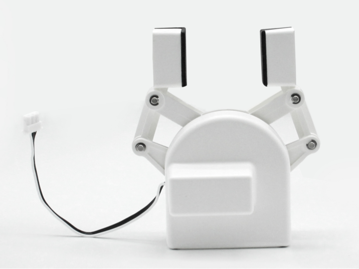
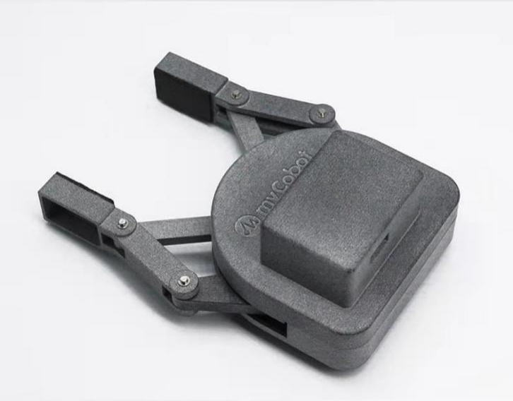
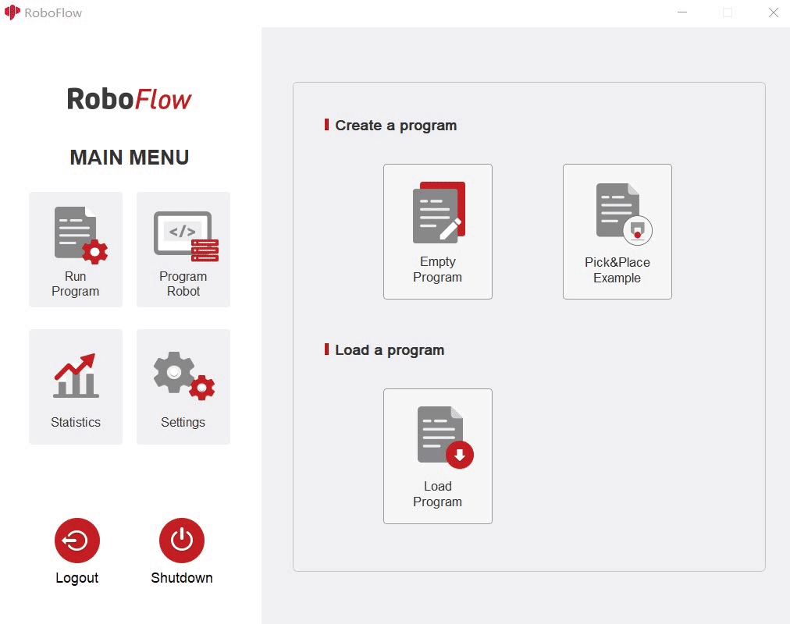

# **Adaptive Gripper**

**Compatible models:** myCobot 280, myPalletizer 260, mechArm 270

**product icon**

**Specifications:**

| **name**                     | **mycobot280 adaptive gripper**                              |
| ---------------------------- | ------------------------------------------------------------ |
| Model model                  | myCobot_gripperAg_white                                      |
| craft                        | ABS injection molding                                        |
| color                        | White                                                        |
| Clamp size                   | 20-45mm                                                      |
| Clamp force                  | 150g                                                         |
| Repeatability precision      | 1mm                                                          |
| Lifetime                     | one year                                                     |
| drive mode                   | electric                                                     |
| transfer method              | gear + connecting rod                                        |
| size                         | 112×94×50mm                                                  |
| weight                       | 100g                                                         |
| Fixed method                 | Lego Connectors                                              |
| Use environment requirements | Temperature and pressure                                     |
| control interface            | serial control                                               |
| Applicable equipment         | ER myCobot Series 280, ER myPalletizer Series 260, ER mechArm Series 270, ER myBuddy Series 280 |

**Adaptive Gripper:** Gripping objects using

**Introduction**

- A gripper is a robotic component that can function like a human hand. It has the advantages of complex structure, firm grasping of objects, not easy to drop, and easy operation. The gripper kit includes gripper accessories and LEGO high-tech parts. The end effector of the robotic arm is controlled by a programmable system to realize functions such as grasping and multi-point positioning of objects. Gripper can be used in all development environments, such as ROS, Arduino, Roboflow, etc.

**working principle**

- Driven by a motor, the finger surface of the gripper makes a linear reciprocating motion to realize the opening or closing action. The acceleration and deceleration of the electric gripper is controllable, the impact on the workpiece can be minimized, the positioning point is controllable, and the clamping is controllable .

· 

**Applicable object**

- small cube

- small ball

- long object

------

Compatible models: myCobot 320, myCobot Pro 600

**product icon**

**Specifications:**

| **name**                     | **mycobot320 Adaptive Gripper**                              |
| ---------------------------- | ------------------------------------------------------------ |
| Model model                  | myCobotPro_gripperAg_grey                                    |
| craft                        | 7500 Nylon                                                   |
| color                        | grey                                                         |
| Clamping rangeClamp size     | 20-100mm                                                     |
| Clamp force                  | 1000g                                                        |
| Repeatability precision      | 1mm                                                          |
| Lifetime                     | one year                                                     |
| drive mode                   | electric                                                     |
| transfer method              | gear + connecting rod                                        |
| size                         | 168×151×54mm                                                 |
| weightweight                 | 260g                                                         |
| Fixed method                 | screw fixed                                                  |
| Use environment requirements | Temperature and pressure                                     |
| control interface            | serial control                                               |
| Applicable equipment         | ER myCobot 320 for M5 ER, myCobot 320 for Pi, ER myCobot Pro 600 |

**Adaptive Gripper:** Gripping objects using

**Introduction**

  - A gripper is a robotic component that can function like a human hand. It has the advantages of complex structure, firm grasping of objects, not easy to drop, and easy operation. The gripper kit includes gripper accessories and LEGO high-tech parts. The end effector of the robotic arm is controlled by a programmable system to realize functions such as grasping and multi-point positioning of objects. Gripper can be used in all development environments, such as ROS, Arduino, Roboflow, etc.

**working principle**

  - Driven by a motor, the finger surface of the gripper makes a linear reciprocating motion to realize the opening or closing action. The acceleration and deceleration of the electric gripper is controllable, the impact on the workpiece can be minimized, the positioning point is controllable, and the clamping is controllable .

**Applicable object**

  - small cube

  - small ball

  - long object

**Mall link：**https://shop-elephantrobotics-com.translate.goog/collections/mybuddy/products/adaptive-gripper?_x_tr_sl=auto&_x_tr_tl=zh-CN

https://shop-elephantrobotics-com.translate.goog/collections/mycobot-pro-600/products/mycobot-pro-adaptive-gripper-grey?_x_tr_sl=auto&_x_tr_tl=zh-CN

**How to use**

Installing the gripper:  
- For mycobot280 Adaptive Gripper, insert it on the pin on the atom, as shown in the following figure:   
 
- For mycobot320 Adaptive Gripper, insert it into the 485 interface on the top, as shown in the following figure:   
 

Function description:  
- Run RoboFlow, enter the program editing interface, and select M5Stack-basic – Gripper (For the way to enter the program editing interface, see 6.2 Simple use of RoboFlow);  
- click Define New Gripper, fill in Gripper Name as " CAG-1 ” (must be this name), and then click Save;  
- select open or close for Saved status. The overall steps are shown in the following figure:  
 
