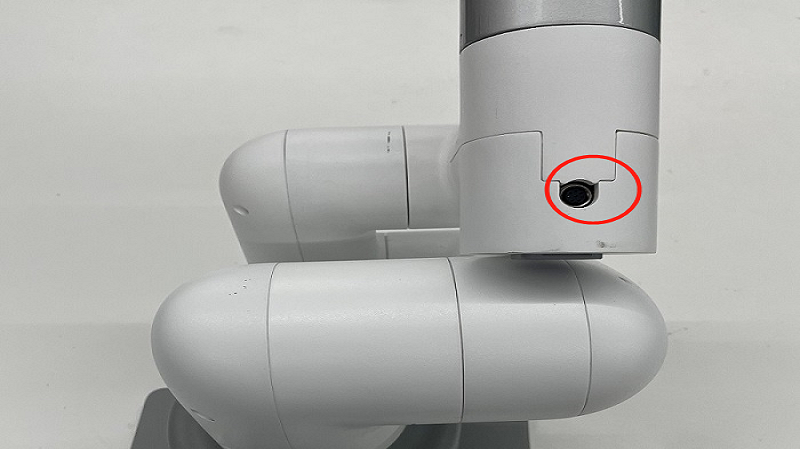

# **myCobotPro Adaptive Gripper**

**Compatible models:** myCobot 320, myCobot Pro 600

<video id="my-video" class="video-js" controls preload="auto" width="100%"
poster="" data-setup='{"aspectRatio":"16:9"}'>
  <source src="../../../resourse\2-serialproduct\vedio\myCobotPro Adaptive Gripper Instructional 2.2.mp4" type='video/mp4' >
</video>

**product icon**


**Specifications:**

| **name name**                 | **myCobotPro Adaptive Gripper Black and White** |
| ----------------------------- | ----------------------------------------------- |
| Material                      | Photosensitive resin + nylon                    |
| process technology            | 3D printing                                     |
| clamping rangeclamp size      | 0-90mm                                          |
| clamp force                   | 1000 grams                                      |
| Repeatability precision       | 0.5 mm                                          |
| service life lifetime         | 1 year                                          |
| drive mode drive              | electric                                        |
| Transmission modetransmission | gear+connecting rod                             |
| size                          | 158x105x55mm                                      |
| weightweight                  | 350 grams                                       |
| Fixed method fixed            | screw fixed                                     |
| Use environment requirements  | Temperature and pressure                        |
| control interface control     | Serial port/IO control                          |
| Applicable equipment          | ER myCobot 320 series, ER myCobot Pro 600       |

**Adaptive Gripper:** Use for Gripping Objects

**Introduction**

- A gripper is a robotic component that can function like a human hand. It has the advantages of complex structure, firm grasping of objects, not easy to drop, and easy operation.

- The gripper kit includes gripper connecting wires and flanges, and controls the end effector of the robotic arm through a programmable system to realize functions such as object grabbing and multi-point positioning. Gripper can be used in all development environments, such as ROS, Arduino, Roboflow, etc.

**working principle**

- Driven by a motor, the finger surface of the gripper makes a linear reciprocating motion to realize the opening or closing action. The acceleration and deceleration of the electric gripper is controllable, the impact on the workpiece can be minimized, the positioning point is controllable, and the clamping is controllable .

**Applicable object**

- small cube

- small ball

- long object

**Mall link**: [https://item.taobao.com/item.htm?spm=a1z10.5-cs.0.0.6945364bve0QX4&id=667084571424](https://item.taobao.com/item.htm?spm=a1z10.5-c-s.0.0.6945364bve0QX4&id=667084571424)

**How to use**

Installing the gripper: <br>

- For mycobot320 Adaptive Gripper, insert it into the 485 interface on the top, as shown in the following figure:  <br>
<br>

(Note: Pay attention to the groove at the connection when connecting the jaw, and the connection must be correct, the wrong connection method may cause damage to the jaw!! )

**myCobot 320Directions for use**

- M5 version：

```python
from pymycobot.mycobot import MyCobot
import time

# Initialize a MyCobot object
mc = MyCobot("COM3", 115200)

# #IO mode
# # # #The gripper is fully open and fully closed, and it should be noted that when the gripper is transparently switched to IO mode, the machine needs to be turned off first and then restarted once before switching back to the IO mode of the gripper
#IO control gripper close or open
for i in range(3):
    #gripper close
    time.sleep(0.1)
    mc.set_digital_output(1, 1)
    time.sleep(1)
    mc.set_digital_output(2, 1)
    time.sleep(2)
    print(mc.get_digital_input(1))
    time.sleep(0.1)
    print(mc.get_digital_input(2))
    time.sleep(2)

    #gripper open
    mc.set_digital_output(1, 0)
    time.sleep(1)
    mc.set_digital_output(2, 0)
    time.sleep(2)
    print(mc.get_digital_input(1))
    time.sleep(0.1)
    print(mc.get_digital_input(2))
    time.sleep(2)

#set gripper Transparent transmission mode
mc.set_gripper_mode(0)
# The following methods can control the gripper to open-close-open
#  Method 1:：
#Use the gripper status interface 0 for open and 1 for off

mc.set_gripper_state(0, 80)
time.sleep(3)
mc.set_gripper_state(1, 80)
time.sleep(3)
mc.set_gripper_state(0, 80)
time.sleep(3)

# Method 2：
#Set the jaw value to control the jaw opening and closing, 100 is fully open, and 0 is fully closed
# mc.set_gripper_value(100, 80)
# time.sleep(3)
# mc.set_gripper_value(0, 80)
# time.sleep(3)
# mc.set_gripper_value(100, 80)
# time.sleep(3)
#You can view the details of how to use the interface python API
```

- Pi version：

```python
from pymycobot.mycobot import MyCobot
from pymycobot import PI_PORT, PI_BAUD  # When using the Raspberry Pi version of mycobot, these two variables can be referenced for MyCobot initialization
import time

# Initialize a MyCobot object
mc = MyCobot(PI_PORT, PI_BAUD)

# #IO mode
# # # #The gripper is fully open and fully closed, and it should be noted that when the gripper is transparently switched to IO mode, the machine needs to be turned off first and then restarted once before switching back to the IO mode of the gripper
#IO control gripper close or open
for i in range(3):
    #gripper close
    time.sleep(0.1)
    mc.set_digital_output(1, 1)
    time.sleep(1)
    mc.set_digital_output(2, 1)
    time.sleep(2)
    print(mc.get_digital_input(1))
    time.sleep(0.1)
    print(mc.get_digital_input(2))
    time.sleep(2)

    #gripper open
    mc.set_digital_output(1, 0)
    time.sleep(1)
    mc.set_digital_output(2, 0)
    time.sleep(2)
    print(mc.get_digital_input(1))
    time.sleep(0.1)
    print(mc.get_digital_input(2))
    time.sleep(2)

#set gripper Transparent transmission mode
mc.set_gripper_mode(0)
# The following methods can control the gripper to open-close-open
#  Method 1:：
#Use the gripper status interface 0 for open and 1 for off

mc.set_gripper_state(0, 80)
time.sleep(3)
mc.set_gripper_state(1, 80)
time.sleep(3)
mc.set_gripper_state(0, 80)
time.sleep(3)

# Method 2：
#Set the jaw value to control the jaw opening and closing, 100 is fully open, and 0 is fully closed
# mc.set_gripper_value(100, 80)
# time.sleep(3)
# mc.set_gripper_value(0, 80)
# time.sleep(3)
# mc.set_gripper_value(100, 80)
# time.sleep(3)
#You can view the details of how to use the interface python API
```

**Pro600 Directions for use**

Function description: <br>

- Run RoboFlow, enter the program editing interface, and select M5Stack-basic – Gripper (For the way to enter the program editing interface, see 6.2 Simple use of RoboFlow); <br>

- IO mode (I/O is selected by the Tool, and the overall steps are shown in the figure)

- 

- IO controls the jaw opening and closing, the pin tool_out0 is closed, and the jaw is opened when it tool_out1 is opened

- 

- IO controls the jaw opening and closing, the pin tool_out0 is closed, and the jaw is opened when it tool_out1 is opened

  

- click Define New Gripper, fill in Gripper Name as " CAG-1 ” (must be this name), and then click Save; <br>

- select open or close for Saved status. The overall steps are shown in the following figure: <br>

   (Note: Before using the transparent transmission mode, you need to set the gripper to the transparent transmission mode, that is, set_cag_gripper_mode (0), please refer to [Socket API](http://localhost:4000/2-serialproduct/2.3-myCobot_Pro_600/2.3.5%20socket%20API%20interface%20description.html)) for detailed interface use.)

- <br>

- python Control

  - Use case：

```python
from pymycobot import ElephantRobot
import time

# Change the ip to the live ip of the P600 Raspberry Pi

elephant_client = ElephantRobot("192.168.10.158", 5001)

# Start the necessary commands for the robot
elephant_client.start_client()
elephant_client.state_off()
time.sleep(3)
# elephant_client.power_off()#it is not necessary to turn off the robot using only the gripper passthrough mode
# time.sleep(3)
elephant_client.power_on()
time.sleep(3)
elephant_client.state_on()
time.sleep(3)


# #IO mode
# # # #The gripper is fully open and fully closed, and it should be noted that when the gripper is transparently switched to IO mode, the machine needs to be turned off first and then restarted once before switching back to the IO mode of the gripper
for i in range(3):
    elephant_client.set_digital_out(16, 0)  # IO Restore low
    time.sleep(1)
    elephant_client.set_digital_out(17, 0)  # IO Restore low
    time.sleep(1)
    elephant_client.set_digital_out(16, 1)  # close gripper
    time.sleep(1)
    elephant_client.set_digital_out(16, 0)  # IO Restore low
    time.sleep(1)
    elephant_client.set_digital_out(17, 1)  # open gripper
    time.sleep(1)

# Transparent transmission mode
# elephant_client.set_cag_gripper_mode(0)
# time.sleep(1)
# for i in range(3):
#     elephant_client.set_cag_gripper_value(26,20)
#     time.sleep(1)
#     elephant_client.set_cag_gripper_value(86,20)
#     time.sleep(1)

elephant_client.command_wait_done()

```

- scoket Control

  - First, open the TCP service in roboflow

  

  - You can obtain the IP of the P600 and the computer in the following ways:

  - Windows: Enter ipconfig in the cmd command window

  

  - P600: Enter ifconfig on the terminal to obtain the device

  

  - Open the socket software, click the client button and enter the IP address obtained above

  

  - Click on the TCP connection to prompt the connection to open

  

  - socket uses IO mode to control the jaw opening and closing

  - Pin 16 low pin 17 high level is the gripper open, pin 16 high pin 17 low level is the gripper off

  - socket uses transparent transmission mode to control the opening and closing of the gripper

  - To use the transparent transmission mode to control the opening and closing of the gripper, you need to set the gripper mode to transparent transmission first, and the specific interface can be referred to[Socket API](http://localhost:4000/2-serialproduct/2.3-myCobot_Pro_600/2.3.5%20socket%20API%20interface%20description.html)

  

------

**Compatible models**：myCobot 320、myCobot Pro 600

**Product illustration**


**Specifications：**

| name                                 | mycobotPro Adaptive gripper gray                             |
| ------------------------------------ | ------------------------------------------------------------ |
| model                                | myCobotPro_gripperAg_grey                                    |
| craft                                | 7500nylon                                                    |
| Color                                | grey                                                         |
| Clamp size                           | 20-100mm                                                     |
| Clamp force                          | 1000g                                                        |
| precision                            | 1mm                                                          |
| Lifetime                             | 一年                                                         |
| drive                                | 电动                                                         |
| Transmission mode                    | Gears + connecting rods                                      |
| size                                 | 168×151×54mm                                                 |
| weight                               | 260g                                                         |
| Fixed                                | Screw-fastened                                               |
| Requirements for the use environment | Normal temperature and pressure                              |
| controlSerial port control           |                                                              |
| Applicable Equipment                 | ER myCobot 320 for M5 ER ，myCobot 320 for Pi ，ER myCobot Pro 600 |

**Adaptive gripper:** Grip objects for use

**Brief introduction**

* A gripper is a robot component that can perform human-like functions. It has the advantages of complex structure, firm grasping of objects, not easy to fall, and easy to operate.

* The gripper kit includes the gripper connection line and flange, and controls the end effector of the robotic arm through a programmable system to realize the functions of object grabbing, multi-point positioning and so on. Grippers can be used in all development environments, such as ROS, Arduino, Roboflow, etc。

**How it works**

* Driven by the motor, the finger surface of the gripper moves in a straight line to achieve opening or closing action, the acceleration and deceleration of the electric gripper can be controlled, the impact on the workpiece can be minimized, the positioning point is controllable, and the clamping is controllable.

**Applicable Objects**

* Small cubes
* globule
* Long objects

**Taobao link：**https://item.taobao.com/item.htm?spm=a1z10.5-c-s.0.0.6945364bve0QX4&id=637681935217

**How to use:**

Gripper installation：<br>

- mycobotProThe adaptive gripper is plugged into the 485 connector on the top, as shown in the figure below：<br>
  <br>

**myCobot 320Directions for use**

- M5 version：

```python
from pymycobot.mycobot import MyCobot
import time

# Initialize a MyCobot object
mc = MyCobot("COM3", 115200)

# The following three ways can control the gripper to open-close-open
# Method 1:
mc.set_gripper_state(0, 80)
time.sleep(3)
mc.set_gripper_state(1, 80)
time.sleep(3)
mc.set_gripper_state(0, 80)
time.sleep(3)

# Method 2：
# mc.set_gripper_value(100, 80)
# time.sleep(3)
# mc.set_gripper_value(0, 80)
# time.sleep(3)
# mc.set_gripper_value(100, 80)
# time.sleep(3)

```

- Pi version：

```python
from pymycobot.mycobot import MyCobot
from pymycobot import PI_PORT, PI_BAUD  # When using the Raspberry Pi version of mycobot, you can refer to these two variables for MyCobot initialization
import time

# Initialize a MyCobot object
mc = MyCobot(PI_PORT, PI_BAUD)
 
# The following three ways can control the gripper to open-close-open
# Method 1:
mc.set_gripper_state(0, 80)
time.sleep(3)
mc.set_gripper_state(1, 80)
time.sleep(3)
mc.set_gripper_state(0, 80)
time.sleep(3)

# Method 1：
# mc.set_gripper_value(100, 80)
# time.sleep(3)
# mc.set_gripper_value(0, 80)
# time.sleep(3)
# mc.set_gripper_value(100, 80)
# time.sleep(3)
```

**myCobot Pro 600Directions for use**

- Controlled by Roboflow

  - Run RoboFlow, enter the program editing interface, and select **M5Stack-basic**--**Gripper** (how to enter the program editing interface, please see**6.2 RoboFlow Simple Use**); <br>

  - Click Define New Gripper, set the Gripper Name to CAG-1 (must be this name), and click Save. <br>

  - Select open or close for Saved status, as shown in the following figure:<br>

  <br>
