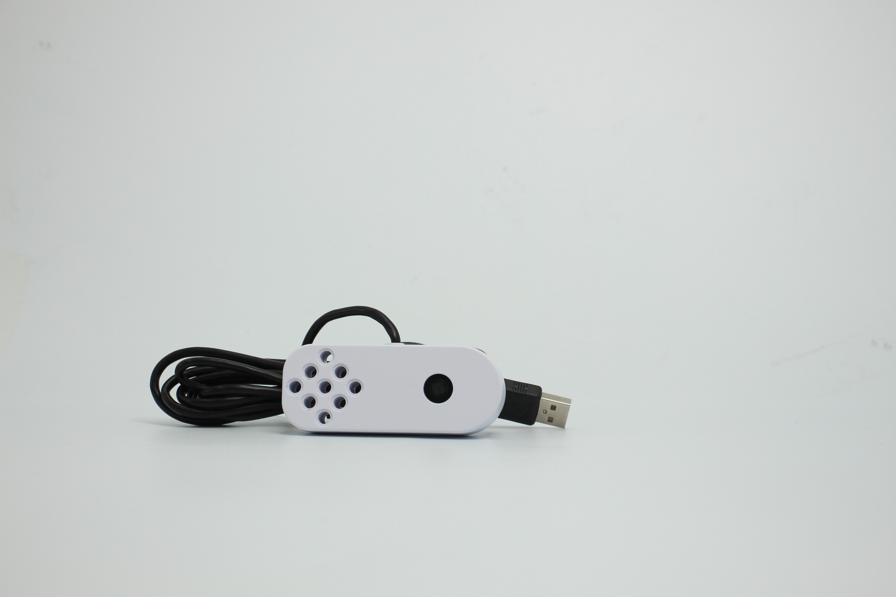

# **myCobot camera module v2.0**

**Compatible models:** myCobot 280, myPalletizer 260, mechArm 270

**product icon**

**Specifications:**

| **name**                     | **myCobot camera module v2.0**                               |
| ---------------------------- | ------------------------------------------------------------ |
| model                        | myCobot_cameraHolder_J6                                      |
| color                        | white (default)                                              |
| Material                     | ABS injection molding                                        |
| size                         | 836416                                                       |
| USB protocol                 | USB2.0 HS/FS                                                 |
| lens focal length            | Standard 1.7mm                                               |
| Field of view                | about 60°                                                    |
| supported system             | Win7/8/10, Linux, MAC                                        |
| service life                 | two years                                                    |
| a fixed way                  | Lego Connectors                                              |
| Use environment requirements | Temperature and pressure                                     |
| Applicable equipment support | ER myCobot Series 280, ER myPalletizer Series 260, ER mechArm Series 270, ER myBuddy Series 280 |

**Camera Flange:** Machine Vision

**Introduction**

- USB high-definition camera can be used with suction pump, self-adaptive gripper, artificial intelligence kit, etc., eye in hand to achieve precise positioning and calibration.

Mall link:https://shop-elephantrobotics-com.translate.goog/collections/mybuddy/products/camera-flange-2-0?_x_tr_sl=auto&_x_tr_tl=zh-CN

 
